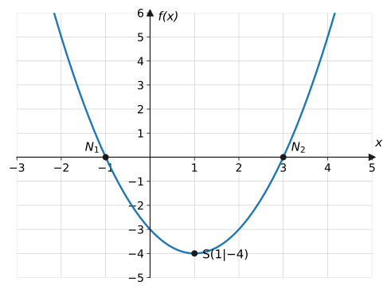

{/*
  VORLAGE für alle Inhaltsseiten. Diese Datei beginnt mit "_" und wird
  deshalb nicht gebaut. Abschnittsreihenfolge ist verbindlich (§4 des Briefs):
  Worum geht's? → Erklärung → Beispiele → Aufgaben → Merksatz → Vertiefung.
  Ausnahmen: basiswissen/* ohne Alltagskontext und ohne Vertiefung;
  Seiten vor einer Klassenarbeit zusätzlich mit "Checkliste zur Klassenarbeit".
*/}

## Worum geht's?

2–4 Sätze Alltagskontext und eine Leitfrage. Kein Vorgriff auf die Lösung.

## Erklärung

Definitionen, Herleitung, zentrale Formeln. Inline-Mathe mit $f(x) = x^2$,
Display-Mathe mit:

$$
f(x) = a_n x^n + a_{n-1} x^{n-1} + \dots + a_1 x + a_0
$$

Mehrschrittige Rechnungen in `aligned`, EIN Schritt pro Zeile, am
Gleichheitszeichen ausgerichtet:

$$
\begin{aligned}
x^2 - 2x - 3 &= 0 \\
(x-3)(x+1) &= 0 \\
x_1 = 3,\quad x_2 &= -1
\end{aligned}
$$

Plots als Markdown-Bild mit deutschem Alt-Text:

### Teilkonzept

Bei mehreren Teilkonzepten `###`-Unterüberschriften verwenden.

Nach jedem größeren Gedankenschritt eine **Verständnisfrage** einstreuen
(2–3 pro Erklärung). Die Frage steht sichtbar in der Zeile, die Antwort
klappt auf:

Verständnisfrage: Warum …?

Kurze Antwort in 1–3 Sätzen, die auf das Konzept zielt (nicht rechnen,
sondern begründen).

## Beispiele

**Beispiel 1:** Aufgabenstellung sichtbar.

Lösung

Vollständiger Lösungsweg, jeder Schritt kommentiert („Warum dieser Schritt?“).

$$
\begin{aligned}
x^2 - 4 &= 0 &&\text{| } +4 \\
x^2 &= 4 &&\text{| Wurzel ziehen} \\
x_{1,2} &= \pm 2
\end{aligned}
$$

## Aufgaben

Jede Aufgabe steckt komplett (Text + Lösung) in `
`,
damit die Seite eine ruhige Liste bleibt. Mindestens eine Aufgabe pro Seite
ist eine reine Verständnisaufgabe („Begründe …“, „Erkläre, warum …“,
„Beurteile die Aussage …“) ohne Rechnung.

Aufgabe 1 ⭐

Grundniveau-Aufgabe.

Lösung zu Aufgabe 1

Vollständiger Rechenweg, nicht nur das Ergebnis.

Aufgabe 2 ⭐⭐

Standard-/Klassenarbeitsniveau.

Lösung zu Aufgabe 2

Vollständiger Rechenweg.

Aufgabe 3 ⭐⭐⭐

Transferaufgabe.

Lösung zu Aufgabe 3

Vollständiger Rechenweg.

## Merksatz

Merksatz anzeigen

Der Kernsatz des Themas – so formuliert, dass die Klasse ihn erst selbst
entwickeln kann.

## Vertiefung

Sonderfälle, typische Fehler, Ausblick auf das Folgethema.

:::caution
Typische Fehlerquelle hier beschreiben.
:::

## Quiz

Zum Abschluss ein Quiz (Komponente `Quiz.astro`, zeigt eine Frage nach der
anderen). Mischung aus Rechen- und **Verständnisfragen** – mindestens zwei
Fragen zielen auf das Konzept („Warum …?“, „Was passiert, wenn …?“,
typische Fehlvorstellungen als Distraktoren).
