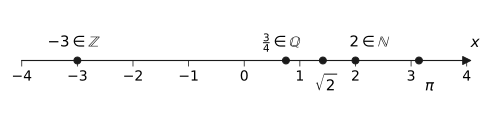

import Quiz from '../../../components/Quiz.astro';

## Worum geht's?

Diese Seite ordnet die Zahlenmengen $\mathbb{N}$, $\mathbb{Z}$, $\mathbb{Q}$
und $\mathbb{R}$ – die Grundlage, um später Definitions- und Wertebereiche
von Funktionen sauber anzugeben.

## Erklärung

### Die vier Zahlenmengen

| Menge | Name | Beispiele |
| --- | --- | --- |
| $\mathbb{N} = \{0;\ 1;\ 2;\ 3;\ \dots\}$ | natürliche Zahlen | $0;\ 7;\ 132$ |
| $\mathbb{Z} = \{\dots;\ -2;\ -1;\ 0;\ 1;\ 2;\ \dots\}$ | ganze Zahlen | $-5;\ 0;\ 42$ |
| $\mathbb{Q}$: alle Brüche $\frac{p}{q}$ mit $p, q \in \mathbb{Z},\ q \neq 0$ | rationale Zahlen | $\frac{3}{4};\ -2{,}5;\ 0{,}\overline{3}$ |
| $\mathbb{R}$: alle Punkte der Zahlengeraden | reelle Zahlen | $\sqrt{2};\ \pi;\ -\frac{1}{3}$ |

Jede Menge enthält die vorherige – die Mengen sind ineinander geschachtelt:

$$
\mathbb{N} \subset \mathbb{Z} \subset \mathbb{Q} \subset \mathbb{R}
$$

Verständnisfrage: Warum ist jede ganze Zahl automatisch auch eine rationale Zahl?

Weil man jede ganze Zahl als Bruch schreiben kann: $-5 = \frac{-5}{1}$,
$42 = \frac{42}{1}$. Die Bruchdarstellung ist genau das, was $\mathbb{Q}$
verlangt – deshalb gilt $\mathbb{Z} \subset \mathbb{Q}$.

### Rationale Zahlen erkennen

Eine Zahl ist rational, wenn sie sich als Bruch schreiben lässt. In
Dezimalschreibweise heißt das: Die Dezimaldarstellung **bricht ab**
(z. B. $0{,}25 = \frac{1}{4}$) oder ist **periodisch**
(z. B. $0{,}\overline{3} = \frac{1}{3}$).

### Irrationale Zahlen

Zahlen, die sich **nicht** als Bruch schreiben lassen, heißen irrational:
Ihre Dezimaldarstellung ist unendlich und **nicht** periodisch. Die
bekanntesten Beispiele sind $\sqrt{2} = 1{,}41421\dots$ und
$\pi = 3{,}14159\dots$ Zusammen mit den rationalen Zahlen füllen sie die
Zahlengerade lückenlos – das ist $\mathbb{R}$.

:::caution
Nicht jede Wurzel ist irrational: $\sqrt{9} = 3$ ist eine natürliche Zahl.
Irrational sind Wurzeln aus Zahlen, die **keine** Quadratzahlen sind.
:::

Verständnisfrage: Die Zahl $0{,}101001000100001\dots$ (nach jeder 1 kommt eine Null mehr) hat ein klares Muster. Ist sie rational?

Nein. Ein *Muster* reicht nicht – rational heißt: Die Dezimaldarstellung
bricht ab oder ist **periodisch**, d. h. derselbe Ziffernblock wiederholt
sich exakt und unendlich oft. Hier wird der Block aber immer länger, es
gibt keine Periode – die Zahl ist irrational.

### Intervalle

Ausschnitte aus $\mathbb{R}$ schreibt man als Intervalle:
$[2; 5]$ enthält 2 und 5 (abgeschlossen), $\,]2; 5[$ enthält beide nicht
(offen). Für „alle reellen Zahlen ab 0“ schreibt man $[0; \infty[$.

Verständnisfrage: Warum steht bei $\infty$ immer eine offene Klammer, also $[0;\ \infty[$ statt $[0;\ \infty]$?

$\infty$ ist keine reelle Zahl, sondern nur das Zeichen dafür, dass das
Intervall nach rechts nie endet. Was keine Zahl ist, kann auch nicht zum
Intervall *gehören* – deshalb ist die Klammer dort immer offen.

## Beispiele

**Beispiel 1:** Zu welchen Zahlenmengen gehören die Zahlen
$-4$, $\ \frac{7}{2}$, $\ \sqrt{25}$ und $\ \sqrt{7}$? Gib jeweils die
**kleinste** der vier Mengen an.

Lösung

Für jede Zahl prüfen wir von der kleinsten Menge aufwärts:

- $-4$: negativ, also nicht in $\mathbb{N}$; ganze Zahl → $-4 \in \mathbb{Z}$
- $\frac{7}{2} = 3{,}5$: kein ganzzahliger Wert, aber ein Bruch →
  $\frac{7}{2} \in \mathbb{Q}$
- $\sqrt{25} = 5$: die Wurzel geht auf! → $\sqrt{25} \in \mathbb{N}$
- $\sqrt{7}$: 7 ist keine Quadratzahl, die Wurzel geht nicht auf und ist
  irrational → $\sqrt{7} \in \mathbb{R}$ (und in keiner kleineren Menge)

**Beispiel 2:** Zeige, dass $0{,}75$ und $0{,}\overline{6}$ rationale Zahlen
sind, indem du sie als Bruch schreibst.

Lösung

$0{,}75$ bricht ab – als Bruch mit Zehnerpotenz schreiben, dann kürzen:

$$
0{,}75 = \frac{75}{100} = \frac{3}{4}
$$

$0{,}\overline{6}$ ist periodisch – Trick: mit 10 multiplizieren und
subtrahieren, damit die Periode wegfällt. Sei $x = 0{,}\overline{6}$:

$$
\begin{aligned}
10x &= 6{,}\overline{6} &&\text{| } -x \\
9x &= 6 &&\text{| } :9 \\
x &= \frac{6}{9} = \frac{2}{3}
\end{aligned}
$$

Beide Zahlen sind Brüche, also rational. ✓

## Aufgaben

Aufgabe 1 ⭐

Zu welchen der Mengen $\mathbb{N}$, $\mathbb{Z}$,
$\mathbb{Q}$, $\mathbb{R}$ gehört die Zahl?
a) $8$  b) $-3$  c) $\frac{1}{2}$  d) $\pi$

Lösung zu Aufgabe 1

a) $8 \in \mathbb{N}$, damit auch $\in \mathbb{Z}, \mathbb{Q}, \mathbb{R}$

b) $-3 \in \mathbb{Z}, \mathbb{Q}, \mathbb{R}$ (nicht in $\mathbb{N}$: negativ)

c) $\frac{1}{2} \in \mathbb{Q}, \mathbb{R}$ (kein ganzzahliger Wert)

d) $\pi \in \mathbb{R}$ (irrational, also in keiner kleineren Menge)

Aufgabe 2 ⭐

Nenne je zwei Zahlen, die
a) in $\mathbb{Z}$, aber nicht in $\mathbb{N}$ liegen,
b) in $\mathbb{Q}$, aber nicht in $\mathbb{Z}$ liegen.

Lösung zu Aufgabe 2

a) Alle negativen ganzen Zahlen, z. B. $-1$ und $-17$.

b) Alle nicht-ganzzahligen Brüche, z. B. $\frac{1}{2}$ und $-0{,}75$.

Aufgabe 3 ⭐

Schreibe als gekürzten Bruch:
a) $0{,}2$  b) $0{,}125$  c) $2{,}5$

Lösung zu Aufgabe 3

a) $0{,}2 = \frac{2}{10} = \frac{1}{5}$

b) $0{,}125 = \frac{125}{1000} = \frac{1}{8}$

c) $2{,}5 = \frac{25}{10} = \frac{5}{2}$

Aufgabe 4 ⭐⭐

Welche der Wurzeln sind rational, welche irrational?
a) $\sqrt{16}$  b) $\sqrt{2}$  c) $\sqrt{100}$  d) $\sqrt{10}$

Lösung zu Aufgabe 4

Rational ist die Wurzel genau dann, wenn sie aufgeht:

a) $\sqrt{16} = 4$ → rational (sogar natürlich)

b) $\sqrt{2}$ → irrational (2 ist keine Quadratzahl)

c) $\sqrt{100} = 10$ → rational (natürlich)

d) $\sqrt{10}$ → irrational (10 ist keine Quadratzahl)

Aufgabe 5 ⭐⭐

Ordne die Zahlen der Größe nach:
$\ \sqrt{2};\ \ 1{,}5;\ \ \frac{4}{3};\ \ 1{,}\overline{4}$

Lösung zu Aufgabe 5

Alle Zahlen als Dezimalzahlen vergleichen:

$$
\sqrt{2} \approx 1{,}4142; \qquad
\frac{4}{3} = 1{,}3333\ldots; \qquad
1{,}\overline{4} = 1{,}4444\ldots
$$

Reihenfolge:

$$
\frac{4}{3} < \sqrt{2} < 1{,}\overline{4} < 1{,}5
$$

Aufgabe 6 ⭐⭐

Schreibe $0{,}\overline{7}$ als Bruch.

Lösung zu Aufgabe 6

Sei $x = 0{,}\overline{7}$. Mit 10 multiplizieren und subtrahieren:

$$
\begin{aligned}
10x &= 7{,}\overline{7} &&\text{| } -x \\
9x &= 7 &&\text{| } :9 \\
x &= \frac{7}{9}
\end{aligned}
$$

Aufgabe 7 ⭐⭐

Gib die Menge in Intervallschreibweise an:
a) alle reellen Zahlen zwischen $-2$ und $3$, beide eingeschlossen
b) alle reellen Zahlen, die größer als 5 sind

Lösung zu Aufgabe 7

a) Beide Grenzen gehören dazu → abgeschlossenes Intervall $[-2;\ 3]$

b) 5 gehört nicht dazu, nach oben unbeschränkt → $\ ]5;\ \infty[$

Aufgabe 8 ⭐⭐⭐

Luca behauptet: „Die Summe zweier irrationaler Zahlen
ist immer irrational.“ Widerlege die Behauptung mit einem Gegenbeispiel.

Lösung zu Aufgabe 8

Gegenbeispiel: $\sqrt{2}$ und $-\sqrt{2}$ sind beide irrational, aber

$$
\sqrt{2} + \left(-\sqrt{2}\right) = 0 \in \mathbb{N}
$$

Die Summe ist sogar eine natürliche Zahl – die Behauptung ist falsch. ∎

Aufgabe 9 ⭐⭐ · Verständnisaufgabe

Wahr oder falsch? Begründe oder widerlege mit einem Gegenbeispiel:
a) „Jede Wurzel ist irrational.“
b) „Zwischen $\frac{1}{3}$ und $\frac{1}{2}$ liegt keine weitere rationale Zahl.“

Lösung zu Aufgabe 9

a) **Falsch.** Gegenbeispiel: $\sqrt{9} = 3 \in \mathbb{N}$. Irrational
sind nur Wurzeln aus Zahlen, die keine Quadratzahlen sind (z. B. $\sqrt{7}$).

b) **Falsch.** Zum Beispiel liegt der Mittelwert dazwischen:

$$
\frac{1}{2}\left(\frac{1}{3} + \frac{1}{2}\right) = \frac{1}{2} \cdot \frac{5}{6} = \frac{5}{12}
$$

Es gilt $\frac{1}{3} = \frac{4}{12} < \frac{5}{12} < \frac{6}{12} = \frac{1}{2}$.
So findet man zwischen zwei rationalen Zahlen immer eine weitere –
sogar unendlich viele.

## Merksatz

Merksatz anzeigen

Die Zahlenmengen sind geschachtelt:
$\mathbb{N} \subset \mathbb{Z} \subset \mathbb{Q} \subset \mathbb{R}$.
**Rational** = als Bruch darstellbar (Dezimaldarstellung bricht ab oder ist
periodisch). **Irrational** = unendlich und nicht periodisch (z. B.
$\sqrt{2}$, $\pi$). Erst rationale und irrationale Zahlen zusammen füllen
die Zahlengerade vollständig.

## Quiz

Zum Abschluss: Klicke bei jeder Frage eine Antwort an – die Auswertung kommt sofort.

<Quiz fragen={[
  { frage: 'Zu welchen Zahlenmengen gehört √2?',
    antworten: ['√2 ∈ ℚ, denn jede Wurzel ist ein Bruch', '√2 ∈ ℝ, aber nicht ∈ ℚ', '√2 ∈ ℤ, denn √2 geht auf', '√2 gehört zu keiner Zahlenmenge'],
    richtig: 1, erklaerung: '√2 = 1,41421… ist unendlich und nicht periodisch – also irrational: reell, aber nicht rational.' },
  { frage: 'Wie schreibt man 0,75 als vollständig gekürzten Bruch?',
    antworten: ['7/5', '15/2', '3/4', '3/40'],
    richtig: 2, erklaerung: '0,75 = 75/100, gekürzt mit 25 ergibt das 3/4.' },
  { frage: 'Woran erkennt man eine rationale Zahl an ihrer Dezimaldarstellung?',
    antworten: ['Sie hat höchstens zwei Nachkommastellen', 'Sie bricht ab oder ist periodisch', 'Sie ist immer positiv', 'Sie enthält keine Null'],
    richtig: 1, erklaerung: 'Genau die abbrechenden und periodischen Dezimalzahlen lassen sich als Bruch schreiben.' },
  { frage: 'Was ist die <em>kleinste</em> der vier Zahlenmengen, zu der −5 gehört?',
    antworten: ['ℕ', 'ℤ', 'ℚ', 'ℝ'],
    richtig: 1, erklaerung: '−5 ist negativ (also nicht in ℕ), aber eine ganze Zahl: −5 ∈ ℤ – und damit automatisch auch in ℚ und ℝ.' },
  { frage: 'Verständnisfrage: Welche Aussage über die Zahlenmengen ist richtig?',
    antworten: ['Jede ganze Zahl ist auch eine rationale Zahl', 'Jede rationale Zahl ist auch eine ganze Zahl', 'Es gibt natürliche Zahlen, die nicht reell sind', 'Irrationale Zahlen gehören nicht zu ℝ'],
    richtig: 0, erklaerung: 'Die Mengen sind geschachtelt: ℕ ⊂ ℤ ⊂ ℚ ⊂ ℝ. Jede ganze Zahl z lässt sich als Bruch z/1 schreiben.' },
  { frage: 'Verständnisfrage: Was ist √16?',
    antworten: ['Eine natürliche Zahl', 'Irrational, denn Wurzeln sind irrational', 'Eine rationale, aber keine ganze Zahl', 'Keine reelle Zahl'],
    richtig: 0, erklaerung: '16 ist eine Quadratzahl: √16 = 4 ∈ ℕ. Irrational sind nur Wurzeln aus Nicht-Quadratzahlen wie √7.' },
]} />
