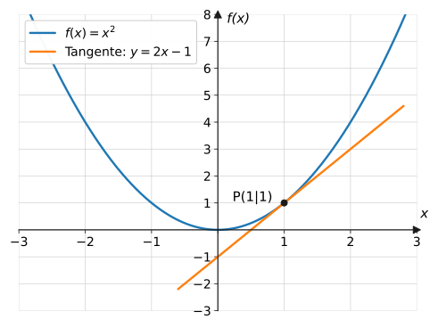
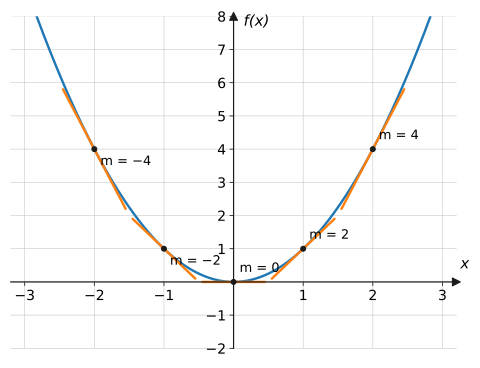
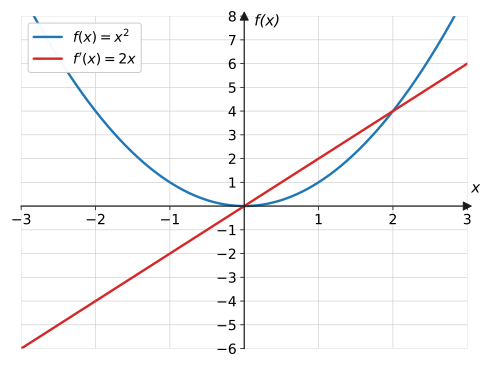

import Quiz from '../../../components/Quiz.astro';

## Worum geht's?

Auf der letzten Seite haben wir die Momentangeschwindigkeit nur
**angenähert**: Sekantensteigungen für immer kürzere Intervalle
ausrechnen und schauen, wohin die Werte laufen. Das ist mühsam und bleibt
eine Vermutung. **Leitfrage:** Wie berechnet man die Tangentensteigung
**exakt** – mit einer einzigen Rechnung statt einer endlosen
Zahlenfolge?

## Erklärung

### Der Differentialquotient

Die Sekantensteigung an der Stelle $x_0$ mit Schrittweite $h$ ist der
Differenzenquotient

$$
\frac{f(x_0 + h) - f(x_0)}{h}
$$

Lässt man $h$ gegen 0 laufen, entsteht die Tangentensteigung – der
**Differentialquotient**. Sein Wert heißt **Ableitung von $f$ an der
Stelle $x_0$**, geschrieben $f'(x_0)$:

$$
f'(x_0) = \lim_{h \to 0} \frac{f(x_0 + h) - f(x_0)}{h}
$$

Verständnisfrage: Was unterscheidet Differenzenquotient und Differentialquotient?

Der **Differenzenquotient** ist eine gewöhnliche Division: Sekantensteigung
über einem echten Intervall der Breite $h$. Der **Differentialquotient**
ist sein **Grenzwert** für $h \to 0$: die Tangentensteigung an einer
einzigen Stelle. Merkhilfe: Differenzen = zwei Punkte, Differential =
ein Punkt (nach dem Grenzübergang).

### Die h-Methode in drei Schritten

Man kann nicht einfach $h = 0$ einsetzen ($\frac{0}{0}$!). Der Trick:
**erst vereinfachen, bis $h$ gekürzt ist** – dann ist der Grenzübergang
harmlos.

1. **Aufstellen:** Differenzenquotient mit $f(x_0 + h)$ hinschreiben.
2. **Vereinfachen:** ausmultiplizieren (binomische Formel!),
   zusammenfassen, $h$ ausklammern und **kürzen**.
3. **Grenzübergang:** $h \to 0$ setzen – übrig bleibt $f'(x_0)$.

Musterdurchlauf für $f(x) = x^2$ an der Stelle $x_0 = 1$:

$$
\begin{aligned}
f'(1) &= \lim_{h \to 0} \frac{(1 + h)^2 - 1^2}{h}
&&\text{| 1. aufstellen} \\
&= \lim_{h \to 0} \frac{1 + 2h + h^2 - 1}{h}
&&\text{| binomische Formel} \\
&= \lim_{h \to 0} \frac{h\,(2 + h)}{h}
&&\text{| } h \text{ ausklammern} \\
&= \lim_{h \to 0} \,(2 + h)
&&\text{| kürzen} \\
&= 2 &&\text{| 3. } h \to 0
\end{aligned}
$$

Exakt das Ergebnis, das die Zahlenfolgen vermuten ließen – ohne jede
Näherung.

Verständnisfrage: Warum darf man das $h$ kürzen – es läuft doch gegen null?

„$h \to 0$“ heißt: $h$ wird beliebig klein, ist aber unterwegs **nie
exakt null** – und für jedes $h \neq 0$ ist das Kürzen erlaubt. Erst
*nachdem* der Bruch zu $2 + h$ vereinfacht ist, schaut man, wohin der
Ausdruck für $h \to 0$ strebt. Genau diese Reihenfolge – erst kürzen,
dann Grenzübergang – umgeht die verbotene $\frac{0}{0}$-Situation.

### Von der Stelle zur Ableitungsfunktion

Führt man die h-Methode an einer **allgemeinen** Stelle $x$ durch,
erhält man auf einen Schlag die Tangentensteigung für **jede** Stelle –
die **Ableitungsfunktion** $f'$:

Die Steigungen $-4, -2, 0, 2, 4$ an den Stellen $-2, -1, 0, 1, 2$ legen
das Muster nahe – und Beispiel 1 beweist es: $f'(x) = 2x$.

Ablesen am Bild: Wo $f$ fällt, ist $f'$ negativ; am Scheitel ist
$f'(0) = 0$; wo $f$ steigt, ist $f'$ positiv.

Verständnisfrage: Was ist der Unterschied zwischen $f'(3)$ und $f'(x)$?

$f'(3)$ ist eine **Zahl**: die Tangentensteigung an der einen Stelle
$x = 3$ (bei $f(x) = x^2$ also $6$). $f'(x)$ ist eine ganze **Funktion**:
Sie liefert zu *jeder* Stelle die dortige Steigung. Aus der
Ableitungsfunktion bekommt man jede einzelne Steigung durch Einsetzen –
umgekehrt geht das nicht.

## Beispiele

**Beispiel 1:** Bestimme mit der h-Methode die Ableitungsfunktion von
$f(x) = x^2$.

Lösung

Allgemeine Stelle $x$ statt konkreter Zahl – sonst gleiches Schema:

$$
\begin{aligned}
f'(x) &= \lim_{h \to 0} \frac{(x + h)^2 - x^2}{h}
&&\text{| aufstellen} \\
&= \lim_{h \to 0} \frac{x^2 + 2xh + h^2 - x^2}{h}
&&\text{| 1. binomische Formel} \\
&= \lim_{h \to 0} \frac{h\,(2x + h)}{h}
&&\text{| } h \text{ ausklammern} \\
&= \lim_{h \to 0} \,(2x + h)
&&\text{| kürzen} \\
&= 2x
\end{aligned}
$$

$$
\boxed{f(x) = x^2 \quad\Rightarrow\quad f'(x) = 2x}
$$

**Beispiel 2:** Bestimme mit der h-Methode die Ableitungsfunktion von
$f(x) = x^3$.

Lösung

Zuerst die dritte Potenz ausmultiplizieren:
$(x + h)^3 = x^3 + 3x^2h + 3xh^2 + h^3$ (zweimal ausmultiplizieren oder
Merkformel).

$$
\begin{aligned}
f'(x) &= \lim_{h \to 0} \frac{(x + h)^3 - x^3}{h} \\
&= \lim_{h \to 0} \frac{x^3 + 3x^2h + 3xh^2 + h^3 - x^3}{h}
&&\text{| } x^3 \text{ fällt weg} \\
&= \lim_{h \to 0} \frac{h\left(3x^2 + 3xh + h^2\right)}{h}
&&\text{| } h \text{ ausklammern} \\
&= \lim_{h \to 0} \left(3x^2 + 3xh + h^2\right)
&&\text{| kürzen} \\
&= 3x^2 &&\text{| beide } h\text{-Terme} \to 0
\end{aligned}
$$

$$
\boxed{f(x) = x^3 \quad\Rightarrow\quad f'(x) = 3x^2}
$$

(Kontrolle mit der Zahlenfolge von der vorigen Seite: $f'(1) = 3$ ✓)

**Beispiel 3:** Berechne mit der h-Methode $f'(2)$ für
$f(x) = x^2 - 4x$ und deute das Ergebnis am Graphen.

Lösung

$f(2) = 4 - 8 = -4$.

$$
\begin{aligned}
f'(2) &= \lim_{h \to 0} \frac{(2 + h)^2 - 4(2 + h) - (-4)}{h} \\
&= \lim_{h \to 0} \frac{4 + 4h + h^2 - 8 - 4h + 4}{h}
&&\text{| ausmultiplizieren} \\
&= \lim_{h \to 0} \frac{h^2}{h}
&&\text{| alles andere hebt sich auf} \\
&= \lim_{h \to 0} h = 0
\end{aligned}
$$

$f'(2) = 0$: **waagerechte Tangente**. Das passt – die Parabel
$x^2 - 4x = (x - 2)^2 - 4$ hat bei $x = 2$ ihren Scheitel.

## Aufgaben

Aufgabe 1 ⭐

$f(x) = x^2$. Stelle den Differenzenquotienten an der
Stelle $x_0 = 3$ auf, vereinfache ihn und bestimme $f'(3)$.

Lösung zu Aufgabe 1

$$
\begin{aligned}
\frac{(3 + h)^2 - 9}{h}
&= \frac{9 + 6h + h^2 - 9}{h} \\
&= \frac{h(6 + h)}{h} = 6 + h
\end{aligned}
$$

Grenzübergang: $f'(3) = \lim_{h \to 0}(6 + h) = 6$.

Aufgabe 2 ⭐

Berechne mit der h-Methode $f'(2)$ für $f(x) = x^2$.

Lösung zu Aufgabe 2

$$
\begin{aligned}
f'(2) &= \lim_{h \to 0} \frac{(2 + h)^2 - 4}{h}
= \lim_{h \to 0} \frac{4h + h^2}{h} \\
&= \lim_{h \to 0} (4 + h) = 4
\end{aligned}
$$

Aufgabe 3 ⭐

Berechne mit der h-Methode $f'(-1)$ für $f(x) = x^2$.

Lösung zu Aufgabe 3

$$
\begin{aligned}
f'(-1) &= \lim_{h \to 0} \frac{(-1 + h)^2 - 1}{h}
= \lim_{h \to 0} \frac{1 - 2h + h^2 - 1}{h} \\
&= \lim_{h \to 0} (-2 + h) = -2
\end{aligned}
$$

(Negativ – links vom Scheitel fällt die Parabel.)

Aufgabe 4 ⭐

Was bedeutet das Ergebnis $f'(3) = 6$ aus Aufgabe 1
grafisch? Gib auch an, was es für $f(x) = x^2$ als Weg-Zeit-Funktion
bedeuten würde.

Lösung zu Aufgabe 4

Grafisch: Die **Tangente** an den Graphen im Punkt $(3 \mid 9)$ hat die
Steigung 6. Als Weg-Zeit-Funktion gelesen: Zum Zeitpunkt 3 beträgt die
**Momentangeschwindigkeit** 6 (Längeneinheiten pro Zeiteinheit).

Aufgabe 5 ⭐⭐

Bestimme mit der h-Methode die Ableitungsfunktion von
$f(x) = x^2 + 3$. Was fällt im Vergleich zu $x^2$ auf?

Lösung zu Aufgabe 5

$$
\begin{aligned}
f'(x) &= \lim_{h \to 0} \frac{(x + h)^2 + 3 - \left(x^2 + 3\right)}{h} \\
&= \lim_{h \to 0} \frac{2xh + h^2}{h}
&&\text{| die } +3 \text{ hebt sich auf} \\
&= \lim_{h \to 0} (2x + h) = 2x
\end{aligned}
$$

Gleiche Ableitung wie $x^2$! Die Konstante verschiebt den Graphen nur
nach oben und ändert keine einzige Tangentensteigung.

Aufgabe 6 ⭐⭐

Bestimme mit der h-Methode die Ableitungsfunktion von
$f(x) = 2x^2$.

Lösung zu Aufgabe 6

$$
\begin{aligned}
f'(x) &= \lim_{h \to 0} \frac{2(x + h)^2 - 2x^2}{h} \\
&= \lim_{h \to 0} \frac{2x^2 + 4xh + 2h^2 - 2x^2}{h} \\
&= \lim_{h \to 0} (4x + 2h) = 4x
\end{aligned}
$$

(Doppelter Vorfaktor → doppelte Ableitung: $2 \cdot 2x = 4x$.)

Aufgabe 7 ⭐⭐

Berechne mit der h-Methode $f'(1)$ für $f(x) = x^3$.

Lösung zu Aufgabe 7

$$
\begin{aligned}
f'(1) &= \lim_{h \to 0} \frac{(1 + h)^3 - 1}{h} \\
&= \lim_{h \to 0} \frac{1 + 3h + 3h^2 + h^3 - 1}{h} \\
&= \lim_{h \to 0} \left(3 + 3h + h^2\right) = 3
\end{aligned}
$$

Aufgabe 8 ⭐⭐

Berechne mit der h-Methode $f'(2)$ für $f(x) = x^3$.

Lösung zu Aufgabe 8

$$
\begin{aligned}
f'(2) &= \lim_{h \to 0} \frac{(2 + h)^3 - 8}{h} \\
&= \lim_{h \to 0} \frac{8 + 12h + 6h^2 + h^3 - 8}{h} \\
&= \lim_{h \to 0} \left(12 + 6h + h^2\right) = 12
\end{aligned}
$$

(Kontrolle mit $f'(x) = 3x^2$ aus Beispiel 2: $3 \cdot 4 = 12$ ✓)

Aufgabe 9 ⭐⭐

Bestimme mit der h-Methode die Ableitung von
$f(x) = 5x + 2$ und deute das Ergebnis.

Lösung zu Aufgabe 9

$$
\begin{aligned}
f'(x) &= \lim_{h \to 0} \frac{5(x + h) + 2 - (5x + 2)}{h} \\
&= \lim_{h \to 0} \frac{5h}{h} = 5
\end{aligned}
$$

Die Ableitung ist **konstant 5**: Eine Gerade hat überall dieselbe
Steigung – jede Tangente ist die Gerade selbst.

Aufgabe 10 ⭐⭐

Bestimme mit der h-Methode die Ableitung einer
konstanten Funktion $f(x) = c$.

Lösung zu Aufgabe 10

$$
f'(x) = \lim_{h \to 0} \frac{c - c}{h} = \lim_{h \to 0} \frac{0}{h} = 0
$$

Ein waagerechter Graph hat überall Steigung 0.

Aufgabe 11 ⭐⭐

$f(x) = x^2 - 4x$. Bestimme mit der h-Methode die
Ableitungsfunktion $f'$ und berechne, an welcher Stelle die Tangente
waagerecht ist.

Lösung zu Aufgabe 11

$$
\begin{aligned}
f'(x) &= \lim_{h \to 0} \frac{(x+h)^2 - 4(x+h) - \left(x^2 - 4x\right)}{h} \\
&= \lim_{h \to 0} \frac{2xh + h^2 - 4h}{h} \\
&= \lim_{h \to 0} (2x + h - 4) = 2x - 4
\end{aligned}
$$

Waagerechte Tangente: $f'(x) = 0$:

$$
2x - 4 = 0 \quad\Rightarrow\quad x = 2
$$

(der Scheitel der Parabel, vgl. Beispiel 3)

Aufgabe 12 ⭐⭐

Für $f(x) = x^2$ gilt $f'(x) = 2x$.
a) Gib die Tangentensteigungen an den Stellen $-2$, $0$ und $3$ an.
b) An welcher Stelle hat der Graph die Steigung 5?

Lösung zu Aufgabe 12

a) $f'(-2) = -4$, $\ f'(0) = 0$, $\ f'(3) = 6$.

b) $f'(x) = 5$:

$$
2x = 5 \quad\Rightarrow\quad x = 2{,}5
$$

Aufgabe 13 ⭐⭐⭐

Berechne mit der h-Methode $f'(2)$ für
$f(x) = \dfrac{1}{x}$.

Lösung zu Aufgabe 13

$$
\begin{aligned}
f'(2) &= \lim_{h \to 0} \frac{\frac{1}{2 + h} - \frac{1}{2}}{h}
&&\text{| Brüche gleichnamig machen} \\
&= \lim_{h \to 0} \frac{\frac{2 - (2 + h)}{2(2 + h)}}{h} \\
&= \lim_{h \to 0} \frac{-h}{2(2 + h) \cdot h}
&&\text{| } h \text{ kürzen} \\
&= \lim_{h \to 0} \frac{-1}{2(2 + h)} \\
&= -\frac{1}{4}
\end{aligned}
$$

Die Tangente im Punkt $(2 \mid 0{,}5)$ fällt mit Steigung
$-\frac{1}{4}$.

Aufgabe 14 ⭐⭐⭐

Bestimme mit der h-Methode die Ableitungsfunktion
von $f(x) = x^3 - x$.

Lösung zu Aufgabe 14

$$
\begin{aligned}
f'(x) &= \lim_{h \to 0} \frac{(x+h)^3 - (x+h) - \left(x^3 - x\right)}{h} \\
&= \lim_{h \to 0} \frac{3x^2h + 3xh^2 + h^3 - h}{h}
&&\text{| } x^3 \text{ und } x \text{ heben sich auf} \\
&= \lim_{h \to 0} \left(3x^2 + 3xh + h^2 - 1\right) \\
&= 3x^2 - 1
\end{aligned}
$$

(Die Ableitungen der Summanden addieren sich: $3x^2$ von $x^3$, $-1$
von $-x$.)

Aufgabe 15 ⭐⭐

Fehlersuche! Ein Schüler rechnet für $f(x) = x^2$:

$$
\frac{(x + h)^2 - x^2}{h} = \frac{x^2 + h^2 - x^2}{h} = \frac{h^2}{h} = h
\ \Rightarrow\ f'(x) = 0
$$

Finde und korrigiere den Fehler.

Lösung zu Aufgabe 15

Der Fehler steckt im ersten Schritt: $(x + h)^2$ ist **nicht**
$x^2 + h^2$, sondern (1. binomische Formel!)

$$
(x + h)^2 = x^2 + 2xh + h^2
$$

Richtig weitergerechnet bleibt $\frac{2xh + h^2}{h} = 2x + h$, also
$f'(x) = 2x$.

Aufgabe 16 ⭐⭐⭐

Sprintmodell $s(t) = 1{,}5t^2$ (vorige Seite).
a) Zeige mit der h-Methode: Die Geschwindigkeitsfunktion ist $v(t) = 3t$.
b) Berechne $v(3)$ und vergleiche mit der Näherung „9 m/s“ der vorigen
Seite.

Lösung zu Aufgabe 16

a)

$$
\begin{aligned}
v(t) = s'(t) &= \lim_{h \to 0} \frac{1{,}5(t+h)^2 - 1{,}5t^2}{h} \\
&= \lim_{h \to 0} \frac{1{,}5\left(2th + h^2\right)}{h} \\
&= \lim_{h \to 0} \left(3t + 1{,}5h\right) = 3t
\end{aligned}
$$

b) $v(3) = 9$ m/s – die Zahlenfolge der vorigen Seite (10,5; 9,75;
9,15; 9,015 …) hatte also exakt den richtigen Grenzwert. Die h-Methode
liefert ihn in einer Rechnung.

Aufgabe 17 ⭐⭐ · Verständnisaufgabe

Wahr oder falsch? Begründe:
a) „$f'(2) = 4$ bedeutet: Die Funktion hat an der Stelle 2 den Wert 4.“
b) „Weil beim Einsetzen von $h = 0$ der verbotene Ausdruck $\frac{0}{0}$
entsteht, existiert die Ableitung gar nicht.“

Lösung zu Aufgabe 17

a) **Falsch.** Den Funktionswert liefert $f(2)$. $f'(2) = 4$ sagt: Die
**Tangente** im Punkt $(2 \mid f(2))$ hat die **Steigung** 4 – der Graph
steigt dort gerade mit „4 nach oben pro 1 nach rechts“.

b) **Falsch.** Man setzt ja nicht ein, sondern bildet den **Grenzwert**:
Erst wird der Bruch vereinfacht, bis sich $h$ kürzt, dann lässt man
$h \to 0$ laufen. Für $f(x) = x^2$ bleibt z. B. $2x_0 + h \to 2x_0$ –
ein völlig bestimmter Wert.

## Merksatz

Merksatz anzeigen

Die **Ableitung** $f'(x_0) = \lim\limits_{h \to 0}
\frac{f(x_0+h) - f(x_0)}{h}$ ist die exakte Tangentensteigung an der
Stelle $x_0$. **h-Methode:** aufstellen → vereinfachen (binomische
Formel, $h$ ausklammern und **kürzen**) → dann erst $h \to 0$. An einer
allgemeinen Stelle $x$ durchgeführt liefert sie die
**Ableitungsfunktion**, z. B. $\left(x^2\right)' = 2x$ und
$\left(x^3\right)' = 3x^2$.

## Vertiefung

:::caution
Niemals sofort $h = 0$ einsetzen – das ergibt den unbestimmten Ausdruck
$\frac{0}{0}$. Der Grenzübergang ist erst erlaubt, **nachdem** $h$
gekürzt wurde. Und der häufigste Rechenfehler davor: $(x+h)^2$ ohne
Mittelterm $2xh$ ausmultiplizieren (Aufgabe 15).
:::

**Ein Muster zeichnet sich ab:**
$\left(x^2\right)' = 2x$, $\ \left(x^3\right)' = 3x^2$ – Exponent nach
vorne, Exponent um 1 kleiner. Konstante Summanden fallen weg
(Aufgabe 5), Vorfaktoren bleiben stehen (Aufgabe 6), Summen darf man
gliedweise ableiten (Aufgabe 14).

**Ausblick:** Diese Beobachtungen sind kein Zufall, sondern die
[Ableitungsregeln](../ableitungsregeln/) – mit ihnen leitet man ab
Übermorgen jede ganzrationale Funktion in einer Zeile ab, ganz ohne
Grenzwert.

## Quiz

Zum Abschluss: Klicke bei jeder Frage eine Antwort an – die Auswertung kommt sofort.

<Quiz fragen={[
  { frage: 'Wie ist die Ableitung f′(x₀) definiert?',
    antworten: ['Als Differenzenquotient mit h = 1', 'Als Grenzwert des Differenzenquotienten für h → 0', 'Als f(x₀ + h) − f(x₀)', 'Als Steigung der Sekante'],
    richtig: 1, erklaerung: 'f′(x₀) = lim (f(x₀+h) − f(x₀))/h für h → 0 – der Differentialquotient.' },
  { frage: 'Warum darf man nicht sofort h = 0 einsetzen?',
    antworten: ['Weil h immer positiv sein muss', 'Weil dann der unbestimmte Ausdruck 0/0 entsteht', 'Weil die Formel nur für h = 1 gilt', 'Man darf sofort einsetzen'],
    richtig: 1, erklaerung: 'Zähler und Nenner wären beide 0. Erst vereinfachen und h kürzen – dann ist der Grenzübergang harmlos.' },
  { frage: 'Was ist die Ableitungsfunktion von f(x) = x²?',
    antworten: ['f′(x) = x', 'f′(x) = 2x', 'f′(x) = x²/2', 'f′(x) = 2'],
    richtig: 1, erklaerung: 'Die h-Methode liefert (2xh + h²)/h = 2x + h → 2x.' },
  { frage: 'f(x) = x². Was ist f′(3)?',
    antworten: ['9', '3', '6', '2'],
    richtig: 2, erklaerung: 'f′(x) = 2x, also f′(3) = 6 – die Tangente im Punkt (3|9) hat Steigung 6.' },
  { frage: 'Was passiert mit dem Summanden +5 in f(x) = x² + 5 beim Ableiten?',
    antworten: ['Er bleibt stehen', 'Er wird zu 5x', 'Er fällt weg', 'Er wird zu 1/5'],
    richtig: 2, erklaerung: 'Konstanten verschieben den Graphen nur nach oben und ändern keine Steigung – ihre Ableitung ist 0.' },
  { frage: 'Verständnisfrage: Was sagt f′(2) = −3 über den Graphen von f?',
    antworten: ['Der Punkt (2|−3) liegt auf dem Graphen', 'Der Graph fällt bei x = 2; die Tangente dort hat Steigung −3', 'Der Graph hat bei x = 2 eine Nullstelle', 'f hat bei x = −3 den Wert 2'],
    richtig: 1, erklaerung: 'f′ liefert Steigungen, keine Funktionswerte: Bei x = 2 geht es mit Tangentensteigung −3 bergab.' },
  { frage: 'Verständnisfrage: Warum darf man in der h-Methode das h kürzen, obwohl h → 0 läuft?',
    antworten: ['Weil h eine positive Zahl ist', 'Weil h beim Grenzprozess nie exakt null ist – gekürzt wird für h ≠ 0, der Grenzübergang kommt danach', 'Weil sich Fehler am Ende ausgleichen', 'Kürzen ist eigentlich nicht erlaubt'],
    richtig: 1, erklaerung: 'Für jedes h ≠ 0 ist das Kürzen eine gewöhnliche Bruchrechnung. Erst der vereinfachte Ausdruck (z. B. 2x + h) wird dem Grenzwert unterworfen.' },
]} />
