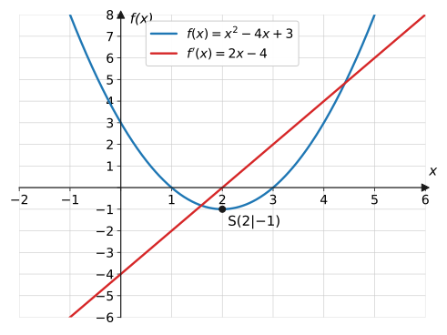
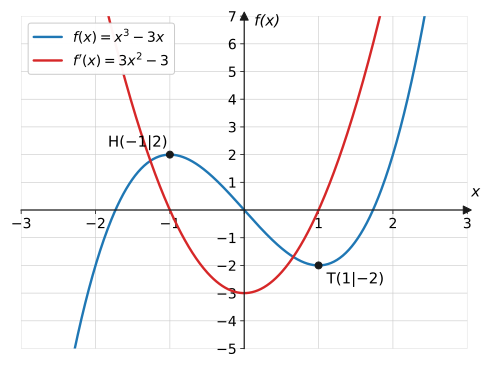

import Quiz from '../../../components/Quiz.astro';

## Worum geht's?

Die h-Methode funktioniert – aber wer möchte für
$f(x) = 2x^4 - 5x^3 + 3x^2 - 7x + 10$ einen Grenzwert ausrechnen? Beim
Ableiten von $x^2$, $x^3$ und Co. zeigte sich ein klares Muster.
**Leitfrage:** Welche Regeln stecken hinter dem Muster – und wie leitet
man damit jede ganzrationale Funktion in einer Zeile ab?

## Erklärung

### Potenzregel

$$
f(x) = x^n \quad\Rightarrow\quad f'(x) = n \cdot x^{n-1}
$$

Der Exponent springt als Faktor nach vorn, der neue Exponent ist um 1
kleiner. Genau das lieferte die h-Methode: $\left(x^2\right)' = 2x$,
$\left(x^3\right)' = 3x^2$. Weitere Beispiele:

$$
\left(x^5\right)' = 5x^4, \qquad
\left(x\right)' = 1 \cdot x^0 = 1, \qquad
\left(x^{100}\right)' = 100\,x^{99}
$$

Die Regel gilt sogar für **negative** Exponenten:
$\left(x^{-1}\right)' = -x^{-2}$, also
$\left(\frac{1}{x}\right)' = -\frac{1}{x^2}$ – das passt zum h-Methoden-
Ergebnis $f'(2) = -\frac{1}{4}$ von der vorigen Seite.

### Faktorregel

Ein konstanter Vorfaktor bleibt beim Ableiten einfach stehen:

$$
f(x) = c \cdot g(x) \quad\Rightarrow\quad f'(x) = c \cdot g'(x)
$$

Beispiel: $\left(4x^3\right)' = 4 \cdot 3x^2 = 12x^2$.

### Summenregel

Summen (und Differenzen) werden **gliedweise** abgeleitet:

$$
f(x) = g(x) + h(x) \quad\Rightarrow\quad f'(x) = g'(x) + h'(x)
$$

### Konstante Summanden

Eine Konstante hat die Ableitung 0 – sie verschiebt den Graphen nur und
ändert keine Steigung:

$$
f(x) = c \quad\Rightarrow\quad f'(x) = 0
$$

**Alle Regeln zusammen** erledigen jede ganzrationale Funktion:

$$
f(x) = 2x^3 - 4x^2 + x - 8 \quad\Rightarrow\quad f'(x) = 6x^2 - 8x + 1
$$

Am Bild sieht man die Bedeutung: Wo $f$ fällt, verläuft $f'$ unterhalb
der $x$-Achse; am Scheitel gilt $f'(2) = 0$; wo $f$ steigt, ist $f'$
positiv.

### Höhere Ableitungen

Die Ableitungsfunktion kann man erneut ableiten: $f''$ (**zweite
Ableitung**), $f'''$ usw. Beispiel:

$$
f(x) = x^3 - 3x
\ \Rightarrow\
f'(x) = 3x^2 - 3
\ \Rightarrow\
f''(x) = 6x
$$

Die zweite Ableitung wird ab der Seite
[Extrem- und Wendepunkte](../extrem-wendepunkte/) gebraucht; im
Bewegungskontext ist sie die **Beschleunigung** (Änderungsrate der
Geschwindigkeit).

## Beispiele

**Beispiel 1:** Leite ab: a) $f(x) = x^5$  b) $g(x) = 4x^3$
c) $h(x) = 7x$  d) $k(x) = -3$

Lösung

a) Potenzregel: $f'(x) = 5x^4$

b) Faktor- und Potenzregel: $g'(x) = 4 \cdot 3x^2 = 12x^2$

c) $h(x) = 7x^1$: $\ h'(x) = 7 \cdot 1 \cdot x^0 = 7$ (Gerade mit
Steigung 7)

d) Konstante: $k'(x) = 0$

**Beispiel 2:** Leite $f(x) = 2x^4 - 5x^3 + 3x^2 - 7x + 10$ ab und
berechne $f'(1)$.

Lösung

Gliedweise mit Potenz- und Faktorregel:

$$
\begin{aligned}
f'(x) &= 2 \cdot 4x^3 - 5 \cdot 3x^2 + 3 \cdot 2x - 7 + 0 \\
&= 8x^3 - 15x^2 + 6x - 7
\end{aligned}
$$

Einsetzen:

$$
f'(1) = 8 - 15 + 6 - 7 = -8
$$

Der Graph fällt an der Stelle 1 mit Tangentensteigung $-8$.

**Beispiel 3:** Leite ab, nachdem du den Term passend umgeschrieben hast:
a) $f(x) = \dfrac{x^2}{4}$  b) $g(x) = \dfrac{1}{x^2}$
c) $h(x) = x^2(x - 3)$

Lösung

a) $f(x) = \frac{1}{4}x^2$, also $f'(x) = \frac{1}{4} \cdot 2x =
\frac{x}{2}$

b) $g(x) = x^{-2}$, Potenzregel mit negativem Exponenten:

$$
g'(x) = -2x^{-3} = -\frac{2}{x^3}
$$

c) Erst ausmultiplizieren (eine Produktregel kennen wir nicht!):

$$
h(x) = x^3 - 3x^2 \quad\Rightarrow\quad h'(x) = 3x^2 - 6x
$$

## Aufgaben

Aufgabe 1 ⭐

Leite ab: a) $x^4$  b) $x^7$  c) $x^{100}$

Lösung zu Aufgabe 1

a) $4x^3$  b) $7x^6$  c) $100x^{99}$

Aufgabe 2 ⭐

Leite ab: a) $3x^2$  b) $-5x^4$  c) $\frac{1}{2}x^3$

Lösung zu Aufgabe 2

a) $6x$  b) $-20x^3$  c) $\frac{3}{2}x^2$

Aufgabe 3 ⭐

Leite ab: a) $f(x) = x^2 + x$  b) $g(x) = x^3 - 2x + 5$

Lösung zu Aufgabe 3

a) $f'(x) = 2x + 1$

b) $g'(x) = 3x^2 - 2$ (die $+5$ fällt weg)

Aufgabe 4 ⭐

Leite ab: $f(x) = 2x^3 - 4x^2 + x - 8$

Lösung zu Aufgabe 4

$$
f'(x) = 6x^2 - 8x + 1
$$

Aufgabe 5 ⭐

Leite ab: a) $f(x) = 9$  b) $g(x) = x + 9$

Lösung zu Aufgabe 5

a) $f'(x) = 0$ (Konstante)

b) $g'(x) = 1$ (die 9 fällt weg, $x$ hat Ableitung 1)

Aufgabe 6 ⭐⭐

Leite ab: $f(x) = -0{,}5x^4 + 2x^2 - 3$

Lösung zu Aufgabe 6

$$
f'(x) = -0{,}5 \cdot 4x^3 + 2 \cdot 2x = -2x^3 + 4x
$$

Aufgabe 7 ⭐⭐

$f(x) = x^3 - 3x$.
a) Bestimme $f'$ und berechne $f'(0)$ und $f'(2)$.
b) An welchen Stellen gilt $f'(x) = 0$?

Lösung zu Aufgabe 7

a) $f'(x) = 3x^2 - 3$; $\ f'(0) = -3$, $\ f'(2) = 12 - 3 = 9$.

b)

$$
3x^2 - 3 = 0 \ \Rightarrow\ x^2 = 1 \ \Rightarrow\ x = \pm 1
$$

(Dort liegen Hoch- und Tiefpunkt – siehe Graph in der Erklärung.)

Aufgabe 8 ⭐⭐

An welcher Stelle hat der Graph von
$f(x) = x^2 - 4x + 3$ eine waagerechte Tangente? Gib den zugehörigen
Punkt an.

Lösung zu Aufgabe 8

$$
f'(x) = 2x - 4 = 0 \quad\Rightarrow\quad x = 2
$$

$f(2) = 4 - 8 + 3 = -1$ → waagerechte Tangente im Punkt $S(2 \mid -1)$
(der Scheitel).

Aufgabe 9 ⭐⭐

$f(x) = x^4 - 2x^3$. Bestimme $f'$, $f''$ und $f'''$.

Lösung zu Aufgabe 9

$$
f'(x) = 4x^3 - 6x^2, \qquad
f''(x) = 12x^2 - 12x, \qquad
f'''(x) = 24x - 12
$$

Aufgabe 10 ⭐⭐

$f(x) = 0{,}5x^4 - x^2$. Berechne die
Tangentensteigung an den Stellen $1$ und $-2$.

Lösung zu Aufgabe 10

$f'(x) = 2x^3 - 2x$.

$$
f'(1) = 2 - 2 = 0, \qquad
f'(-2) = 2 \cdot (-8) - 2 \cdot (-2) = -16 + 4 = -12
$$

Bei $x = 1$ waagerechte Tangente, bei $x = -2$ steil fallend.

Aufgabe 11 ⭐⭐

In welchem Punkt hat die Normalparabel
$f(x) = x^2$ die Steigung 4?

Lösung zu Aufgabe 11

$$
f'(x) = 2x = 4 \quad\Rightarrow\quad x = 2
$$

$f(2) = 4$ → im Punkt $(2 \mid 4)$.

Aufgabe 12 ⭐⭐

Schreibe als Potenz und leite ab:
a) $f(x) = \dfrac{1}{x}$  b) $g(x) = \dfrac{1}{x^2}$

Lösung zu Aufgabe 12

a) $f(x) = x^{-1}$:

$$
f'(x) = -1 \cdot x^{-2} = -\frac{1}{x^2}
$$

b) $g(x) = x^{-2}$:

$$
g'(x) = -2x^{-3} = -\frac{2}{x^3}
$$

Aufgabe 13 ⭐⭐

Leite ab (erst umformen!):
a) $f(x) = x^2(x - 3)$  b) $g(x) = (x + 2)(x - 2)$

Lösung zu Aufgabe 13

a) $f(x) = x^3 - 3x^2$ → $f'(x) = 3x^2 - 6x$

b) $g(x) = x^2 - 4$ (3. binomische Formel) → $g'(x) = 2x$

Aufgabe 14 ⭐⭐⭐

Für welchen Wert von $a$ hat der Graph von
$f(x) = ax^2$ an der Stelle $3$ die Steigung 12?

Lösung zu Aufgabe 14

$f'(x) = 2ax$, also

$$
f'(3) = 6a = 12 \quad\Rightarrow\quad a = 2
$$

Aufgabe 15 ⭐⭐⭐

Sprintmodell $s(t) = 1{,}5t^2$.
a) Bestimme die Geschwindigkeit $v(t) = s'(t)$ und die Beschleunigung
$a(t) = v'(t)$.
b) Deute das Ergebnis für $a(t)$.

Lösung zu Aufgabe 15

a) $v(t) = 3t$, $\ a(t) = 3$.

b) Die Beschleunigung ist **konstant 3 m/s²**: Das Modell beschreibt
einen gleichmäßig beschleunigten Antritt. Die zweite Ableitung des Weges
ist die Beschleunigung – jede Ableitung „eine Etage tiefer“:
Weg → Geschwindigkeit → Beschleunigung.

Aufgabe 16 ⭐⭐⭐

Zeige: Der Graph von $f(x) = x^3$ hat an keiner
Stelle eine negative Tangentensteigung. An welcher Stelle ist die
Steigung genau 0, und wie sieht der Graph dort aus?

Lösung zu Aufgabe 16

$f'(x) = 3x^2$. Quadrate sind nie negativ, also

$$
f'(x) = 3x^2 \geq 0 \quad \text{für alle } x
$$

Steigung 0 nur bei $x = 0$. Dort liegt aber kein Hoch- oder Tiefpunkt:
Der Graph steigt davor und danach – ein **Sattelpunkt** mit waagerechter
Tangente. (Warum $f'(x_0) = 0$ allein keinen Extrempunkt garantiert,
klärt die Seite [Extrem- und Wendepunkte](../extrem-wendepunkte/).)

## Merksatz

Merksatz anzeigen

**Potenzregel:** $\left(x^n\right)' = n \cdot x^{n-1}$ – Exponent nach
vorn, Exponent um 1 herunter. Dazu **Faktorregel** (Vorfaktor bleibt)
und **Summenregel** (gliedweise ableiten); Konstanten fallen weg. Damit
lässt sich jede ganzrationale Funktion direkt ableiten – und durch
erneutes Ableiten entstehen $f''$, $f'''$, …

## Vertiefung

:::caution
Zwei Stolperfallen: **(1)** $f(x) = x$ hat die Ableitung $1$ (nicht $x$
oder $0$). **(2)** Produkte wie $x^2(x - 3)$ dürfen **nicht** faktorweise
abgeleitet werden – erst ausmultiplizieren! Die Faktorregel gilt nur für
**konstante** Faktoren.
:::

**Warum die Potenzregel stimmt:** Für $x^2$ und $x^3$ haben wir sie mit
der h-Methode bewiesen. Der allgemeine Beweis läuft genauso – beim
Ausmultiplizieren von $(x+h)^n$ überlebt nach dem Kürzen nur der Term
$n \cdot x^{n-1}$, alle anderen enthalten noch $h$ und verschwinden im
Grenzübergang.

**Ausblick:** Mit dem schnellen Ableiten im Gepäck lassen sich jetzt
[Tangenten- und Normalengleichungen](../tangente-normale/) aufstellen –
und danach Hoch-, Tief- und Wendepunkte rechnerisch bestimmen.

## Quiz

Zum Abschluss: Klicke bei jeder Frage eine Antwort an – die Auswertung kommt sofort.

<Quiz fragen={[
  { frage: 'Was ist die Ableitung von f(x) = x⁵?',
    antworten: ['5x⁵', 'x⁴', '5x⁴', '4x⁵'],
    richtig: 2, erklaerung: 'Potenzregel: Exponent nach vorn, Exponent um 1 herunter – 5x⁴.' },
  { frage: 'Was ist die Ableitung von f(x) = 3x²?',
    antworten: ['6x', '3x', '6x²', '2x'],
    richtig: 0, erklaerung: 'Faktorregel: Der Vorfaktor bleibt stehen – 3 · 2x = 6x.' },
  { frage: 'Was ist die Ableitung von f(x) = x?',
    antworten: ['0', 'x', '1', '2x'],
    richtig: 2, erklaerung: 'x = x¹, also 1 · x⁰ = 1 – eine Gerade mit Steigung 1.' },
  { frage: 'Was ist die Ableitung von f(x) = x² − 4x + 7?',
    antworten: ['2x − 4 + 7', '2x − 4', 'x − 4', '2x + 7'],
    richtig: 1, erklaerung: 'Gliedweise: 2x − 4; die Konstante 7 fällt weg.' },
  { frage: 'Wie leitet man f(x) = x²(x − 3) richtig ab?',
    antworten: ['Faktorweise: 2x · 1', 'Erst ausmultiplizieren, dann gliedweise ableiten', 'Nur die Klammer ableiten', 'Geht mit unseren Regeln nicht'],
    richtig: 1, erklaerung: 'Die Faktorregel gilt nur für konstante Faktoren! Also: x³ − 3x², abgeleitet 3x² − 6x.' },
  { frage: 'Was ist die zweite Ableitung von f(x) = x⁴?',
    antworten: ['4x³', '12x²', '24x', 'x²'],
    richtig: 1, erklaerung: 'Zweimal Potenzregel: f′(x) = 4x³, dann f″(x) = 12x².' },
]} />
