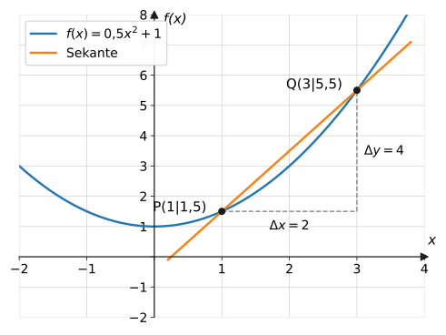
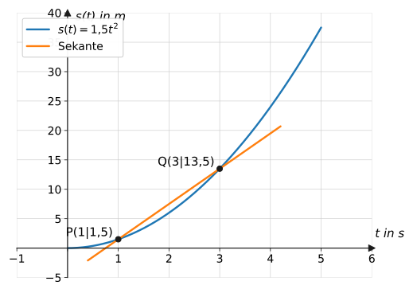
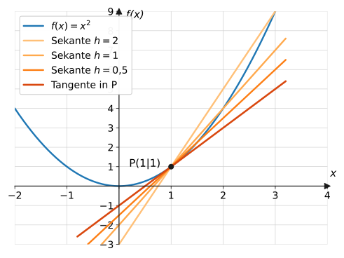
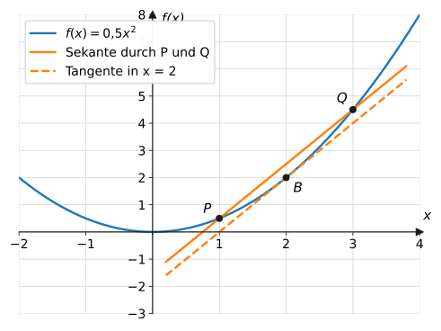

import Quiz from '../../../components/Quiz.astro';

## Worum geht's?

Usain Bolt lief die 100 m in 9,58 s – im Schnitt also
$100 : 9{,}58 \approx 10{,}4$ m/s. Aber am Start stand er still, und bei
Kilometer­marke 70 war er deutlich über 12 m/s schnell. Der Durchschnitt
verrät nicht, wie schnell jemand **in einem bestimmten Moment** ist.
**Leitfrage:** Wie kommt man von der durchschnittlichen Geschwindigkeit
über einen Zeitraum zur Geschwindigkeit in einem einzigen Augenblick?

## Erklärung

### Mittlere Änderungsrate (Differenzenquotient)

Die **mittlere Änderungsrate** einer Funktion $f$ auf dem Intervall
$[a;\ b]$ ist der **Differenzenquotient**:

$$
m = \frac{f(b) - f(a)}{b - a} = \frac{\Delta y}{\Delta x}
$$

Grafisch ist das die Steigung der **Sekante** durch die Punkte
$P(a \mid f(a))$ und $Q(b \mid f(b))$ – ein Steigungsdreieck zwischen
zwei Graphenpunkten:

Hier: $m = \frac{5{,}5 - 1{,}5}{3 - 1} = \frac{4}{2} = 2$.

Je nach Kontext hat die mittlere Änderungsrate eine eigene Bedeutung:
Durchschnitts­geschwindigkeit (Weg pro Zeit), durchschnittliches
Wachstum, mittlere Abbaurate eines Medikaments …

Verständnisfrage: Was verrät die mittlere Änderungsrate über den Verlauf <em>innerhalb</em> des Intervalls?

Nichts! In den Differenzenquotienten gehen nur die **Randwerte** $f(a)$
und $f(b)$ ein. Eine Fieberkurve kann auf $[0;\ 4]$ die mittlere
Änderungsrate 0 haben und trotzdem zwischendurch stark gestiegen und
wieder gefallen sein – entscheidend ist nur, dass Start- und Endwert
gleich sind.

### Beispiel Sprint: das Weg-Zeit-Modell

Für die Beschleunigungsphase eines 100-m-Sprints verwenden wir das stark
vereinfachte Modell $s(t) = 1{,}5t^2$ ($t$ in s, $s$ in m, gültig für
$0 \leq t \leq 5$):

Mittlere Geschwindigkeit zwischen Sekunde 1 und 3:

$$
\frac{s(3) - s(1)}{3 - 1} = \frac{13{,}5 - 1{,}5}{2} = 6\ \text{m/s}
$$

### Von der Sekante zur Tangente: lokale Änderungsrate

Wie schnell ist der Sprinter **genau** bei $t = 3$? Idee: Wir berechnen
mittlere Geschwindigkeiten über **immer kürzere** Intervalle
$[3;\ 3 + h]$ und lassen $h$ gegen 0 laufen. Die Sekanten kippen dabei in
eine Grenzlage – die **Tangente**:

Die Steigung der Tangente im Punkt $P$ heißt **lokale** (oder momentane)
**Änderungsrate** von $f$ an der Stelle $a$. Im Sprintkontext ist sie die
**Momentangeschwindigkeit** – die Zahl, die ein Blitzer messen würde.

Verständnisfrage: Warum kann man die Momentangeschwindigkeit bei $t = 3$ nicht einfach als Differenzenquotient auf $[3;\ 3]$ berechnen?

Dann stünde $\frac{s(3) - s(3)}{3 - 3} = \frac{0}{0}$ – und durch null
darf man nicht teilen. Ein einzelner Zeitpunkt hat keine „Strecke pro
Zeit“. Deshalb der Umweg: Intervalle $[3;\ 3+h]$ immer weiter
schrumpfen lassen und schauen, welchem Wert sich die Sekantensteigungen
nähern.

**Zusammengefasst:**

| | mittlere Änderungsrate | lokale Änderungsrate |
| --- | --- | --- |
| bezieht sich auf | Intervall $[a;\ b]$ | eine Stelle $a$ |
| grafisch | Sekantensteigung | Tangentensteigung |
| Beispiel | Durchschnittsgeschwindigkeit | Momentangeschwindigkeit |

Wie man die Tangentensteigung **exakt** berechnet (nicht nur näherungs­weise),
zeigt die nächste Seite ([h-Methode](../ableitung-h-methode/)).

Verständnisfrage: Woran erkennst du in einer Textaufgabe, ob die mittlere oder die lokale Änderungsrate gefragt ist?

An der Zeitangabe: Ein **Zeitraum** („zwischen Sekunde 1 und 3“, „im
ersten Jahr“, „durchschnittlich“) verlangt die mittlere Änderungsrate
(Sekante). Ein **Zeitpunkt** („genau bei $t = 3$“, „momentan“, „in
diesem Augenblick“) verlangt die lokale Änderungsrate (Tangente).

## Merksatz

Merksatz anzeigen

**Mittlere Änderungsrate** auf $[a;\ b]$: Differenzenquotient
$\frac{f(b)-f(a)}{b-a}$ = Steigung der **Sekante**. **Lokale
Änderungsrate** an der Stelle $a$: Grenzwert der Sekantensteigungen für
immer kürzere Intervalle = Steigung der **Tangente**. Im Sachkontext:
Durchschnitts- vs. Momentangeschwindigkeit.

## Beispiele

**Beispiel 1:** Sprintmodell $s(t) = 1{,}5t^2$ (in m, $t$ in s). Berechne
die mittlere Geschwindigkeit a) im Intervall $[1;\ 3]$, b) im Intervall
$[0;\ 5]$, und vergleiche.

Lösung

a) Differenzenquotient:

$$
\frac{s(3) - s(1)}{3 - 1}
= \frac{1{,}5 \cdot 9 - 1{,}5 \cdot 1}{2}
= \frac{13{,}5 - 1{,}5}{2}
= 6\ \text{m/s}
$$

b)

$$
\frac{s(5) - s(0)}{5 - 0} = \frac{37{,}5 - 0}{5} = 7{,}5\ \text{m/s}
$$

Über das längere Intervall ist der Schnitt höher, weil der Sprinter am
Ende schneller läuft – die mittlere Änderungsrate hängt vom gewählten
Intervall ab.

**Beispiel 2:** Wie schnell ist der Sprinter aus Beispiel 1 **im Moment**
$t = 3$? Nähere dich mit den Intervallen $[3;\ 4]$, $[3;\ 3{,}5]$,
$[3;\ 3{,}1]$ und $[3;\ 3{,}01]$ an.

Lösung

Jeweils Differenzenquotient $\frac{s(3+h) - s(3)}{h}$ mit $s(3) = 13{,}5$:

| Intervall | Rechnung | mittlere Geschw. |
| --- | --- | --- |
| $[3;\ 4]$ | $\frac{24 - 13{,}5}{1}$ | $10{,}5$ m/s |
| $[3;\ 3{,}5]$ | $\frac{18{,}375 - 13{,}5}{0{,}5}$ | $9{,}75$ m/s |
| $[3;\ 3{,}1]$ | $\frac{14{,}415 - 13{,}5}{0{,}1}$ | $9{,}15$ m/s |
| $[3;\ 3{,}01]$ | $\frac{13{,}59015 - 13{,}5}{0{,}01}$ | $9{,}015$ m/s |

Die Werte steuern erkennbar auf **9 m/s** zu: Die Momentangeschwindigkeit
bei $t = 3$ beträgt 9 m/s. (Kürzer werdende Sekanten → Tangente.)

**Beispiel 3:** Nach einer Tabletteneinnahme steigt die
Wirkstoffkonzentration gemäß $K(t) = -0{,}1t^2 + 2{,}4t$ ($t$ in h, $K$
in mg/l, $0 \leq t \leq 12$). Berechne die mittlere Änderungsrate auf
$[0;\ 4]$ und auf $[8;\ 12]$ und deute die Ergebnisse.

Lösung

Werte: $K(0) = 0$; $\ K(4) = -1{,}6 + 9{,}6 = 8$;
$\ K(8) = -6{,}4 + 19{,}2 = 12{,}8$; $\ K(12) = -14{,}4 + 28{,}8 = 14{,}4$.

$$
[0;\ 4]:\quad \frac{8 - 0}{4} = 2\ \text{mg/l pro h}
$$

$$
[8;\ 12]:\quad \frac{14{,}4 - 12{,}8}{4} = 0{,}4\ \text{mg/l pro h}
$$

Deutung: In den ersten 4 Stunden steigt die Konzentration im Schnitt um
2 mg/l pro Stunde, gegen Ende nur noch um 0,4 mg/l pro Stunde – die
Anflutung des Wirkstoffs verlangsamt sich deutlich (bei $t = 12$ ist das
Maximum erreicht, die lokale Änderungsrate dort ist 0).

## Aufgaben

Aufgabe 1 ⭐

Berechne die mittlere Änderungsrate von $f(x) = x^2$
auf $[1;\ 3]$.

Lösung zu Aufgabe 1

$$
m = \frac{f(3) - f(1)}{3 - 1} = \frac{9 - 1}{2} = 4
$$

Aufgabe 2 ⭐

Begründe: Die mittlere Änderungsrate von
$f(x) = 2x + 5$ ist auf **jedem** Intervall gleich. Wie groß ist sie?

Lösung zu Aufgabe 2

Der Graph ist eine Gerade – jede Sekante liegt auf der Geraden selbst
und hat deren Steigung $m = 2$. Rechnung allgemein:

$$
\frac{(2b + 5) - (2a + 5)}{b - a} = \frac{2(b - a)}{b - a} = 2
$$

Aufgabe 3 ⭐

Radtour: $s(0) = 0$, $s(1) = 12$, $s(2) = 20$,
$s(3) = 24$ (km nach $t$ Stunden). Berechne die mittlere Geschwindigkeit
für jede der drei Stunden und für die Gesamttour.

Lösung zu Aufgabe 3

$$
\text{1. Stunde: } \frac{12 - 0}{1} = 12\ \text{km/h}, \quad
\text{2. Stunde: } \frac{20 - 12}{1} = 8\ \text{km/h}, \quad
\text{3. Stunde: } \frac{24 - 20}{1} = 4\ \text{km/h}
$$

Gesamt: $\frac{24}{3} = 8$ km/h. Die Fahrt wird von Stunde zu Stunde
langsamer.

Aufgabe 4 ⭐

Berechne die mittlere Änderungsrate von
$f(x) = x^2 - 2x$ auf $[0;\ 2]$ und erkläre das Ergebnis am Graphen.

Lösung zu Aufgabe 4

$$
m = \frac{f(2) - f(0)}{2 - 0} = \frac{0 - 0}{2} = 0
$$

Beide Punkte liegen gleich hoch (beides Nullstellen) – die Sekante
verläuft **waagerecht**. Eine mittlere Änderungsrate von 0 heißt nicht,
dass sich nichts ändert: Dazwischen geht der Graph erst hinunter und
wieder hinauf.

Aufgabe 5 ⭐⭐

Berechne die mittlere Änderungsrate von $f(x) = x^3$
auf $[1;\ 2]$.

Lösung zu Aufgabe 5

$$
m = \frac{f(2) - f(1)}{2 - 1} = \frac{8 - 1}{1} = 7
$$

Aufgabe 6 ⭐⭐

$f(x) = 0{,}5x^2 + 1$ (Graph mit Steigungsdreieck in
der Erklärung). Berechne die mittlere Änderungsrate auf $[1;\ 3]$ und
vergleiche mit dem eingezeichneten Dreieck.

Lösung zu Aufgabe 6

$$
m = \frac{f(3) - f(1)}{3 - 1} = \frac{5{,}5 - 1{,}5}{2} = 2
$$

Das passt zum Steigungsdreieck: $\Delta x = 2$, $\Delta y = 4$, also
$\frac{\Delta y}{\Delta x} = 2$. ✓

Aufgabe 7 ⭐⭐

Sprintmodell $s(t) = 1{,}5t^2$: Berechne die mittlere
Geschwindigkeit auf $[3;\ 5]$ und vergleiche mit der auf $[0;\ 5]$
(Beispiel 1). Was zeigt der Vergleich?

Lösung zu Aufgabe 7

$$
\frac{s(5) - s(3)}{5 - 3} = \frac{37{,}5 - 13{,}5}{2} = 12\ \text{m/s}
$$

Auf $[0;\ 5]$ waren es nur 7,5 m/s. In der zweiten Rennhälfte des
Modells ist der Läufer viel schneller als im Gesamtschnitt – der
Durchschnitt „versteckt“ die Beschleunigung.

Aufgabe 8 ⭐⭐

$f(x) = x^2$, Stelle $a = 1$. Berechne die
Sekantensteigungen auf $[1;\ 2]$, $[1;\ 1{,}5]$, $[1;\ 1{,}1]$ und
$[1;\ 1{,}01]$. Welche lokale Änderungsrate vermutest du?

Lösung zu Aufgabe 8

$$
\frac{4 - 1}{1} = 3; \qquad
\frac{2{,}25 - 1}{0{,}5} = 2{,}5; \qquad
\frac{1{,}21 - 1}{0{,}1} = 2{,}1; \qquad
\frac{1{,}0201 - 1}{0{,}01} = 2{,}01
$$

Die Werte nähern sich **2** – die lokale Änderungsrate an der Stelle 1
ist vermutlich 2 (vgl. Sekantenschar-Graph in der Erklärung).

Aufgabe 9 ⭐⭐

$f(x) = x^2 + 1$. Vereinfache den
Differenzenquotienten auf dem Intervall $[2;\ 2 + h]$ so weit wie
möglich. Was passiert für $h \to 0$?

Lösung zu Aufgabe 9

$$
\begin{aligned}
\frac{f(2 + h) - f(2)}{h}
&= \frac{(2 + h)^2 + 1 - 5}{h} &&\text{| binomische Formel} \\
&= \frac{4 + 4h + h^2 - 4}{h} \\
&= \frac{4h + h^2}{h} &&\text{| } h \text{ ausklammern, kürzen} \\
&= 4 + h
\end{aligned}
$$

Für $h \to 0$ strebt der Wert gegen **4** – das ist die lokale
Änderungsrate an der Stelle 2, ganz ohne Zahlenfolgen.

Aufgabe 10 ⭐⭐

Auf der Autobahn: Ein Streckenradar misst die Zeit
zwischen zwei 3 km entfernten Brücken, ein Blitzer die Geschwindigkeit an
einem Punkt. Ordne den Messungen die Begriffe mittlere/lokale
Änderungsrate zu und erkläre, warum man mit dem Streckenradar zu schnell
gewesen sein kann, ohne je „geblitzt“ worden zu sein.

Lösung zu Aufgabe 10

Streckenradar → **mittlere** Änderungsrate (Weg durch Zeit über das
Intervall), Blitzer → **lokale** Änderungsrate (Momentangeschwindigkeit).

Wer zwischendurch rast und vor den Messpunkten bremst, hat an jedem
Blitzer eine erlaubte Momentangeschwindigkeit – aber der Durchschnitt
über die Strecke kann trotzdem über dem Limit liegen. Umgekehrt kann der
Durchschnitt stimmen, obwohl man kurzzeitig zu schnell war.

Aufgabe 11 ⭐⭐

Wirkstoffmodell $K(t) = -0{,}1t^2 + 2{,}4t$
(Beispiel 3). Berechne die mittlere Änderungsrate auf $[4;\ 8]$ und
ordne sie in die Ergebnisse aus Beispiel 3 ein.

Lösung zu Aufgabe 11

$K(4) = 8$, $K(8) = 12{,}8$:

$$
\frac{12{,}8 - 8}{8 - 4} = \frac{4{,}8}{4} = 1{,}2\ \text{mg/l pro h}
$$

Einordnung: $2 > 1{,}2 > 0{,}4$ – die Steigraten nehmen von
Intervall zu Intervall ab, die Kurve wird immer flacher.

Aufgabe 12 ⭐⭐

An welcher Stelle ist die **lokale** Änderungsrate
des Wirkstoffmodells $K(t) = -0{,}1t^2 + 2{,}4t$ gleich 0? Argumentiere
mit dem Graphen (Parabel!), ohne zu rechnen.

Lösung zu Aufgabe 12

Die lokale Änderungsrate ist die Tangentensteigung. Eine **waagerechte**
Tangente hat die Parabel genau im Scheitel. Scheitelstelle:
$t = -\frac{2{,}4}{2 \cdot (-0{,}1)} = 12$ – am Rand des
Definitionsbereichs, wenn die Konzentration maximal ist, ändert sie
sich momentan nicht.

Aufgabe 13 ⭐⭐⭐

$f(x) = x^3$, Stelle $a = 1$. Berechne die
Sekantensteigungen auf $[1;\ 1{,}1]$ und $[1;\ 1{,}01]$ und gib die
vermutete lokale Änderungsrate an.

Lösung zu Aufgabe 13

$$
\frac{1{,}1^3 - 1}{0{,}1} = \frac{1{,}331 - 1}{0{,}1} = 3{,}31
$$

$$
\frac{1{,}01^3 - 1}{0{,}01} = \frac{1{,}030301 - 1}{0{,}01} = 3{,}0301
$$

Die Werte streben gegen **3** – die lokale Änderungsrate von $x^3$ an
der Stelle 1 ist 3.

Aufgabe 14 ⭐⭐⭐

Der Temperaturverlauf eines Tages sei
$T(t) = -0{,}05(t - 14)^2 + 9$ ($t$ in h, $T$ in °C).
a) Berechne die mittlere Änderungsrate zwischen 6 Uhr und 14 Uhr.
b) Wie groß ist die lokale Änderungsrate um 14 Uhr? Begründe ohne
Rechnung.

Lösung zu Aufgabe 14

a) $T(6) = -0{,}05 \cdot 64 + 9 = 5{,}8$; $\ T(14) = 9$:

$$
\frac{9 - 5{,}8}{14 - 6} = \frac{3{,}2}{8} = 0{,}4\ \text{°C pro h}
$$

Im Schnitt erwärmt es sich vormittags um 0,4 °C pro Stunde.

b) Um 14 Uhr liegt der Scheitel der Parabel (Tagesmaximum) – die
Tangente ist dort waagerecht, die lokale Änderungsrate ist **0**: Die
Temperatur steigt in diesem Moment nicht mehr und fällt noch nicht.

Aufgabe 15 ⭐⭐

$f(x) = x^2$. Gib ohne Rechnung an, für welche
Stellen die lokale Änderungsrate negativ, null bzw. positiv ist.

Lösung zu Aufgabe 15

Tangentensteigungen an der Normalparabel:

- $x < 0$: Graph fällt → lokale Änderungsrate **negativ**
- $x = 0$: Scheitel, waagerechte Tangente → **null**
- $x > 0$: Graph steigt → **positiv**

Aufgabe 16 ⭐⭐⭐

Modellkritik: Das Sprintmodell $s(t) = 1{,}5t^2$
liefert auf $[4;\ 5]$ eine mittlere Geschwindigkeit von 13,5 m/s –
Usain Bolts tatsächliche Spitzengeschwindigkeit lag aber bei etwa
12,4 m/s. Rechne den Wert nach und erkläre, warum das Modell trotzdem
brauchbar ist – und wo seine Grenze liegt.

Lösung zu Aufgabe 16

Nachrechnen:

$$
\frac{s(5) - s(4)}{1} = \frac{37{,}5 - 24}{1} = 13{,}5\ \text{m/s}
$$

Das Modell lässt die Geschwindigkeit unbegrenzt weiterwachsen
(gleichmäßige Beschleunigung). Real beschleunigt ein Sprinter nur
wenige Sekunden und läuft dann mit nahezu konstanter
Spitzengeschwindigkeit. Für die **ersten** Sekunden (Anfahrphase) passt
die Parabel gut; ab etwa $t = 4$ überschätzt sie die Geschwindigkeit.
Ein besseres Modell müsste dort in eine Gerade (konstantes Tempo)
übergehen – jedes Modell hat einen Gültigkeitsbereich.

Aufgabe 17 ⭐⭐ · Verständnisaufgabe

Wahr oder falsch? Begründe:
a) „Ist die mittlere Änderungsrate auf $[0;\ 4]$ gleich null, war die
Funktion dort konstant.“
b) „Die Momentangeschwindigkeit bei $t = 3$ erhält man als
Differenzenquotient auf dem Intervall $[3;\ 3]$.“

Lösung zu Aufgabe 17

a) **Falsch.** Null bedeutet nur $f(0) = f(4)$ – die Randwerte sind
gleich. Dazwischen kann die Funktion beliebig steigen und fallen, wie
eine Fieberkurve, die hoch- und wieder herunterläuft.

b) **Falsch.** Das ergäbe $\frac{f(3)-f(3)}{3-3} = \frac{0}{0}$ –
Division durch null. Die lokale Änderungsrate entsteht erst als
**Grenzwert** der Sekantensteigungen auf $[3;\ 3+h]$ für $h \to 0$.

## Vertiefung

:::caution
Mittlere Änderungsrate 0 bedeutet **nicht** „keine Veränderung“
(Aufgabe 4): Start- und Endwert sind nur zufällig gleich. Umgekehrt
sagt der Durchschnitt nichts über Momentanwerte – dazwischen kann alles
passieren (Aufgabe 10).
:::

**Vorzeichen deuten:** Positive Änderungsrate = Zunahme, negative =
Abnahme – das gilt für mittlere wie lokale Raten und ist in
Sachaufgaben oft die halbe Antwort („die Konzentration sinkt zwischen …
um durchschnittlich …“).

**Ausblick:** Das Aufstellen und Vereinfachen des Differenzenquotienten
mit anschließendem Grenzübergang $h \to 0$ (wie in Aufgabe 9) wird auf
der nächsten Seite zum systematischen Verfahren: der
[h-Methode](../ableitung-h-methode/). Ihr Ergebnis bekommt einen eigenen
Namen – die **Ableitung**.

## Quiz

Zum Abschluss: Klicke bei jeder Frage eine Antwort an – die Auswertung kommt sofort.

<Quiz fragen={[
  { frage: 'Was ist die mittlere Änderungsrate von f auf [a; b] grafisch?',
    antworten: ['Die Steigung der Tangente in a', 'Die Steigung der Sekante durch die Punkte bei a und b', 'Der Funktionswert in der Mitte', 'Die Fläche unter dem Graphen'],
    richtig: 1, erklaerung: 'Der Differenzenquotient (f(b) − f(a))/(b − a) ist genau die Sekantensteigung.' },
  { frage: 'Berechne die mittlere Änderungsrate von f(x) = x² auf [1; 3].',
    antworten: ['2', '8', '4', '3'],
    richtig: 2, erklaerung: '(f(3) − f(1))/(3 − 1) = (9 − 1)/2 = 4.' },
  { frage: 'Was ist die lokale Änderungsrate an einer Stelle grafisch?',
    antworten: ['Die Sekantensteigung', 'Die Tangentensteigung', 'Der y-Achsenabschnitt', 'Die Nullstelle'],
    richtig: 1, erklaerung: 'Lokal = an einer einzigen Stelle: Dort misst die Tangente die momentane Steigung.' },
  { frage: 'Ein Blitzer an der Straße misst …',
    antworten: ['die mittlere Geschwindigkeit', 'die momentane Geschwindigkeit', 'die Beschleunigung', 'den zurückgelegten Weg'],
    richtig: 1, erklaerung: 'Der Blitzer misst an einem Punkt – das ist die lokale Änderungsrate des Weges, die Momentangeschwindigkeit.' },
  { frage: 'Was passiert mit den Sekanten, wenn h gegen 0 läuft?',
    antworten: ['Sie werden waagerecht', 'Sie kippen in die Tangente', 'Sie verschwinden', 'Sie werden senkrecht'],
    richtig: 1, erklaerung: 'Der zweite Punkt rückt auf den ersten zu – die Sekante nähert sich der Tangente, ihre Steigung dem Grenzwert.' },
  { frage: 'Verständnisfrage: Die mittlere Änderungsrate von f auf [0; 4] ist null. Was folgt daraus?',
    antworten: ['f war auf [0; 4] konstant', 'f(0) = f(4) – dazwischen kann alles passiert sein', 'f hat bei x = 2 eine Nullstelle', 'f ist auf [0; 4] gefallen'],
    richtig: 1, erklaerung: 'In den Differenzenquotienten gehen nur die Randwerte ein. Gleiche Randwerte ⇒ Sekantensteigung 0, egal was dazwischen passiert.' },
  { frage: 'Verständnisfrage: Warum darf man in (f(3+h) − f(3))/h nicht einfach h = 0 einsetzen?',
    antworten: ['Weil h immer positiv sein muss', 'Weil dann 0/0 dastünde – man braucht den Grenzwert h → 0', 'Weil f(3) dann nicht definiert ist', 'Man darf – das Ergebnis ist 0'],
    richtig: 1, erklaerung: 'Bei h = 0 sind Zähler und Nenner null. Die Kunst der h-Methode: erst vereinfachen und kürzen, dann h gegen 0 laufen lassen.' },
]} />
