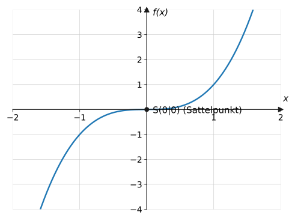
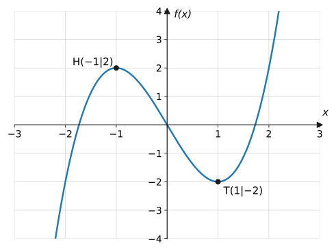
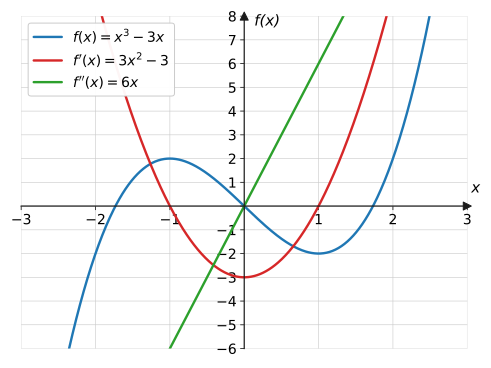
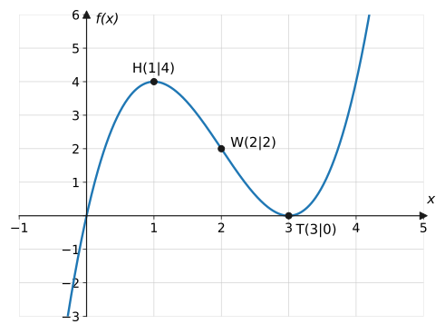

import Quiz from '../../../components/Quiz.astro';

## Worum geht's?

Wann ist die Wirkstoffkonzentration am höchsten? Wann steigt der
Laktatwert beim Belastungstest am schnellsten? Solche Fragen zielen auf
die markantesten Punkte eines Graphen: **Hochpunkte**, **Tiefpunkte**
und **Wendepunkte**. Bisher konnten wir sie nur am Bild ablesen.
**Leitfrage:** Wie berechnet man diese Punkte exakt aus dem
Funktionsterm – und warum reicht $f'(x_0) = 0$ allein dafür nicht aus?

## Erklärung

### Extrempunkte: notwendige Bedingung

An einem Hoch- oder Tiefpunkt ist die Tangente waagerecht:

$$
\textbf{notwendig:}\quad f'(x_0) = 0
$$

Diese Bedingung liefert die **Kandidaten**. Aber Vorsicht – sie ist nur
notwendig, nicht hinreichend:

:::caution
**Klassische Klausurfalle:** Aus $f'(x_0) = 0$ folgt **nicht**, dass bei
$x_0$ ein Extrempunkt liegt! Gegenbeispiel $f(x) = x^3$: Es gilt
$f'(0) = 0$, aber der Graph steigt links **und** rechts von 0 – ein
**Sattelpunkt**. Jeder Kandidat muss mit einer **hinreichenden**
Bedingung überprüft werden.
:::

### Extrempunkte: hinreichende Bedingungen

**Variante 1 – Vorzeichenwechsel (VZW) von $f'$:**
Wechselt $f'$ an der Stelle $x_0$ das Vorzeichen von $+$ nach $-$, liegt
ein **Hochpunkt** vor; von $-$ nach $+$ ein **Tiefpunkt**; kein Wechsel →
Sattelpunkt.

**Variante 2 – zweite Ableitung:**

$$
f'(x_0) = 0 \ \text{ und } \ f''(x_0) < 0 \ \Rightarrow\ \text{Hochpunkt}
$$

$$
f'(x_0) = 0 \ \text{ und } \ f''(x_0) > 0 \ \Rightarrow\ \text{Tiefpunkt}
$$

(Merkhilfe: $f'' < 0$ – der Graph „hängt durch wie ein trauriger Mund“ →
rechtsgekrümmt → Hochpunkt.) Ist $f''(x_0) = 0$, entscheidet diese
Variante **nicht** – dann hilft der VZW-Test.

Am Zusammenspiel der Ableitungen sieht man beide Kriterien gleichzeitig:

### Wendepunkte

Im **Wendepunkt** wechselt die Krümmung: von rechtsgekrümmt (Kurve
„lenkt nach rechts“) zu linksgekrümmt oder umgekehrt. Dort ist der Graph
lokal am steilsten bzw. am flachsten.

$$
\textbf{notwendig:}\quad f''(x_0) = 0
\qquad
\textbf{hinreichend:}\quad f''(x_0) = 0 \ \text{ und } \ f'''(x_0) \neq 0
$$

### Rezept (für Extrem- wie Wendepunkte)

1. Ableitungen bilden ($f'$, $f''$, ggf. $f'''$)
2. **Notwendige** Bedingung null setzen → Kandidaten
3. **Hinreichende** Bedingung prüfen → Art des Punktes
4. $y$-Koordinate mit $f$ (nicht $f'$!) berechnen, Punkt angeben

## Beispiele

**Beispiel 1:** Bestimme die Extrempunkte von $f(x) = x^3 - 3x$.

Lösung

**Ableitungen:** $f'(x) = 3x^2 - 3$, $\ f''(x) = 6x$.

**Notwendige Bedingung** $f'(x) = 0$:

$$
3x^2 - 3 = 0 \ \Rightarrow\ x^2 = 1 \ \Rightarrow\ x_1 = -1,\ x_2 = 1
$$

**Hinreichende Bedingung** ($f''$-Test):

$$
f''(-1) = -6 < 0 \ \Rightarrow\ \text{Hochpunkt}, \qquad
f''(1) = 6 > 0 \ \Rightarrow\ \text{Tiefpunkt}
$$

**$y$-Koordinaten** (in $f$ einsetzen!):

$$
f(-1) = -1 + 3 = 2, \qquad f(1) = 1 - 3 = -2
$$

Ergebnis: $H(-1 \mid 2)$ und $T(1 \mid -2)$.

**Beispiel 2:** Untersuche $f(x) = x^3$ auf Extrempunkte.

Lösung

$f'(x) = 3x^2 = 0$ liefert den einzigen Kandidaten $x_0 = 0$.

$f''(x) = 6x$, also $f''(0) = 0$ – **keine Entscheidung** über die
zweite Ableitung möglich. Also VZW-Test für $f'(x) = 3x^2$:

$$
f'(-0{,}1) = 0{,}03 > 0, \qquad f'(0{,}1) = 0{,}03 > 0
$$

**Kein Vorzeichenwechsel** – $f$ steigt vor und nach der Stelle 0. Bei
$S(0 \mid 0)$ liegt kein Extrempunkt, sondern ein **Sattelpunkt**. Die
notwendige Bedingung allein hätte hier in die Irre geführt!

**Beispiel 3:** Bestimme Extrem- und Wendepunkte von
$f(x) = x^3 - 6x^2 + 9x$.

Lösung

**Ableitungen:** $f'(x) = 3x^2 - 12x + 9$, $\ f''(x) = 6x - 12$,
$\ f'''(x) = 6$.

**Extrempunkte:** $f'(x) = 0$:

$$
\begin{aligned}
3x^2 - 12x + 9 &= 0 &&\text{| } :3 \\
x^2 - 4x + 3 &= 0 &&\text{| pq-Formel} \\
x_{1,2} = 2 \pm 1 \ \Rightarrow\ x_1 &= 1,\ x_2 = 3
\end{aligned}
$$

Prüfen: $f''(1) = -6 < 0$ → Hochpunkt; $f''(3) = 6 > 0$ → Tiefpunkt.
Werte: $f(1) = 1 - 6 + 9 = 4$; $\ f(3) = 27 - 54 + 27 = 0$.

$$
H(1 \mid 4), \qquad T(3 \mid 0)
$$

**Wendepunkt:** $f''(x) = 6x - 12 = 0 \Rightarrow x = 2$.
Hinreichend: $f'''(2) = 6 \neq 0$ ✓. Wert: $f(2) = 8 - 24 + 18 = 2$.

$$
W(2 \mid 2)
$$

(Graph in der Erklärung – der Wendepunkt liegt hier genau in der Mitte
zwischen $H$ und $T$.)

## Aufgaben

**Aufgabe 1** (⭐) Bestimme den Extrempunkt von $f(x) = x^2 - 6x$ und
seine Art.

Lösung zu Aufgabe 1

$f'(x) = 2x - 6 = 0 \Rightarrow x = 3$. $\ f''(x) = 2 > 0$ →
Tiefpunkt. $f(3) = 9 - 18 = -9$:

$$
T(3 \mid -9)
$$

**Aufgabe 2** (⭐) Bestimme den Extrempunkt von $f(x) = -x^2 + 4x + 1$.

Lösung zu Aufgabe 2

$f'(x) = -2x + 4 = 0 \Rightarrow x = 2$. $\ f''(x) = -2 < 0$ →
Hochpunkt. $f(2) = -4 + 8 + 1 = 5$:

$$
H(2 \mid 5)
$$

**Aufgabe 3** (⭐) Nenne die notwendige Bedingung für einen Extrempunkt
und erkläre an einem Beispiel, warum sie nicht hinreichend ist.

Lösung zu Aufgabe 3

Notwendig: $f'(x_0) = 0$ (waagerechte Tangente). Nicht hinreichend,
denn z. B. bei $f(x) = x^3$ gilt $f'(0) = 0$, aber bei $x = 0$ liegt
ein **Sattelpunkt**: Der Graph steigt links und rechts der Stelle –
kein Hoch- oder Tiefpunkt.

**Aufgabe 4** (⭐⭐) Bestimme alle Extrempunkte von $f(x) = x^3 - 12x$.

Lösung zu Aufgabe 4

$f'(x) = 3x^2 - 12 = 0 \Rightarrow x^2 = 4 \Rightarrow x = \pm 2$.
$f''(x) = 6x$:

$$
f''(-2) = -12 < 0 \Rightarrow \text{Hochpunkt}, \qquad
f''(2) = 12 > 0 \Rightarrow \text{Tiefpunkt}
$$

$f(-2) = -8 + 24 = 16$; $\ f(2) = 8 - 24 = -16$:

$$
H(-2 \mid 16), \qquad T(2 \mid -16)
$$

**Aufgabe 5** (⭐⭐) Bestimme alle Extrempunkte von $f(x) = x^3 + 3x^2$.

Lösung zu Aufgabe 5

$f'(x) = 3x^2 + 6x = 3x(x + 2) = 0 \Rightarrow x_1 = 0,\ x_2 = -2$.
$f''(x) = 6x + 6$:

$$
f''(-2) = -6 < 0 \Rightarrow \text{Hochpunkt}, \qquad
f''(0) = 6 > 0 \Rightarrow \text{Tiefpunkt}
$$

$f(-2) = -8 + 12 = 4$; $\ f(0) = 0$:

$$
H(-2 \mid 4), \qquad T(0 \mid 0)
$$

**Aufgabe 6** (⭐⭐) Bestimme alle Extrempunkte von $f(x) = x^4 - 2x^2$.

Lösung zu Aufgabe 6

$f'(x) = 4x^3 - 4x = 4x\left(x^2 - 1\right) = 0 \Rightarrow
x = 0,\ \pm 1$. $\ f''(x) = 12x^2 - 4$:

$$
f''(0) = -4 < 0 \Rightarrow \text{Hochpunkt}; \qquad
f''(\pm 1) = 8 > 0 \Rightarrow \text{Tiefpunkte}
$$

$f(0) = 0$; $\ f(\pm 1) = 1 - 2 = -1$:

$$
H(0 \mid 0), \qquad T_1(-1 \mid -1), \qquad T_2(1 \mid -1)
$$

(W-förmiger Graph, achsensymmetrisch.)

**Aufgabe 7** (⭐⭐) Zeige, dass $f(x) = x^3 + 2$ an der Stelle $x = 0$
trotz $f'(0) = 0$ keinen Extrempunkt hat.

Lösung zu Aufgabe 7

$f'(x) = 3x^2$, also $f'(0) = 0$ (Kandidat). VZW-Test:

$$
f'(-1) = 3 > 0, \qquad f'(1) = 3 > 0
$$

$f'$ ist beidseitig positiv – **kein Vorzeichenwechsel**, der Graph
steigt durch. Bei $(0 \mid 2)$ liegt ein Sattelpunkt.

**Aufgabe 8** (⭐⭐) Bestimme den Wendepunkt von $f(x) = x^3 - 3x^2$.

Lösung zu Aufgabe 8

$f''(x) = 6x - 6 = 0 \Rightarrow x = 1$. Hinreichend:
$f'''(x) = 6 \neq 0$ ✓. $\ f(1) = 1 - 3 = -2$:

$$
W(1 \mid -2)
$$

**Aufgabe 9** (⭐⭐) Bestimme alle Wendepunkte von $f(x) = x^4 - 6x^2$.

Lösung zu Aufgabe 9

$f''(x) = 12x^2 - 12 = 0 \Rightarrow x = \pm 1$. Hinreichend:
$f'''(x) = 24x$, $\ f'''(\pm 1) = \pm 24 \neq 0$ ✓.

$f(\pm 1) = 1 - 6 = -5$:

$$
W_1(-1 \mid -5), \qquad W_2(1 \mid -5)
$$

**Aufgabe 10** (⭐⭐) $f(x) = x^4$. Zeige: Bei $x = 0$ versagt der
$f''$-Test – und entscheide mit dem Vorzeichenwechsel-Kriterium, was
dort wirklich vorliegt.

Lösung zu Aufgabe 10

$f'(x) = 4x^3 = 0 \Rightarrow x = 0$; $\ f''(x) = 12x^2$, also
$f''(0) = 0$ – keine Aussage!

VZW-Test: $f'(-1) = -4 < 0$ und $f'(1) = 4 > 0$ – Wechsel von $-$ nach
$+$ → **Tiefpunkt** $T(0 \mid 0)$.

Merke: $f''(x_0) = 0$ heißt nur „$f''$-Test entscheidet nicht“, nicht
automatisch „Sattelpunkt“.

**Aufgabe 11** (⭐⭐) Gib für $f(x) = x^3 - 3x$ die Intervalle an, in denen
$f$ steigt bzw. fällt.

Lösung zu Aufgabe 11

$f'(x) = 3x^2 - 3$ hat die Nullstellen $\pm 1$ (nach oben geöffnete
Parabel):

- $f' > 0$ für $x < -1$ und $x > 1$ → $f$ **steigt** dort
- $f' < 0$ für $-1 < x < 1$ → $f$ **fällt** dazwischen

**Aufgabe 12** (⭐⭐) Gib für $f(x) = x^3 - 3x$ an, wo der Graph rechts-
bzw. linksgekrümmt ist.

Lösung zu Aufgabe 12

$f''(x) = 6x$:

- $f'' < 0$ für $x < 0$ → **rechtsgekrümmt** (dort liegt auch der
  Hochpunkt)
- $f'' > 0$ für $x > 0$ → **linksgekrümmt** (dort der Tiefpunkt)

Bei $x = 0$ wechselt die Krümmung → Wendepunkt $W(0 \mid 0)$.

**Aufgabe 13** (⭐⭐⭐) Beim Belastungstest steigt der Laktatwert gemäß
$L(t) = 6t^2 - t^3$ ($t$ in min, $0 \leq t \leq 6$; Graph in der
Erklärung). Wann ist der Laktatwert maximal, und wie hoch ist er dann?

Lösung zu Aufgabe 13

$L'(t) = 12t - 3t^2 = 3t(4 - t) = 0 \Rightarrow t = 0$ oder $t = 4$.

$L''(t) = 12 - 6t$: $\ L''(0) = 12 > 0$ (Tiefpunkt – Teststart),
$L''(4) = -12 < 0$ → **Hochpunkt**.

$$
L(4) = 6 \cdot 16 - 64 = 32
$$

Nach **4 Minuten** erreicht der Laktatwert sein Maximum von **32**
(mmol/l-Skalenwert im Modell).

**Aufgabe 14** (⭐⭐⭐) Bestimme für die Laktatkurve aus Aufgabe 13 den
Wendepunkt und deute ihn im Sachzusammenhang.

Lösung zu Aufgabe 14

$L''(t) = 12 - 6t = 0 \Rightarrow t = 2$; $\ L'''(t) = -6 \neq 0$ ✓.
$L(2) = 24 - 8 = 16$:

$$
W(2 \mid 16)
$$

Deutung: Bei $t = 2$ ist die **Anstiegsrate maximal** – der Laktatwert
steigt dort am schnellsten ($L'(2) = 24 - 12 = 12$ pro Minute). Danach
steigt er zwar weiter, aber immer langsamer.

**Aufgabe 15** (⭐⭐⭐) Für welche Werte von $a$ hat $f(x) = x^3 + ax$
a) zwei Extrempunkte, b) keinen Extrempunkt? Was passiert bei $a = 0$?

Lösung zu Aufgabe 15

$f'(x) = 3x^2 + a = 0 \Leftrightarrow x^2 = -\frac{a}{3}$.

a) Lösungen existieren nur für $-\frac{a}{3} > 0$, also $\boxed{a < 0}$:
zwei Kandidaten $\pm\sqrt{-a/3}$ mit VZW (+/−/+) → Hoch- und Tiefpunkt.

b) Für $a > 0$ ist $f'(x) = 3x^2 + a > 0$ überall – $f$ steigt streng,
**kein** Extrempunkt.

Bei $a = 0$: $f(x) = x^3$ mit Sattelpunkt bei 0 (Beispiel 2) – der
Grenzfall zwischen beiden Welten.

**Aufgabe 16** (⭐⭐) Erkläre das Begriffspaar **notwendig/hinreichend**
erst an einem Alltagsbeispiel und dann für Extrempunkte.

Lösung zu Aufgabe 16

Alltag: Um den Führerschein zu bekommen, ist Volljährigkeit (bei B17
abgesehen) **notwendig** – aber nicht **hinreichend**: 18 zu sein reicht
allein nicht, man muss auch die Prüfung bestehen.

Extrempunkte: $f'(x_0) = 0$ ist **notwendig** (ohne waagerechte
Tangente kein Extremum), aber nicht hinreichend (Sattelpunkte!). Erst
eine **hinreichende** Bedingung – VZW von $f'$ oder
$f''(x_0) \neq 0$ mit passendem Vorzeichen – sichert den Extrempunkt.

## Merksatz

Merksatz anzeigen

**Extrempunkte:** notwendig $f'(x_0) = 0$ (liefert Kandidaten);
hinreichend VZW von $f'$ **oder** $f''(x_0) \neq 0$
($f'' < 0$ → Hochpunkt, $f'' > 0$ → Tiefpunkt).
**Wendepunkte:** notwendig $f''(x_0) = 0$, hinreichend
$f'''(x_0) \neq 0$. $y$-Koordinaten immer mit $f$ berechnen. Ohne
hinreichende Bedingung droht die Sattelpunkt-Falle ($x^3$!).

## Vertiefung

:::caution
Drei Punktabzug-Klassiker: **(1)** hinreichende Bedingung vergessen
(Sattelpunkt-Falle), **(2)** $y$-Koordinate mit $f'$ statt $f$
berechnet, **(3)** bei $f''(x_0) = 0$ vorschnell „kein Extremum“
geschlossen – dabei entscheidet dann der VZW-Test (siehe $x^4$,
Aufgabe 10).
:::

**Lokal vs. global:** $H$ und $T$ sind **lokale** Extrempunkte – der
höchste Punkt der Umgebung, nicht unbedingt des ganzen Graphen
($x^3 - 3x$ wächst rechts über jedes $H$ hinaus). In Sachaufgaben mit
eingeschränktem Definitionsbereich müssen zusätzlich die **Ränder**
geprüft werden – wichtig bei den
[Extremwertproblemen](../../extremwertprobleme/extremwertprobleme/).

**Ausblick:** Nullstellen, Symmetrie, Randverhalten, Extrem- und
Wendepunkte – alle Werkzeuge sind beisammen. Die
[vollständige Kurvendiskussion](../../kurvendiskussion/vollstaendig/)
setzt sie zum Standardverfahren zusammen.

## Quiz

Zum Abschluss: Klicke bei jeder Frage eine Antwort an – die Auswertung kommt sofort.

<Quiz fragen={[
  { frage: 'Wie lautet die notwendige Bedingung für einen Extrempunkt?',
    antworten: ['f(x₀) = 0', 'f′(x₀) = 0', 'f″(x₀) = 0', 'f″(x₀) &lt; 0'],
    richtig: 1, erklaerung: 'Ohne waagerechte Tangente kein Extremum – f′(x₀) = 0 liefert die Kandidaten.' },
  { frage: 'Warum reicht f′(x₀) = 0 allein nicht für einen Extrempunkt?',
    antworten: ['Weil f′ ungenau ist', 'Weil dort auch ein Sattelpunkt liegen kann (z. B. bei x³)', 'Weil man f(x₀) nicht kennt', 'f′(x₀) = 0 reicht immer'],
    richtig: 1, erklaerung: 'f(x) = x³ hat f′(0) = 0, aber keinen Extrempunkt – deshalb braucht jeder Kandidat eine hinreichende Prüfung.' },
  { frage: 'Es gilt f′(x₀) = 0 und f″(x₀) &lt; 0. Was liegt vor?',
    antworten: ['Tiefpunkt', 'Hochpunkt', 'Wendepunkt', 'Sattelpunkt'],
    richtig: 1, erklaerung: 'Rechtsgekrümmt (f″ &lt; 0) mit waagerechter Tangente – ein Hochpunkt.' },
  { frage: 'Wie lautet die notwendige Bedingung für einen Wendepunkt?',
    antworten: ['f′(x₀) = 0', 'f″(x₀) = 0', 'f(x₀) = 0', 'f‴(x₀) = 0'],
    richtig: 1, erklaerung: 'Am Wendepunkt wechselt die Krümmung – dafür muss f″ null werden; hinreichend ist zusätzlich f‴(x₀) ≠ 0.' },
  { frage: 'Womit berechnet man die y-Koordinate eines Extrempunkts?',
    antworten: ['Mit f′', 'Mit f″', 'Mit f', 'Mit f‴'],
    richtig: 2, erklaerung: 'Die Höhe des Punktes liefert immer die Originalfunktion f – ein beliebter Flüchtigkeitsfehler.' },
  { frage: 'An welchen Stellen hat f(x) = x³ − 12x waagerechte Tangenten?',
    antworten: ['x = 0 und x = 12', 'x = ±2', 'x = ±4', 'Nur x = 2'],
    richtig: 1, erklaerung: 'f′(x) = 3x² − 12 = 0 führt auf x² = 4, also x = ±2.' },
  { frage: 'Was bedeutet ein Wendepunkt im Sachkontext (z. B. Fieberkurve)?',
    antworten: ['Der höchste Wert', 'Die Stelle der stärksten Zu- oder Abnahme', 'Der Startwert', 'Das Ende des Vorgangs'],
    richtig: 1, erklaerung: 'Am Wendepunkt ist die Änderungsrate extremal – das Fieber steigt (oder fällt) dort am schnellsten.' },
]} />

## Checkliste zur Klassenarbeit

Die zweite Klassenarbeit umfasst ganzrationale Funktionen und
Differentialrechnung. Hake ab, was du sicher kannst:

- [ ] Ich kann Grad, Koeffizienten, Symmetrie und Randverhalten
  ganzrationaler Funktionen am Term ablesen.
  → [Eigenschaften](../../ganzrationale/eigenschaften/#erklärung)
- [ ] Ich kann Nullstellen durch Ausklammern, Substitution,
  Polynomdivision und Horner-Schema bestimmen.
  → [Nullstellen](../../ganzrationale/nullstellen/#erklärung)
- [ ] Ich kann Terme in Linearfaktoren zerlegen und Vielfachheiten am
  Graphen deuten.
  → [Linearfaktorzerlegung](../../ganzrationale/linearfaktorzerlegung/#erklärung)
- [ ] Ich kann mittlere und lokale Änderungsraten berechnen und im
  Sachkontext deuten. → [Änderungsrate](../aenderungsrate/#erklärung)
- [ ] Ich kann die Ableitung an einer Stelle mit der h-Methode
  bestimmen. → [h-Methode](../ableitung-h-methode/#erklärung)
- [ ] Ich kann ganzrationale Funktionen mit Potenz-, Faktor- und
  Summenregel ableiten – auch mehrfach.
  → [Ableitungsregeln](../ableitungsregeln/#erklärung)
- [ ] Ich kann Tangenten- und Normalengleichungen aufstellen.
  → [Tangente & Normale](../tangente-normale/#erklärung)
- [ ] Ich kann vom Graphen von $f$ auf den Graphen von $f'$ schließen
  und umgekehrt.
  → [Graphisches Differenzieren](../graphisches-differenzieren/#erklärung)
- [ ] Ich kann Extrempunkte mit notwendiger **und** hinreichender
  Bedingung bestimmen und Sattelpunkte erkennen.
  → [diese Seite](#extrempunkte-notwendige-bedingung)
- [ ] Ich kann Wendepunkte berechnen und im Sachzusammenhang deuten
  (stärkste Zunahme/Abnahme). → [diese Seite](#wendepunkte)
