import Quiz from '../../../components/Quiz.astro';

## Worum geht's?

Ein EKG, ein Höhenprofil einer Radetappe, eine Fieberkurve: Oft liegt nur
ein **Graph** vor, kein Funktionsterm. Trotzdem lässt sich die Ableitung
bestimmen – als Graph. **Leitfrage:** Wie überträgt man die
Steigungsinformation eines Graphen Punkt für Punkt in den Graphen der
Ableitungsfunktion – und wie liest man umgekehrt aus $f'$ den Verlauf
von $f$ ab?

## Erklärung

### Das Übersetzungs-Wörterbuch

Der $f'$-Graph zeigt an jeder Stelle die **Steigung** des $f$-Graphen.
Daraus ergeben sich feste Übersetzungsregeln:

| am Graphen von $f$ | am Graphen von $f'$ |
| --- | --- |
| $f$ steigt | $f'$ verläuft **oberhalb** der $x$-Achse |
| $f$ fällt | $f'$ verläuft **unterhalb** der $x$-Achse |
| Hoch- oder Tiefpunkt (waagerechte Tangente) | **Nullstelle** von $f'$ |
| $f$ am steilsten (Wendepunkt) | $f'$ hat Hoch-/Tiefpunkt |
| Sattelpunkt | $f'$ **berührt** die $x$-Achse |

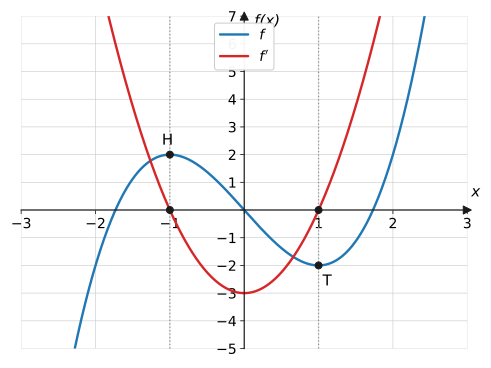

Verständnisfrage: Unter jedem Extrempunkt von $f$ liegt eine Nullstelle von $f'$ – gilt das auch umgekehrt?

Nein! Eine Nullstelle von $f'$ heißt nur: waagerechte Tangente. Das kann
ein Hoch- oder Tiefpunkt sein – oder ein **Sattelpunkt**, bei dem $f$
danach in dieselbe Richtung weiterläuft. Entscheidend ist der
**Vorzeichenwechsel** von $f'$: ohne Wechsel kein Extremum.

### Vorgehen in drei Schritten

1. **Besondere Stellen übertragen:** Unter jedem Hoch-/Tiefpunkt von
   $f$ eine Nullstelle von $f'$ markieren (senkrechte Hilfslinien!).
2. **Vorzeichen festlegen:** Wo $f$ steigt, liegt $f'$ oben, wo $f$
   fällt, unten.
3. **Steigungswerte schätzen:** An einigen Stellen die
   Tangentensteigung abschätzen (z. B. mit einem Geodreieck als
   „Tangentenlineal“) und als $y$-Werte von $f'$ eintragen, dann glatt
   verbinden.

**Grad-Faustregel:** Der $f'$-Graph ist immer „eine Stufe einfacher“ –
aus einer Parabel wird eine Gerade, aus einer kubischen Kurve eine
Parabel, aus einer W-Form eine kubische Kurve.

Verständnisfrage: Warum ist der $f'$-Graph immer „eine Stufe einfacher“ als der $f$-Graph?

Wegen der Potenzregel: Aus dem Leitterm $a x^n$ wird $n a x^{n-1}$ – der
Grad sinkt beim Ableiten um genau 1. Anschaulich: Eine Kurve mit zwei
„Buckeln“ (Grad 3) hat zwei Stellen mit waagerechter Tangente, ihre
Ableitung braucht also zwei Nullstellen – eine Parabel (Grad 2) reicht
dafür genau.

### Rückwärts lesen: von f′ auf f

Auch die Gegenrichtung folgt dem Wörterbuch, von rechts nach links
gelesen: Nullstelle von $f'$ mit Vorzeichenwechsel von $-$ nach $+$ →
Tiefpunkt von $f$, usw. **Aber:** $f$ ist dabei nur bis auf eine
Verschiebung in $y$-Richtung bestimmt – alle senkrecht verschobenen
Kopien haben dieselbe Ableitung.

Verständnisfrage: Der $f'$-Graph hat bei $x = 1$ einen Hochpunkt. Was passiert dort am $f$-Graphen?

Der $y$-Wert von $f'$ ist die Steigung von $f$ – ein Maximum von $f'$
bedeutet also: Bei $x = 1$ ist $f$ **am steilsten**. Das ist ein
**Wendepunkt** von $f$: Bis dahin wurde der Anstieg immer stärker, ab
dort flacht er wieder ab.

## Merksatz

Merksatz anzeigen

Der $f'$-Graph zeigt **Steigungen**, nicht Werte: $f$ steigt ↔ $f'$
über der Achse; Extrempunkt von $f$ ↔ Nullstelle von $f'$ (mit
Vorzeichenwechsel); steilste Stelle von $f$ ↔ Extrempunkt von $f'$;
Sattelpunkt ↔ $f'$ berührt die Achse. Der Grad sinkt um 1. Rückwärts
gilt alles genauso – aber $f$ ist nur bis auf Verschiebung nach
oben/unten bestimmt.

## Beispiele

**Beispiel 1:** Am Schema-Graphen oben (blaue Kurve $f$ mit
$H(-1 \mid 2)$ und $T(1 \mid -2)$): Leite die Form des $f'$-Graphen
Schritt für Schritt her.

Lösung

**Schritt 1:** Unter $H(-1 \mid 2)$ und $T(1 \mid -2)$ liegen
Nullstellen von $f'$: bei $x = -1$ und $x = 1$.

**Schritt 2 – Vorzeichen:**

| Bereich | $f$ | $f'$ |
| --- | --- | --- |
| $x < -1$ | steigt | positiv |
| $-1 < x < 1$ | fällt | negativ |
| $x > 1$ | steigt | positiv |

**Schritt 3:** Positiv – null – negativ – null – positiv, glatt
verbunden: eine nach oben geöffnete **Parabel** mit Nullstellen $\pm 1$
und Tiefpunkt bei $x = 0$ (dort fällt $f$ am steilsten). Genau der rote
Graph im Bild.

**Beispiel 2:** Der Graph zeigt eine Parabel $f$ mit Tiefpunkt
$T(1 \mid -1)$ (erster Aufgaben-Graph unten, siehe Aufgabe 3).
Konstruiere den $f'$-Graphen über eine Steigungstabelle.

Lösung

Tangentensteigungen am Graphen abschätzen:

| $x$ | $-1$ | $0$ | $1$ | $2$ | $3$ |
| --- | --- | --- | --- | --- | --- |
| Steigung von $f$ | $-4$ | $-2$ | $0$ | $2$ | $4$ |

Die Werte wachsen gleichmäßig um 2 pro Schritt – die Punkte
$(x \mid f'(x))$ liegen auf einer **Geraden** durch $(1 \mid 0)$ mit
Steigung 2. (Plausibel: Ableitung einer Parabel ist eine Gerade.)

**Beispiel 3:** Gegeben ist der Graph von $f'$: eine steigende Gerade
mit Nullstelle bei $x = -1$ (Aufgaben-Graph von Aufgabe 8). Was lässt
sich über $f$ sagen?

Lösung

- Für $x < -1$ ist $f'$ **negativ** → $f$ fällt.
- Bei $x = -1$ Vorzeichenwechsel von $-$ nach $+$ → **Tiefpunkt** von
  $f$.
- Für $x > -1$ ist $f'$ **positiv** → $f$ steigt, und zwar immer
  steiler (denn $f'$ wächst).

Fallend–Tiefpunkt–steigend mit linear wachsender Steigung: $f$ ist eine
nach oben geöffnete **Parabel** mit Scheitel bei $x = -1$. Ihre Höhe ist
nicht bestimmt – jede in $y$-Richtung verschobene Parabel passt.

## Aufgaben

Aufgabe 1 ⭐

Vervollständige das „Wörterbuch“: Was gilt am
$f'$-Graphen, wenn a) $f$ streng steigt, b) $f$ einen Tiefpunkt hat,
c) $f$ einen Sattelpunkt hat?

Lösung zu Aufgabe 1

a) $f'$ verläuft oberhalb der $x$-Achse ($f' > 0$).

b) $f'$ hat eine Nullstelle mit Vorzeichenwechsel von $-$ nach $+$.

c) $f'$ **berührt** die $x$-Achse (Nullstelle ohne Vorzeichenwechsel).

Aufgabe 2 ⭐

Der Graph von $f$ hat einen Hochpunkt bei $x = -1$ und
einen Tiefpunkt bei $x = 3$. Gib die Nullstellen von $f'$ an und die
Bereiche, in denen $f'$ negativ ist.

Lösung zu Aufgabe 2

Nullstellen von $f'$: $x = -1$ und $x = 3$.
Zwischen Hoch- und Tiefpunkt fällt $f$, also ist $f'$ **negativ für
$-1 < x < 3$**.

Aufgabe 3 ⭐

Skizziere den Graphen von $f'$ zum abgebildeten
Graphen:

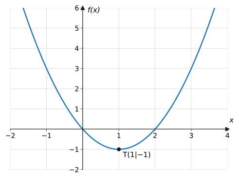

Lösung zu Aufgabe 3

Unter dem Tiefpunkt $T(1 \mid -1)$ liegt die Nullstelle von $f'$.
Links davon fällt $f$ ($f'$ negativ), rechts steigt $f$ ($f'$ positiv),
die Steigung wächst gleichmäßig → $f'$ ist eine steigende Gerade:

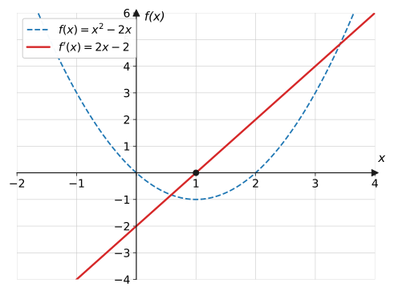

Aufgabe 4 ⭐

Skizziere den Graphen von $f'$:

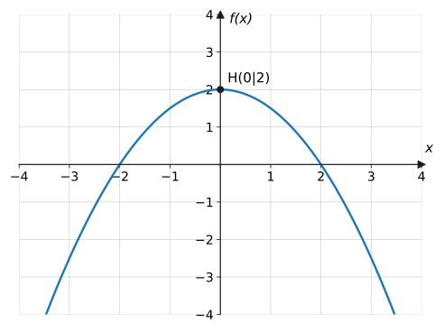

Lösung zu Aufgabe 4

Nullstelle von $f'$ unter dem Hochpunkt bei $x = 0$; links steigt $f$
($f' > 0$), rechts fällt $f$ ($f' < 0$) → fallende Gerade durch den
Ursprung:

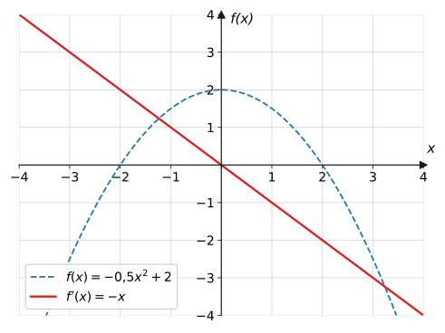

Aufgabe 5 ⭐⭐

Skizziere den Graphen von $f'$:

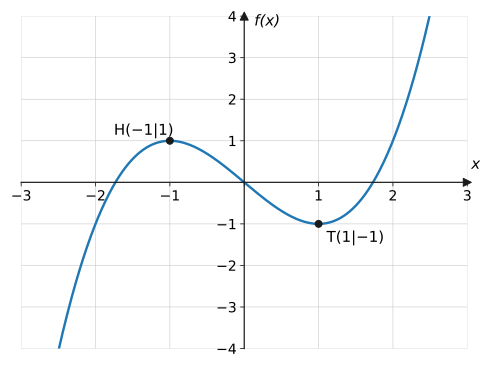

Lösung zu Aufgabe 5

Nullstellen von $f'$ unter $H$ und $T$: bei $\pm 1$. Außen steigt $f$
($f' > 0$), dazwischen fällt $f$ ($f' < 0$) → nach oben geöffnete
Parabel mit Tiefpunkt bei $x = 0$:

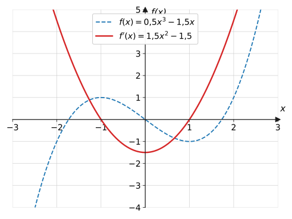

Aufgabe 6 ⭐⭐

Skizziere den Graphen von $f'$:

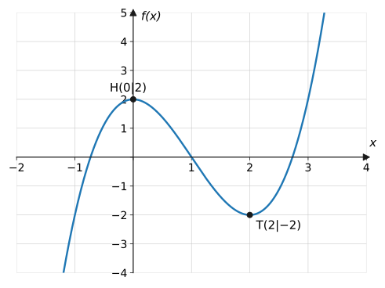

Lösung zu Aufgabe 6

Nullstellen von $f'$ bei $x = 0$ und $x = 2$; dazwischen negativ
(fallendes $f$), außen positiv → nach oben geöffnete Parabel mit
Scheitel bei $x = 1$:

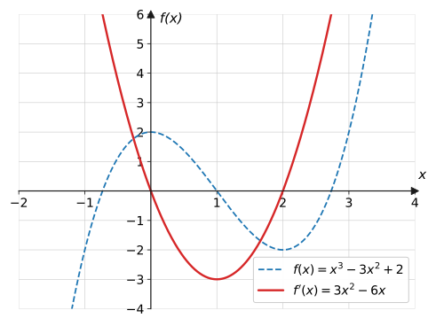

Aufgabe 7 ⭐⭐⭐

Skizziere den Graphen von $f'$:

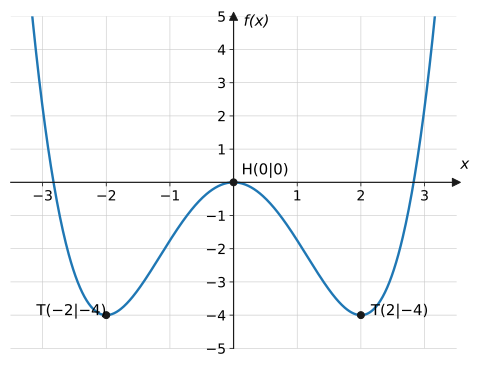

Lösung zu Aufgabe 7

Drei Extrempunkte → drei Nullstellen von $f'$ bei $-2$, $0$, $2$.
Vorzeichen von links: $f$ fällt ($-$), steigt ($+$), fällt ($-$),
steigt ($+$) → kubische Kurve „von unten nach oben“ durch die drei
Nullstellen:

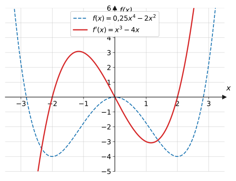

Aufgabe 8 ⭐⭐

Diesmal umgekehrt – gegeben ist der Graph der
**Ableitung** $f'$. Skizziere einen möglichen Graphen von $f$:

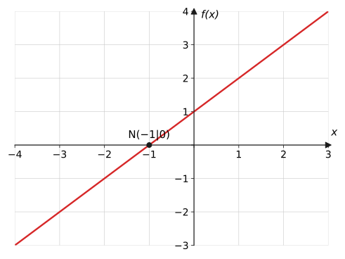

Lösung zu Aufgabe 8

$f'$ wechselt bei $x = -1$ von $-$ nach $+$ → Tiefpunkt von $f$ bei
$x = -1$; links fällt $f$, rechts steigt $f$ mit wachsender Steigung →
nach oben geöffnete Parabel mit Scheitelstelle $-1$:

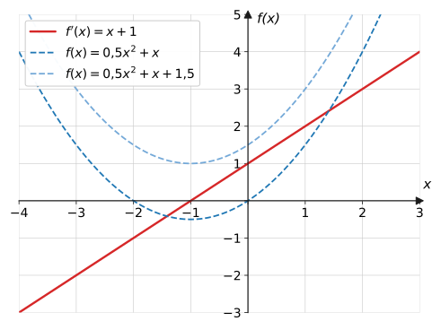

Jede in $y$-Richtung verschobene Parabel ist ebenfalls richtig.

Aufgabe 9 ⭐⭐

Warum ist der Graph von $f$ in Aufgabe 8 nicht
eindeutig bestimmt? Gib zwei verschiedene Funktionen an, die beide die
Ableitung $f'(x) = x + 1$ haben.

Lösung zu Aufgabe 9

$f'$ legt nur die **Steigungen** fest, nicht die Höhenlage. Zum
Beispiel haben

$$
f_1(x) = 0{,}5x^2 + x \qquad\text{und}\qquad f_2(x) = 0{,}5x^2 + x + 1{,}5
$$

beide die Ableitung $x + 1$ – konstante Summanden fallen beim Ableiten
weg.

Aufgabe 10 ⭐⭐

Woran erkennt man am $f'$-Graphen, dass $f$ einen
**Sattelpunkt** hat und keinen Extrempunkt?

Lösung zu Aufgabe 10

$f'$ hat zwar eine Nullstelle, aber **ohne Vorzeichenwechsel**: Der
$f'$-Graph berührt die $x$-Achse nur (z. B. Parabel mit Scheitel auf der
Achse). $f$ hat dort eine waagerechte Tangente, steigt aber davor und
danach in dieselbe Richtung weiter.

Aufgabe 11 ⭐⭐

An welcher Stelle fällt der Graph aus Aufgabe 5 am
steilsten? Woran erkennt man das am $f'$-Graphen?

Lösung zu Aufgabe 11

Zwischen Hoch- und Tiefpunkt, bei $x = 0$: Dort hat der $f'$-Graph
seinen **Tiefpunkt** ($f'(0) = -1{,}5$, der negativste Wert). Die
steilste Stelle von $f$ ist zugleich ihr Wendepunkt.

Aufgabe 12 ⭐⭐

Der Graph von $f'$ ist eine nach oben geöffnete
Parabel mit den Nullstellen $-1$ und $1$. In welchen Intervallen steigt
bzw. fällt $f$? Wo liegen Hoch- und Tiefpunkt?

Lösung zu Aufgabe 12

$f' > 0$ für $x < -1$ und $x > 1$ → $f$ **steigt** dort.
$f' < 0$ für $-1 < x < 1$ → $f$ **fällt** dazwischen.

Bei $x = -1$: Wechsel $+ \to -$ → **Hochpunkt**;
bei $x = 1$: Wechsel $- \to +$ → **Tiefpunkt**.

Aufgabe 13 ⭐

Ergänze die Faustregel: Der Graph einer
ganzrationalen Funktion vom Grad $n$ hat eine Ableitung vom Grad … Gib
die Paare für Parabel und W-Form an.

Lösung zu Aufgabe 13

Grad $n - 1$ (die Potenzregel senkt jeden Exponenten um 1):
Parabel (Grad 2) → Gerade (Grad 1); W-Form (Grad 4) → kubische Kurve
(Grad 3).

Aufgabe 14 ⭐⭐

Fehlersuche: Lena zeichnet als $f'$-Graphen einfach
den $f$-Graphen um 1 nach unten verschoben. Erkläre grundsätzlich, warum
das nicht funktionieren kann.

Lösung zu Aufgabe 14

Der $f'$-Graph zeigt nicht die **Werte** von $f$, sondern ihre
**Steigungen** – das sind völlig andere Größen. Konkretes Gegenargument:
Am Hochpunkt hat $f$ einen großen Wert, aber die Steigung 0; die
verschobene Kopie hätte dort keinen Achsenschnittpunkt. Auch der Grad
passt nicht (er müsste um 1 sinken).

Aufgabe 15 ⭐⭐⭐

Wende das Verfahren zweimal an: Der Graph von $f$
sei die kubische Kurve aus Aufgabe 5. Beschreibe den Graphen von $f''$.
An welcher Stelle hat $f''$ seine Nullstelle, und was bedeutet sie für
$f$?

Lösung zu Aufgabe 15

$f'$ ist eine nach oben geöffnete Parabel mit Tiefpunkt bei $x = 0$
(Aufgabe 5). Deren Ableitung $f''$ ist eine **steigende Gerade** mit
Nullstelle unter dem Parabel-Tiefpunkt, also bei $x = 0$.

Bedeutung für $f$: Bei $x = 0$ liegt die **steilste Stelle** zwischen
Hoch- und Tiefpunkt – der Wendepunkt von $f$ (dort wechselt die
Krümmung).

Aufgabe 16 ⭐⭐⭐

Höhenprofil einer Radetappe: erst gleichmäßiger
Anstieg, oben ein Gipfelplateau, dann steile Abfahrt ins Tal, zuletzt
flaches Ziel. Beschreibe den Verlauf des zugehörigen
Steigungsgraphen ($f'$) in Worten.

Lösung zu Aufgabe 16

- Anstieg: $f'$ konstant **positiv** (etwa waagerechtes Stück oberhalb
  der Achse)
- Gipfelplateau: $f'$ fällt auf **0** und bleibt dort kurz
- Steile Abfahrt: $f'$ springt deutlich ins **Negative** (tiefster
  Wert = steilstes Gefälle)
- Flaches Ziel: $f'$ kehrt auf **0** zurück

Der Steigungsgraph pendelt also um die $x$-Achse und bildet Anstieg,
Plateau, Abfahrt und Zielflachstück als positiv/null/negativ/null ab.

Aufgabe 17 ⭐⭐ · Verständnisaufgabe

Wahr oder falsch? Begründe:
a) „$f'(3) = 0$, also hat $f$ bei $x = 3$ einen Extrempunkt.“
b) „Die Ableitung einer nach unten geöffneten Parabel ist eine steigende
Gerade.“

Lösung zu Aufgabe 17

a) **Falsch.** $f'(3) = 0$ garantiert nur eine waagerechte Tangente.
Wechselt $f'$ dort das Vorzeichen nicht, liegt ein **Sattelpunkt** vor –
wie bei $f(x) = x^3$ an der Stelle 0.

b) **Falsch.** Links vom Scheitel steigt die Parabel ($f' > 0$), rechts
fällt sie ($f' < 0$) – die Steigungen werden von links nach rechts
**kleiner**. Die Ableitung ist also eine **fallende** Gerade (bei
$f(x) = -x^2$ etwa $f'(x) = -2x$).

## Vertiefung

:::caution
Häufigster Fehler: den $f'$-Graphen wie eine „Kopie“ von $f$ behandeln
(Aufgabe 14). Kontrolliere jede Skizze mit den zwei harten Kriterien:
Nullstellen von $f'$ **exakt unter** den Extrempunkten von $f$, und
Vorzeichen von $f'$ passend zu steigt/fällt.
:::

**Warum das trainiert wird:** In Klassenarbeiten (und im Abitur) sind
Zuordnungsaufgaben „Welcher Graph gehört zu $f'$?“ Standard – sie
prüfen das Verständnis der Ableitung ohne jede Rechnung.

**Ausblick:** Die Wörterbuch-Regeln sind genau die Kriterien, mit denen
die nächste Seite [Extrem- und Wendepunkte](../extrem-wendepunkte/)
**rechnerisch** arbeitet: $f'(x_0) = 0$ plus Vorzeichenwechsel.

## Quiz

Zum Abschluss: Klicke bei jeder Frage eine Antwort an – die Auswertung kommt sofort.

<Quiz fragen={[
  { frage: 'f hat bei x = 2 einen Hochpunkt. Was gilt für den Graphen von f′?',
    antworten: ['f′ hat bei x = 2 einen Hochpunkt', 'f′ hat bei x = 2 eine Nullstelle', 'f′ ist bei x = 2 maximal steil', 'f′ hat bei x = 2 den Wert 2'],
    richtig: 1, erklaerung: 'Am Extrempunkt ist die Tangente waagerecht – die Ableitung ist dort null.' },
  { frage: 'f fällt auf einem Intervall. Wo verläuft dort der Graph von f′?',
    antworten: ['Oberhalb der x-Achse', 'Unterhalb der x-Achse', 'Auf der x-Achse', 'Das kann man nicht sagen'],
    richtig: 1, erklaerung: 'Fallend bedeutet negative Steigungen – f′ ist dort negativ.' },
  { frage: 'Woran erkennt man einen Sattelpunkt von f am Graphen von f′?',
    antworten: ['f′ schneidet die x-Achse steil', 'f′ berührt die x-Achse ohne Vorzeichenwechsel', 'f′ hat dort einen Sprung', 'f′ ist dort maximal'],
    richtig: 1, erklaerung: 'Nullstelle ohne Vorzeichenwechsel: waagerechte Tangente, aber f steigt (oder fällt) auf beiden Seiten weiter.' },
  { frage: 'f ist eine Parabel. Welche Form hat der Graph von f′?',
    antworten: ['Ebenfalls eine Parabel', 'Eine Gerade', 'Eine kubische Kurve', 'Eine Waagerechte'],
    richtig: 1, erklaerung: 'Der Grad sinkt beim Ableiten um 1: Aus Grad 2 wird Grad 1 – eine Gerade.' },
  { frage: 'Warum ist f durch den Graphen von f′ nicht eindeutig bestimmt?',
    antworten: ['Weil f′ ungenau ist', 'Weil alle in y-Richtung verschobenen Kopien von f dieselbe Ableitung haben', 'Weil f′ nur für x &gt; 0 gilt', 'f ist eindeutig bestimmt'],
    richtig: 1, erklaerung: 'Konstante Summanden fallen beim Ableiten weg – f + c hat für jedes c dieselbe Ableitung.' },
  { frage: 'Verständnisfrage: f′(x₀) = 0. Hat f bei x₀ auf jeden Fall einen Extrempunkt?',
    antworten: ['Ja, das ist die Definition', 'Nein – ohne Vorzeichenwechsel von f′ ist es ein Sattelpunkt', 'Ja, wenn f eine Parabel ist – sonst nie', 'Nein, f hat dort immer einen Wendepunkt'],
    richtig: 1, erklaerung: 'Waagerechte Tangente ist nur notwendig, nicht hinreichend: Bei f(x) = x³ ist f′(0) = 0, aber x = 0 ist ein Sattelpunkt.' },
  { frage: 'Verständnisfrage: Der f′-Graph hat bei x = 1 ein Maximum. Was gilt für f?',
    antworten: ['f hat bei x = 1 einen Hochpunkt', 'f ist bei x = 1 am steilsten – ein Wendepunkt', 'f hat bei x = 1 eine Nullstelle', 'f fällt ab x = 1'],
    richtig: 1, erklaerung: 'f′-Werte sind Steigungen: Das Maximum von f′ markiert die steilste Stelle von f – dort wendet sich das Krümmungsverhalten.' },
]} />
