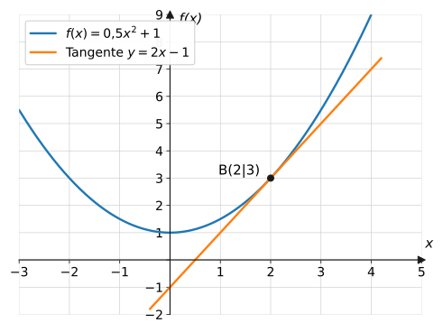
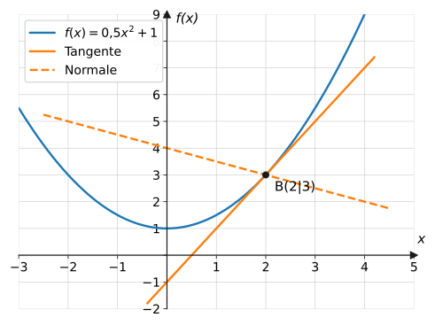
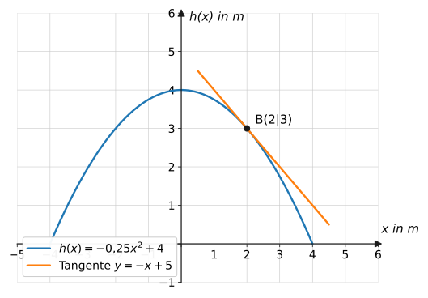

import Quiz from '../../../components/Quiz.astro';

## Worum geht's?

Wie steil ist eine Skaterrampe an ihrer Kante? In welche Richtung fliegt
ein Ball, der von einer gekrümmten Bahn abhebt? Beides beantwortet die
**Tangente** – die Gerade, die sich im Berührpunkt an den Graphen
anschmiegt. Ihre Steigung kennen wir bereits: die Ableitung.
**Leitfrage:** Wie stellt man aus $f$ und $f'$ die komplette
**Geradengleichung** der Tangente auf – und die der senkrecht dazu
stehenden **Normale**?

## Erklärung

### Die Tangentengleichung

Gesucht ist die Gerade $y = mx + b$ durch den **Berührpunkt**
$B(x_0 \mid f(x_0))$ mit der Steigung der Kurve an dieser Stelle. Rezept:

1. **$y$-Koordinate:** $y_0 = f(x_0)$ berechnen
2. **Steigung:** $m = f'(x_0)$ berechnen
3. **$b$ bestimmen:** $B$ in $y = mx + b$ einsetzen

Beispiel $f(x) = 0{,}5x^2 + 1$ an der Stelle $x_0 = 2$:

$$
\begin{aligned}
f(2) &= 0{,}5 \cdot 4 + 1 = 3 &&\text{| Berührpunkt } B(2 \mid 3) \\
f'(x) = x \ \Rightarrow\ f'(2) &= 2 &&\text{| Steigung } m = 2 \\
3 = 2 \cdot 2 + b \ \Rightarrow\ b &= -1 &&\text{| } B \text{ einsetzen}
\end{aligned}
$$

$$
\text{Tangente:}\quad y = 2x - 1
$$

Verständnisfrage: Wozu braucht man $f(x_0)$ <em>und</em> $f'(x_0)$ – reicht nicht eins von beiden?

Eine Gerade ist erst durch **zwei** Angaben festgelegt: einen Punkt und
eine Steigung. $f(x_0)$ liefert den Berührpunkt (wo?), $f'(x_0)$ die
Steigung (wie steil?). Wer beides verwechselt – etwa $f'(x_0)$ als
$y$-Koordinate einsetzt –, baut eine Gerade, die mit der Kurve nichts zu
tun hat.

### Die Normale

Die **Normale** steht im Berührpunkt **senkrecht** auf der Tangente.
Für die Steigungen zweier senkrechter Geraden gilt:

$$
m_t \cdot m_n = -1 \qquad\Longrightarrow\qquad m_n = -\frac{1}{m_t}
$$

Im Beispiel: $m_n = -\frac{1}{2}$. Mit $B(2 \mid 3)$:

$$
3 = -\frac{1}{2} \cdot 2 + b \ \Rightarrow\ b = 4
\qquad\Rightarrow\qquad
\text{Normale:}\quad y = -\frac{1}{2}x + 4
$$

Sonderfall: Ist die Tangente **waagerecht** ($m_t = 0$), ist die Normale
die **senkrechte** Gerade $x = x_0$ (keine Funktionsgleichung).

Verständnisfrage: Warum gilt für senkrechte Geraden gerade $m_t \cdot m_n = -1$?

Dreht man das Steigungsdreieck („1 nach rechts, $m$ nach oben“) um 90°,
wird daraus „$m$ nach links, 1 nach oben“ – die gedrehte Gerade hat also
die Steigung $\frac{1}{-m} = -\frac{1}{m}$. Das Produkt beider Steigungen
ist dann immer $m \cdot \left(-\frac{1}{m}\right) = -1$. Probe im
Beispiel: $2 \cdot \left(-\frac{1}{2}\right) = -1$. ✓

### Steilheit im Kontext: Steigungswinkel

Aus der Tangentensteigung folgt der **Steigungswinkel** gegenüber der
Horizontalen: $\tan(\alpha) = m$, also $\alpha = \tan^{-1}(m)$.
Beispiel: $m = -1$ bedeutet 45° Gefälle – relevante Information für
jede Rampe:

Verständnisfrage: „Die Tangente berührt den Graphen nur und schneidet ihn nie“ – stimmt das?

Nur **lokal**, also in der Nähe des Berührpunkts. Weiter draußen darf
die Tangente die Kurve durchaus wieder treffen: Bei $f(x) = x^3 - 3x$
schneidet z. B. jede Tangente den Graphen noch ein zweites Mal. „Genau
ein gemeinsamer Punkt“ gilt als Tangenten-Kriterium nur bei Parabeln.

## Beispiele

**Beispiel 1:** Bestimme die Tangentengleichung an
$f(x) = 0{,}5x^2 + 1$ im Punkt mit $x_0 = 2$.

Lösung

**Schritt 1 – Berührpunkt:** $f(2) = 0{,}5 \cdot 4 + 1 = 3$, also
$B(2 \mid 3)$.

**Schritt 2 – Steigung:** $f'(x) = x$, also $m = f'(2) = 2$.

**Schritt 3 – $b$ bestimmen:**

$$
\begin{aligned}
3 &= 2 \cdot 2 + b &&\text{| } B \text{ einsetzen} \\
b &= -1
\end{aligned}
$$

$$
t\colon\ y = 2x - 1
$$

**Beispiel 2:** Bestimme die Gleichung der Normale an
$f(x) = 0{,}5x^2 + 1$ im selben Punkt $B(2 \mid 3)$.

Lösung

Tangentensteigung aus Beispiel 1: $m_t = 2$. Normalensteigung:

$$
m_n = -\frac{1}{m_t} = -\frac{1}{2}
$$

$b$ über den Punkt $B(2 \mid 3)$:

$$
\begin{aligned}
3 &= -\frac{1}{2} \cdot 2 + b \\
3 &= -1 + b \\
b &= 4
\end{aligned}
$$

$$
n\colon\ y = -\frac{1}{2}x + 4
$$

**Beispiel 3:** Bestimme die Tangente an $f(x) = x^3 - 3x$ an der Stelle
$x_0 = 2$ und prüfe, ob der Punkt $Q(1 \mid -7)$ auf ihr liegt.

Lösung

**Berührpunkt:** $f(2) = 8 - 6 = 2$ → $B(2 \mid 2)$.

**Steigung:** $f'(x) = 3x^2 - 3$ → $m = f'(2) = 12 - 3 = 9$.

**$b$:**

$$
2 = 9 \cdot 2 + b \quad\Rightarrow\quad b = -16
$$

$$
t\colon\ y = 9x - 16
$$

**Punktprobe für $Q(1 \mid -7)$:** $\ 9 \cdot 1 - 16 = -7$ ✓ – $Q$ liegt
auf der Tangente (aber nicht auf dem Graphen: $f(1) = -2 \neq -7$).

## Aufgaben

Aufgabe 1 ⭐

Bestimme die Tangente an $f(x) = x^2$ an der Stelle
$x_0 = 1$.

Lösung zu Aufgabe 1

$f(1) = 1$ → $B(1 \mid 1)$; $\ f'(x) = 2x$ → $m = 2$.

$$
1 = 2 \cdot 1 + b \ \Rightarrow\ b = -1
\qquad\Rightarrow\qquad y = 2x - 1
$$

Aufgabe 2 ⭐

Bestimme die Tangente an $f(x) = x^2$ an der Stelle
$x_0 = -2$.

Lösung zu Aufgabe 2

$f(-2) = 4$ → $B(-2 \mid 4)$; $\ m = f'(-2) = -4$.

$$
4 = -4 \cdot (-2) + b \ \Rightarrow\ 4 = 8 + b \ \Rightarrow\ b = -4
$$

$$
y = -4x - 4
$$

Aufgabe 3 ⭐

Bestimme die Tangente an $f(x) = x^2 + 3$ an der
Stelle $x_0 = 0$. Was fällt auf?

Lösung zu Aufgabe 3

$f(0) = 3$; $\ f'(x) = 2x$ → $m = f'(0) = 0$.

$$
y = 3
$$

Die Tangente ist **waagerecht** – bei $x_0 = 0$ liegt der Scheitel.

Aufgabe 4 ⭐⭐

Bestimme die Tangente an $f(x) = x^3$ an der Stelle
$x_0 = 1$.

Lösung zu Aufgabe 4

$f(1) = 1$ → $B(1 \mid 1)$; $\ f'(x) = 3x^2$ → $m = 3$.

$$
1 = 3 + b \ \Rightarrow\ b = -2
\qquad\Rightarrow\qquad y = 3x - 2
$$

Aufgabe 5 ⭐⭐

Bestimme die Tangente an $f(x) = x^2 - 4x + 5$ an der
Stelle $x_0 = 3$.

Lösung zu Aufgabe 5

$f(3) = 9 - 12 + 5 = 2$ → $B(3 \mid 2)$; $\ f'(x) = 2x - 4$ →
$m = f'(3) = 2$.

$$
2 = 2 \cdot 3 + b \ \Rightarrow\ b = -4
\qquad\Rightarrow\qquad y = 2x - 4
$$

Aufgabe 6 ⭐⭐

Bestimme die Normale an $f(x) = x^2$ im Punkt
$B(1 \mid 1)$.

Lösung zu Aufgabe 6

Tangentensteigung $m_t = f'(1) = 2$, also
$m_n = -\frac{1}{2}$.

$$
1 = -\frac{1}{2} \cdot 1 + b \ \Rightarrow\ b = \frac{3}{2}
\qquad\Rightarrow\qquad y = -\frac{1}{2}x + \frac{3}{2}
$$

Aufgabe 7 ⭐⭐

Bestimme Tangente **und** Normale an
$f(x) = x^3 - 2x$ an der Stelle $x_0 = 1$.

Lösung zu Aufgabe 7

$f(1) = 1 - 2 = -1$ → $B(1 \mid -1)$; $\ f'(x) = 3x^2 - 2$ →
$m_t = f'(1) = 1$.

**Tangente:** $-1 = 1 \cdot 1 + b \Rightarrow b = -2$:

$$
t\colon\ y = x - 2
$$

**Normale:** $m_n = -\frac{1}{1} = -1$;
$\ -1 = -1 \cdot 1 + b \Rightarrow b = 0$:

$$
n\colon\ y = -x
$$

Aufgabe 8 ⭐⭐

An welchen Punkten hat der Graph von
$f(x) = x^3 - 12x$ waagerechte Tangenten? Gib die Tangentengleichungen
an.

Lösung zu Aufgabe 8

$$
f'(x) = 3x^2 - 12 = 0 \ \Rightarrow\ x^2 = 4 \ \Rightarrow\ x = \pm 2
$$

$f(2) = 8 - 24 = -16$; $\ f(-2) = -8 + 24 = 16$.

Waagerechte Tangenten in $(2 \mid -16)$ und $(-2 \mid 16)$ mit den
Gleichungen $y = -16$ bzw. $y = 16$.

Aufgabe 9 ⭐⭐

Zeige rechnerisch, dass die Gerade $y = 4x - 4$ eine
Tangente an $f(x) = x^2$ ist, und gib den Berührpunkt an.

Lösung zu Aufgabe 9

Schnittstellen bestimmen (gleichsetzen):

$$
\begin{aligned}
x^2 &= 4x - 4 &&\text{| alles nach links} \\
x^2 - 4x + 4 &= 0 &&\text{| binomische Formel} \\
(x - 2)^2 &= 0
\end{aligned}
$$

**Genau eine** (doppelte) Lösung $x = 2$ – die Gerade berührt den
Graphen, statt ihn zu schneiden: Tangente mit Berührpunkt $B(2 \mid 4)$.
(Kontrolle über die Ableitung: $f'(2) = 4$ = Geradensteigung ✓)

Aufgabe 10 ⭐⭐

In welchem Punkt ist die Tangente an $f(x) = x^2$
**parallel** zur Geraden $g\colon y = 6x - 1$? Gib die
Tangentengleichung an.

Lösung zu Aufgabe 10

Parallel heißt gleiche Steigung:

$$
f'(x) = 2x = 6 \quad\Rightarrow\quad x = 3
$$

$f(3) = 9$ → $B(3 \mid 9)$. Tangente: $9 = 6 \cdot 3 + b \Rightarrow
b = -9$:

$$
y = 6x - 9
$$

Aufgabe 11 ⭐⭐

An welcher Stelle steigt der Graph von $f(x) = x^2$
unter einem Winkel von 45° an (d. h. Tangentensteigung 1)?

Lösung zu Aufgabe 11

45° entspricht $m = \tan(45^\circ) = 1$:

$$
2x = 1 \quad\Rightarrow\quad x = 0{,}5
$$

Im Punkt $(0{,}5 \mid 0{,}25)$ steigt die Parabel unter 45°.

Aufgabe 12 ⭐⭐⭐

a) Prüfe für $f(x) = 0{,}5x^2 + 1$ an der Stelle
$x_0 = 2$ die Senkrecht-Bedingung $m_t \cdot m_n = -1$ nach.
b) Begründe allgemein: Multipliziert man die Steigungen von Tangente
und Normale, ergibt sich immer $-1$ (außer bei waagerechter Tangente).

Lösung zu Aufgabe 12

a) $m_t = f'(2) = 2$ und $m_n = -\frac{1}{2}$ (Beispiel 2):

$$
2 \cdot \left(-\frac{1}{2}\right) = -1 \ \checkmark
$$

b) Die Normale ist als die Senkrechte zur Tangente **definiert**, und
für senkrechte Geraden gilt $m_1 \cdot m_2 = -1$: Das Steigungsdreieck
der einen Geraden ist das um 90° gedrehte Dreieck der anderen – aus
„$\Delta x$ nach rechts, $\Delta y$ nach oben“ wird „$\Delta y$ nach
links, $\Delta x$ nach oben“, also $m_2 = -\frac{\Delta x}{\Delta y} =
-\frac{1}{m_1}$. Bei $m_t = 0$ versagt die Formel: Die Normale ist dann
senkrecht ($x = x_0$).

Aufgabe 13 ⭐⭐⭐

Der Querschnitt einer Skaterrampe wird durch
$h(x) = -0{,}25x^2 + 4$ beschrieben ($x$, $h$ in Metern; Graph in der
Erklärung).
a) Bestimme die Tangente im Punkt $B(2 \mid 3)$.
b) Unter welchem Winkel fällt die Rampe dort ab?

Lösung zu Aufgabe 13

a) $h'(x) = -0{,}5x$ → $m = h'(2) = -1$.

$$
3 = -1 \cdot 2 + b \ \Rightarrow\ b = 5
\qquad\Rightarrow\qquad y = -x + 5
$$

b) $\tan(\alpha) = |m| = 1$ → $\alpha = 45^\circ$. Die Rampe fällt an
dieser Stelle unter **45°** ab – für Anfänger definitiv zu steil.

Aufgabe 14 ⭐⭐

Wo schneidet die Tangente an $f(x) = x^3$ an der
Stelle $x_0 = 2$ die $y$-Achse?

Lösung zu Aufgabe 14

$f(2) = 8$; $\ m = f'(2) = 12$;

$$
8 = 12 \cdot 2 + b \ \Rightarrow\ b = -16
$$

Tangente $y = 12x - 16$ – sie schneidet die $y$-Achse in
$(0 \mid -16)$.

Aufgabe 15 ⭐⭐⭐

Bestimme alle Tangenten an $f(x) = x^2$, die durch
den Punkt $P(1 \mid -3)$ verlaufen. ($P$ liegt **nicht** auf der
Parabel!)

Lösung zu Aufgabe 15

Der Berührpunkt ist unbekannt – nenne seine Stelle $a$. Die Tangente in
$(a \mid a^2)$ hat die Steigung $2a$:

$$
y = 2a(x - a) + a^2 = 2ax - a^2
$$

Sie soll durch $P(1 \mid -3)$ gehen:

$$
\begin{aligned}
-3 &= 2a \cdot 1 - a^2 &&\text{| ordnen} \\
a^2 - 2a - 3 &= 0 &&\text{| pq-Formel} \\
a &= 1 \pm 2
\end{aligned}
$$

$a_1 = 3$: Tangente $y = 6x - 9$ (Berührpunkt $(3 \mid 9)$).
$a_2 = -1$: Tangente $y = -2x - 1$ (Berührpunkt $(-1 \mid 1)$).

Probe mit $P$: $6 - 9 = -3$ ✓ und $-2 - 1 = -3$ ✓ – von $P$ aus gibt es
**zwei** Tangenten an die Parabel.

Aufgabe 16 ⭐⭐⭐

Begründe: Im Scheitel jeder Parabel
$f(x) = x^2 + c$ ist die Normale genau die $y$-Achse.

Lösung zu Aufgabe 16

Scheitel bei $x_0 = 0$ (denn $f'(x) = 2x = 0 \Leftrightarrow x = 0$).
Dort ist die Tangente waagerecht ($m_t = 0$) – die Normale steht
senkrecht darauf, ist also die **senkrechte Gerade** durch den Scheitel
$(0 \mid c)$: die Gerade $x = 0$, sprich die $y$-Achse. (Zugleich die
Symmetrieachse der Parabel.)

Aufgabe 17 ⭐⭐ · Verständnisaufgabe

a) Finde den Fehler: „Tangente an $f(x) = x^2 - 1$ bei $x_0 = 1$: Die
Steigung ist $m = f(1) = 0$, also ist die Tangente waagerecht.“
b) Wahr oder falsch? „Eine Tangente hat mit dem Graphen immer genau
einen gemeinsamen Punkt.“

Lösung zu Aufgabe 17

a) Hier wurde der **Funktionswert** mit der **Steigung** verwechselt:
$f(1) = 0$ ist die $y$-Koordinate des Berührpunkts $B(1 \mid 0)$. Die
Steigung liefert die Ableitung: $f'(x) = 2x$, also $m = f'(1) = 2$ –
die Tangente lautet $y = 2x - 2$ und ist keineswegs waagerecht.

b) **Falsch.** „Berühren“ ist eine lokale Eigenschaft. Weiter entfernt
darf die Tangente den Graphen erneut treffen – bei kubischen Funktionen
passiert das ständig. Nur bei Parabeln gilt: Tangente ⇔ genau ein
gemeinsamer Punkt (Diskriminante 0).

## Merksatz

Merksatz anzeigen

**Tangente** an der Stelle $x_0$: Berührpunkt $B(x_0 \mid f(x_0))$,
Steigung $m_t = f'(x_0)$, dann $b$ über Punkt einsetzen. **Normale:**
gleiche Rechnung mit $m_n = -\frac{1}{f'(x_0)}$ (steht senkrecht:
$m_t \cdot m_n = -1$). Tangente berühren heißt: Gleichsetzen liefert
eine **doppelte** Lösung.

## Vertiefung

:::caution
$f'(x_0)$ ist eine **Zahl** (die Steigung an einer Stelle), nicht die
Tangentengleichung! Die Tangente braucht zusätzlich den Berührpunkt.
Beliebter Fehler: $y = f'(x_0) \cdot x$ ohne $b$ – das stimmt nur, wenn
die Tangente zufällig durch den Ursprung geht.
:::

**Formel für Profis:** Alle drei Schritte in einer Zeile –
Punkt-Steigungs-Form der Tangente:

$$
y = f'(x_0) \cdot (x - x_0) + f(x_0)
$$

Damit lassen sich Aufgaben wie Nr. 15 kompakt ansetzen.

**Ausblick:** Waagerechte Tangenten ($f'(x_0) = 0$) markieren die
Kandidaten für Hoch- und Tiefpunkte – das Kernwerkzeug der Seite
[Extrem- und Wendepunkte](../extrem-wendepunkte/). Vorher trainiert
[Graphisches Differenzieren](../graphisches-differenzieren/) den Blick
für den Zusammenhang zwischen $f$ und $f'$.

## Quiz

Zum Abschluss: Klicke bei jeder Frage eine Antwort an – die Auswertung kommt sofort.

<Quiz fragen={[
  { frage: 'Woher kommt die Steigung der Tangente an der Stelle x₀?',
    antworten: ['Aus f(x₀)', 'Aus f′(x₀)', 'Aus f(0)', 'Aus dem y-Achsenabschnitt'],
    richtig: 1, erklaerung: 'Die Ableitung an der Stelle ist genau die Tangentensteigung – f(x₀) liefert nur den Berührpunkt.' },
  { frage: 'Welcher Zusammenhang gilt zwischen Tangenten- und Normalensteigung?',
    antworten: ['mₜ = mₙ', 'mₜ + mₙ = 0', 'mₜ · mₙ = −1', 'mₜ · mₙ = 1'],
    richtig: 2, erklaerung: 'Die Normale steht senkrecht auf der Tangente: mₙ = −1/mₜ.' },
  { frage: 'Wie lautet die Tangente an f(x) = x² an der Stelle x₀ = 1?',
    antworten: ['y = 2x', 'y = 2x − 1', 'y = x − 1', 'y = 2x + 1'],
    richtig: 1, erklaerung: 'B(1|1), m = f′(1) = 2; aus 1 = 2 · 1 + b folgt b = −1.' },
  { frage: 'Was bedeutet f′(x₀) = 0 für die Tangente?',
    antworten: ['Es gibt keine Tangente', 'Die Tangente ist waagerecht', 'Die Tangente ist senkrecht', 'Die Tangente geht durch den Ursprung'],
    richtig: 1, erklaerung: 'Steigung 0 = waagerechte Tangente – Kandidat für Hoch-, Tief- oder Sattelpunkt.' },
  { frage: 'Woran erkennt man beim Gleichsetzen von Gerade und Parabel, dass die Gerade Tangente ist?',
    antworten: ['Es gibt zwei Lösungen', 'Es gibt genau eine (doppelte) Lösung', 'Es gibt keine Lösung', 'Die Gerade hat Steigung 0'],
    richtig: 1, erklaerung: 'Berühren = genau ein gemeinsamer Punkt: Die quadratische Gleichung hat Diskriminante 0.' },
  { frage: 'Verständnisfrage: Welche zwei Zutaten legen die Tangente an der Stelle x₀ fest?',
    antworten: ['f(x₀) und f′(x₀) – Punkt und Steigung', 'f(x₀) und f(0)', 'f′(x₀) und f″(x₀)', 'Zwei Punkte auf der Kurve'],
    richtig: 0, erklaerung: 'Eine Gerade braucht Punkt + Steigung: f(x₀) sagt wo, f′(x₀) sagt wie steil. Verwechslung der beiden ist der häufigste Fehler.' },
  { frage: 'Verständnisfrage: Darf die Tangente den Graphen an einer anderen Stelle nochmal schneiden?',
    antworten: ['Nein, nie – sonst wäre sie keine Tangente', 'Ja – „berühren“ gilt nur lokal am Berührpunkt', 'Nur wenn f′(x₀) = 0', 'Nur bei Parabeln'],
    richtig: 1, erklaerung: 'Bei f(x) = x³ − 3x trifft jede Tangente den Graphen ein zweites Mal. Das Ein-Punkt-Kriterium funktioniert nur bei Parabeln.' },
]} />
