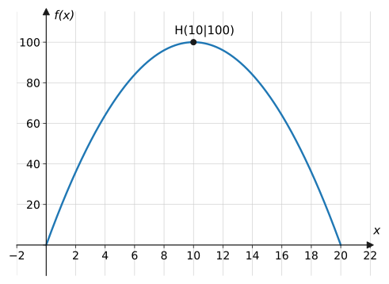
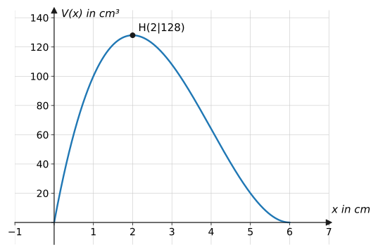
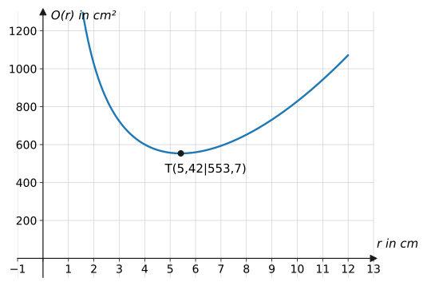
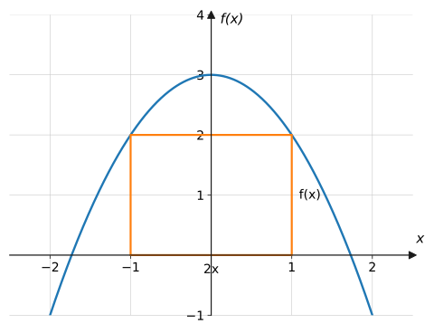
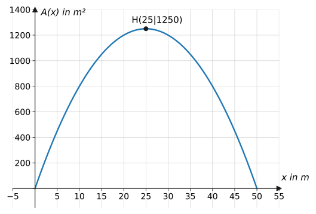
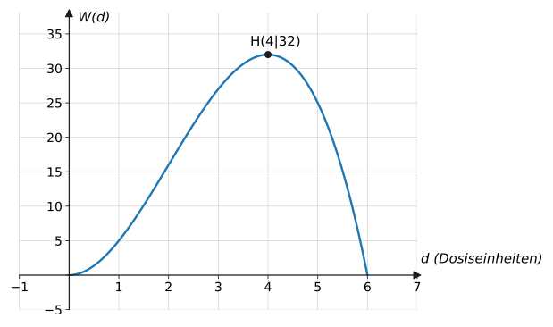

## Worum geht's?

Wie schneidet man aus einem Blech die Schachtel mit dem größten
Volumen? Welche Dose braucht für einen Liter Inhalt am wenigsten
Material? Welche Dosis erzielt die stärkste Wirkung? Immer geht es
darum, unter allen zulässigen Möglichkeiten die **beste** zu finden.
**Leitfrage:** Wie übersetzt man eine Optimierungsfrage in eine
Funktion – und findet dann mit der Differentialrechnung das Optimum?

## Erklärung

### Das Lösungsverfahren (5 Schritte)

1. **Skizze & Variablen:** Situation zeichnen, Größen benennen.
2. **Zielfunktion aufstellen:** Die Größe, die maximal/minimal werden
   soll (Fläche, Volumen, Kosten …) – zunächst oft mit **zwei**
   Variablen.
3. **Nebenbedingung einsetzen:** Der feste Zusammenhang (Umfang,
   Volumen, Blattgröße …) wird nach einer Variablen aufgelöst und in
   die Zielfunktion eingesetzt → Funktion **einer** Variablen, dazu den
   **sinnvollen Definitionsbereich** notieren.
4. **Extremum berechnen:** Zielfunktion ableiten, notwendige und
   hinreichende Bedingung ([Extrempunkte](../../differentialrechnung/extrem-wendepunkte/)).
5. **Randwerte prüfen & Antwortsatz:** Ist das Optimum wirklich im
   Inneren? Alle gesuchten Größen berechnen und mit Einheiten
   antworten.

### Mini-Durchlauf am Klassiker

*Zwei Zahlen haben die Summe 20. Wann ist ihr Produkt maximal?*

**Zielfunktion:** $P = x \cdot y$ (zwei Variablen).
**Nebenbedingung:** $x + y = 20 \Rightarrow y = 20 - x$. Einsetzen:

$$
P(x) = x(20 - x) = 20x - x^2, \qquad 0 \leq x \leq 20
$$

**Extremum:** $P'(x) = 20 - 2x = 0 \Rightarrow x = 10$;
$P''(x) = -2 < 0$ → Maximum. $y = 10$, $P = 100$.

**Antwort:** Beide Zahlen 10, maximales Produkt 100.

### Randwerte nicht vergessen

Der Definitionsbereich der Zielfunktion ist im Sachkontext fast immer
ein **Intervall**. Das gesuchte Optimum kann statt an einer Stelle mit
$f' = 0$ auch **am Rand** liegen – deshalb gehören die Randwerte zur
Kontrolle dazu (Aufgabe 30 zeigt einen solchen Fall).

:::caution
Häufigster Fehler: Es wird die **falsche Größe** optimiert. Die
Zielfunktion ist immer die Größe aus der Frage („… soll maximal
werden“); die Nebenbedingung ist der feste Zusammenhang („… stehen
100 m Zaun zur Verfügung“). Erst benennen, dann rechnen!
:::

## Beispiele

**Beispiel 1 (Zahlenpaar):** Zwei positive Zahlen haben die Summe 20.
Für welche Zahlen ist ihr Produkt maximal?

Lösung

**Zielfunktion:** $P = x \cdot y$ soll maximal werden.

**Nebenbedingung:** $x + y = 20$, also $y = 20 - x$.

**Einsetzen** (mit $0 < x < 20$):

$$
P(x) = x(20 - x) = 20x - x^2
$$

**Extremum:**

$$
P'(x) = 20 - 2x = 0 \quad\Rightarrow\quad x = 10
$$

$P''(x) = -2 < 0$ → Maximum ✓. Dann $y = 20 - 10 = 10$ und
$P = 100$.

**Antwort:** Das Produkt ist maximal für $10 \cdot 10 = 100$.
(An den Rändern $x \to 0$ bzw. $x \to 20$ geht $P$ gegen 0 – das
innere Maximum ist das globale.)

**Beispiel 2 (Rechteck mit festem Umfang):** Ein Rechteck hat den
Umfang 40 cm. Für welche Seitenlängen wird die Fläche maximal?

Lösung

**Zielfunktion:** $A = x \cdot y$.

**Nebenbedingung:** $2x + 2y = 40 \Rightarrow y = 20 - x$.

$$
A(x) = x(20 - x), \qquad 0 < x < 20
$$

Das ist **dieselbe** Funktion wie in Beispiel 1: Maximum bei
$x = 10$, also $y = 10$.

**Antwort:** Das flächengrößte Rechteck ist das **Quadrat** mit
Seitenlänge 10 cm ($A = 100\ \text{cm}^2$). Verschiedene Sachverhalte
– gleiche Mathematik.

**Beispiel 3 (Schachtelproblem):** Aus einem quadratischen Karton mit
Seitenlänge 12 cm werden an den Ecken Quadrate der Seitenlänge $x$
ausgeschnitten; die Ränder werden zu einer offenen Schachtel
hochgeklappt. Für welches $x$ ist das Volumen maximal?

Lösung

**Skizze/Variablen:** Grundfläche nach dem Falten:
$(12 - 2x) \times (12 - 2x)$, Höhe $x$.

**Zielfunktion mit eingebauter Nebenbedingung:**

$$
V(x) = x\,(12 - 2x)^2, \qquad 0 < x < 6
$$

**Extremum:** Produktweise ableiten geht noch nicht – also erst
ausmultiplizieren:

$$
V(x) = x\left(144 - 48x + 4x^2\right) = 4x^3 - 48x^2 + 144x
$$

$$
V'(x) = 12x^2 - 96x + 144 = 12\left(x^2 - 8x + 12\right)
$$

$$
x^2 - 8x + 12 = 0 \quad\Rightarrow\quad x = 4 \pm 2
\quad\Rightarrow\quad x = 2 \ \text{oder}\ x = 6
$$

$x = 6$ liegt am Rand (Volumen 0). $V''(x) = 24x - 96$:
$V''(2) = -48 < 0$ → Maximum ✓.

$$
V(2) = 2 \cdot 8^2 = 128
$$

**Antwort:** Bei $x = 2$ cm Einschnitt entsteht die größte Schachtel:
$8 \times 8 \times 2$ cm mit $V = 128\ \text{cm}^3$.

**Beispiel 4 (optimale Dose):** Eine zylindrische Dose soll 1 Liter
($1000\ \text{cm}^3$) fassen und möglichst wenig Blech verbrauchen.
Bestimme Radius und Höhe.

Lösung

**Zielfunktion:** Oberfläche (Boden + Deckel + Mantel):

$$
O = 2\pi r^2 + 2\pi r h
$$

**Nebenbedingung:** $V = \pi r^2 h = 1000 \Rightarrow
h = \frac{1000}{\pi r^2}$. Einsetzen:

$$
O(r) = 2\pi r^2 + 2\pi r \cdot \frac{1000}{\pi r^2}
= 2\pi r^2 + \frac{2000}{r}, \qquad r > 0
$$

**Extremum** (mit $\frac{2000}{r} = 2000\,r^{-1}$):

$$
O'(r) = 4\pi r - \frac{2000}{r^2} = 0
\quad\Rightarrow\quad r^3 = \frac{2000}{4\pi} = \frac{500}{\pi}
\quad\Rightarrow\quad r = \sqrt[3]{\frac{500}{\pi}} \approx 5{,}42
$$

Hinreichend: $O''(r) = 4\pi + \frac{4000}{r^3} > 0$ → Minimum ✓.

$$
h = \frac{1000}{\pi r^2} \approx \frac{1000}{\pi \cdot 29{,}4}
\approx 10{,}84
$$

**Antwort:** $r \approx 5{,}4$ cm, $h \approx 10{,}8$ cm – auffällig:
$h = 2r$, die optimale Dose ist „so hoch wie breit“
(Beweis: Aufgabe 35). Materialbedarf $O \approx 554\ \text{cm}^2$.

**Beispiel 5 (einbeschriebenes Rechteck):** Unter der Parabel
$f(x) = 3 - x^2$ soll ein achsensymmetrisches Rechteck mit Grundseite
auf der $x$-Achse den größten Flächeninhalt haben.

Lösung

**Zielfunktion:** Breite $2x$, Höhe $f(x)$:

$$
A(x) = 2x \cdot \left(3 - x^2\right) = 6x - 2x^3,
\qquad 0 < x < \sqrt{3}
$$

**Extremum:**

$$
A'(x) = 6 - 6x^2 = 0 \quad\Rightarrow\quad x = 1 \ (x > 0)
$$

$A''(x) = -12x$, $A''(1) = -12 < 0$ → Maximum ✓.

$$
A(1) = 6 - 2 = 4
$$

**Antwort:** Das größte Rechteck ist $2 \times 2$ (Breite $2x = 2$,
Höhe $f(1) = 2$) mit Flächeninhalt **4**.

**Beispiel 6 (Zaun am Fluss):** Eine rechteckige Weide am geraden
Flussufer soll mit 100 m Zaun eingezäunt werden – die Flussseite
braucht keinen Zaun. Welche Maße maximieren die Fläche?

Lösung

**Variablen:** zwei kurze Seiten $x$, eine lange Seite $y$
(parallel zum Fluss).

**Zielfunktion:** $A = x \cdot y$.

**Nebenbedingung:** $2x + y = 100 \Rightarrow y = 100 - 2x$:

$$
A(x) = x(100 - 2x) = 100x - 2x^2, \qquad 0 < x < 50
$$

**Extremum:**

$$
A'(x) = 100 - 4x = 0 \quad\Rightarrow\quad x = 25
$$

$A''(x) = -4 < 0$ → Maximum ✓. $y = 100 - 50 = 50$;
$A = 25 \cdot 50 = 1250$.

**Antwort:** 25 m tief, 50 m breit → maximale Weide
$1250\ \text{m}^2$. (Anders als beim freien Rechteck ist hier **kein**
Quadrat optimal – die „gratis“ Flussseite verschiebt das Optimum.)

## Aufgaben

**Aufgabe 1** (⭐) Zwei Zahlen haben die Summe 16. Für welche Zahlen ist
das Produkt maximal?

Lösung zu Aufgabe 1

$y = 16 - x$; $\ P(x) = x(16 - x) = 16x - x^2$;
$P'(x) = 16 - 2x = 0 \Rightarrow x = 8$; $P'' = -2 < 0$ ✓.

Beide Zahlen **8**, Produkt $64$.

**Aufgabe 2** (⭐) Zwei Zahlen haben die Summe 30. Wann ist die Summe
ihrer Quadrate minimal?

Lösung zu Aufgabe 2

$S(x) = x^2 + (30 - x)^2$;

$$
S'(x) = 2x - 2(30 - x) = 4x - 60 = 0 \quad\Rightarrow\quad x = 15
$$

$S'' = 4 > 0$ ✓ Minimum. Beide Zahlen **15**,
$S = 225 + 225 = 450$.

**Aufgabe 3** (⭐) Ein Rechteck hat den Umfang 24 cm. Für welche Seiten
ist die Fläche maximal?

Lösung zu Aufgabe 3

$y = 12 - x$; $A(x) = x(12 - x)$; $A'(x) = 12 - 2x = 0 \Rightarrow
x = 6$; $A'' = -2 < 0$ ✓.

Quadrat $6 \times 6$ cm, $A = 36\ \text{cm}^2$.

**Aufgabe 4** (⭐) Benenne für Aufgabe 3 die Zielfunktion und die
Nebenbedingung.

Lösung zu Aufgabe 4

**Zielfunktion:** der Flächeninhalt $A = x \cdot y$ (soll maximal
werden). **Nebenbedingung:** der feste Umfang $2x + 2y = 24$ – sie
verknüpft die beiden Variablen und macht aus $A$ eine Funktion einer
Variablen.

**Aufgabe 5** (⭐⭐) Zaunproblem: 60 m Zaun, eine Seite ist eine Mauer.
Welche Maße maximieren die Rechtecksfläche?

Lösung zu Aufgabe 5

$A(x) = x(60 - 2x) = 60x - 2x^2$; $A'(x) = 60 - 4x = 0 \Rightarrow
x = 15$; $A'' = -4 < 0$ ✓; $y = 30$.

**15 m × 30 m**, $A = 450\ \text{m}^2$.

**Aufgabe 6** (⭐⭐) Wie Aufgabe 5 mit 80 m Zaun.

Lösung zu Aufgabe 6

$A(x) = x(80 - 2x)$; $A'(x) = 80 - 4x = 0 \Rightarrow x = 20$;
$y = 40$; $A = 800\ \text{m}^2$.

**Aufgabe 7** (⭐⭐) Ein Rechteck soll den Flächeninhalt
$36\ \text{cm}^2$ haben. Für welche Seitenlängen ist der **Umfang**
minimal?

Lösung zu Aufgabe 7

Nebenbedingung $xy = 36 \Rightarrow y = \frac{36}{x}$;

$$
U(x) = 2x + \frac{72}{x}, \qquad x > 0
$$

$$
U'(x) = 2 - \frac{72}{x^2} = 0 \quad\Rightarrow\quad x^2 = 36
\quad\Rightarrow\quad x = 6
$$

$U''(x) = \frac{144}{x^3} > 0$ ✓ Minimum. $y = 6$: wieder das
**Quadrat**, $U = 24$ cm.

**Aufgabe 8** (⭐⭐) Schachtelproblem mit einem Karton
$18 \times 18$ cm: Für welchen Eckeinschnitt $x$ ist das Volumen
maximal?

Lösung zu Aufgabe 8

$V(x) = x(18 - 2x)^2 = 4x^3 - 72x^2 + 324x$, $\ 0 < x < 9$;

$$
V'(x) = 12x^2 - 144x + 324 = 12\left(x^2 - 12x + 27\right) = 0
$$

$$
x = 6 \pm 3 \ \Rightarrow\ x = 3 \ (\text{oder } x = 9 = \text{Rand})
$$

$V''(x) = 24x - 144$: $V''(3) = -72 < 0$ ✓.
$V(3) = 3 \cdot 12^2 = 432\ \text{cm}^3$ bei $x = 3$ cm.

**Aufgabe 9** (⭐⭐) Schachtelproblem mit Karton $20 \times 20$ cm (WTR
erlaubt).

Lösung zu Aufgabe 9

$V(x) = x(20 - 2x)^2$; $V'(x) = 12x^2 - 160x + 400 =
4\left(3x^2 - 40x + 100\right) = 0$:

$$
x = \frac{40 \pm \sqrt{1600 - 1200}}{6} = \frac{40 \pm 20}{6}
\ \Rightarrow\ x = \frac{10}{3} \ (\text{oder } 10 = \text{Rand})
$$

$V\!\left(\frac{10}{3}\right) = \frac{10}{3} \cdot
\left(\frac{40}{3}\right)^2 = \frac{16000}{27} \approx 593\ \text{cm}^3$
bei $x = \frac{10}{3} \approx 3{,}3$ cm.

**Aufgabe 10** (⭐⭐⭐) Aus einem rechteckigen Blech
$16 \times 10$ cm wird eine offene Schachtel gefaltet (Eckquadrate
$x$ ausschneiden). Maximiere das Volumen.

Lösung zu Aufgabe 10

$$
V(x) = x(16 - 2x)(10 - 2x) = 4x^3 - 52x^2 + 160x, \qquad 0 < x < 5
$$

$$
V'(x) = 12x^2 - 104x + 160 = 4\left(3x^2 - 26x + 40\right) = 0
$$

$$
x = \frac{26 \pm \sqrt{676 - 480}}{6} = \frac{26 \pm 14}{6}
\ \Rightarrow\ x = 2 \ \left(x = \tfrac{20}{3} > 5 \text{ entfällt}\right)
$$

$V''(x) = 24x - 104$: $V''(2) = -56 < 0$ ✓.

$$
V(2) = 2 \cdot 12 \cdot 6 = 144\ \text{cm}^3
$$

**Aufgabe 11** (⭐⭐) Unter der Parabel $f(x) = 12 - x^2$ soll ein
achsensymmetrisches Rechteck (Grundseite auf der $x$-Achse) maximale
Fläche haben.

Lösung zu Aufgabe 11

$A(x) = 2x\left(12 - x^2\right) = 24x - 2x^3$, $0 < x < \sqrt{12}$;

$$
A'(x) = 24 - 6x^2 = 0 \quad\Rightarrow\quad x = 2
$$

$A''(2) = -24 < 0$ ✓. Rechteck $4 \times 8$ mit $A = 32$.

**Aufgabe 12** (⭐⭐) In das Dreieck mit den Eckpunkten $(0 \mid 0)$,
$(6 \mid 0)$, $(0 \mid 4)$ wird ein achsenparalleles Rechteck mit
einer Ecke im Ursprung einbeschrieben. Maximiere die Fläche.
(Hypotenusengerade: $y = 4 - \frac{2}{3}x$.)

Lösung zu Aufgabe 12

$$
A(x) = x\left(4 - \frac{2}{3}x\right) = 4x - \frac{2}{3}x^2,
\qquad 0 < x < 6
$$

$$
A'(x) = 4 - \frac{4}{3}x = 0 \quad\Rightarrow\quad x = 3
$$

$A'' = -\frac{4}{3} < 0$ ✓. $y = 4 - 2 = 2$: Rechteck $3 \times 2$,
$A = 6$ – genau die **halbe** Dreiecksfläche.

**Aufgabe 13** (⭐⭐⭐) Ein oben offener Kasten mit quadratischer
Grundfläche soll $32\ \text{cm}^3$ fassen. Für welche Maße ist die
Oberfläche (Boden + 4 Seiten) minimal?

Lösung zu Aufgabe 13

Nebenbedingung: $x^2 h = 32 \Rightarrow h = \frac{32}{x^2}$.

$$
O(x) = x^2 + 4xh = x^2 + \frac{128}{x}, \qquad x > 0
$$

$$
O'(x) = 2x - \frac{128}{x^2} = 0 \quad\Rightarrow\quad x^3 = 64
\quad\Rightarrow\quad x = 4
$$

$O''(x) = 2 + \frac{256}{x^3} > 0$ ✓ Minimum.
$h = \frac{32}{16} = 2$:

**Grundseite 4 cm, Höhe 2 cm**, $O = 16 + 32 = 48\ \text{cm}^2$.

**Aufgabe 14** (⭐⭐) Für welche positive Zahl ist die Summe aus der
Zahl und ihrem Kehrwert minimal?

Lösung zu Aufgabe 14

$S(x) = x + \frac{1}{x}$, $x > 0$;

$$
S'(x) = 1 - \frac{1}{x^2} = 0 \quad\Rightarrow\quad x = 1
$$

$S''(x) = \frac{2}{x^3} > 0$ ✓. Minimum bei $x = 1$ mit $S = 2$.

**Aufgabe 15** (⭐⭐⭐) Das Produkt zweier positiver Zahlen ist 100. Wann
ist ihre Summe minimal?

Lösung zu Aufgabe 15

$y = \frac{100}{x}$; $\ S(x) = x + \frac{100}{x}$;

$$
S'(x) = 1 - \frac{100}{x^2} = 0 \quad\Rightarrow\quad x = 10
$$

$S'' > 0$ ✓. Beide Zahlen **10**, Summe 20. (Wieder: Symmetrie
gewinnt.)

**Aufgabe 16** (⭐⭐) Ein rechteckiges Fenster soll den Umfang 6 m
haben. Welche Maße lassen am meisten Licht durch (maximale Fläche)?

Lösung zu Aufgabe 16

$y = 3 - x$; $A(x) = x(3 - x)$; $A' = 3 - 2x = 0 \Rightarrow
x = 1{,}5$; quadratisches Fenster $1{,}5 \times 1{,}5$ m,
$A = 2{,}25\ \text{m}^2$.

**Aufgabe 17** (⭐⭐⭐) Eine 400-m-Laufbahn besteht aus einem Rechteck
mit zwei angesetzten Halbkreisen (Durchmesser $d$ = Rechteckbreite).
Für welche Maße wird die **Rechteckfläche** (Spielfeld) maximal?

Lösung zu Aufgabe 17

Nebenbedingung (Bahnlänge): $2x + \pi d = 400 \Rightarrow
d = \frac{400 - 2x}{\pi}$ ($x$ = Länge der Geraden).

$$
A(x) = x \cdot d = \frac{400x - 2x^2}{\pi}, \qquad 0 < x < 200
$$

$$
A'(x) = \frac{400 - 4x}{\pi} = 0 \quad\Rightarrow\quad x = 100
$$

$A'' = -\frac{4}{\pi} < 0$ ✓. $d = \frac{200}{\pi} \approx 63{,}7$:

**Geraden je 100 m, Breite ≈ 63,7 m**, $A \approx 6366\ \text{m}^2$.
(Reale Stadien sind so ähnlich proportioniert.)

**Aufgabe 18** (⭐⭐) Die Wirkung eines Medikaments in Abhängigkeit von
der Dosis $d$ werde durch $W(d) = 6d^2 - d^3$ ($0 \leq d \leq 6$)
modelliert. Welche Dosis maximiert die Wirkung?

Lösung zu Aufgabe 18

$$
W'(d) = 12d - 3d^2 = 3d(4 - d) = 0 \quad\Rightarrow\quad d = 0
\ \text{oder}\ d = 4
$$

$W''(d) = 12 - 6d$: $W''(4) = -12 < 0$ ✓ Maximum.

**Dosis 4** (Einheiten) mit Wirkung $W(4) = 96 - 64 = 32$. Mehr hilft
nicht mehr – ab $d = 4$ sinkt die Wirkung wieder (Überdosierung).

**Aufgabe 19** (⭐⭐⭐) Der Gewinn eines Betriebs bei $x$ verkauften
Einheiten ist $G(x) = -x^2 + 120x - 2000$. Bestimme die
gewinnmaximale Stückzahl und den Maximalgewinn.

Lösung zu Aufgabe 19

$$
G'(x) = -2x + 120 = 0 \quad\Rightarrow\quad x = 60
$$

$G'' = -2 < 0$ ✓.

$$
G(60) = -3600 + 7200 - 2000 = 1600
$$

Bei **60 Einheiten** ist der Gewinn mit **1600 €** maximal.

**Aufgabe 20** (⭐⭐) Die Stückkosten betragen
$K(x) = x^2 - 40x + 500$. Bei welcher Stückzahl sind sie minimal?

Lösung zu Aufgabe 20

$K'(x) = 2x - 40 = 0 \Rightarrow x = 20$; $K'' = 2 > 0$ ✓.

$$
K(20) = 400 - 800 + 500 = 100
$$

Minimale Stückkosten **100 €** bei $x = 20$.

**Aufgabe 21** (⭐⭐) Ein achsenparalleles Rechteck hat eine Ecke im
Ursprung und die gegenüberliegende Ecke auf der Geraden $y = 6 - x$
(im ersten Quadranten). Maximiere die Fläche.

Lösung zu Aufgabe 21

$A(x) = x(6 - x)$; $A'(x) = 6 - 2x = 0 \Rightarrow x = 3$;
$A'' = -2 < 0$ ✓; $y = 3$, $A = 9$.

**Aufgabe 22** (⭐⭐⭐) Welcher Punkt der Normalparabel $y = x^2$ liegt
dem Punkt $A(0 \mid 1)$ am nächsten? (Tipp: Minimiere das **Quadrat**
des Abstands.)

Lösung zu Aufgabe 22

Punkt auf der Parabel: $P(x \mid x^2)$. Abstandsquadrat:

$$
d(x) = x^2 + \left(x^2 - 1\right)^2
$$

$$
d'(x) = 2x + 2\left(x^2 - 1\right) \cdot 2x = 2x\left(2x^2 - 1\right) = 0
$$

Kandidaten $x = 0$ und $x = \pm\frac{1}{\sqrt{2}}$. Vergleich:
$d(0) = 1$; $\ d\!\left(\pm\tfrac{1}{\sqrt{2}}\right) = \tfrac{1}{2} +
\tfrac{1}{4} = \tfrac{3}{4} < 1$.

Am nächsten liegen die **zwei** Punkte
$P\left(\pm\frac{1}{\sqrt{2}} \mid \frac{1}{2}\right) \approx
(\pm 0{,}71 \mid 0{,}5)$ mit Abstand $\sqrt{3/4} \approx 0{,}87$.
($x = 0$ ist ein lokales **Maximum** des Abstands – Kandidaten immer
prüfen!)

**Aufgabe 23** (⭐⭐) Formuliere die 5 Schritte des Lösungsverfahrens
für Extremwertprobleme.

Lösung zu Aufgabe 23

1. Skizze anfertigen, Variablen benennen.
2. Zielfunktion aufstellen (Größe aus der Frage).
3. Nebenbedingung nach einer Variablen auflösen, einsetzen,
   Definitionsbereich notieren.
4. Ableiten; notwendige + hinreichende Bedingung.
5. Randwerte prüfen, gesuchte Größen berechnen, Antwortsatz mit
   Einheiten.

**Aufgabe 24** (⭐⭐) Aus 36 cm Draht wird ein Rechteck gebogen. Stelle
Zielfunktion und Nebenbedingung auf und bestimme das flächengrößte
Rechteck.

Lösung zu Aufgabe 24

Zielfunktion $A = xy$; Nebenbedingung $2x + 2y = 36 \Rightarrow
y = 18 - x$:

$$
A(x) = x(18 - x); \quad A'(x) = 18 - 2x = 0 \Rightarrow x = 9
$$

Quadrat $9 \times 9$ cm, $A = 81\ \text{cm}^2$.

**Aufgabe 25** (⭐⭐⭐) Ein 40 cm langer Draht wird in zwei Stücke
geteilt; aus jedem wird ein Quadrat gebogen.
a) Wie muss man teilen, damit die **Summe** der Quadratflächen
**minimal** wird?
b) Und wie, damit sie **maximal** wird?

Lösung zu Aufgabe 25

Stücke $x$ und $40 - x$, Seitenlängen $\frac{x}{4}$ bzw.
$\frac{40 - x}{4}$:

$$
A(x) = \frac{x^2}{16} + \frac{(40 - x)^2}{16}, \qquad 0 \leq x \leq 40
$$

a)

$$
A'(x) = \frac{2x - 2(40 - x)}{16} = \frac{4x - 80}{16} = 0
\ \Rightarrow\ x = 20
$$

$A'' = \frac{1}{4} > 0$ ✓: **halbieren** – zwei gleiche Quadrate,
$A = 25 + 25 = 50\ \text{cm}^2$.

b) Das Maximum liegt am **Rand**: $x = 0$ (oder 40) – gar nicht
teilen, ein großes Quadrat mit $A = 100\ \text{cm}^2$. (Innere
Kandidaten sind hier Minimum – Randwerte prüfen!)

**Aufgabe 26** (⭐⭐) Aus einem 40 cm breiten Blechstreifen wird eine
oben offene Regenrinne mit rechteckigem Querschnitt gebogen (beide
Ränder um $x$ hochkanten). Maximiere die Querschnittsfläche.

Lösung zu Aufgabe 26

$$
A(x) = x(40 - 2x) = 40x - 2x^2, \qquad 0 < x < 20
$$

$$
A'(x) = 40 - 4x = 0 \quad\Rightarrow\quad x = 10
$$

$A'' = -4 < 0$ ✓. Ränder 10 cm hoch, Boden 20 cm:
$A = 200\ \text{cm}^2$.

**Aufgabe 27** (⭐⭐⭐) Ein Plakat soll $600\ \text{cm}^2$ groß sein, mit
Rändern von 2 cm oben und unten sowie 3 cm links und rechts. Für
welche Plakatmaße ist die **bedruckbare** Fläche maximal?

Lösung zu Aufgabe 27

Plakat $b \times h$ mit $bh = 600 \Rightarrow h = \frac{600}{b}$.
Druckfläche:

$$
A(b) = (b - 6)\left(\frac{600}{b} - 4\right)
= 624 - 4b - \frac{3600}{b}
$$

$$
A'(b) = -4 + \frac{3600}{b^2} = 0 \quad\Rightarrow\quad b^2 = 900
\quad\Rightarrow\quad b = 30
$$

$A''(b) = -\frac{7200}{b^3} < 0$ ✓ Maximum. $h = 20$:

**Plakat 30 cm × 20 cm**; Druckfläche $24 \times 16 =
384\ \text{cm}^2$.

**Aufgabe 28** (⭐⭐) Bei einem Quader mit quadratischer Grundfläche
beträgt die Summe aller 12 Kantenlängen 48 cm. Maximiere das Volumen.

Lösung zu Aufgabe 28

Kanten: $8x + 4h = 48 \Rightarrow h = 12 - 2x$:

$$
V(x) = x^2(12 - 2x) = 12x^2 - 2x^3, \qquad 0 < x < 6
$$

$$
V'(x) = 24x - 6x^2 = 6x(4 - x) = 0 \quad\Rightarrow\quad x = 4
$$

$V''(x) = 24 - 12x$, $V''(4) = -24 < 0$ ✓. $h = 4$: der **Würfel**
mit Kante 4 cm, $V = 64\ \text{cm}^3$.

**Aufgabe 29** (⭐⭐) Ein Ausflugsboot fährt bei 20 € Fahrpreis mit 60
Gästen. Pro Euro Preisnachlass kämen 5 Gäste mehr. Welcher Preis
maximiert die Einnahmen?

Lösung zu Aufgabe 29

Nachlass $x$ (in €): Preis $20 - x$, Gäste $60 + 5x$:

$$
E(x) = (20 - x)(60 + 5x) = 1200 + 40x - 5x^2
$$

$$
E'(x) = 40 - 10x = 0 \quad\Rightarrow\quad x = 4
$$

$E'' = -10 < 0$ ✓. Preis **16 €**, 80 Gäste, Einnahmen
$E = 1280$ € (statt 1200 €).

**Aufgabe 30** (⭐⭐) Beim Zaunproblem $A(x) = x(60 - 2x)$ aus
Aufgabe 5 sind aus Platzgründen nur Tiefen $20 \leq x \leq 25$
erlaubt. Bestimme die optimale Tiefe. Vorsicht!

Lösung zu Aufgabe 30

Der freie Kandidat $x = 15$ liegt **außerhalb** des erlaubten
Intervalls! Auf $[20;\ 25]$ ist $A'(x) = 60 - 4x < 0$ – die Fläche
fällt durchgehend. Das Maximum liegt am **linken Rand**:

$$
A(20) = 20 \cdot 20 = 400\ \text{m}^2
$$

(Vergleich: $A(25) = 250$.) Optimale Tiefe $x = 20$ m – ein
Rand-Maximum ohne $A' = 0$.

**Aufgabe 31** (⭐) Warum minimiert man in Aufgabe 22 das **Quadrat**
des Abstands statt des Abstands selbst?

Lösung zu Aufgabe 31

Abstand und Abstandsquadrat sind an derselben Stelle minimal (Quadrieren
ist für nichtnegative Zahlen monoton) – aber $d^2$ hat keine Wurzel im
Term und lässt sich mit unseren Regeln bequem ableiten.

**Aufgabe 32** (⭐⭐) Erkläre am Beispiel von Aufgabe 25 b), warum man
bei Extremwertproblemen die Randwerte des Definitionsbereichs prüfen
muss.

Lösung zu Aufgabe 32

Die Bedingung $f'(x) = 0$ findet nur **innere** Extrema. Auf einem
Intervall kann der größte/kleinste Wert aber am **Rand** liegen – in
Aufgabe 25 b) liefert die Ableitung nur das Minimum (bei $x = 20$),
während das Maximum bei $x = 0$ bzw. $x = 40$ sitzt, wo die Ableitung
gar nicht null ist. Ohne Randcheck übersieht man solche Lösungen.

**Aufgabe 33** (⭐⭐⭐) Eine Getränkedose soll 330 ml fassen. Berechne
Radius und Höhe der materialsparendsten Dose (WTR).

Lösung zu Aufgabe 33

Wie Beispiel 4 mit $V = 330$:

$$
O(r) = 2\pi r^2 + \frac{660}{r}; \qquad
O'(r) = 4\pi r - \frac{660}{r^2} = 0
\ \Rightarrow\ r^3 = \frac{660}{4\pi} = \frac{165}{\pi} \approx 52{,}5
$$

$$
r \approx 3{,}74\ \text{cm}, \qquad
h = \frac{330}{\pi r^2} \approx 7{,}5\ \text{cm} \ (= 2r)
$$

Reale Dosen (≈ 3,3 cm / 11,5 cm) sind höher und schmaler – u. a.
wegen Handlichkeit und genormter Deckel: Optimierung hat in der
Praxis mehr Nebenbedingungen als im Modell.

**Aufgabe 34** (⭐⭐) Zeige allgemein: Unter allen Rechtecken mit
festem Umfang $U$ hat das **Quadrat** den größten Flächeninhalt.

Lösung zu Aufgabe 34

$y = \frac{U}{2} - x$;

$$
A(x) = x\left(\frac{U}{2} - x\right) = \frac{U}{2}x - x^2
$$

$$
A'(x) = \frac{U}{2} - 2x = 0 \quad\Rightarrow\quad x = \frac{U}{4}
$$

$A'' = -2 < 0$ ✓. Dann ist auch $y = \frac{U}{2} - \frac{U}{4} =
\frac{U}{4} = x$ – alle Seiten gleich: ein Quadrat. ∎

**Aufgabe 35** (⭐⭐⭐) Zeige allgemein: Bei der geschlossenen Dose mit
festem Volumen $V$ ist die Oberfläche minimal, wenn $h = 2r$ gilt
(„so hoch wie breit“).

Lösung zu Aufgabe 35

$h = \frac{V}{\pi r^2}$ einsetzen:

$$
O(r) = 2\pi r^2 + 2\pi r \cdot \frac{V}{\pi r^2}
= 2\pi r^2 + \frac{2V}{r}
$$

$$
O'(r) = 4\pi r - \frac{2V}{r^2} = 0
\quad\Rightarrow\quad V = 2\pi r^3
$$

($O''(r) = 4\pi + \frac{4V}{r^3} > 0$ ✓ Minimum.) Damit:

$$
h = \frac{V}{\pi r^2} = \frac{2\pi r^3}{\pi r^2} = 2r \ \blacksquare
$$

Höhe = Durchmesser, unabhängig vom Volumen – deshalb kam in
Beispiel 4 und Aufgabe 33 stets $h = 2r$ heraus.

## Merksatz

Merksatz anzeigen

Extremwertprobleme = **Zielfunktion** (die zu optimierende Größe) +
**Nebenbedingung** (der feste Zusammenhang). Nebenbedingung auflösen,
einsetzen → Funktion einer Variablen mit sinnvollem
Definitionsbereich; dann Extrema wie gewohnt (notwendig +
hinreichend) und **Randwerte prüfen**. Antwortsatz mit allen gesuchten
Größen und Einheiten.

## Vertiefung

:::caution
Drei typische Stolperfallen: **(1)** Zielfunktion und Nebenbedingung
vertauscht, **(2)** Definitionsbereich vergessen – und damit
Scheinlösungen wie $x = 6$ beim Schachtelproblem übersehen,
**(3)** Rand-Extrema ignoriert (Aufgaben 25 b und 30). 
:::

**Modellkritik gehört dazu:** Die optimale Literdose (Aufgabe 33)
sieht anders aus als reale Dosen – reale Optimierung berücksichtigt
Griffigkeit, Normteile, Stapelbarkeit. Ein Modellergebnis ist ein
Argument, kein Naturgesetz.

**Ausblick:** Bisher war die Funktion gegeben und das Optimum gesucht.
Bei den [Steckbriefaufgaben](../../steckbriefaufgaben/steckbriefaufgaben/)
ist es umgekehrt: Eigenschaften sind gegeben – gesucht ist die
**Funktion selbst**.
