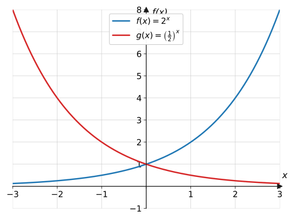
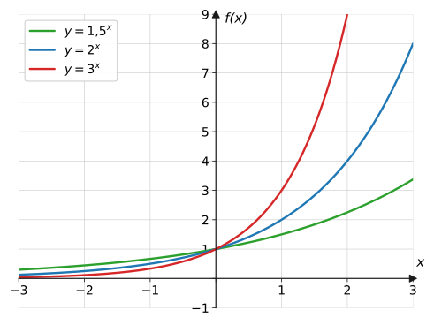
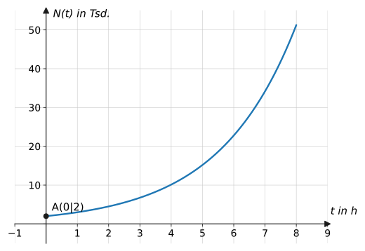
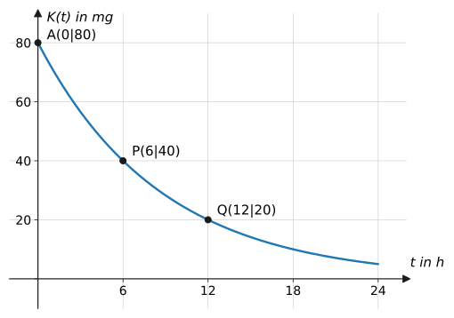
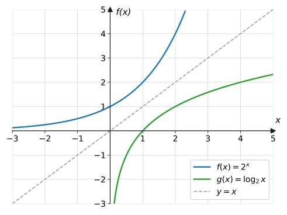

## Worum geht's?

Eine Bakterienkultur, die sich stündlich verdoppelt. Ein Medikament, dessen
Konzentration im Blut alle sechs Stunden auf die Hälfte fällt. Ein
Sparguthaben mit Zinseszins. Überall dort wächst oder schrumpft eine Größe
nicht um einen festen **Betrag**, sondern um einen festen **Faktor** pro
Zeitschritt. **Leitfrage:** Wie beschreibt man solche Prozesse mit einer
Funktion – und wie findet man heraus, *wann* ein bestimmter Wert erreicht
wird?

## Erklärung

### Die Exponentialfunktion

$$
f(x) = b \cdot a^x \qquad (a > 0,\ a \neq 1)
$$

- $b = f(0)$ ist der **Startwert** ($y$-Achsenabschnitt),
- $a$ ist der **Wachstumsfaktor**: Pro Schritt wird der Wert mit $a$
  multipliziert.

| Prozentsatz pro Schritt | Faktor |
| --- | --- |
| $+5\ \%$ | $a = 1{,}05$ |
| $+50\ \%$ | $a = 1{,}5$ |
| $-20\ \%$ | $a = 0{,}8$ |
| Halbierung | $a = 0{,}5$ |

Allgemein: $a = 1 + \frac{p}{100}$ bei Wachstum um $p\,\%$, $\ a = 1 - \frac{p}{100}$
bei Abnahme um $p\,\%$.

**Eigenschaften** (für $b > 0$):

- $a > 1$: streng steigend (**Wachstum**); $\ 0 < a < 1$: streng fallend
  (**Zerfall**)
- Der Graph verläuft komplett oberhalb der $x$-Achse: $W = \ ]0;\ \infty[$
- Die $x$-Achse ist **waagerechte Asymptote** (der Graph erreicht sie nie)
- Alle Graphen laufen durch $(0 \mid b)$

### Wachstumsprozesse modellieren

Ein Bestand mit Startwert $b$, der sich pro Zeiteinheit um den Faktor $a$
ändert, hat nach $t$ Zeiteinheiten den Wert:

$$
N(t) = b \cdot a^t
$$

Typisch für exponentielles Wachstum: Am Anfang wirkt es harmlos, dann
explodiert es – jede Potenzfunktion wird irgendwann überholt.

### Halbwertszeit und Verdopplungszeit

Die **Verdopplungszeit** $T_2$ ist die Zeit, in der sich der Bestand
verdoppelt; die **Halbwertszeit** $T_{1/2}$ die Zeit, in der er sich
halbiert. Beide sind bei exponentiellen Prozessen **konstant** – egal, wo
man startet. Ein Abbauprozess mit Halbwertszeit $T_{1/2}$ lässt sich
direkt so schreiben:

$$
K(t) = b \cdot \left(\frac{1}{2}\right)^{t / T_{1/2}}
$$

### Der Logarithmus

Beim Lösen von $a^x = c$ ist der Exponent gesucht. Die Antwort gibt der
**Logarithmus**:

$$
a^x = c \quad\Longleftrightarrow\quad x = \log_a(c)
$$

Sprich: „$\log_a(c)$ ist die Zahl, mit der man $a$ potenzieren muss, um
$c$ zu erhalten.“ Beispiele: $\log_2(8) = 3$, denn $2^3 = 8$;
$\ \log_{10}(1000) = 3$.

Mit dem Taschenrechner (Taste `log` oder `ln`) berechnet man beliebige
Logarithmen über die Formel:

$$
x = \log_a(c) = \frac{\ln(c)}{\ln(a)}
$$

Die Logarithmusfunktion $g(x) = \log_a(x)$ ist die **Umkehrfunktion** der
Exponentialfunktion – ihr Graph ist die Spiegelung an der
Winkelhalbierenden $y = x$. Sie ist nur für $x > 0$ definiert.

## Beispiele

**Beispiel 1:** Eine Bakterienkultur startet mit 200 Zellen und
verdreifacht sich jede Stunde.
a) Stelle den Funktionsterm auf und berechne den Bestand nach 4 Stunden.
b) Nach welcher Zeit überschreitet der Bestand 100 000 Zellen?

Lösung

a) Startwert $b = 200$, Faktor $a = 3$:

$$
N(t) = 200 \cdot 3^t
$$

$$
N(4) = 200 \cdot 3^4 = 200 \cdot 81 = 16\,200
$$

Nach 4 Stunden sind es 16 200 Zellen.

b) Ansatz $N(t) = 100\,000$, dann mit dem Logarithmus nach $t$ auflösen:

$$
\begin{aligned}
200 \cdot 3^t &= 100\,000 &&\text{| } :200 \\
3^t &= 500 &&\text{| Logarithmus} \\
t &= \log_3(500) = \frac{\ln(500)}{\ln(3)} \approx 5{,}66
\end{aligned}
$$

Nach knapp 5 Stunden und 40 Minuten – also im Laufe der 6. Stunde – wird
die Grenze überschritten.

**Beispiel 2:** Ein Neuwagen kostet 20 000 € und verliert pro Jahr 15 %
seines Werts.
a) Wie viel ist er nach 5 Jahren noch wert?
b) Nach welcher Zeit ist er nur noch die Hälfte wert?

Lösung

a) Abnahme um 15 % bedeutet Faktor $a = 1 - 0{,}15 = 0{,}85$:

$$
W(t) = 20\,000 \cdot 0{,}85^t
$$

$$
W(5) = 20\,000 \cdot 0{,}85^5 \approx 20\,000 \cdot 0{,}4437 \approx 8874{,}11
$$

Nach 5 Jahren ist der Wagen noch rund **8874 €** wert.

b) Halber Wert heißt $0{,}85^t = 0{,}5$ (der Startwert kürzt sich weg):

$$
t = \frac{\ln(0{,}5)}{\ln(0{,}85)} \approx 4{,}27
$$

Die „Halbwertszeit“ des Autowerts beträgt etwa **4,3 Jahre**.

**Beispiel 3:** Ein Medikament wird mit einer Dosis von 80 mg verabreicht;
die Halbwertszeit im Blut beträgt 6 Stunden (Graph in der Erklärung).
Berechne die Wirkstoffmenge nach 15 Stunden.

Lösung

Halbwertszeit-Formel mit $b = 80$ und $T_{1/2} = 6$:

$$
K(t) = 80 \cdot \left(\frac{1}{2}\right)^{t/6}
$$

Einsetzen von $t = 15$:

$$
\begin{aligned}
K(15) &= 80 \cdot 0{,}5^{15/6} \\
&= 80 \cdot 0{,}5^{2{,}5} \\
&\approx 80 \cdot 0{,}1768 \approx 14{,}1
\end{aligned}
$$

Nach 15 Stunden sind noch etwa **14 mg** im Blut. (Plausibel: Nach 12 h
sind es 20 mg, nach 18 h 10 mg – 15 h liegt dazwischen.)

**Beispiel 4:** Löse: a) $5 \cdot 2^x = 80$  b) $3^x = 20$

Lösung

a) Erst isolieren, dann als Potenz erkennen:

$$
\begin{aligned}
5 \cdot 2^x &= 80 &&\text{| } :5 \\
2^x &= 16 &&\text{| } 16 = 2^4 \\
x &= 4
\end{aligned}
$$

b) 20 ist keine Dreierpotenz – hier hilft der Logarithmus:

$$
x = \log_3(20) = \frac{\ln(20)}{\ln(3)} \approx 2{,}73
$$

Kontrolle: $3^{2{,}73} \approx 20$ ✓

## Aufgaben

**Aufgabe 1** (⭐) Berechne $2^x$ für $x = 0,\ 1,\ 2,\ 3,\ 4$ und $x = -2$.

Lösung zu Aufgabe 1

$$
2^0 = 1,\quad 2^1 = 2,\quad 2^2 = 4,\quad 2^3 = 8,\quad 2^4 = 16,\quad
2^{-2} = \frac{1}{4}
$$

**Aufgabe 2** (⭐) Gib den Wachstumsfaktor an:
a) Zunahme um 3 % b) Abnahme um 20 % c) Zunahme um 150 %

Lösung zu Aufgabe 2

a) $a = 1 + 0{,}03 = 1{,}03$

b) $a = 1 - 0{,}20 = 0{,}8$

c) $a = 1 + 1{,}50 = 2{,}5$

**Aufgabe 3** (⭐) Welche prozentuale Änderung pro Schritt steckt im Faktor?
a) $a = 1{,}05$  b) $a = 0{,}93$  c) $a = 2$

Lösung zu Aufgabe 3

a) $+5\ \%$  b) $-7\ \%$  c) $+100\ \%$ (Verdopplung)

**Aufgabe 4** (⭐) $f(x) = 3 \cdot 2^x$. Berechne $f(0)$, $f(2)$ und $f(5)$.

Lösung zu Aufgabe 4

$$
f(0) = 3 \cdot 1 = 3, \qquad f(2) = 3 \cdot 4 = 12, \qquad
f(5) = 3 \cdot 32 = 96
$$

**Aufgabe 5** (⭐) Wachstum oder Zerfall? Gib auch den Startwert an:
a) $f(x) = 0{,}97^x$  b) $g(x) = 4 \cdot 1{,}2^x$  c) $h(x) = 5 \cdot 0{,}5^x$

Lösung zu Aufgabe 5

a) $a = 0{,}97 < 1$ → Zerfall; Startwert $1$

b) $a = 1{,}2 > 1$ → Wachstum; Startwert $4$

c) $a = 0{,}5 < 1$ → Zerfall; Startwert $5$

**Aufgabe 6** (⭐) Wo schneidet der Graph von $f(x) = 4 \cdot 1{,}5^x$ die
$y$-Achse? Begründe allgemein für $f(x) = b \cdot a^x$.

Lösung zu Aufgabe 6

$f(0) = 4 \cdot 1{,}5^0 = 4 \cdot 1 = 4$ → Schnittpunkt $(0 \mid 4)$.

Allgemein: $f(0) = b \cdot a^0 = b$ – der Startwert $b$ ist immer der
$y$-Achsenabschnitt.

**Aufgabe 7** (⭐⭐) Ein Sparguthaben von 500 € wächst mit 8 % Zins pro Jahr.
Stelle den Funktionsterm auf und berechne das Guthaben nach 10 Jahren.

Lösung zu Aufgabe 7

$$
G(t) = 500 \cdot 1{,}08^t
$$

$$
G(10) = 500 \cdot 1{,}08^{10} \approx 500 \cdot 2{,}1589 \approx 1079{,}46
$$

Nach 10 Jahren sind es rund **1079 €** – mehr als das Doppelte.

**Aufgabe 8** (⭐⭐) Von 60 mg eines Wirkstoffs werden pro Stunde 25 %
abgebaut. Wie viel ist nach 4 Stunden noch vorhanden?

Lösung zu Aufgabe 8

Faktor $a = 1 - 0{,}25 = 0{,}75$:

$$
K(t) = 60 \cdot 0{,}75^t
$$

$$
K(4) = 60 \cdot 0{,}75^4 = 60 \cdot 0{,}3164 \approx 19{,}0
$$

Nach 4 Stunden sind noch etwa **19 mg** vorhanden.

**Aufgabe 9** (⭐⭐) Löse exakt (ohne Taschenrechner):
a) $2^x = 32$  b) $10^x = 0{,}001$  c) $4^x = \frac{1}{16}$

Lösung zu Aufgabe 9

a) $32 = 2^5$, also $x = 5$

b) $0{,}001 = 10^{-3}$, also $x = -3$

c) $\frac{1}{16} = 4^{-2}$, also $x = -2$

**Aufgabe 10** (⭐⭐) Löse mit dem Logarithmus (auf zwei Dezimalen):
a) $3^x = 50$  b) $1{,}05^x = 2$

Lösung zu Aufgabe 10

a)

$$
x = \frac{\ln(50)}{\ln(3)} \approx \frac{3{,}912}{1{,}099} \approx 3{,}56
$$

b)

$$
x = \frac{\ln(2)}{\ln(1{,}05)} \approx \frac{0{,}6931}{0{,}0488} \approx 14{,}21
$$

**Aufgabe 11** (⭐⭐) Eine Population wächst um 4 % pro Jahr. Berechne die
Verdopplungszeit.

Lösung zu Aufgabe 11

Verdopplung heißt $1{,}04^t = 2$ (der Startwert kürzt sich):

$$
t = \frac{\ln(2)}{\ln(1{,}04)} \approx \frac{0{,}6931}{0{,}0392} \approx 17{,}7
$$

Die Population verdoppelt sich etwa alle **17,7 Jahre**.

**Aufgabe 12** (⭐⭐) Ein Stoff zerfällt um 10 % pro Tag. Berechne die
Halbwertszeit.

Lösung zu Aufgabe 12

$0{,}9^t = 0{,}5$:

$$
t = \frac{\ln(0{,}5)}{\ln(0{,}9)} \approx \frac{-0{,}6931}{-0{,}1054} \approx 6{,}6
$$

Die Halbwertszeit beträgt etwa **6,6 Tage**.

**Aufgabe 13** (⭐⭐) Zum Bakterien-Graphen der Erklärung
($N(t) = 2 \cdot 1{,}5^t$, $N$ in Tausend):
a) Wie viele Zellen sind es am Anfang? Um wie viel Prozent wächst die
Kultur pro Stunde?
b) Berechne den Bestand nach 4 Stunden.

Lösung zu Aufgabe 13

a) $N(0) = 2$ (Tausend) → **2000 Zellen**. Faktor $1{,}5$ → **+50 %** pro
Stunde.

b)

$$
N(4) = 2 \cdot 1{,}5^4 = 2 \cdot 5{,}0625 = 10{,}125
$$

Nach 4 Stunden: rund **10 100 Zellen**.

**Aufgabe 14** (⭐⭐) Liegt der Punkt auf dem Graphen?
a) $P(3 \mid 24)$ auf $f(x) = 3 \cdot 2^x$
b) $Q(2 \mid 10)$ auf $g(x) = 2 \cdot 2^x$

Lösung zu Aufgabe 14

a) $f(3) = 3 \cdot 8 = 24$ ✓ → $P$ liegt auf dem Graphen.

b) $g(2) = 2 \cdot 4 = 8 \neq 10$ → $Q$ liegt nicht auf dem Graphen.

**Aufgabe 15** (⭐⭐) Eine Exponentialfunktion $f(x) = b \cdot a^x$ ($a > 0$)
hat die Werte $f(0) = 5$ und $f(2) = 20$. Bestimme $b$ und $a$.

Lösung zu Aufgabe 15

$f(0) = b = 5$. Dann $f(2) = 20$ einsetzen:

$$
\begin{aligned}
5 \cdot a^2 &= 20 &&\text{| } :5 \\
a^2 &= 4 &&\text{| Wurzel, } a > 0 \\
a &= 2
\end{aligned}
$$

Also $f(x) = 5 \cdot 2^x$.

**Aufgabe 16** (⭐⭐) Vergleiche $f(x) = 2^x$ und $g(x) = x^2$ an den Stellen
$x = 2$, $x = 4$ und $x = 10$. Was fällt auf?

Lösung zu Aufgabe 16

| $x$ | $2$ | $4$ | $10$ |
| --- | --- | --- | --- |
| $2^x$ | $4$ | $16$ | $1024$ |
| $x^2$ | $4$ | $16$ | $100$ |

Bis $x = 4$ halten beide mit, dann zieht die Exponentialfunktion davon:
Exponentielles Wachstum überholt **jede** Potenzfunktion.

**Aufgabe 17** (⭐⭐) Zum Medikamenten-Graphen der Erklärung
($K(t) = 80 \cdot 0{,}5^{t/6}$):
a) Lies $K(6)$ und $K(12)$ ab.
b) Nach welcher Zeit sind nur noch 10 mg im Blut? (exakt lösbar!)

Lösung zu Aufgabe 17

a) $K(6) = 40$ mg, $K(12) = 20$ mg (jede Halbwertszeit halbiert).

b)

$$
\begin{aligned}
80 \cdot 0{,}5^{t/6} &= 10 &&\text{| } :80 \\
0{,}5^{t/6} &= \frac{1}{8} = 0{,}5^3 &&\text{| Exponenten vergleichen} \\
\frac{t}{6} &= 3 &&\text{| } \cdot 6 \\
t &= 18
\end{aligned}
$$

Nach **18 Stunden** (drei Halbwertszeiten: $80 \to 40 \to 20 \to 10$).

**Aufgabe 18** (⭐⭐) Ein Prozess halbiert sich alle 6 Stunden. Um wie viel
Prozent nimmt er **pro Stunde** ab?

Lösung zu Aufgabe 18

Gesucht ist der Stundenfaktor $a$ mit $a^6 = 0{,}5$:

$$
a = 0{,}5^{1/6} \approx 0{,}891
$$

Pro Stunde bleibt also 89,1 % übrig – der Bestand nimmt um etwa
**10,9 % pro Stunde** ab.

**Aufgabe 19** (⭐⭐⭐) Die Halbwertszeit von C-14 beträgt 5730 Jahre. In
einem Knochenfund sind noch 25 % des ursprünglichen C-14-Gehalts enthalten.
Wie alt ist der Fund?

Lösung zu Aufgabe 19

25 % $= \frac{1}{4} = \left(\frac{1}{2}\right)^2$ – es sind genau **zwei**
Halbwertszeiten vergangen:

$$
t = 2 \cdot 5730 = 11\,460
$$

Der Fund ist etwa **11 460 Jahre** alt.

**Aufgabe 20** (⭐⭐⭐) Eine Bakterienkultur (Start: 500 Zellen) verdoppelt
sich alle 3 Stunden.
a) Stelle den Funktionsterm mit der Verdopplungszeit auf.
b) Wie viele Zellen sind es nach 12 Stunden?
c) Wann erreicht die Kultur 32 000 Zellen? (exakt lösbar)

Lösung zu Aufgabe 20

a)

$$
N(t) = 500 \cdot 2^{t/3}
$$

b) $N(12) = 500 \cdot 2^4 = 500 \cdot 16 = 8000$ Zellen.

c)

$$
\begin{aligned}
500 \cdot 2^{t/3} &= 32\,000 &&\text{| } :500 \\
2^{t/3} &= 64 = 2^6 &&\text{| Exponenten vergleichen} \\
\frac{t}{3} &= 6 \quad\Rightarrow\quad t = 18
\end{aligned}
$$

Nach **18 Stunden**.

**Aufgabe 21** (⭐⭐⭐) Zwei Gehaltsangebote, Startgehalt jeweils 40 000 €:
Firma A erhöht jährlich um 1000 € (linear), Firma B um 3 % (exponentiell).
Welches Gehalt ist nach 10 Jahren höher?

Lösung zu Aufgabe 21

Firma A (linear):

$$
G_A(10) = 40\,000 + 10 \cdot 1000 = 50\,000
$$

Firma B (exponentiell):

$$
G_B(10) = 40\,000 \cdot 1{,}03^{10} \approx 40\,000 \cdot 1{,}3439 \approx 53\,757
$$

Nach 10 Jahren liegt **Firma B** mit rund 53 757 € klar vorn – der
Zinseszins-Effekt.

**Aufgabe 22** (⭐⭐) Berechne ohne Taschenrechner:
a) $\log_2(8)$  b) $\log_3(81)$  c) $\log_{10}(1000)$  d) $\log_5(1)$

Lösung zu Aufgabe 22

a) $2^3 = 8$ → $\log_2(8) = 3$

b) $3^4 = 81$ → $\log_3(81) = 4$

c) $10^3 = 1000$ → $\log_{10}(1000) = 3$

d) $5^0 = 1$ → $\log_5(1) = 0$

**Aufgabe 23** (⭐⭐) Ein Guthaben von 200 € wächst mit 6 % pro Jahr. Wann
hat es sich auf 400 € verdoppelt?

Lösung zu Aufgabe 23

$$
\begin{aligned}
200 \cdot 1{,}06^t &= 400 &&\text{| } :200 \\
1{,}06^t &= 2 &&\text{| Logarithmus} \\
t &= \frac{\ln(2)}{\ln(1{,}06)} \approx 11{,}9
\end{aligned}
$$

Nach knapp **12 Jahren**.

**Aufgabe 24** (⭐⭐⭐) Die Weltbevölkerung wachse modellhaft um 2 % pro
Jahr. Zeige, dass sie sich dann in etwa 55,5 Jahren **verdreifacht**, und
erkläre, warum das Ergebnis nicht vom Startwert abhängt.

Lösung zu Aufgabe 24

Ansatz $b \cdot 1{,}02^t = 3b$. Division durch $b$:

$$
1{,}02^t = 3
\quad\Rightarrow\quad
t = \frac{\ln(3)}{\ln(1{,}02)} \approx \frac{1{,}0986}{0{,}0198} \approx 55{,}5
$$

Der Startwert $b$ kürzt sich beim Dividieren weg – die
Verdreifachungszeit ist (wie Halbwerts- und Verdopplungszeit) eine
Eigenschaft des **Faktors**, nicht des Bestands.

## Merksatz

Merksatz anzeigen

Exponentielle Prozesse ändern sich pro Schritt um einen festen **Faktor**:
$N(t) = b \cdot a^t$ mit Startwert $b$ und $a = 1 \pm \frac{p}{100}$.
$a > 1$ heißt Wachstum, $0 < a < 1$ Zerfall; die $x$-Achse ist Asymptote.
Halbwerts- und Verdopplungszeit sind konstant. Ist der **Exponent**
gesucht, hilft der **Logarithmus**: $a^x = c \Leftrightarrow x = \log_a(c)
= \frac{\ln c}{\ln a}$.

## Vertiefung

:::caution
„Wächst um 50 %“ heißt Faktor $1{,}5$ – nicht $0{,}5$ und nicht $50$. Und:
Zweimal $+50\ \%$ sind **nicht** $+100\ \%$, sondern Faktor
$1{,}5^2 = 2{,}25$, also $+125\ \%$. Prozente addieren sich bei
exponentiellem Wachstum nicht!
:::

**Modellgrenzen:** Kein realer Bestand wächst ewig exponentiell – Nährstoffe,
Platz oder Geld gehen aus. Exponentialmodelle gelten daher meist nur für
einen begrenzten Zeitraum; im Biologieunterricht begegnet dir später das
logistische Wachstum als realistischere Fortsetzung.

**Ausblick:** Wie sich Graphen von Exponentialfunktionen verschieben und
strecken lassen, behandelt die Seite
[Transformationen](../transformationen/) – und in der
[Differentialrechnung](../../differentialrechnung/aenderungsrate/) wirst du
untersuchen, wie **schnell** solche Prozesse wachsen.
