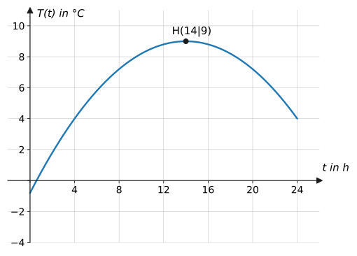
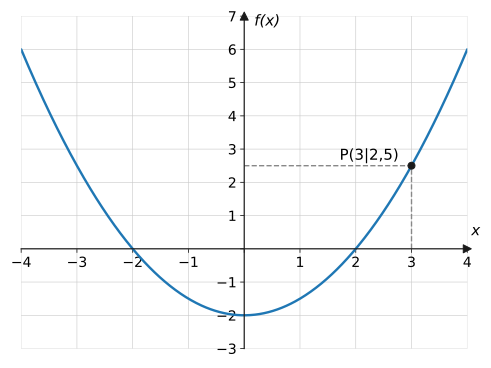
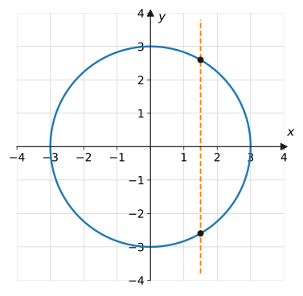
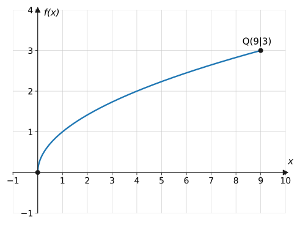

import Quiz from '../../../components/Quiz.astro';

## Worum geht's?

Die Wetter-App zeigt für jede Uhrzeit genau eine Temperatur an, der
Taxameter für jede gefahrene Strecke genau einen Preis, die Fitness-Uhr für
jeden Zeitpunkt genau einen Puls. Solche eindeutigen Zuordnungen sind das
Grundmuster hinter fast allen Anwendungen der Mathematik.
**Leitfrage:** Wann ist eine Zuordnung eine „Funktion“ – und wie beschreibt
man sie so, dass man damit rechnen kann?

## Erklärung

### Definition

Eine **Funktion** $f$ ordnet **jedem** Element $x$ einer Menge $D$
(**Definitionsbereich**) **genau ein** Element $y = f(x)$ zu. Man schreibt:

$$
f\colon\ x \mapsto f(x)
$$

- $x$ heißt **unabhängige Variable** (das, was man wählt),
- $y = f(x)$ heißt **Funktionswert** (das, was herauskommt),
- die Menge aller Funktionswerte heißt **Wertebereich** $W$.

Beide Bedingungen sind wichtig: *jedem* $x$ (keines bleibt übrig) wird
*genau ein* $y$ zugeordnet (niemals zwei).

Der Temperaturverlauf ist eine Funktion: Zu jedem Zeitpunkt $t$ gibt es
genau eine Temperatur $T(t)$. Umgekehrt ist die Zuordnung „Temperatur
$\mapsto$ Uhrzeit“ **keine** Funktion: 4 °C wird hier z. B. morgens *und*
abends erreicht.

### Darstellungsformen

Ein und dieselbe Funktion kann man auf vier Arten angeben:

1. **Funktionsgleichung/-term:** $f(x) = 0{,}5x^2 - 2$
2. **Wertetabelle:**

   | $x$ | $-2$ | $-1$ | $0$ | $1$ | $2$ | $3$ |
   | --- | --- | --- | --- | --- | --- | --- |
   | $f(x)$ | $0$ | $-1{,}5$ | $-2$ | $-1{,}5$ | $0$ | $2{,}5$ |

3. **Graph** (alle Punkte $(x \mid f(x))$ im Koordinatensystem)
4. **Text:** „Quadriere $x$, halbiere das Ergebnis, ziehe 2 ab.“

**Funktionswert berechnen** heißt: $x$ in den Term einsetzen.
**Funktionswert ablesen** heißt: vom $x$-Wert senkrecht zum Graphen, dann
waagerecht zur $y$-Achse (gestrichelte Hilfslinien).

### Der Senkrechten-Test

Am Graphen erkennt man eine Funktion so: Jede senkrechte Gerade darf den
Graphen **höchstens einmal** schneiden. Schneidet eine Senkrechte den
Graphen zweimal, gäbe es zu einem $x$ zwei $y$-Werte – keine Funktion.

### Definitions- und Wertebereich

Wenn nichts anderes angegeben ist, besteht $D$ aus allen reellen Zahlen,
für die sich der Term berechnen lässt. Zwei klassische Einschränkungen:

- **Nenner:** darf nicht null werden, z. B. $f(x) = \frac{1}{x-2}$ hat
  $D = \mathbb{R} \setminus \{2\}$
- **Wurzel:** der Radikand darf nicht negativ sein, z. B.
  $g(x) = \sqrt{x+3}$ hat $D = [-3;\ \infty[$

In Anwendungen schränkt oft der **Sachzusammenhang** ein: Eine Strecke oder
eine Zeit ist nicht negativ.

## Beispiele

**Beispiel 1:** Gegeben ist $f(x) = 0{,}5x^2 - 2$.
a) Berechne $f(3)$ und $f(-4)$.
b) Prüfe, ob der Punkt $A(2 \mid 0)$ auf dem Graphen liegt.

Lösung

a) Einsetzen von $x = 3$ (jedes $x$ im Term wird ersetzt):

$$
\begin{aligned}
f(3) &= 0{,}5 \cdot 3^2 - 2 &&\text{| Potenz zuerst} \\
&= 0{,}5 \cdot 9 - 2 \\
&= 2{,}5
\end{aligned}
$$

Einsetzen von $x = -4$ (Klammern setzen!):

$$
\begin{aligned}
f(-4) &= 0{,}5 \cdot (-4)^2 - 2 \\
&= 0{,}5 \cdot 16 - 2 \\
&= 6
\end{aligned}
$$

b) Ein Punkt liegt auf dem Graphen, wenn seine Koordinaten die Gleichung
erfüllen. Test mit $x = 2$:

$$
f(2) = 0{,}5 \cdot 4 - 2 = 0
$$

$f(2) = 0$ stimmt mit der $y$-Koordinate von $A$ überein → $A$ liegt auf
dem Graphen. ✓

**Beispiel 2:** Entscheide jeweils, ob die Zuordnung eine Funktion ist:
a) Jedem Schüler der Klasse wird seine Körpergröße zugeordnet.
b) Jeder Körpergröße wird der Schüler mit dieser Größe zugeordnet.
c) Der Kreis $x^2 + y^2 = 9$ (siehe Graph oben).

Lösung

a) **Funktion.** Jeder Schüler hat zu einem Zeitpunkt genau eine
Körpergröße – kein Schüler hat zwei.

b) **Keine Funktion.** Zwei Schüler können gleich groß sein – dann würde
dieser Größe mehr als ein Schüler zugeordnet. Die Zuordnung ist nicht
eindeutig.

c) **Keine Funktion.** Der Senkrechten-Test schlägt fehl: Die Gerade
$x = 1{,}5$ schneidet den Kreis in zwei Punkten, zu $x = 1{,}5$ gehören
also zwei $y$-Werte ($y \approx 2{,}6$ und $y \approx -2{,}6$).

**Beispiel 3:** Bestimme den maximalen Definitionsbereich:
a) $f(x) = \dfrac{3}{x - 2}$  b) $g(x) = \sqrt{x + 3}$

Lösung

a) Der Nenner darf nicht null sein. Wann wird er null?

$$
x - 2 = 0 \quad\Rightarrow\quad x = 2
$$

Also muss genau dieser Wert ausgeschlossen werden:
$D_f = \mathbb{R} \setminus \{2\}$

b) Unter der Wurzel darf nichts Negatives stehen:

$$
\begin{aligned}
x + 3 &\geq 0 &&\text{| } -3 \\
x &\geq -3
\end{aligned}
$$

Also $D_g = [-3;\ \infty[$.

## Aufgaben

Aufgabe 1 ⭐

$f(x) = 3x - 4$. Berechne $f(0)$, $f(2)$ und $f(-1)$.

Lösung zu Aufgabe 1

$$
\begin{aligned}
f(0) &= 3 \cdot 0 - 4 = -4 \\
f(2) &= 3 \cdot 2 - 4 = 2 \\
f(-1) &= 3 \cdot (-1) - 4 = -7
\end{aligned}
$$

Aufgabe 2 ⭐

$f(x) = x^2 + 1$. Berechne $f(-2)$, $f\!\left(\frac{1}{2}\right)$ und $f(10)$.

Lösung zu Aufgabe 2

$$
\begin{aligned}
f(-2) &= (-2)^2 + 1 = 5 \\
f\!\left(\tfrac{1}{2}\right) &= \tfrac{1}{4} + 1 = \tfrac{5}{4} \\
f(10) &= 100 + 1 = 101
\end{aligned}
$$

Beim Einsetzen negativer Zahlen immer Klammern setzen: $(-2)^2 = 4$, nicht
$-2^2 = -4$.

Aufgabe 3 ⭐

Lege eine Wertetabelle für $f(x) = 2x - 3$ an
($x = -2$ bis $x = 2$, Schrittweite 1).

Lösung zu Aufgabe 3

| $x$ | $-2$ | $-1$ | $0$ | $1$ | $2$ |
| --- | --- | --- | --- | --- | --- |
| $f(x)$ | $-7$ | $-5$ | $-3$ | $-1$ | $1$ |

Rechnung z. B. für $x = -2$: $f(-2) = 2 \cdot (-2) - 3 = -7$.

Aufgabe 4 ⭐

Funktion oder nicht? Begründe kurz.
a) Jedem Auto wird sein amtliches Kennzeichen zugeordnet.
b) Jedem Tag des Jahres wird die Niederschlagsmenge in Trier zugeordnet.
c) Jeder natürlichen Zahl werden ihre Teiler zugeordnet.

Lösung zu Aufgabe 4

a) **Funktion** – jedes zugelassene Auto hat genau ein Kennzeichen.

b) **Funktion** – pro Tag wird genau ein Messwert erfasst.

c) **Keine Funktion** – z. B. hat die 6 die Teiler 1, 2, 3 und 6: einem
$x$ werden mehrere Werte zugeordnet.

Aufgabe 5 ⭐

Begründe mit dem Senkrechten-Test, dass der Kreis aus der
Erklärung kein Funktionsgraph ist. Gib die beiden $y$-Werte an, die dort zu
$x = 0$ gehören.

Lösung zu Aufgabe 5

Die senkrechte Gerade $x = 0$ (die $y$-Achse) schneidet den Kreis
$x^2 + y^2 = 9$ zweimal:

$$
0^2 + y^2 = 9 \quad\Rightarrow\quad y_1 = 3,\ y_2 = -3
$$

Zu $x = 0$ gehören also **zwei** $y$-Werte – die Zuordnung ist nicht
eindeutig, der Kreis ist kein Funktionsgraph.

Aufgabe 6 ⭐⭐

Lies am Graphen von $f(x) = 0{,}5x^2 - 2$ (Erklärung) den
Wert $f(3)$ ab und bestätige ihn durch Rechnung. Für welche $x$ gilt
$f(x) = 0$?

Lösung zu Aufgabe 6

Ablesen: Bei $x = 3$ senkrecht nach oben zum Graphen, dann waagerecht zur
$y$-Achse: $f(3) = 2{,}5$. Rechnung:

$$
f(3) = 0{,}5 \cdot 9 - 2 = 2{,}5 \ \checkmark
$$

$f(x) = 0$ bedeutet: Schnittpunkte mit der $x$-Achse.

$$
\begin{aligned}
0{,}5x^2 - 2 &= 0 &&\text{| } +2 \\
0{,}5x^2 &= 2 &&\text{| } \cdot 2 \\
x^2 &= 4 &&\text{| Wurzel, beide Vorzeichen} \\
x_1 = 2&,\quad x_2 = -2
\end{aligned}
$$

Aufgabe 7 ⭐⭐

$f(x) = x^2 - 4$. Für welche $x$ gilt a) $f(x) = 0$,
b) $f(x) = 5$?

Lösung zu Aufgabe 7

a)

$$
x^2 - 4 = 0 \quad\Rightarrow\quad x^2 = 4 \quad\Rightarrow\quad x_{1,2} = \pm 2
$$

b)

$$
\begin{aligned}
x^2 - 4 &= 5 &&\text{| } +4 \\
x^2 &= 9 &&\text{| Wurzel} \\
x_{1,2} &= \pm 3
\end{aligned}
$$

Aufgabe 8 ⭐⭐

Liegen die Punkte auf dem Graphen von $f(x) = 2x - 1$?
a) $P(2 \mid 3)$  b) $Q(-1 \mid -2)$

Lösung zu Aufgabe 8

a) $f(2) = 2 \cdot 2 - 1 = 3$ = $y$-Koordinate von $P$ → $P$ **liegt** auf
dem Graphen. ✓

b) $f(-1) = 2 \cdot (-1) - 1 = -3 \neq -2$ → $Q$ liegt **nicht** auf dem
Graphen.

Aufgabe 9 ⭐⭐

Bestimme den maximalen Definitionsbereich:
a) $f(x) = \dfrac{1}{x}$  b) $g(x) = \dfrac{5}{x + 5}$  c) $h(x) = \sqrt{x - 1}$

Lösung zu Aufgabe 9

a) Nenner null bei $x = 0$: $\ D_f = \mathbb{R} \setminus \{0\}$

b) Nenner null bei $x = -5$: $\ D_g = \mathbb{R} \setminus \{-5\}$

c) Radikand $\geq 0$: $x - 1 \geq 0$, also $x \geq 1$:
$\ D_h = [1;\ \infty[$

Aufgabe 10 ⭐⭐

Gib den Wertebereich an: a) $f(x) = x^2$
b) $g(x) = x^2 + 3$  c) $h(x) = -x^2$

Lösung zu Aufgabe 10

a) Quadrate sind nie negativ, alle Werte $\geq 0$ kommen vor:
$W_f = [0;\ \infty[$

b) Wie a), aber alles um 3 nach oben verschoben: $W_g = [3;\ \infty[$

c) Das Minus spiegelt: alle Werte $\leq 0$: $W_h = \ ]-\infty;\ 0]$

Aufgabe 11 ⭐⭐

$f(x) = 2x + 1$ und $g(x) = -x + 7$. Für welches $x$
gilt $f(x) = g(x)$? Gib den zugehörigen Punkt an.

Lösung zu Aufgabe 11

Gleichsetzen:

$$
\begin{aligned}
2x + 1 &= -x + 7 &&\text{| } +x \\
3x + 1 &= 7 &&\text{| } -1 \\
3x &= 6 &&\text{| } :3 \\
x &= 2
\end{aligned}
$$

$y$-Wert: $f(2) = 5$ (Kontrolle: $g(2) = -2 + 7 = 5$ ✓).
Beide Graphen schneiden sich im Punkt $S(2 \mid 5)$.

Aufgabe 12 ⭐⭐

Eine Taxifahrt kostet 4 € Grundpreis plus 2 € pro
Kilometer.
a) Stelle den Funktionsterm für den Preis $K(x)$ bei $x$ km auf.
b) Was kostet eine 7-km-Fahrt?
c) Wie weit kommt man für 12 €?

Lösung zu Aufgabe 12

a) Grundpreis plus kilometerabhängiger Anteil:

$$
K(x) = 2x + 4
$$

b) $K(7) = 2 \cdot 7 + 4 = 18$ – die Fahrt kostet 18 €.

c) $K(x) = 12$ lösen:

$$
\begin{aligned}
2x + 4 &= 12 &&\text{| } -4 \\
2x &= 8 &&\text{| } :2 \\
x &= 4
\end{aligned}
$$

Für 12 € kommt man 4 km weit.

Aufgabe 13 ⭐⭐

Finde zur Wertetabelle einen passenden Funktionsterm:

| $x$ | $1$ | $2$ | $3$ | $4$ |
| --- | --- | --- | --- | --- |
| $f(x)$ | $3$ | $6$ | $9$ | $12$ |

Lösung zu Aufgabe 13

Jeder Funktionswert ist das Dreifache von $x$ (proportionale Zuordnung):

$$
f(x) = 3x
$$

Kontrolle: $f(4) = 12$ ✓

Aufgabe 14 ⭐⭐⭐

$f(x) = \sqrt{x}$ mit $D = [0;\ 9]$ (Graph in der
Erklärung).
a) Warum enthält $D$ keine negativen Zahlen?
b) Bestimme den Wertebereich $W$.

Lösung zu Aufgabe 14

a) Die Wurzel aus einer negativen Zahl ist in $\mathbb{R}$ nicht definiert –
es gibt keine reelle Zahl, deren Quadrat negativ ist.

b) $\sqrt{x}$ wächst mit $x$. Kleinster Wert: $f(0) = 0$, größter Wert:
$f(9) = 3$. Alle Werte dazwischen werden angenommen (der Graph hat keine
Lücken):

$$
W = [0;\ 3]
$$

Aufgabe 15 ⭐⭐⭐

Zwei Handytarife: Tarif A kostet 10 € Grundgebühr plus
0,05 € pro Minute, Tarif B keine Grundgebühr, aber 0,15 € pro Minute.
a) Stelle für beide Tarife den Funktionsterm der Monatskosten auf
($m$ = Gesprächsminuten).
b) Ab wie vielen Minuten ist Tarif A günstiger?

Lösung zu Aufgabe 15

a)

$$
K_A(m) = 0{,}05m + 10, \qquad K_B(m) = 0{,}15m
$$

b) Gleichsetzen liefert die Minutenzahl mit gleichen Kosten:

$$
\begin{aligned}
0{,}05m + 10 &= 0{,}15m &&\text{| } -0{,}05m \\
10 &= 0{,}1m &&\text{| } :0{,}1 \\
m &= 100
\end{aligned}
$$

Bei 100 Minuten kosten beide 15 €. Für $m > 100$ wächst B schneller
($0{,}15$ €/min statt $0{,}05$ €/min) – **ab mehr als 100 Minuten** im
Monat ist Tarif A günstiger.

Aufgabe 16 ⭐⭐⭐

Der Temperaturverlauf aus der Erklärung lässt sich
durch $T(t) = -0{,}05(t - 14)^2 + 9$ beschreiben ($t$ in Stunden, $T$ in °C,
$0 \leq t \leq 24$).
a) Berechne die Temperatur um Mitternacht ($t = 0$).
b) Zu welchen Uhrzeiten beträgt die Temperatur genau 4 °C?

Lösung zu Aufgabe 16

a)

$$
T(0) = -0{,}05 \cdot (-14)^2 + 9 = -0{,}05 \cdot 196 + 9 = -0{,}8
$$

Um Mitternacht sind es $-0{,}8$ °C.

b) $T(t) = 4$ lösen:

$$
\begin{aligned}
-0{,}05(t - 14)^2 + 9 &= 4 &&\text{| } -9 \\
-0{,}05(t - 14)^2 &= -5 &&\text{| } : (-0{,}05) \\
(t - 14)^2 &= 100 &&\text{| Wurzel, beide Vorzeichen} \\
t - 14 = 10 \ \ \text{oder}\ \ t - 14 &= -10 \\
t_1 = 24,\quad t_2 &= 4
\end{aligned}
$$

Um 4 Uhr morgens und um 24 Uhr beträgt die Temperatur 4 °C.

## Merksatz

Merksatz anzeigen

Eine **Funktion** ordnet **jedem** $x$ aus dem Definitionsbereich $D$
**genau ein** $y = f(x)$ zu. Am Graphen prüft man das mit dem
**Senkrechten-Test**. $D$ enthält alle erlaubten Einsetzungen (Nenner
$\neq 0$, Radikand $\geq 0$, Sachzusammenhang!), der **Wertebereich** $W$
alle herauskommenden Funktionswerte.

## Vertiefung

**Typischer Fehler beim Einsetzen:**

:::caution
Negative Zahlen immer **mit Klammer** einsetzen: Für $f(x) = x^2$ ist
$f(-3) = (-3)^2 = 9$. Wer die Klammer weglässt, rechnet $-3^2 = -9$ –
falsches Vorzeichen!
:::

**Sachzusammenhang schränkt ein:** Beim Taxi-Beispiel ist mathematisch
jedes $x$ erlaubt, sinnvoll sind aber nur $x \geq 0$ – gefahrene Kilometer
sind nicht negativ. In Anwendungsaufgaben gehört zur Angabe von $D$ immer
ein Blick auf die Situation.

**Ausblick:** Auf den nächsten Seiten lernst du die wichtigsten
Funktionstypen im Detail kennen – zuerst [lineare und quadratische
Funktionen](../lineare-quadratische/), später Potenz-, Exponential- und
trigonometrische Funktionen. Für alle gelten die Begriffe dieser Seite.

## Quiz

Zum Abschluss: Klicke bei jeder Frage eine Antwort an – die Auswertung kommt sofort.

<Quiz fragen={[
  { frage: 'Wann ist eine Zuordnung eine Funktion?',
    antworten: ['Wenn jedem x genau ein y zugeordnet wird', 'Wenn jedem y genau ein x zugeordnet wird', 'Wenn der Graph eine Gerade ist', 'Wenn es unendlich viele Wertepaare gibt'],
    richtig: 0, erklaerung: 'Genau das ist die Definition: jedem x aus D genau ein Funktionswert – keiner mehr, keiner weniger.' },
  { frage: 'Warum ist der Kreis x² + y² = 9 kein Funktionsgraph?',
    antworten: ['Weil er keine Nullstellen hat', 'Weil eine senkrechte Gerade ihn zweimal schneidet', 'Weil er nicht durch den Ursprung geht', 'Weil er keinen y-Achsenabschnitt hat'],
    richtig: 1, erklaerung: 'Der Senkrechten-Test schlägt fehl: Zu einem x gehören zwei y-Werte – die Zuordnung ist nicht eindeutig.' },
  { frage: 'f(x) = x² + 1. Was ist f(−2)?',
    antworten: ['−3', '5', '3', '−5'],
    richtig: 1, erklaerung: 'Mit Klammer einsetzen: (−2)² + 1 = 4 + 1 = 5. Ohne Klammer entsteht der klassische Fehler −3.' },
  { frage: 'Was ist der maximale Definitionsbereich von f(x) = √(x − 4)?',
    antworten: ['x ≠ 4', 'x ≥ 4', 'x ≥ −4', 'alle reellen Zahlen'],
    richtig: 1, erklaerung: 'Der Radikand darf nicht negativ sein: x − 4 ≥ 0, also x ≥ 4.' },
  { frage: 'Welchen Wertebereich hat f(x) = x² + 3?',
    antworten: ['ℝ', '[0; ∞[', '[3; ∞[', ']−∞; 3]'],
    richtig: 2, erklaerung: 'x² ist nie negativ, der kleinste Wert ist f(0) = 3 – alles ab 3 kommt vor.' },
]} />
