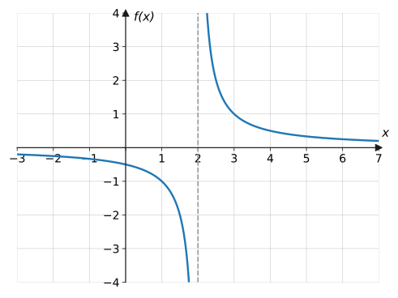
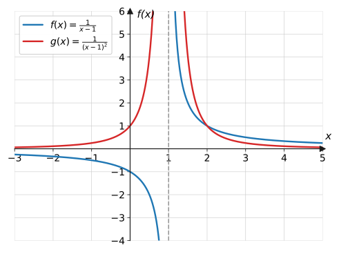
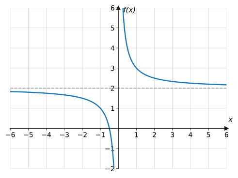
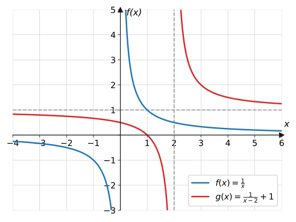
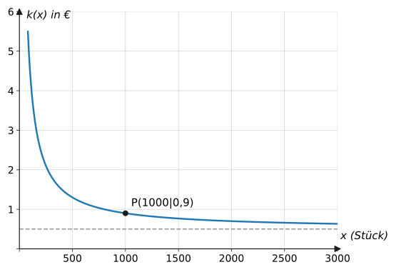

import Quiz from '../../../components/Quiz.astro';

## Worum geht's?

Eine Druckerei produziert Flyer: 400 € kostet das Einrichten der Maschine
(egal wie viele gedruckt werden), dazu 0,50 € pro Stück. Was kostet ein
einzelner Flyer im Durchschnitt – bei 100 Stück, bei 1 000, bei
10 000? Die Antwort liefert eine Funktion, bei der $x$ **im Nenner**
steht. **Leitfrage:** Wie verhält sich eine Funktion an den Stellen, an
denen ihr Nenner null wird – und was passiert für sehr große $x$?

## Erklärung

### Was ist eine gebrochenrationale Funktion?

Eine **gebrochenrationale Funktion** ist ein Bruch aus zwei ganzrationalen
Termen:

$$
f(x) = \frac{\text{Zähler}}{\text{Nenner}}, \qquad \text{z. B.} \quad
f(x) = \frac{1}{x-2}, \quad g(x) = \frac{2x+1}{x}
$$

Die einfachsten Vertreter kennst du schon von den
[Potenzfunktionen mit negativen Exponenten](../potenz-wurzel/#negative-exponenten):
$\frac{1}{x}$ und $\frac{1}{x^2}$ – die **Hyperbeln**. Neu ist jetzt: Der
Nenner darf ein beliebiger Term sein, und damit wandert die „verbotene
Stelle“ weg von der $0$.

### Definitionslücken

Division durch null ist nicht definiert. Deshalb gehören alle $x$-Werte,
die den **Nenner null** machen, nicht zum Definitionsbereich – sie heißen
**Definitionslücken**.

$$
f(x) = \frac{1}{x-2}: \qquad x - 2 = 0 \ \Rightarrow\ x = 2
\qquad\Rightarrow\qquad D = \mathbb{R} \setminus \{2\}
$$

**Rezept:** Nenner gleich null setzen, Gleichung lösen, gefundene Werte
ausschließen. Mehr braucht es nicht – und die Gleichungstechniken dafür
kennst du aus dem
[Algebra-Werkzeugkasten](../../basiswissen/algebra-werkzeugkasten/#erklärung).

Verständnisfrage: Warum liefert der <em>Nenner</em> die Definitionslücken und der <em>Zähler</em> die Nullstellen – und nicht umgekehrt?

Ein Bruch scheitert genau dann, wenn unten null steht (Division durch
null) – deshalb bestimmen die Nenner-Nullstellen, welche $x$ verboten
sind. Und ein Bruch **hat den Wert** null genau dann, wenn oben null
steht: $\frac{0}{5} = 0$, aber $\frac{5}{0}$ existiert nicht. Merke:
Nenner → wo die Funktion *nicht lebt*, Zähler → wo sie *null ist*.

### Polstellen und senkrechte Asymptoten

Was passiert **nahe** der Definitionslücke? Einsetzen von Werten dicht bei
$x = 2$ zeigt es:

$$
f(2{,}1) = \frac{1}{0{,}1} = 10, \qquad f(2{,}01) = 100, \qquad
f(1{,}99) = \frac{1}{-0{,}01} = -100
$$

Die Funktionswerte **explodieren**: Eine solche Definitionslücke heißt
**Polstelle**. Der Graph schmiegt sich an die senkrechte Gerade $x = 2$
an, ohne sie je zu berühren – sie heißt **senkrechte Asymptote**.

Ob der Graph an der Polstelle die Seite wechselt, entscheidet der Nenner:

- $\dfrac{1}{x-1}$: Der Nenner wechselt bei $x = 1$ das Vorzeichen → der
  Graph springt von $-\infty$ nach $+\infty$ (**mit** Vorzeichenwechsel).
- $\dfrac{1}{(x-1)^2}$: Das Quadrat ist auf beiden Seiten positiv → der
  Graph geht beidseitig nach $+\infty$ (**ohne** Vorzeichenwechsel).

Verständnisfrage: Darf der Graph eine senkrechte Asymptote wenigstens berühren?

Nein – an der Stelle der senkrechten Asymptote liegt eine
Definitionslücke: Dort gibt es **gar keinen** Funktionswert, also auch
keinen Punkt des Graphen, der die Gerade berühren könnte. Die Werte
daneben explodieren nur nach $\pm\infty$. (Waagerechte Asymptoten sind
weniger streng – siehe unten.)

### Verhalten im Unendlichen: waagerechte Asymptoten

Für betragsgroße $x$ wird ein Bruch mit großem Nenner winzig:
$\frac{1}{x} \to 0$. In der **Grenzwert-Schreibweise** (mehr dazu auf der
Seite [Eigenschaften ganzrationaler Funktionen](../../ganzrationale/eigenschaften/#randverhalten-globalverlauf)):

$$
\lim_{x \to \pm\infty} \frac{1}{x} = 0
$$

Die $x$-Achse ($y = 0$) ist **waagerechte Asymptote**. Steht vor dem Bruch
noch eine Zahl, verschiebt sich diese Grenze. Der Trick: den Term in
„Zahl + Restbruch“ zerlegen.

$$
g(x) = \frac{2x+1}{x} = \frac{2x}{x} + \frac{1}{x} = 2 + \frac{1}{x}
\qquad\Rightarrow\qquad \lim_{x \to \pm\infty} g(x) = 2
$$

Verständnisfrage: Darf ein Graph seine <em>waagerechte</em> Asymptote schneiden?

Ja! Die waagerechte Asymptote beschreibt nur das Verhalten **ganz weit
draußen** ($x \to \pm\infty$). Im Mittelteil darf der Graph sie kreuzen:
$f(x) = \frac{x}{x^2+1}$ hat die Asymptote $y = 0$ und schneidet sie
trotzdem bei $x = 0$. Nur die senkrechte Asymptote ist tabu – dort ist
die Funktion nicht definiert.

### Nullstellen

Ein Bruch ist genau dann null, wenn sein **Zähler** null ist (und der
Nenner dort nicht auch null wird):

$$
g(x) = \frac{2x+1}{x} = 0 \quad\Longleftrightarrow\quad 2x + 1 = 0
\quad\Longleftrightarrow\quad x = -\tfrac{1}{2}
$$

Der Nenner hat mit den Nullstellen **nichts** zu tun – er liefert die
Definitionslücken.

### Hyperbeln verschieben

Die [Transformationen](../transformationen/) wirken hier wie bei jeder
Funktion – und die Asymptoten wandern mit:

$$
g(x) = \frac{1}{x-2} + 1
$$

Gegenüber $\frac{1}{x}$ ist der Graph um $2$ nach **rechts** und um $1$
nach **oben** verschoben: senkrechte Asymptote $x = 2$, waagerechte
Asymptote $y = 1$. An der Form

$$
f(x) = \frac{a}{x-d} + c
$$

liest man beide Asymptoten direkt ab: $x = d$ und $y = c$.

## Merksatz

Merksatz anzeigen

Bei einer gebrochenrationalen Funktion liefert der **Nenner** die
**Definitionslücken** (Nenner = 0 → Polstelle mit senkrechter Asymptote)
und der **Zähler** die **Nullstellen**. Für $x \to \pm\infty$ verschwinden
Brüche der Form $\frac{a}{x}$ – der übrig bleibende Summand ist die
**waagerechte Asymptote**: $\lim\limits_{x \to \pm\infty}
\left(c + \frac{a}{x-d}\right) = c$.

## Beispiele

**Beispiel 1 (Standarduntersuchung):** Untersuche
$f(x) = \dfrac{1}{x-2}$: Definitionsbereich, Nullstellen, Asymptoten und
Verhalten an der Polstelle.

Lösung

**Definitionsbereich:** Nenner null setzen: $x - 2 = 0 \Rightarrow x = 2$.
Also $D = \mathbb{R} \setminus \{2\}$.

**Nullstellen:** Der Zähler ist konstant $1 \neq 0$ – es gibt **keine**
Nullstelle.

**Senkrechte Asymptote:** An der Definitionslücke $x = 2$ explodieren die
Werte (z. B. $f(2{,}01) = 100$): Polstelle mit senkrechter Asymptote
$x = 2$. Der Nenner wechselt bei $x = 2$ das Vorzeichen, also springt der
Graph von $-\infty$ (links) nach $+\infty$ (rechts).

**Waagerechte Asymptote:** Für $x \to \pm\infty$ wird der Bruch winzig:

$$
\lim_{x \to \pm\infty} \frac{1}{x-2} = 0
$$

Die $x$-Achse $y = 0$ ist waagerechte Asymptote.

**Beispiel 2 (Zerlegungstrick):** Bestimme für
$g(x) = \dfrac{2x+1}{x}$ Definitionsbereich, Nullstelle und die
waagerechte Asymptote.

Lösung

**Definitionsbereich:** Nenner $x = 0$ ausschließen:
$D = \mathbb{R} \setminus \{0\}$.

**Nullstelle:** Zähler null setzen:

$$
2x + 1 = 0 \quad\Rightarrow\quad x = -\tfrac{1}{2}
$$

($-\tfrac{1}{2} \in D$ ✓, also ist $N\!\left(-\tfrac{1}{2} \mid 0\right)$
Nullstelle.)

**Waagerechte Asymptote:** Term zerlegen – jeden Summanden des Zählers
einzeln durch $x$ teilen:

$$
g(x) = \frac{2x+1}{x} = 2 + \frac{1}{x}
$$

Für $x \to \pm\infty$ verschwindet $\frac{1}{x}$:
$\lim\limits_{x \to \pm\infty} g(x) = 2$, waagerechte Asymptote $y = 2$.
(Nebenbei zeigt die Zerlegung: $g$ ist die um 2 nach oben verschobene
Hyperbel $\frac{1}{x}$.)

**Beispiel 3 (Sachkontext Stückkosten):** Die Druckerei aus dem Einstieg:
Fixkosten 400 €, variable Kosten 0,50 € pro Flyer. Die **Stückkosten**
(Kosten pro Flyer) bei $x$ gedruckten Flyern sind

$$
k(x) = \frac{0{,}5x + 400}{x} \qquad (x > 0)
$$

a) Berechne die Stückkosten für 100, 1 000 und 10 000 Stück.
b) Welchem Wert nähern sich die Stückkosten bei sehr großen Auflagen?
Deute das Ergebnis.

Lösung

a) Einsetzen:

$$
\begin{aligned}
k(100) &= \frac{0{,}5 \cdot 100 + 400}{100} = \frac{450}{100} = 4{,}50\ € \\
k(1\,000) &= \frac{900}{1\,000} = 0{,}90\ € \\
k(10\,000) &= \frac{5\,400}{10\,000} = 0{,}54\ €
\end{aligned}
$$

b) Zerlegen wie in Beispiel 2:

$$
k(x) = \frac{0{,}5x}{x} + \frac{400}{x} = 0{,}5 + \frac{400}{x}
\qquad\Rightarrow\qquad \lim_{x \to \infty} k(x) = 0{,}5
$$

**Antwortsatz:** Bei sehr großen Auflagen nähern sich die Stückkosten
0,50 € pro Flyer – dem reinen Materialpreis. Der Fixkostenanteil
$\frac{400}{x}$ verteilt sich auf immer mehr Flyer und fällt kaum noch
ins Gewicht. Ganz erreicht werden die 0,50 € aber nie, denn
$\frac{400}{x} > 0$ für jedes $x$.

## Aufgaben

Aufgabe 1 ⭐

$f(x) = \dfrac{6}{x}$. Berechne $f(2)$, $f(12)$,
$f(-3)$ und $f(0{,}5)$. Warum darf man $x = 0$ nicht einsetzen?

Lösung zu Aufgabe 1

$$
f(2) = 3, \qquad f(12) = \frac{6}{12} = 0{,}5, \qquad
f(-3) = -2, \qquad f(0{,}5) = \frac{6}{0{,}5} = 12
$$

$x = 0$ macht den Nenner null – Division durch null ist nicht definiert,
also $D = \mathbb{R} \setminus \{0\}$.

Aufgabe 2 ⭐

Gib den maximalen Definitionsbereich an:
a) $f(x) = \dfrac{3}{x-4}$  b) $g(x) = \dfrac{5}{2x+6}$
c) $h(x) = \dfrac{x+1}{x^2-9}$

Lösung zu Aufgabe 2

Jeweils den Nenner null setzen:

a) $x - 4 = 0 \Rightarrow x = 4$: $\ D_f = \mathbb{R} \setminus \{4\}$

b) $2x + 6 = 0 \Rightarrow x = -3$: $\ D_g = \mathbb{R} \setminus \{-3\}$

c) $x^2 - 9 = 0 \Rightarrow x = \pm 3$:
$\ D_h = \mathbb{R} \setminus \{-3;\ 3\}$

Aufgabe 3 ⭐

Gib die Polstelle und die Gleichung der senkrechten
Asymptote an: a) $f(x) = \dfrac{1}{x+3}$  b) $g(x) = \dfrac{2}{5-x}$
c) $h(x) = \dfrac{x}{x-1}$

Lösung zu Aufgabe 3

a) Nenner null bei $x = -3$: Polstelle $x = -3$, senkrechte Asymptote
$x = -3$

b) $5 - x = 0 \Rightarrow x = 5$: senkrechte Asymptote $x = 5$

c) $x - 1 = 0 \Rightarrow x = 1$: senkrechte Asymptote $x = 1$
(der Zähler ist dort $1 \neq 0$, also wirklich eine Polstelle)

Aufgabe 4 ⭐

Gib das Verhalten für $x \to +\infty$ in der
Grenzwert-Schreibweise an:
a) $f(x) = \dfrac{4}{x}$  b) $g(x) = 2 + \dfrac{3}{x}$
c) $h(x) = -\dfrac{5}{x^2}$

Lösung zu Aufgabe 4

a) $\lim\limits_{x \to +\infty} \dfrac{4}{x} = 0$

b) $\lim\limits_{x \to +\infty} \left(2 + \dfrac{3}{x}\right) = 2$

c) $\lim\limits_{x \to +\infty} \left(-\dfrac{5}{x^2}\right) = 0$
(Annäherung von unten, da der Bruch negativ bleibt)

Aufgabe 5 ⭐

Bestimme alle Nullstellen:
a) $f(x) = \dfrac{x-3}{x+1}$  b) $g(x) = \dfrac{2x+8}{x}$
c) $h(x) = \dfrac{5}{x-2}$

Lösung zu Aufgabe 5

Nur der **Zähler** entscheidet:

a) $x - 3 = 0 \Rightarrow x = 3$ (liegt in $D$ ✓)

b) $2x + 8 = 0 \Rightarrow x = -4$ (liegt in $D$ ✓)

c) Zähler konstant $5 \neq 0$: **keine** Nullstelle

Aufgabe 6 ⭐⭐

Ordne jedem Term das passende Asymptoten-Paar zu:

Terme: $\ f(x) = \dfrac{1}{x-1}$, $\ g(x) = \dfrac{1}{x} + 2$,
$\ h(x) = \dfrac{1}{x+2}$, $\ k(x) = \dfrac{3}{x-2} + 1$

Asymptoten-Paare: (A) $x = -2,\ y = 0$ (B) $x = 2,\ y = 1$
(C) $x = 1,\ y = 0$ (D) $x = 0,\ y = 2$

Lösung zu Aufgabe 6

Senkrechte Asymptote aus dem Nenner, waagerechte aus dem Summanden hinter
dem Bruch:

$f \to$ (C), $\quad g \to$ (D), $\quad h \to$ (A), $\quad k \to$ (B)

Aufgabe 7 ⭐⭐

$f(x) = \dfrac{1}{x+1} - 2$.
a) Gib Definitionsbereich und beide Asymptoten an.
b) Beschreibe, wie der Graph aus der Hyperbel $y = \frac{1}{x}$ entsteht.
c) Berechne die Nullstelle.

Lösung zu Aufgabe 7

a) $D = \mathbb{R} \setminus \{-1\}$; senkrechte Asymptote $x = -1$,
waagerechte Asymptote $y = -2$.

b) Verschiebung um $1$ nach **links** und um $2$ nach **unten**.

c) Bruch isolieren und Kehrwert bilden:

$$
\begin{aligned}
\frac{1}{x+1} - 2 &= 0 &&\text{| } +2 \\
\frac{1}{x+1} &= 2 &&\text{| Kehrwert} \\
x + 1 &= \frac{1}{2} &&\text{| } -1 \\
x &= -\frac{1}{2}
\end{aligned}
$$

Nullstelle $N\!\left(-\frac{1}{2} \mid 0\right)$.

Aufgabe 8 ⭐⭐

Bestimme die waagerechte Asymptote mit dem
Zerlegungstrick: a) $f(x) = \dfrac{3x-1}{x}$  b) $g(x) = \dfrac{4x+2}{2x}$

Lösung zu Aufgabe 8

a)

$$
f(x) = \frac{3x}{x} - \frac{1}{x} = 3 - \frac{1}{x}
\qquad\Rightarrow\qquad y = 3
$$

b)

$$
g(x) = \frac{4x}{2x} + \frac{2}{2x} = 2 + \frac{1}{x}
\qquad\Rightarrow\qquad y = 2
$$

Aufgabe 9 ⭐⭐

$f(x) = \dfrac{1}{x-1}$ und $g(x) = \dfrac{1}{(x-1)^2}$
haben beide die Polstelle $x = 1$. Begründe, warum sich die Graphen dort
trotzdem völlig unterschiedlich verhalten.

Lösung zu Aufgabe 9

Entscheidend ist das **Vorzeichen des Nenners** nahe der Polstelle:

Bei $f$ ist der Nenner $x - 1$ links von $1$ negativ, rechts positiv –
der Graph springt von $-\infty$ nach $+\infty$ (Polstelle **mit**
Vorzeichenwechsel).

Bei $g$ ist der Nenner $(x-1)^2$ auf **beiden** Seiten positiv – die
Werte gehen beidseitig nach $+\infty$ (Polstelle **ohne**
Vorzeichenwechsel).

Aufgabe 10 ⭐⭐

Löse die Bruchgleichungen (Definitionsbereich
beachten): a) $\dfrac{6}{x} = 3$  b) $\dfrac{4}{x-1} = 2$
c) $\dfrac{1}{x+2} = -1$

Lösung zu Aufgabe 10

a) ($x \neq 0$) Mit $x$ multiplizieren: $6 = 3x \Rightarrow x = 2$ ✓

b) ($x \neq 1$) $4 = 2(x-1) \Rightarrow 4 = 2x - 2 \Rightarrow x = 3$ ✓

c) ($x \neq -2$) $1 = -(x+2) \Rightarrow 1 = -x - 2 \Rightarrow x = -3$ ✓

Alle Lösungen liegen im jeweiligen Definitionsbereich.

Aufgabe 11 ⭐⭐

Eine Funktion der Form $f(x) = \dfrac{a}{x-d} + c$
hat die Asymptoten $x = 1$ und $y = 2$ und läuft durch $P(2 \mid 5)$.
Bestimme den Funktionsterm.

Lösung zu Aufgabe 11

Aus den Asymptoten: $d = 1$ und $c = 2$, also
$f(x) = \dfrac{a}{x-1} + 2$.

Punkt $P(2 \mid 5)$ einsetzen:

$$
\begin{aligned}
\frac{a}{2-1} + 2 &= 5 \\
a + 2 &= 5 \\
a &= 3
\end{aligned}
$$

Funktionsterm: $f(x) = \dfrac{3}{x-1} + 2$

Aufgabe 12 ⭐⭐

Fehlersuche: In einem Heft steht „$f(x) =
\dfrac{3}{x-2}$ hat die Nullstelle $x = 2$, denn dort wird der Nenner
null.“ Finde beide Fehler.

Lösung zu Aufgabe 12

**Fehler 1:** Wo der **Nenner** null wird, liegt keine Nullstelle,
sondern eine **Definitionslücke** – bei $x = 2$ ist $f$ gar nicht
definiert (Polstelle).

**Fehler 2:** Nullstellen liefert der **Zähler**. Der ist hier konstant
$3 \neq 0$ – die Funktion hat also **überhaupt keine** Nullstelle.

Aufgabe 13 ⭐⭐

Untersuche rechnerisch auf Symmetrie:
a) $f(x) = \dfrac{2}{x}$  b) $g(x) = \dfrac{1}{x^2} + 1$

Lösung zu Aufgabe 13

a)

$$
f(-x) = \frac{2}{-x} = -\frac{2}{x} = -f(x)
$$

→ **punktsymmetrisch** zum Ursprung.

b)

$$
g(-x) = \frac{1}{(-x)^2} + 1 = \frac{1}{x^2} + 1 = g(x)
$$

→ **achsensymmetrisch** zur $y$-Achse.

Aufgabe 14 ⭐⭐⭐

Ein Betrieb fertigt USB-Sticks mit Fixkosten 600 €
und variablen Kosten 0,80 € pro Stück:
$k(x) = \dfrac{0{,}8x + 600}{x}$ (Stückkosten in €).
a) Berechne $k(100)$ und $k(1\,000)$.
b) Ab welcher Stückzahl liegen die Stückkosten unter 1 €?
c) Gib die waagerechte Asymptote an und deute sie im Sachzusammenhang.

Lösung zu Aufgabe 14

a)

$$
k(100) = \frac{80 + 600}{100} = 6{,}80\ €, \qquad
k(1\,000) = \frac{800 + 600}{1\,000} = 1{,}40\ €
$$

b) Zerlegen und Ungleichung lösen ($x > 0$):

$$
\begin{aligned}
0{,}8 + \frac{600}{x} &< 1 &&\text{| } -0{,}8 \\
\frac{600}{x} &< 0{,}2 &&\text{| } \cdot x \ (x > 0) \\
600 &< 0{,}2x &&\text{| } : 0{,}2 \\
x &> 3\,000
\end{aligned}
$$

**Antwortsatz:** Ab 3 001 Stück liegen die Stückkosten unter 1 €.

c) $\lim\limits_{x \to \infty} k(x) = 0{,}8$: waagerechte Asymptote
$y = 0{,}8$. Bei sehr großen Stückzahlen nähern sich die Stückkosten den
variablen Kosten von 0,80 € – die Fixkosten pro Stück verschwinden, ganz
erreicht wird der Wert nie.

Aufgabe 15 ⭐⭐⭐

Die Wirkung eines Medikaments in Abhängigkeit von
der Dosis $d$ (in mg) wird modelliert durch
$W(d) = \dfrac{90\,d}{d+5}$ (Wirkung in Prozent der Maximalwirkung,
$d \geq 0$).
a) Berechne $W(5)$ und $W(45)$.
b) Welche Dosis ist für eine Wirkung von 60 % nötig?
c) Zeige, dass die Wirkung nie 90 % erreicht, sich diesem Wert aber
beliebig nähert.

Lösung zu Aufgabe 15

a)

$$
W(5) = \frac{450}{10} = 45\ \%, \qquad W(45) = \frac{4\,050}{50} = 81\ \%
$$

b) Gleichung aufstellen und lösen:

$$
\begin{aligned}
\frac{90\,d}{d+5} &= 60 &&\text{| } \cdot (d+5) \\
90\,d &= 60\,d + 300 &&\text{| } -60\,d \\
30\,d &= 300 &&\text{| } :30 \\
d &= 10
\end{aligned}
$$

**Antwortsatz:** Für 60 % Wirkung sind 10 mg nötig.

c) Zerlegen (Polynomdivision im Kopf: $90d = 90(d+5) - 450$):

$$
W(d) = \frac{90(d+5) - 450}{d+5} = 90 - \frac{450}{d+5}
$$

Da $\frac{450}{d+5} > 0$ für alle $d \geq 0$, gilt stets $W(d) < 90$.
Für $d \to \infty$ verschwindet der Bruch:
$\lim\limits_{d \to \infty} W(d) = 90$ – die 90 % sind waagerechte
Asymptote (**Sättigung**): Mehr Dosis bringt immer weniger zusätzliche
Wirkung.

Aufgabe 16 ⭐⭐⭐

$f(x) = \dfrac{2x^2}{x^2+1}$.
a) Begründe: $D = \mathbb{R}$ – obwohl $x$ im Nenner steht.
b) Bestimme die Nullstelle und untersuche auf Symmetrie.
c) Zeige mit einer Zerlegung, dass $y = 2$ waagerechte Asymptote ist.

Lösung zu Aufgabe 16

a) Der Nenner $x^2 + 1 \geq 1$ wird **nie** null – Definitionslücken
entstehen nur, wenn der Nenner Nullstellen hat. Also $D = \mathbb{R}$,
und es gibt auch keine Polstelle.

b) Zähler: $2x^2 = 0 \Rightarrow x = 0$, Nullstelle $N(0 \mid 0)$.
Symmetrie: $f(-x) = \frac{2(-x)^2}{(-x)^2+1} = f(x)$ →
achsensymmetrisch zur $y$-Achse.

c) Zerlegen ($2x^2 = 2(x^2+1) - 2$):

$$
f(x) = \frac{2(x^2+1) - 2}{x^2+1} = 2 - \frac{2}{x^2+1}
\qquad\Rightarrow\qquad \lim_{x \to \pm\infty} f(x) = 2
$$

Wegen $\frac{2}{x^2+1} > 0$ bleibt der Graph immer **unterhalb** der
Asymptote $y = 2$.

Aufgabe 17 ⭐⭐ · Verständnisaufgabe

Wahr oder falsch? Begründe:
a) „Ein Graph darf seine waagerechte Asymptote niemals schneiden.“
b) „$f(x) = \dfrac{5}{x+3}$ hat die Nullstelle $x = -3$.“

Lösung zu Aufgabe 17

a) **Falsch.** Die waagerechte Asymptote beschreibt nur das Verhalten für
$x \to \pm\infty$. Beispiel: $g(x) = \frac{x}{x^2+1}$ hat die Asymptote
$y = 0$ und schneidet sie bei $x = 0$. Nur senkrechte Asymptoten kann der
Graph nie berühren – dort ist die Funktion nicht definiert.

b) **Falsch.** Bei $x = -3$ wird der **Nenner** null: Das ist eine
Definitionslücke (Polstelle), kein Punkt des Graphen. Nullstellen kommen
vom Zähler – und der Zähler 5 wird nie null. $f$ hat also gar keine
Nullstelle.

## Vertiefung

:::caution
**Beliebter Fehler:** Nullstelle und Definitionslücke verwechseln. Wo der
**Nenner** null wird, hat der Graph keine Nullstelle, sondern ein Loch im
Definitionsbereich – meist mit Polstelle. Nullstellen kommen **nur** vom
Zähler. Kontrolle: Eine Nullstelle muss man einsetzen dürfen!
:::

**Nicht jeder Bruch hat eine Lücke:** Wird der Nenner nie null (wie
$x^2 + 1$ in Aufgabe 16), ist $D = \mathbb{R}$ – erst die Nullstellen des
Nenners erzeugen Definitionslücken.

**Ausblick:** Wenn Zähler und Nenner eine **gemeinsame** Nullstelle haben
(z. B. $\frac{x^2-1}{x-1}$), kann sich die Lücke „heilen“ lassen – solche
hebbaren Definitionslücken und die vollständige Kurvendiskussion
gebrochenrationaler Funktionen (mit Ableitungen, auch mit Parametern)
kommen in der Qualifikationsphase. Die Werkzeuge dieser Seite bleiben
dabei genau dieselben.

## Quiz

Zum Abschluss: Klicke bei jeder Frage eine Antwort an – die Auswertung kommt sofort.

<Quiz fragen={[
  { frage: 'Welchen Definitionsbereich hat f(x) = 1/(x − 3)?',
    antworten: ['ℝ', 'ℝ ohne {3}', 'ℝ ohne {0}', 'ℝ ohne {−3}'],
    richtig: 1, erklaerung: 'Der Nenner wird bei x = 3 null – diese Stelle muss ausgeschlossen werden.' },
  { frage: 'Welche Gerade ist die senkrechte Asymptote von f(x) = 1/(x + 4)?',
    antworten: ['x = 4', 'x = −4', 'y = −4', 'y = 0'],
    richtig: 1, erklaerung: 'Nenner null: x + 4 = 0 ⇒ x = −4. Senkrechte Asymptoten sind x-Werte!' },
  { frage: 'Was ist der Grenzwert von g(x) = 2 + 5/x für x → +∞?',
    antworten: ['0', '2', '5', '+∞'],
    richtig: 1, erklaerung: 'Der Bruch 5/x wird beliebig klein – übrig bleibt die 2 (waagerechte Asymptote y = 2).' },
  { frage: 'Wo liegt die Nullstelle von f(x) = (x − 4)/(x + 2)?',
    antworten: ['x = −2', 'x = 4', 'x = −4', 'x = 2'],
    richtig: 1, erklaerung: 'Ein Bruch ist null, wenn der Zähler null ist: x − 4 = 0 ⇒ x = 4. Der Nenner liefert nur die Definitionslücke x = −2.' },
  { frage: 'Wie verhält sich f(x) = 1/(x − 3)² an der Polstelle x = 3?',
    antworten: ['Sprung von −∞ nach +∞', 'Beide Seiten gehen nach +∞', 'Beide Seiten gehen nach −∞', 'Der Graph berührt die Asymptote'],
    richtig: 1, erklaerung: 'Das Quadrat im Nenner ist auf beiden Seiten positiv – kein Vorzeichenwechsel, beidseitig +∞.' },
  { frage: 'Warum ist „x = 1 ist Nullstelle von f(x) = 5/(x − 1)“ falsch?',
    antworten: ['Die Nullstelle ist x = −1', 'Bei x = 1 ist f gar nicht definiert – und der Zähler 5 wird nie null', 'Die Nullstelle ist x = 5', 'Die Aussage ist richtig'],
    richtig: 1, erklaerung: 'Nenner null ⇒ Definitionslücke, nicht Nullstelle. Nullstellen kommen vom Zähler, und 5 ≠ 0 – f hat keine Nullstelle.' },
  { frage: 'Verständnisfrage: Darf der Graph einer Funktion seine senkrechte Asymptote berühren?',
    antworten: ['Ja, aber nur in einem Punkt', 'Ja, wenn der Zähler groß genug ist', 'Nein – an dieser Stelle ist die Funktion gar nicht definiert', 'Nein, aber nur bei Hyperbeln'],
    richtig: 2, erklaerung: 'Die senkrechte Asymptote steht an einer Definitionslücke: Dort existiert kein Funktionswert, also auch kein Berührpunkt.' },
  { frage: 'Verständnisfrage: Woran erkennst du am Term, ob der Graph an der Polstelle die Seite wechselt?',
    antworten: ['Am Vorzeichen des Zählers', 'An der Potenz des Nennerfaktors: ungerade → Sprung ±∞, gerade → beide Seiten gleich', 'An der waagerechten Asymptote', 'Das sieht man nur am Graphen'],
    richtig: 1, erklaerung: 'Bei (x − a)¹ wechselt der Nenner das Vorzeichen (Sprung), bei (x − a)² bleibt er positiv – beide Seiten laufen in dieselbe Richtung.' },
]} />
