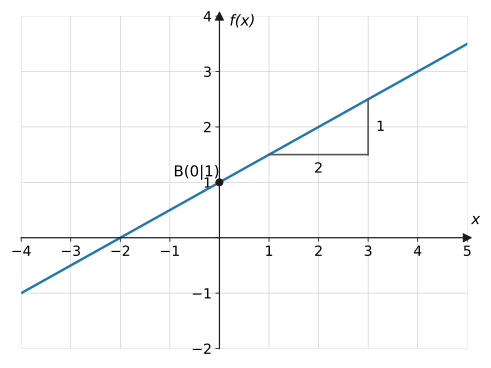
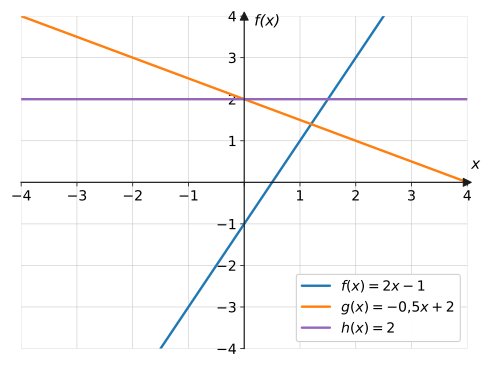
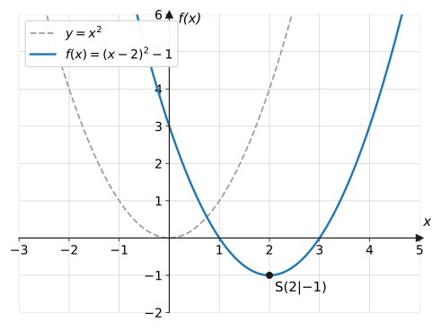
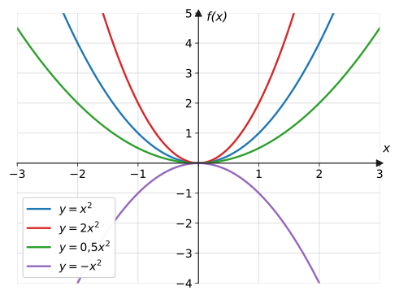
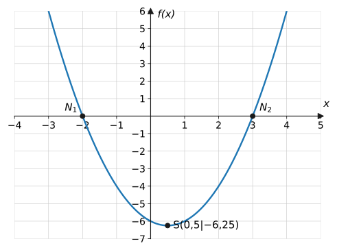

import Quiz from '../../../components/Quiz.astro';

## Worum geht's?

Handytarif, Taxipreis, Stromrechnung: Wächst etwas mit konstanter Rate,
steckt eine **lineare** Funktion dahinter. Wirft man dagegen einen Ball,
beschreibt seine Flugbahn eine **Parabel** – eine **quadratische** Funktion.
**Leitfrage:** Wie liest man Steigung, Achsenabschnitt, Scheitelpunkt und
Nullstellen aus Term und Graph ab – und wie rechnet man sie aus?

## Erklärung

### Lineare Funktionen

$$
f(x) = mx + b
$$

- $m$ ist die **Steigung**: Gehe ich 1 nach rechts, geht der Graph um $m$
  nach oben ($m > 0$) bzw. unten ($m < 0$).
- $b$ ist der **y-Achsenabschnitt**: Der Graph schneidet die $y$-Achse im
  Punkt $B(0 \mid b)$.

Am **Steigungsdreieck** liest man $m$ ab: hier $m = \frac{1}{2} = 0{,}5$.
Allgemein gilt für zwei Punkte $A(x_1 \mid y_1)$ und $B(x_2 \mid y_2)$:

$$
m = \frac{y_2 - y_1}{x_2 - x_1}
$$

**Nullstelle:** $f(x) = 0$ setzen und nach $x$ auflösen. Eine Gerade mit
$m \neq 0$ hat genau eine Nullstelle.

### Quadratische Funktionen

Allgemeine Form und Scheitelform:

$$
f(x) = ax^2 + bx + c
\qquad\text{bzw.}\qquad
f(x) = a(x - d)^2 + e
$$

Aus der **Scheitelform** liest man den **Scheitelpunkt** $S(d \mid e)$
direkt ab – den tiefsten Punkt (für $a > 0$) bzw. höchsten Punkt (für
$a < 0$) der Parabel.

Der **Formfaktor** $a$ steuert Öffnung und Breite:

- $a > 0$: nach oben geöffnet, $a < 0$: nach unten geöffnet
- $|a| > 1$: enger (gestreckt), $|a| < 1$: weiter (gestaucht) als die
  Normalparabel

**Von der allgemeinen Form zur Scheitelform** führt die quadratische
Ergänzung:

$$
\begin{aligned}
x^2 + 6x + 5 &= x^2 + 6x + 9 - 9 + 5 &&\text{| } \left(\tfrac{6}{2}\right)^2 = 9 \text{ ergänzen} \\
&= (x + 3)^2 - 4 &&\text{| binomische Formel}
\end{aligned}
$$

**Nullstellen** quadratischer Funktionen liefert die pq-Formel (siehe
[Algebra-Werkzeugkasten](../../basiswissen/algebra-werkzeugkasten/)). Je
nach Lage des Scheitels gibt es zwei, eine oder keine Nullstelle.

## Beispiele

**Beispiel 1:** Bestimme die Gleichung der Geraden durch $A(1 \mid 1)$ und
$B(3 \mid 5)$.

Lösung

Zuerst die Steigung aus den beiden Punkten:

$$
m = \frac{y_2 - y_1}{x_2 - x_1} = \frac{5 - 1}{3 - 1} = \frac{4}{2} = 2
$$

Dann $b$ bestimmen: Ansatz $y = 2x + b$, Punkt $A$ einsetzen (seine
Koordinaten müssen die Gleichung erfüllen):

$$
\begin{aligned}
1 &= 2 \cdot 1 + b &&\text{| } -2 \\
b &= -1
\end{aligned}
$$

Also $f(x) = 2x - 1$. Kontrolle mit $B$: $f(3) = 6 - 1 = 5$ ✓

**Beispiel 2:** Bestimme Scheitelpunkt und Nullstellen von
$f(x) = x^2 - 4x + 3$.

Lösung

**Scheitel** über die quadratische Ergänzung ($\left(\frac{4}{2}\right)^2 = 4$
ergänzen):

$$
\begin{aligned}
f(x) &= x^2 - 4x + 4 - 4 + 3 &&\text{| ergänzen und wieder abziehen} \\
&= (x - 2)^2 - 1 &&\text{| 2. binomische Formel}
\end{aligned}
$$

Scheitelpunkt $S(2 \mid -1)$.

**Nullstellen** mit der pq-Formel ($p = -4$, $q = 3$):

$$
\begin{aligned}
x_{1,2} &= 2 \pm \sqrt{4 - 3} \\
&= 2 \pm 1
\end{aligned}
$$

$x_1 = 3$, $x_2 = 1$. (Plausibel: Die Nullstellen liegen symmetrisch um
$x = 2$, die Scheitelstelle.)

**Beispiel 3:** Ein Ball wird hochgeworfen. Seine Höhe (in m) nach $t$
Sekunden: $h(t) = -5t^2 + 10t$.
a) Wann erreicht der Ball seine maximale Höhe, und wie hoch ist sie?
b) Wann landet der Ball wieder auf dem Boden?

Lösung

a) Die maximale Höhe ist der Scheitel der (nach unten geöffneten) Parabel.
Quadratische Ergänzung – zuerst $-5$ ausklammern:

$$
\begin{aligned}
h(t) &= -5(t^2 - 2t) &&\text{| ausklammern} \\
&= -5\left((t - 1)^2 - 1\right) &&\text{| quadratisch ergänzen} \\
&= -5(t - 1)^2 + 5 &&\text{| ausmultiplizieren}
\end{aligned}
$$

Scheitel $S(1 \mid 5)$: Nach **1 Sekunde** erreicht der Ball die maximale
Höhe von **5 m**.

b) Boden bedeutet $h(t) = 0$:

$$
\begin{aligned}
-5t^2 + 10t &= 0 &&\text{| } -5t \text{ ausklammern} \\
-5t(t - 2) &= 0 &&\text{| Nullprodukt} \\
t_1 = 0&,\quad t_2 = 2
\end{aligned}
$$

$t_1 = 0$ ist der Abwurf – der Ball landet nach **2 Sekunden**.

## Aufgaben

**Aufgabe 1** (⭐) Gib Steigung $m$ und $y$-Achsenabschnitt $b$ an:
a) $y = 3x - 2$  b) $y = -x + 4$  c) $y = 0{,}5x$

Lösung zu Aufgabe 1

a) $m = 3$, $b = -2$

b) $m = -1$, $b = 4$

c) $m = 0{,}5$, $b = 0$ (Ursprungsgerade)

**Aufgabe 2** (⭐) Lege eine Wertetabelle für $f(x) = -2x + 3$ an
($x = -1$ bis $x = 2$).

Lösung zu Aufgabe 2

| $x$ | $-1$ | $0$ | $1$ | $2$ |
| --- | --- | --- | --- | --- |
| $f(x)$ | $5$ | $3$ | $1$ | $-1$ |

Pro Schritt nach rechts sinkt der Wert um 2 – das ist die Steigung $-2$.

**Aufgabe 3** (⭐) Liegt der Punkt auf der Geraden $y = 2x - 1$?
a) $P(3 \mid 5)$  b) $Q(-2 \mid -4)$

Lösung zu Aufgabe 3

a) $f(3) = 2 \cdot 3 - 1 = 5$ ✓ → $P$ liegt auf der Geraden.

b) $f(-2) = -4 - 1 = -5 \neq -4$ → $Q$ liegt nicht auf der Geraden.

**Aufgabe 4** (⭐) Lies aus dem ersten Graphen der Erklärung
(Steigungsdreieck) die Steigung und den $y$-Achsenabschnitt ab und gib den
Funktionsterm an.

Lösung zu Aufgabe 4

Steigungsdreieck: 2 nach rechts, 1 nach oben → $m = \frac{1}{2} = 0{,}5$.
Schnitt mit der $y$-Achse bei $B(0 \mid 1)$ → $b = 1$.

$$
g(x) = 0{,}5x + 1
$$

**Aufgabe 5** (⭐) Berechne die Nullstelle:
a) $f(x) = 3x - 6$  b) $g(x) = -2x - 8$

Lösung zu Aufgabe 5

a)

$$
3x - 6 = 0 \ \Rightarrow\ 3x = 6 \ \Rightarrow\ x = 2
$$

b)

$$
-2x - 8 = 0 \ \Rightarrow\ -2x = 8 \ \Rightarrow\ x = -4
$$

**Aufgabe 6** (⭐⭐) Bestimme die Gleichung der Geraden durch $A(2 \mid 3)$
und $B(4 \mid 7)$.

Lösung zu Aufgabe 6

$$
m = \frac{7 - 3}{4 - 2} = \frac{4}{2} = 2
$$

$b$ über Punkt $A$: $3 = 2 \cdot 2 + b \Rightarrow b = -1$.

$$
f(x) = 2x - 1
$$

Kontrolle mit $B$: $f(4) = 8 - 1 = 7$ ✓

**Aufgabe 7** (⭐⭐) Bestimme die Gleichung der Geraden durch $A(-1 \mid 4)$
und $B(2 \mid -2)$.

Lösung zu Aufgabe 7

$$
m = \frac{-2 - 4}{2 - (-1)} = \frac{-6}{3} = -2
$$

$b$ über Punkt $A$:

$$
\begin{aligned}
4 &= -2 \cdot (-1) + b \\
4 &= 2 + b \\
b &= 2
\end{aligned}
$$

$$
f(x) = -2x + 2
$$

Kontrolle mit $B$: $f(2) = -4 + 2 = -2$ ✓

**Aufgabe 8** (⭐⭐) Berechne den Schnittpunkt der Geraden $f(x) = 2x - 1$
und $g(x) = -x + 5$.

Lösung zu Aufgabe 8

Gleichsetzen:

$$
\begin{aligned}
2x - 1 &= -x + 5 &&\text{| } +x \\
3x - 1 &= 5 &&\text{| } +1 \\
3x &= 6 &&\text{| } :3 \\
x &= 2
\end{aligned}
$$

$y$-Wert: $f(2) = 3$. Schnittpunkt $S(2 \mid 3)$.
Kontrolle: $g(2) = -2 + 5 = 3$ ✓

**Aufgabe 9** (⭐⭐) Welche der Geraden sind zueinander parallel? Begründe.
$f(x) = 2x + 3$, $\ g(x) = -2x + 3$, $\ h(x) = 2x - 4$

Lösung zu Aufgabe 9

Parallele Geraden haben dieselbe Steigung. $f$ und $h$ haben beide $m = 2$
→ **parallel**. $g$ hat $m = -2$ → nicht parallel zu den anderen (gleicher
$y$-Achsenabschnitt wie $f$ bedeutet nur: gleicher Schnittpunkt mit der
$y$-Achse).

**Aufgabe 10** (⭐⭐) $f(x) = (x + 1)^2 - 4$.
a) Gib den Scheitelpunkt an. b) Berechne die Nullstellen.

Lösung zu Aufgabe 10

a) Scheitelform ablesen: $S(-1 \mid -4)$.

b)

$$
\begin{aligned}
(x + 1)^2 - 4 &= 0 &&\text{| } +4 \\
(x + 1)^2 &= 4 &&\text{| Wurzel, beide Vorzeichen} \\
x + 1 = 2 \ \ \text{oder} \ \ x + 1 &= -2 \\
x_1 = 1,\quad x_2 &= -3
\end{aligned}
$$

**Aufgabe 11** (⭐⭐) Bringe $f(x) = x^2 + 6x + 5$ in die Scheitelform und
gib den Scheitelpunkt an.

Lösung zu Aufgabe 11

Quadratische Ergänzung mit $\left(\frac{6}{2}\right)^2 = 9$:

$$
\begin{aligned}
f(x) &= x^2 + 6x + 9 - 9 + 5 \\
&= (x + 3)^2 - 4
\end{aligned}
$$

Scheitelpunkt $S(-3 \mid -4)$.

**Aufgabe 12** (⭐⭐) Berechne die Nullstellen von $f(x) = x^2 - x - 6$ und
vergleiche mit dem letzten Graphen der Erklärung.

Lösung zu Aufgabe 12

pq-Formel mit $p = -1$, $q = -6$:

$$
\begin{aligned}
x_{1,2} &= \frac{1}{2} \pm \sqrt{\frac{1}{4} + 6} \\
&= \frac{1}{2} \pm \sqrt{\frac{25}{4}} \\
&= \frac{1}{2} \pm \frac{5}{2}
\end{aligned}
$$

$x_1 = 3$, $x_2 = -2$ – genau die markierten Punkte $N_1(-2 \mid 0)$ und
$N_2(3 \mid 0)$ im Graphen. ✓

**Aufgabe 13** (⭐⭐) Ordne die Terme $y = 2x^2$, $y = 0{,}5x^2$ und
$y = -x^2$ den Parabeln im Öffnungs-Vergleichsgraphen zu und begründe mit
dem Formfaktor.

Lösung zu Aufgabe 13

- $y = 2x^2$: $|a| = 2 > 1$ → die **engste** nach oben geöffnete Parabel
  (rot)
- $y = 0{,}5x^2$: $|a| = 0{,}5 < 1$ → die **weiteste** nach oben geöffnete
  Parabel (grün)
- $y = -x^2$: $a < 0$ → die **nach unten** geöffnete Parabel (violett)

**Aufgabe 14** (⭐⭐) Berechne die Schnittpunkte der Parabel $f(x) = x^2$ mit
der Geraden $g(x) = x + 2$.

Lösung zu Aufgabe 14

Gleichsetzen und auf Normalform bringen:

$$
\begin{aligned}
x^2 &= x + 2 &&\text{| } -x - 2 \\
x^2 - x - 2 &= 0 &&\text{| pq-Formel, } p = -1,\ q = -2 \\
x_{1,2} &= \frac{1}{2} \pm \sqrt{\frac{1}{4} + 2} = \frac{1}{2} \pm \frac{3}{2}
\end{aligned}
$$

$x_1 = 2$, $x_2 = -1$. Die $y$-Werte liefert $f$: $f(2) = 4$, $f(-1) = 1$.

Schnittpunkte: $S_1(2 \mid 4)$ und $S_2(-1 \mid 1)$.

**Aufgabe 15** (⭐⭐⭐) Beim Handballtraining wird ein Ball geworfen; seine
Höhe beschreibt $h(t) = -5t^2 + 20t$ ($t$ in s, $h$ in m).
a) Nach welcher Zeit erreicht der Ball die maximale Höhe? Wie hoch fliegt er?
b) Wie lange ist der Ball in der Luft?

Lösung zu Aufgabe 15

a) Scheitelform ($-5$ ausklammern, quadratisch ergänzen):

$$
\begin{aligned}
h(t) &= -5(t^2 - 4t) \\
&= -5\left((t - 2)^2 - 4\right) \\
&= -5(t - 2)^2 + 20
\end{aligned}
$$

Scheitel $S(2 \mid 20)$: nach **2 s** maximale Höhe **20 m**.

b) $h(t) = 0$:

$$
-5t(t - 4) = 0 \quad\Rightarrow\quad t_1 = 0,\ t_2 = 4
$$

Der Ball ist **4 Sekunden** in der Luft.

**Aufgabe 16** (⭐⭐⭐) Für welchen Wert von $c$ berührt die Parabel
$y = x^2 + c$ die Gerade $y = 2x$ in genau einem Punkt?

Lösung zu Aufgabe 16

Gleichsetzen; „genau ein Schnittpunkt“ heißt: Die entstehende quadratische
Gleichung hat genau eine Lösung, also Diskriminante $D = 0$.

$$
\begin{aligned}
x^2 + c &= 2x &&\text{| } -2x \\
x^2 - 2x + c &= 0 &&\text{| } p = -2,\ q = c \\
D = 1 - c &= 0 \\
c &= 1
\end{aligned}
$$

Für $c = 1$ berührt die Parabel die Gerade – im Punkt mit $x = 1$, also in
$(1 \mid 2)$.

## Merksatz

Merksatz anzeigen

**Gerade:** $f(x) = mx + b$ – Steigung $m$ (Steigungsdreieck bzw.
$m = \frac{y_2 - y_1}{x_2 - x_1}$), $y$-Achsenabschnitt $b$.
**Parabel:** $f(x) = a(x-d)^2 + e$ mit Scheitel $S(d \mid e)$; $a$ steuert
Öffnung und Breite. Nullstellen über pq-Formel oder Scheitelform;
Schnittpunkte zweier Graphen immer durch **Gleichsetzen**.

## Vertiefung

:::caution
In der Scheitelform steht ein **Minus**: $f(x) = (x - d)^2 + e$ hat den
Scheitel bei $x = \boldsymbol{+d}$. Also: $(x + 3)^2$ → Scheitelstelle
$x = -3$, nicht $+3$!
:::

**Sonderfall Diskriminante:** Ob eine Parabel die $x$-Achse zweimal, einmal
oder gar nicht schneidet, entscheidet die Diskriminante der pq-Formel –
dasselbe Kriterium, mit dem Aufgabe 16 die Berührung erzwingt. Dieses
Muster („Berühren = genau eine Lösung“) kommt bei
[Tangenten](../../differentialrechnung/tangente-normale/) wieder.

**Ausblick:** Auf der Seite
[Transformationen](../transformationen/) wird aus der Scheitelform ein
allgemeines Prinzip: Verschieben, Strecken und Spiegeln funktioniert bei
**jeder** Funktion so wie hier bei der Parabel.

## Quiz

Zum Abschluss: Klicke bei jeder Frage eine Antwort an – die Auswertung kommt sofort.

<Quiz fragen={[
  { frage: 'Welche Steigung hat die Gerade durch A(1|2) und B(3|8)?',
    antworten: ['m = 6', 'm = 3', 'm = 2', 'm = 1/3'],
    richtig: 1, erklaerung: 'm = (8 − 2)/(3 − 1) = 6/2 = 3.' },
  { frage: 'Wo schneidet y = −2x + 5 die y-Achse?',
    antworten: ['Bei −2', 'Bei 5', 'Bei 2,5', 'Bei 0'],
    richtig: 1, erklaerung: 'Der y-Achsenabschnitt ist b = 5: Punkt (0|5).' },
  { frage: 'Welchen Scheitel hat f(x) = (x − 3)² + 2?',
    antworten: ['S(−3|2)', 'S(3|2)', 'S(3|−2)', 'S(2|3)'],
    richtig: 1, erklaerung: 'Scheitelform a(x − d)² + e: Vorzeichen in der Klammer umdrehen – Scheitel bei (3|2).' },
  { frage: 'Woran erkennt man, dass zwei Geraden parallel sind?',
    antworten: ['Gleicher y-Achsenabschnitt', 'Gleiche Steigung', 'Gleiche Nullstelle', 'Beide steigen'],
    richtig: 1, erklaerung: 'Parallel bedeutet gleiche Steigung m – der y-Achsenabschnitt darf sich unterscheiden.' },
  { frage: 'Was bewirkt der Formfaktor a = −0,5 bei einer Parabel?',
    antworten: ['Nach unten geöffnet und breiter als die Normalparabel', 'Nach unten geöffnet und enger', 'Nach oben geöffnet und breiter', 'Nach oben geöffnet und enger'],
    richtig: 0, erklaerung: 'a &lt; 0 öffnet nach unten, |a| = 0,5 &lt; 1 staucht – die Parabel wird breiter.' },
  { frage: 'Die Diskriminante der pq-Formel ist negativ. Wie viele Nullstellen gibt es?',
    antworten: ['Zwei', 'Genau eine', 'Keine', 'Das hängt von p ab'],
    richtig: 2, erklaerung: 'Aus einer negativen Zahl kann man keine (reelle) Wurzel ziehen – keine Lösung, keine Nullstelle.' },
]} />
