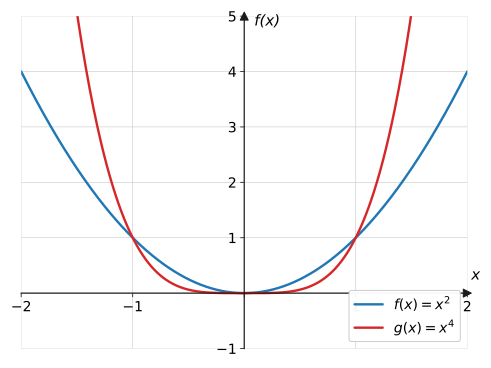
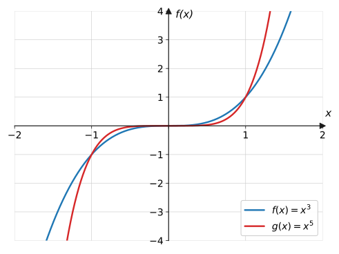
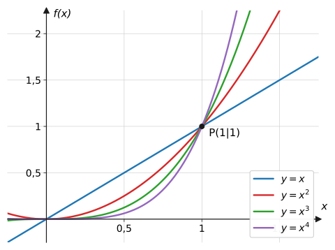
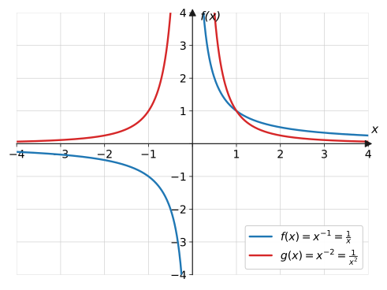
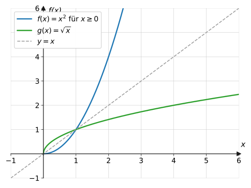

import Quiz from '../../../components/Quiz.astro';

## Worum geht's?

Verdoppelt man die Kantenlänge eines Würfels, verachtfacht sich sein
Volumen ($V = a^3$). Verdoppelt man den Abstand zu einer Lampe, kommt nur
noch ein Viertel des Lichts an ($I \sim \frac{1}{r^2}$). Hinter beidem
stecken **Potenzfunktionen**. **Leitfrage:** Wie verändert der Exponent
$n$ – positiv, gerade, ungerade oder negativ – den Verlauf von
$f(x) = x^n$?

## Erklärung

### Potenzfunktionen mit geraden Exponenten

$$
f(x) = x^n \quad (n = 2,\ 4,\ 6,\ \dots)
$$

- **achsensymmetrisch** zur $y$-Achse, denn $(-x)^n = x^n$ für gerades $n$
- Werte nie negativ: $W = [0;\ \infty[$
- Verlauf „von oben links nach oben rechts“
- je größer $n$, desto flacher zwischen $-1$ und $1$ und desto steiler
  außerhalb

### Potenzfunktionen mit ungeraden Exponenten

$$
f(x) = x^n \quad (n = 1,\ 3,\ 5,\ \dots)
$$

- **punktsymmetrisch** zum Ursprung, denn $(-x)^n = -x^n$ für ungerades $n$
- alle Werte kommen vor: $W = \mathbb{R}$
- Verlauf „von unten links nach oben rechts“

Alle Potenzfunktionen mit $n \geq 1$ laufen durch $(0 \mid 0)$ und durch
$P(1 \mid 1)$:

Verständnisfrage: Für große $x$ wächst $x^4$ viel schneller als $x^2$ – warum liegt $x^4$ zwischen $0$ und $1$ trotzdem <em>unter</em> $x^2$?

Multipliziert man eine Zahl zwischen 0 und 1 mit sich selbst, wird sie
**kleiner**: $0{,}5^2 = 0{,}25$, aber $0{,}5^4 = 0{,}0625$. Je öfter man
multipliziert, desto kleiner das Ergebnis – deshalb drückt ein größerer
Exponent den Graphen dort nach unten. Erst ab $x = 1$ kehrt sich das um.

### Negative Exponenten

$$
f(x) = x^{-n} = \frac{1}{x^n} \quad (n = 1,\ 2,\ \dots)
$$

- $x = 0$ ist verboten (Division durch null): $D = \mathbb{R} \setminus \{0\}$
- Bei $x = 0$ liegt eine **Polstelle**: Der Graph schmiegt sich an die
  $y$-Achse an, ohne sie zu erreichen (senkrechte **Asymptote**).
- Für $x \to \pm\infty$ nähern sich die Werte der 0: Die $x$-Achse ist
  waagerechte Asymptote.
- Symmetrie wie oben: gerades $n$ → achsensymmetrisch, ungerades $n$ →
  punktsymmetrisch.

Verständnisfrage: Warum kommt der Graph von $f(x) = \frac{1}{x}$ der $x$-Achse beliebig nahe, erreicht sie aber nie?

Ein Bruch ist nur dann null, wenn sein **Zähler** null ist – hier steht
oben aber immer die 1. Für wachsendes $x$ wird $\frac{1}{x}$ zwar winzig
($\frac{1}{1000} = 0{,}001$), aber nie exakt null. Deshalb hat $f$ keine
Nullstelle, und die $x$-Achse ist nur Asymptote.

### Wurzelfunktionen

$$
f(x) = \sqrt{x} \qquad D = [0;\ \infty[,\quad W = [0;\ \infty[
$$

Die Wurzelfunktion ist die **Umkehrung** des Quadrierens: Sie beantwortet
die Frage „welche (nicht negative) Zahl ergibt quadriert $x$?“. Ihr Graph
ist der an der Winkelhalbierenden $y = x$ gespiegelte rechte Parabelast.
Man kann sie auch als Potenzfunktion schreiben: $\sqrt{x} = x^{\frac{1}{2}}$.

**Wurzelgleichungen** löst man durch Quadrieren – aber Vorsicht:
Quadrieren ist keine Äquivalenzumformung, deshalb ist die **Probe
Pflicht** (es können Scheinlösungen entstehen).

### Umkehrfunktionen

Was hier für Quadrieren und Wurzelziehen passiert ist, hat einen eigenen
Namen: $g$ heißt **Umkehrfunktion** von $f$, wenn $g$ die Wirkung von $f$
rückgängig macht – erst $f$, dann $g$ anwenden führt zurück zum Start:

$$
g\big(f(x)\big) = x, \qquad \text{z. B.} \quad \sqrt{x^2} = x
\ \ (x \geq 0)
$$

Man schreibt dafür $f^{-1}$ (gelesen „$f$ invers“). Zwei Dinge lassen
sich immer sagen:

- **Graph:** Der Graph von $f^{-1}$ ist die Spiegelung des Graphen von
  $f$ an der Winkelhalbierenden $y = x$ (siehe Plot oben) – dabei
  tauschen Definitions- und Wertebereich die Rollen.
- **Voraussetzung:** Umkehrbar ist $f$ nur, wenn jeder $y$-Wert **genau
  einmal** getroffen wird. Die Parabel $y = x^2$ trifft $y = 4$ zweimal
  ($x = \pm 2$) – deshalb muss man sie erst auf $x \geq 0$ einschränken,
  bevor die Wurzel sie umkehren kann.

Weitere Umkehrpaare in diesem Schuljahr: [Exponentialfunktion und
Logarithmus](../exponential-logarithmus/#der-logarithmus) sowie – als
Rechenoperationen – Kubieren und dritte Wurzel.

Verständnisfrage: Warum tauschen Definitions- und Wertebereich bei der Umkehrfunktion die Rollen?

Die Umkehrfunktion liest jedes Wertepaar rückwärts: Aus „Eingabe $x$,
Ausgabe $y$“ wird „Eingabe $y$, Ausgabe $x$“. Alles, was bei $f$
herauskam ($W_f$), wird bei $f^{-1}$ eingesetzt – und alles, was bei $f$
eingesetzt wurde ($D_f$), kommt bei $f^{-1}$ heraus. Genau das zeigt auch
die Spiegelung an $y = x$: Sie vertauscht die Koordinaten jedes Punktes.

:::caution
$f^{-1}$ ist **nicht** $\frac{1}{f}$! Das hochgestellte $-1$ bezeichnet
hier die Umkehrung, keinen Kehrwert: $\sqrt{x}$ ist die Umkehrfunktion
von $x^2$ (für $x \geq 0$), aber $\frac{1}{x^2}$ ist etwas völlig
anderes.
:::

## Beispiele

**Beispiel 1:** Vergleiche $f(x) = x^4$ und $g(x) = x^3$: Symmetrie,
Wertebereich und Verhalten für $x \to -\infty$.

Lösung

**Symmetrie:** Exponent 4 ist gerade, also ist $f$ achsensymmetrisch zur
$y$-Achse: $f(-x) = (-x)^4 = x^4 = f(x)$. Exponent 3 ist ungerade, also
ist $g$ punktsymmetrisch zum Ursprung: $g(-x) = (-x)^3 = -x^3 = -g(x)$.

**Wertebereich:** $x^4 \geq 0$ für alle $x$, also $W_f = [0;\ \infty[$.
Bei $g$ kommen alle Werte vor: $W_g = \mathbb{R}$.

**Verhalten für $x \to -\infty$:** Bei $f$ wird eine negative Zahl viermal
mit sich multipliziert – das Ergebnis ist positiv und riesig:
$f(x) \to +\infty$. Bei $g$ bleibt das Minus erhalten: $g(x) \to -\infty$.

**Beispiel 2:** Untersuche $f(x) = \dfrac{1}{x^2}$: Definitionsbereich,
Verhalten nahe $x = 0$ und für $x \to \pm\infty$.

Lösung

**Definitionsbereich:** Der Nenner wird bei $x = 0$ null, also
$D = \mathbb{R} \setminus \{0\}$.

**Nahe $x = 0$:** Einsetzen kleiner Werte zeigt das Verhalten:

$$
f(0{,}1) = \frac{1}{0{,}01} = 100, \qquad f(0{,}01) = 10\,000
$$

Die Werte explodieren: $f(x) \to +\infty$ für $x \to 0$ (von beiden
Seiten, da $x^2 > 0$). Bei $x = 0$ liegt eine Polstelle, die $y$-Achse ist
senkrechte Asymptote.

**Für $x \to \pm\infty$:** Der Nenner wird riesig, der Bruch winzig:

$$
f(10) = 0{,}01, \qquad f(100) = 0{,}0001
$$

Die Werte nähern sich der 0, die $x$-Achse ist waagerechte Asymptote.

**Beispiel 3:** Löse die Wurzelgleichung $\sqrt{2x + 3} = 5$.

Lösung

Definitionsbereich: $2x + 3 \geq 0$, also $x \geq -1{,}5$.

$$
\begin{aligned}
\sqrt{2x + 3} &= 5 &&\text{| quadrieren} \\
2x + 3 &= 25 &&\text{| } -3 \\
2x &= 22 &&\text{| } :2 \\
x &= 11
\end{aligned}
$$

**Probe** (Pflicht nach dem Quadrieren!):
$\sqrt{2 \cdot 11 + 3} = \sqrt{25} = 5$ ✓

## Aufgaben

Aufgabe 1 ⭐

$f(x) = x^3$. Berechne $f(2)$, $f(-2)$ und
$f\!\left(\frac{1}{2}\right)$.

Lösung zu Aufgabe 1

$$
f(2) = 8, \qquad f(-2) = (-2)^3 = -8, \qquad
f\!\left(\tfrac{1}{2}\right) = \tfrac{1}{8}
$$

Aufgabe 2 ⭐

Achsen- oder punktsymmetrisch? Entscheide am Exponenten:
a) $y = x^4$  b) $y = x^5$  c) $y = x^6$  d) $y = x^7$

Lösung zu Aufgabe 2

Gerader Exponent → achsensymmetrisch zur $y$-Achse, ungerader Exponent →
punktsymmetrisch zum Ursprung:

a) achsensymmetrisch  b) punktsymmetrisch  c) achsensymmetrisch
d) punktsymmetrisch

Aufgabe 3 ⭐

$f(x) = \dfrac{1}{x}$. Berechne $f(2)$, $f(0{,}5)$ und
$f(-4)$. Warum darf man $x = 0$ nicht einsetzen?

Lösung zu Aufgabe 3

$$
f(2) = \frac{1}{2} = 0{,}5, \qquad f(0{,}5) = \frac{1}{0{,}5} = 2, \qquad
f(-4) = -\frac{1}{4} = -0{,}25
$$

$x = 0$ ist verboten, weil Division durch null nicht definiert ist –
deshalb $D = \mathbb{R} \setminus \{0\}$.

Aufgabe 4 ⭐

Berechne ohne Taschenrechner:
a) $\sqrt{49}$  b) $\sqrt{0{,}25}$  c) $\sqrt{\frac{1}{9}}$

Lösung zu Aufgabe 4

a) $\sqrt{49} = 7$ (denn $7^2 = 49$)

b) $\sqrt{0{,}25} = 0{,}5$ (denn $0{,}5^2 = 0{,}25$)

c) $\sqrt{\frac{1}{9}} = \frac{1}{3}$ (denn $\left(\frac{1}{3}\right)^2 = \frac{1}{9}$)

Aufgabe 5 ⭐

Gib den maximalen Definitionsbereich an:
a) $f(x) = \sqrt{x}$  b) $g(x) = \sqrt{x - 4}$  c) $h(x) = \sqrt{2x + 6}$

Lösung zu Aufgabe 5

Der Radikand muss $\geq 0$ sein:

a) $x \geq 0$: $\ D_f = [0;\ \infty[$

b) $x - 4 \geq 0 \Rightarrow x \geq 4$: $\ D_g = [4;\ \infty[$

c) $2x + 6 \geq 0 \Rightarrow x \geq -3$: $\ D_h = [-3;\ \infty[$

Aufgabe 6 ⭐⭐

Im Vergleichsgraphen der Erklärung (Kurven durch
$P(1 \mid 1)$): Welche Kurve gehört zu welchem Term? Begründe mit einem
Testwert bei $x = 0{,}5$.

Lösung zu Aufgabe 6

Testwert $x = 0{,}5$:

$$
0{,}5 > 0{,}5^2 = 0{,}25 > 0{,}5^3 = 0{,}125 > 0{,}5^4 = 0{,}0625
$$

Zwischen 0 und 1 liegt der Graph also umso **tiefer**, je größer der
Exponent ist: Die oberste Kurve ist $y = x$, darunter $y = x^2$, dann
$y = x^3$, ganz unten $y = x^4$. Rechts von $x = 1$ kehrt sich die
Reihenfolge um.

Aufgabe 7 ⭐⭐

Liegt der Punkt auf dem Graphen?
a) $P(-2 \mid 16)$ auf $y = x^4$  b) $Q(-3 \mid -27)$ auf $y = x^3$

Lösung zu Aufgabe 7

a) $(-2)^4 = 16$ ✓ → $P$ liegt auf dem Graphen.

b) $(-3)^3 = -27$ ✓ → $Q$ liegt auf dem Graphen.

Aufgabe 8 ⭐⭐

Löse: a) $x^3 = -64$  b) $x^4 = 81$  c) $x^5 = 32$

Lösung zu Aufgabe 8

a) Ungerader Exponent → genau eine Lösung: $x = -4$ (denn $(-4)^3 = -64$)

b) Gerader Exponent, rechte Seite positiv → **zwei** Lösungen:
$x_1 = 3,\ x_2 = -3$

c) Ungerader Exponent: $x = 2$

Aufgabe 9 ⭐⭐

Löse: a) $\dfrac{1}{x} = 4$  b) $\dfrac{1}{x^2} = \dfrac{1}{9}$

Lösung zu Aufgabe 9

a) ($x \neq 0$) Kehrwert auf beiden Seiten: $x = \frac{1}{4}$

b) ($x \neq 0$) Kehrwert: $x^2 = 9$, also $x_1 = 3$, $x_2 = -3$
(beide Vorzeichen!)

Aufgabe 10 ⭐⭐

Löse mit Probe:
a) $\sqrt{x + 5} = 4$  b) $\sqrt{3x} = 6$

Lösung zu Aufgabe 10

a)

$$
\begin{aligned}
\sqrt{x + 5} &= 4 &&\text{| quadrieren} \\
x + 5 &= 16 &&\text{| } -5 \\
x &= 11
\end{aligned}
$$

Probe: $\sqrt{16} = 4$ ✓

b)

$$
\begin{aligned}
\sqrt{3x} &= 6 &&\text{| quadrieren} \\
3x &= 36 &&\text{| } :3 \\
x &= 12
\end{aligned}
$$

Probe: $\sqrt{36} = 6$ ✓

Aufgabe 11 ⭐⭐

Warum hat die Gleichung $\sqrt{x - 2} + 5 = 3$ keine
Lösung?

Lösung zu Aufgabe 11

Umstellen:

$$
\sqrt{x - 2} = -2
$$

Eine Wurzel ist nie negativ – die Gleichung kann für kein $x$ stimmen.
(Wer trotzdem quadriert, erhält $x = 6$; die Probe entlarvt es als
Scheinlösung: $\sqrt{4} + 5 = 7 \neq 3$.)

Aufgabe 12 ⭐⭐

Gib das Verhalten für $x \to +\infty$ und
$x \to -\infty$ an: a) $y = x^4$  b) $y = x^5$  c) $y = -x^6$

Lösung zu Aufgabe 12

a) gerader Exponent: $x \to +\infty:\ y \to +\infty$; $\ x \to -\infty:\ y \to +\infty$

b) ungerader Exponent: $x \to +\infty:\ y \to +\infty$; $\ x \to -\infty:\ y \to -\infty$

c) Minus spiegelt a) nach unten: beide Richtungen $y \to -\infty$

Aufgabe 13 ⭐⭐

Berechne $x^2$ und $x^4$ für $x = 0{,}5$ und $x = 2$.
Was folgt für die Lage der Graphen zueinander?

Lösung zu Aufgabe 13

$$
0{,}5^2 = 0{,}25 > 0{,}5^4 = 0{,}0625; \qquad 2^2 = 4 < 2^4 = 16
$$

Zwischen $-1$ und $1$ verläuft $x^4$ **unterhalb** von $x^2$, außerhalb
**oberhalb**. An den Stellen $x = -1$, $0$, $1$ berühren/schneiden sich
die Graphen.

Aufgabe 14 ⭐⭐

Zeige rechnerisch, dass $f(x) = \dfrac{1}{x}$
punktsymmetrisch zum Ursprung ist.

Lösung zu Aufgabe 14

Punktsymmetrie zum Ursprung bedeutet $f(-x) = -f(x)$ für alle $x \in D$:

$$
f(-x) = \frac{1}{-x} = -\frac{1}{x} = -f(x) \ \checkmark
$$

Aufgabe 15 ⭐⭐⭐

Das Volumen eines Würfels ist $V(a) = a^3$.
a) Welche Kantenlänge hat ein Würfel mit $V = 125\ \text{cm}^3$?
b) Wie ändert sich das Volumen, wenn man die Kantenlänge verdoppelt?
Begründe allgemein.

Lösung zu Aufgabe 15

a) $a^3 = 125 \Rightarrow a = 5$ cm (denn $5^3 = 125$).

b) Kantenlänge $2a$ einsetzen:

$$
V(2a) = (2a)^3 = 8a^3 = 8 \cdot V(a)
$$

Das Volumen **verachtfacht** sich – unabhängig von der Ausgangslänge.

Aufgabe 16 ⭐⭐⭐

Die Beleuchtungsstärke einer Lampe folgt dem
Abstandsgesetz $I(r) = \dfrac{c}{r^2}$ ($c > 0$ konstant, $r$ = Abstand).
a) Wie ändert sich $I$, wenn sich der Abstand verdoppelt?
b) Bei welchem Vielfachen des Abstands sinkt $I$ auf ein Neuntel?

Lösung zu Aufgabe 16

a) Abstand $2r$ einsetzen:

$$
I(2r) = \frac{c}{(2r)^2} = \frac{c}{4r^2} = \frac{1}{4} \, I(r)
$$

Die Beleuchtungsstärke sinkt auf ein **Viertel**.

b) Gesucht ist $k$ mit $I(kr) = \frac{1}{9} I(r)$:

$$
\frac{c}{k^2 r^2} = \frac{1}{9} \cdot \frac{c}{r^2}
\quad\Rightarrow\quad k^2 = 9 \quad\Rightarrow\quad k = 3
$$

Beim **dreifachen** Abstand ($k = -3$ scheidet aus: Abstände sind positiv).

Aufgabe 17 ⭐⭐ · Verständnisaufgabe

Wahr oder falsch? Begründe:
a) „Für sehr große $x$ ist $x^{-2}$ irgendwann gleich null.“
b) „Jede Funktion besitzt eine Umkehrfunktion.“

Lösung zu Aufgabe 17

a) **Falsch.** $x^{-2} = \frac{1}{x^2}$ ist ein Bruch mit Zähler 1 – er
wird beliebig klein, aber nie null. Die $x$-Achse ist Asymptote, keine
Nullstelle.

b) **Falsch.** Umkehrbar ist eine Funktion nur, wenn jeder $y$-Wert genau
einmal getroffen wird. Die Normalparabel $y = x^2$ trifft $y = 4$ zweimal
($x = \pm 2$) – erst nach Einschränkung auf $x \geq 0$ kehrt $\sqrt{x}$
sie um.

## Merksatz

Merksatz anzeigen

Bei $f(x) = x^n$ entscheidet der Exponent: **gerade** → achsensymmetrisch,
$W = [0; \infty[$; **ungerade** → punktsymmetrisch, $W = \mathbb{R}$;
**negativ** → Hyperbel mit Polstelle bei $x = 0$ und Asymptoten. Die
**Wurzelfunktion** $\sqrt{x} = x^{1/2}$ kehrt das Quadrieren um
($D = W = [0; \infty[$). Nach dem Quadrieren einer Wurzelgleichung ist die
**Probe Pflicht**.

## Vertiefung

:::caution
$x^4 = 81$ hat **zwei** Lösungen ($\pm 3$), $x^3 = -64$ nur **eine**
($-4$). Bei geradem Exponenten und positiver rechter Seite immer an beide
Vorzeichen denken; bei ungeradem Exponenten gibt es genau eine Lösung –
auch für negative rechte Seiten.
:::

**Scheinlösungen:** Quadrieren kann Lösungen „erfinden“ (Aufgabe 11), weil
aus $a = b$ zwar $a^2 = b^2$ folgt, aber nicht umgekehrt. Deshalb gehört
zu jeder Wurzelgleichung die Probe in der Ausgangsgleichung.

**Ausblick:** Summen von Potenzfunktionen mit Koeffizienten – etwa
$f(x) = 2x^3 - 5x^2 + 1$ – heißen [ganzrationale
Funktionen](../../ganzrationale/eigenschaften/). Ihre Symmetrie- und
Verlaufsregeln bauen direkt auf dieser Seite auf. Und die Hyperbeln mit
ihren Polstellen und Asymptoten bekommen auf der nächsten Seite Familie:
die [gebrochenrationalen Funktionen](../gebrochenrationale/).

## Quiz

Zum Abschluss: Klicke bei jeder Frage eine Antwort an – die Auswertung kommt sofort.

<Quiz fragen={[
  { frage: 'Welche Symmetrie hat f(x) = x⁴?',
    antworten: ['Punktsymmetrisch zum Ursprung', 'Achsensymmetrisch zur y-Achse', 'Symmetrisch zur x-Achse', 'Keine Symmetrie'],
    richtig: 1, erklaerung: 'Gerader Exponent: (−x)⁴ = x⁴, also f(−x) = f(x) – Achsensymmetrie.' },
  { frage: 'Was passiert mit f(x) = x⁵ für x → −∞?',
    antworten: ['f(x) → +∞', 'f(x) → −∞', 'f(x) → 0', 'f(x) → −1'],
    richtig: 1, erklaerung: 'Ungerader Exponent: Das Minus bleibt erhalten – der Graph kommt von unten links.' },
  { frage: 'Welche Gerade ist die senkrechte Asymptote von f(x) = 1/x?',
    antworten: ['y = 0', 'x = 0', 'y = x', 'x = 1'],
    richtig: 1, erklaerung: 'An der Polstelle x = 0 schmiegt sich der Graph an die y-Achse (x = 0) an, ohne sie zu erreichen.' },
  { frage: 'Welche Lösungen hat x³ = −27?',
    antworten: ['x = 3 und x = −3', 'x = 3', 'x = −3', 'Keine Lösung'],
    richtig: 2, erklaerung: 'Ungerader Exponent → genau eine Lösung: (−3)³ = −27.' },
  { frage: 'Welche Lösungen hat x⁴ = 16?',
    antworten: ['Nur x = 2', 'x = 2 und x = −2', 'x = 4 und x = −4', 'Nur x = 4'],
    richtig: 1, erklaerung: 'Gerader Exponent und positive rechte Seite → zwei Lösungen: 2⁴ = 16 und (−2)⁴ = 16.' },
  { frage: 'Warum ist nach dem Lösen einer Wurzelgleichung die Probe Pflicht?',
    antworten: ['Weil man sich verrechnet haben könnte', 'Weil Quadrieren keine Äquivalenzumformung ist und Scheinlösungen erzeugen kann', 'Weil Wurzeln nie exakt sind', 'Die Probe ist freiwillig'],
    richtig: 1, erklaerung: 'Aus a = b folgt a² = b², aber nicht umgekehrt – beim Quadrieren können Lösungen dazukommen, die die Ausgangsgleichung nicht erfüllen.' },
  { frage: 'Was bedeutet f⁻¹ (f invers)?',
    antworten: ['Den Kehrwert 1/f', 'Die Umkehrfunktion, die die Wirkung von f rückgängig macht', 'Die Ableitung von f', 'Die Spiegelung an der x-Achse'],
    richtig: 1, erklaerung: 'f⁻¹ macht f rückgängig: f⁻¹(f(x)) = x. Der Graph entsteht durch Spiegelung an y = x – mit dem Kehrwert hat das nichts zu tun.' },
  { frage: 'Verständnisfrage: Für x zwischen 0 und 1 – welche Aussage stimmt?',
    antworten: ['x⁴ &lt; x², denn wiederholtes Multiplizieren mit einer Zahl unter 1 verkleinert', 'x⁴ &gt; x², denn der größere Exponent gewinnt immer', 'x⁴ = x², denn beide laufen durch (1|1)', 'Das hängt vom Vorzeichen ab'],
    richtig: 0, erklaerung: 'Beispiel x = 0,5: x² = 0,25, x⁴ = 0,0625. Erst ab x = 1 wächst die höhere Potenz schneller.' },
  { frage: 'Verständnisfrage: Warum hat f(x) = 1/x keine Nullstelle?',
    antworten: ['Weil x = 0 verboten ist', 'Weil ein Bruch nur null wird, wenn der Zähler null ist – hier steht aber immer 1', 'Weil der Graph die y-Achse nicht schneidet', 'f hat doch eine Nullstelle bei x = 0'],
    richtig: 1, erklaerung: 'Nullstelle heißt f(x) = 0. Ein Bruch ist null, wenn sein Zähler null ist – der Zähler 1 wird nie null.' },
]} />
