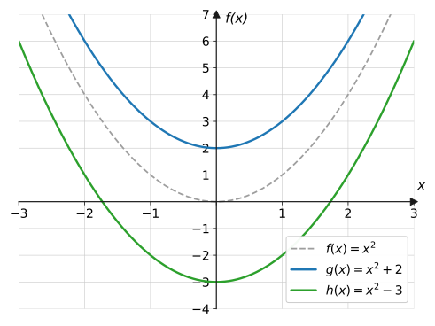
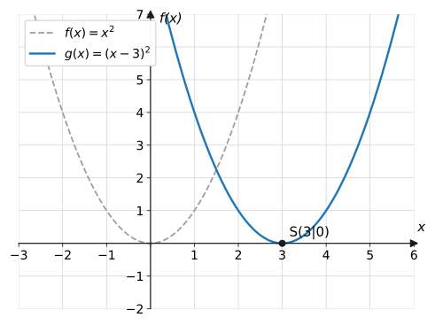
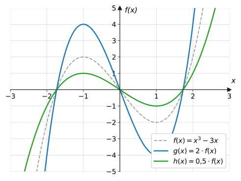
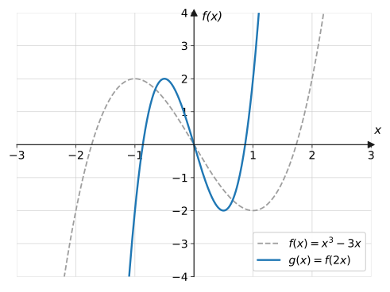
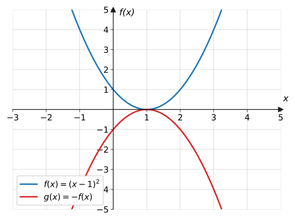
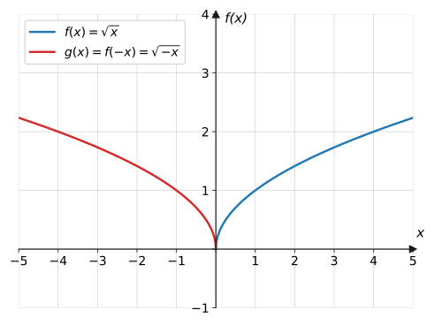
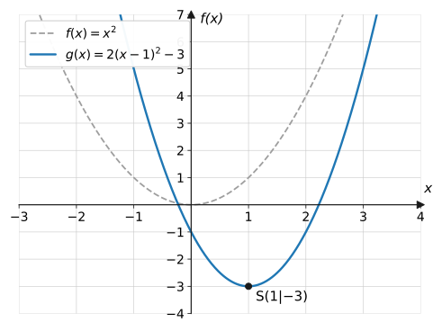
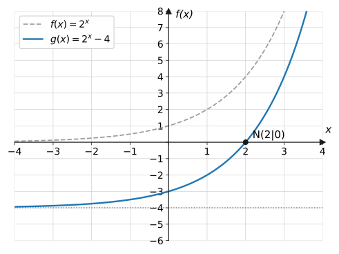

import Quiz from '../../../components/Quiz.astro';

## Worum geht's?

Scheitelform der Parabel, Mittellinie der Sinuskurve, verschobene
Asymptote der Exponentialfunktion – auf den letzten Seiten tauchte immer
wieder dasselbe Muster auf: Kleine Änderungen am Term verschieben,
strecken oder spiegeln den Graphen. **Leitfrage:** Nach welchen festen
Regeln verändert sich ein Graph, wenn man am Term schraubt – und zwar für
**jede** Funktion, egal ob Parabel, Wurzel, Sinus oder Exponentialkurve?

## Erklärung

Ausgangspunkt ist immer eine Grundfunktion $f$. Aus ihr entsteht eine
neue Funktion $g$ durch:

| Term | Wirkung auf den Graphen |
| --- | --- |
| $g(x) = f(x) + e$ | Verschiebung um $e$ in $y$-Richtung |
| $g(x) = f(x - d)$ | Verschiebung um $d$ in $x$-Richtung |
| $g(x) = a \cdot f(x)$ | Streckung in $y$-Richtung mit Faktor $a$ |
| $g(x) = f(b \cdot x)$ | Streckung in $x$-Richtung mit Faktor $\frac{1}{b}$ |
| $g(x) = -f(x)$ | Spiegelung an der $x$-Achse |
| $g(x) = f(-x)$ | Spiegelung an der $y$-Achse |

### Verschiebung in y-Richtung: f(x) + e

Zu jedem Funktionswert wird $e$ addiert – der ganze Graph wandert um $e$
nach oben ($e > 0$) bzw. unten ($e < 0$).

### Verschiebung in x-Richtung: f(x − d)

$g(x) = f(x - d)$ verschiebt den Graphen um $d$ nach **rechts** ($d > 0$)
bzw. links ($d < 0$).

:::caution
**Gegen die Intuition:** Im Term steht $(x - 3)$, verschoben wird nach
**+3** (rechts). Merkhilfe: $g$ erreicht bei $x = 3$ das, was $f$ bei
$x = 0$ tut – alles passiert „3 später“.
:::

### Streckung in y-Richtung: a · f(x)

Jeder Funktionswert wird mit $a$ multipliziert: $|a| > 1$ streckt,
$|a| < 1$ staucht. **Nullstellen bleiben liegen** (aus $0$ wird
$a \cdot 0 = 0$).

### Streckung in x-Richtung: f(b · x)

$g(x) = f(b \cdot x)$ staucht den Graphen für $b > 1$ in $x$-Richtung auf
das $\frac{1}{b}$-Fache (alles passiert „schneller“) – bekannt von der
Periode $T = \frac{2\pi}{b}$ der Sinusfunktion.

### Spiegelungen

$-f(x)$ klappt den Graphen an der $x$-Achse nach unten; $f(-x)$ spiegelt
ihn an der $y$-Achse.

### Kombinationen

Mehrere Transformationen lassen sich kombinieren. Der allgemeine Term

$$
g(x) = a \cdot f(x - d) + e
$$

bedeutet: mit $a$ in $y$-Richtung strecken (ggf. spiegeln), um $d$ nach
rechts und um $e$ nach oben schieben. Die Scheitelform
$a(x - d)^2 + e$ ist genau dieses Muster für $f(x) = x^2$.

Auch **Asymptoten wandern mit**: $g(x) = 2^x - 4$ hat die waagerechte
Asymptote $y = -4$ statt $y = 0$ – und schneidet jetzt die $x$-Achse:

## Beispiele

**Beispiel 1:** Beschreibe, wie der Graph von $g(x) = (x + 2)^2 - 5$ aus
der Normalparabel entsteht, und gib den Scheitelpunkt an.

Lösung

Term mit dem Muster $f(x - d) + e$ vergleichen: $x + 2 = x - (-2)$, also
$d = -2$ und $e = -5$.

- Verschiebung um **2 nach links** ($d = -2$)
- Verschiebung um **5 nach unten** ($e = -5$)

Der Scheitel wandert von $(0 \mid 0)$ mit: $S(-2 \mid -5)$.

**Beispiel 2:** $g(x) = 2(x - 1)^2 - 3$ (Graph in der Erklärung).
a) Beschreibe die Transformationen ausgehend von $f(x) = x^2$.
b) Prüfe mit dem Punkt $x = 2$.

Lösung

a) Vergleich mit $a \cdot f(x - d) + e$: $\ a = 2$, $d = 1$, $e = -3$:

1. Streckung in $y$-Richtung mit Faktor **2**
2. Verschiebung um **1 nach rechts**
3. Verschiebung um **3 nach unten**

Scheitel: $S(1 \mid -3)$.

b) Rechnung:

$$
g(2) = 2 \cdot (2 - 1)^2 - 3 = 2 - 3 = -1
$$

Kontrolle über die Transformationen: $f$ hat bei $x = 1$ (eine Einheit
rechts vom Scheitel) den Wert $1$; gestreckt: $2$; um 3 nach unten:
$-1$ ✓.

**Beispiel 3:** Der Graph von $f(x) = x^3 - 3x$ wird um 2 nach rechts und
1 nach oben verschoben. Gib den Funktionsterm der Bildfunktion $g$ an.

Lösung

Rechtsverschiebung um 2: Jedes $x$ im Term wird durch $(x - 2)$ ersetzt.
Danach $+1$ für die Verschiebung nach oben:

$$
g(x) = (x - 2)^3 - 3(x - 2) + 1
$$

(Man kann ausmultiplizieren, muss aber nicht – die unausmultiplizierte
Form zeigt die Transformation am deutlichsten.)

**Beispiel 4:** $f(x) = \sqrt{x}$. Gib die Terme der beiden Spiegelbilder
an ($x$-Achse bzw. $y$-Achse) und jeweils Definitions- und Wertebereich.

Lösung

**Spiegelung an der $x$-Achse:** $g(x) = -\sqrt{x}$.
Der Definitionsbereich bleibt $D_g = [0;\ \infty[$, die Werte klappen nach
unten: $W_g = \ ]-\infty;\ 0]$.

**Spiegelung an der $y$-Achse:** $h(x) = \sqrt{-x}$.
Jetzt muss $-x \geq 0$ sein, also $D_h = \ ]-\infty;\ 0]$; die Werte
bleiben: $W_h = [0;\ \infty[$ (siehe Vorher-Nachher-Bild in der
Erklärung).

## Aufgaben

**Aufgabe 1** (⭐) Beschreibe die Transformation der Normalparabel:
a) $y = x^2 + 5$  b) $y = x^2 - 1$  c) $y = (x - 4)^2$  d) $y = (x + 3)^2$

Lösung zu Aufgabe 1

a) 5 nach oben  b) 1 nach unten  c) 4 nach **rechts**
d) 3 nach **links**

**Aufgabe 2** (⭐) Beschreibe die Transformation der Normalparabel:
a) $y = 3x^2$  b) $y = 0{,}25x^2$  c) $y = -x^2$

Lösung zu Aufgabe 2

a) Streckung in $y$-Richtung mit Faktor 3 (enger)

b) Stauchung mit Faktor 0,25 (weiter)

c) Spiegelung an der $x$-Achse (nach unten geöffnet)

**Aufgabe 3** (⭐) Gib den Term an: Die Normalparabel wird
a) um 2 nach oben verschoben,
b) um 3 nach links verschoben,
c) an der $x$-Achse gespiegelt.

Lösung zu Aufgabe 3

a) $y = x^2 + 2$  b) $y = (x + 3)^2$  c) $y = -x^2$

**Aufgabe 4** (⭐) Der Punkt $P(2 \mid 4)$ liegt auf der Normalparabel.
Wohin wandert er, wenn der Graph a) um 3 nach oben, b) um 1 nach rechts
verschoben wird?

Lösung zu Aufgabe 4

a) $y$-Koordinate $+3$: $\ P'(2 \mid 7)$

b) $x$-Koordinate $+1$: $\ P'(3 \mid 4)$

**Aufgabe 5** (⭐) Im Vorher-Nachher-Bild zur $x$-Verschiebung (Erklärung)
ist die verschobene Parabel zu sehen. Woran erkennst du am Graphen sofort
den Term $(x - 3)^2$?

Lösung zu Aufgabe 5

Der Scheitel liegt bei $S(3 \mid 0)$ – die Normalparabel wurde um 3 nach
rechts geschoben, also steht im Term $(x - 3)^2$ (Vorzeichen im Term
umgekehrt zur Verschieberichtung).

**Aufgabe 6** (⭐⭐) Beschreibe alle Transformationen von
$g(x) = (x - 2)^2 + 1$ und gib den Scheitelpunkt an.

Lösung zu Aufgabe 6

2 nach rechts, 1 nach oben; Scheitel $S(2 \mid 1)$. Da der Scheitel über
der $x$-Achse liegt und die Parabel nach oben geöffnet ist, hat $g$ keine
Nullstellen.

**Aufgabe 7** (⭐⭐) $g(x) = -(x + 1)^2 + 4$. Beschreibe die
Transformationen, gib Scheitel und Öffnungsrichtung an.

Lösung zu Aufgabe 7

1 nach links, Spiegelung an der $x$-Achse (Minus vor der Klammer), 4 nach
oben. Scheitel $S(-1 \mid 4)$, nach **unten** geöffnet – der Scheitel ist
der höchste Punkt.

**Aufgabe 8** (⭐⭐) $g(x) = \sqrt{x - 3} + 2$. Beschreibe die
Transformationen von $f(x) = \sqrt{x}$ und gib $D_g$ und $W_g$ an.

Lösung zu Aufgabe 8

3 nach rechts, 2 nach oben. Der Startpunkt $(0 \mid 0)$ des Wurzelgraphen
wandert nach $(3 \mid 2)$:

$$
D_g = [3;\ \infty[, \qquad W_g = [2;\ \infty[
$$

**Aufgabe 9** (⭐⭐) $g(x) = \dfrac{1}{x - 2} + 1$. Beschreibe die
Transformationen von $f(x) = \frac{1}{x}$ und gib die beiden Asymptoten
von $g$ an.

Lösung zu Aufgabe 9

2 nach rechts, 1 nach oben. Die Asymptoten wandern mit:

- senkrechte Asymptote: $x = 2$ (statt $x = 0$)
- waagerechte Asymptote: $y = 1$ (statt $y = 0$)

$D_g = \mathbb{R} \setminus \{2\}$.

**Aufgabe 10** (⭐⭐) $g(x) = 2^x - 4$ (Graph in der Erklärung).
a) Gib die Asymptote an. b) Berechne die Nullstelle.

Lösung zu Aufgabe 10

a) Die Asymptote $y = 0$ von $2^x$ wandert 4 nach unten: $y = -4$.

b)

$$
\begin{aligned}
2^x - 4 &= 0 &&\text{| } +4 \\
2^x &= 4 = 2^2 \\
x &= 2
\end{aligned}
$$

Nullstelle $x = 2$ – durch die Verschiebung hat die Exponentialfunktion
jetzt eine Nullstelle!

**Aufgabe 11** (⭐⭐) $f(x) = x^3 - 3x$ hat die Nullstellen $0$ und
$\pm\sqrt{3}$ sowie den Hochpunkt $H(-1 \mid 2)$. Gib Nullstellen und
Hochpunkt von $g(x) = 2 \cdot f(x)$ an – ohne neue Rechnung.

Lösung zu Aufgabe 11

$y$-Streckung mit Faktor 2:

- **Nullstellen unverändert:** $0,\ \pm\sqrt{3}$ (denn $2 \cdot 0 = 0$)
- Hochpunkt: $y$-Koordinate verdoppelt sich → $H'(-1 \mid 4)$

**Aufgabe 12** (⭐⭐) $g(x) = \sqrt{-x}$. Aus welcher Grundfunktion und
welcher Transformation entsteht $g$? Gib $D_g$ an.

Lösung zu Aufgabe 12

$g(x) = f(-x)$ mit $f(x) = \sqrt{x}$: Spiegelung an der **y-Achse**.
Bedingung $-x \geq 0$, also $D_g = \ ]-\infty;\ 0]$ – der Graph läuft nach
links (siehe Erklärung).

**Aufgabe 13** (⭐⭐) Bei $f(x) = x^2$ wird einmal **erst** um 2 nach oben
verschoben und **dann** mit 3 gestreckt, einmal umgekehrt. Stelle beide
Terme auf und vergleiche.

Lösung zu Aufgabe 13

Erst schieben, dann strecken (die Streckung erfasst auch die $+2$):

$$
g_1(x) = 3 \cdot (x^2 + 2) = 3x^2 + 6
$$

Erst strecken, dann schieben:

$$
g_2(x) = 3x^2 + 2
$$

Die Ergebnisse sind **verschieden** ($g_1(0) = 6$, $g_2(0) = 2$) – bei
Kombinationen kommt es auf die **Reihenfolge** an.

**Aufgabe 14** (⭐⭐) Begründe, dass zum Kombinations-Graphen der Erklärung
(Scheitel $S(1 \mid -3)$, verläuft durch $(2 \mid -1)$) genau der Term
$g(x) = 2(x - 1)^2 - 3$ passt.

Lösung zu Aufgabe 14

Ansatz Scheitelform mit $S(1 \mid -3)$: $g(x) = a(x - 1)^2 - 3$.
Punkt $(2 \mid -1)$ einsetzen:

$$
\begin{aligned}
-1 &= a \cdot (2 - 1)^2 - 3 &&\text{| } +3 \\
2 &= a
\end{aligned}
$$

Also $g(x) = 2(x - 1)^2 - 3$. ✓

**Aufgabe 15** (⭐⭐) $f(x) = x^3 - 3x$, $\ g(x) = f(2x)$.
a) Gib den Term von $g$ aus.
b) $f$ hat die Nullstellen $0, \pm\sqrt{3}$. Wo liegen die Nullstellen
von $g$?

Lösung zu Aufgabe 15

a)

$$
g(x) = (2x)^3 - 3 \cdot 2x = 8x^3 - 6x
$$

b) $x$-Stauchung auf die Hälfte: Nullstellen bei
$0$ und $\pm\frac{\sqrt{3}}{2}$.
(Kontrolle: $g\left(\frac{\sqrt{3}}{2}\right) = f(\sqrt{3}) = 0$ ✓)

**Aufgabe 16** (⭐⭐) Der Graph von $f(x) = x^2 - 4$ wird um 1 nach oben
verschoben. Berechne Nullstellen und $y$-Achsenabschnitt der Bildfunktion.

Lösung zu Aufgabe 16

$g(x) = x^2 - 3$.

$y$-Achsenabschnitt: $g(0) = -3$.

Nullstellen:

$$
x^2 - 3 = 0 \quad\Rightarrow\quad x = \pm\sqrt{3} \approx \pm 1{,}73
$$

**Aufgabe 17** (⭐⭐⭐) Multipliziere den Term aus Beispiel 3 aus:
$g(x) = (x - 2)^3 - 3(x - 2) + 1$.

Lösung zu Aufgabe 17

$(x-2)^3$ mit der binomischen Formel bzw. schrittweise:

$$
\begin{aligned}
(x - 2)^3 &= (x-2)(x^2 - 4x + 4) \\
&= x^3 - 4x^2 + 4x - 2x^2 + 8x - 8 \\
&= x^3 - 6x^2 + 12x - 8
\end{aligned}
$$

Alles zusammensetzen:

$$
\begin{aligned}
g(x) &= x^3 - 6x^2 + 12x - 8 - 3x + 6 + 1 \\
&= x^3 - 6x^2 + 9x - 1
\end{aligned}
$$

**Aufgabe 18** (⭐⭐⭐) Zeige durch quadratische Ergänzung, dass
$h(x) = x^2 + 6x + 7$ eine verschobene Normalparabel ist, und beschreibe
die Verschiebung.

Lösung zu Aufgabe 18

$$
\begin{aligned}
h(x) &= x^2 + 6x + 9 - 9 + 7 &&\text{| } \left(\tfrac{6}{2}\right)^2 \text{ ergänzen} \\
&= (x + 3)^2 - 2
\end{aligned}
$$

Die Normalparabel, um **3 nach links** und **2 nach unten** verschoben;
Scheitel $S(-3 \mid -2)$. Jede quadratische Funktion mit $a = 1$ ist also
nur eine verschobene Normalparabel.

**Aufgabe 19** (⭐⭐) Beschreibe $f(x) = 2\sin(x) + 1$ als Transformation
der Sinusfunktion und gib den Wertebereich an.

Lösung zu Aufgabe 19

Streckung in $y$-Richtung mit Faktor 2 (Amplitude 2), dann Verschiebung
um 1 nach oben (Mittellinie $y = 1$):

$$
W = [1 - 2;\ 1 + 2] = [-1;\ 3]
$$

**Aufgabe 20** (⭐⭐⭐) Welche der Transformationen lassen **alle**
Nullstellen einer Funktion unverändert? Begründe.
(i) $f(x) + e$ (ii) $a \cdot f(x)$ (iii) $-f(x)$ (iv) $f(x - d)$

Lösung zu Aufgabe 20

**(ii) und (iii).** Ist $f(x_0) = 0$, dann auch
$a \cdot f(x_0) = 0$ und $-f(x_0) = 0$ – Strecken und Spiegeln in
$y$-Richtung lassen die Punkte auf der $x$-Achse liegen.

(i) hebt die Nullstellen mit an ($f(x_0) + e = e \neq 0$),
(iv) verschiebt sie zur Seite (neue Nullstellen bei $x_0 + d$).

**Aufgabe 21** (⭐) Beschreibe die Transformation von $f(x) = 2^x$:
a) $2^x + 3$  b) $2^{x-3}$  c) $-2^x$  d) $2^{-x}$

Lösung zu Aufgabe 21

a) 3 nach oben (Asymptote $y = 3$)

b) 3 nach rechts

c) Spiegelung an der $x$-Achse

d) Spiegelung an der $y$-Achse (aus Wachstum wird Zerfall:
$2^{-x} = \left(\frac{1}{2}\right)^x$)

**Aufgabe 22** (⭐⭐) $f(x) = x^2$ ist achsensymmetrisch zur $y$-Achse. Gilt
das auch für $g(x) = (x + 1)^2$? Begründe mit der Verschiebung.

Lösung zu Aufgabe 22

**Nein.** Die Verschiebung um 1 nach links nimmt die Symmetrieachse mit:
$g$ ist symmetrisch zur senkrechten Geraden $x = -1$, nicht mehr zur
$y$-Achse. (Check: $g(1) = 4 \neq g(-1) = 0$.)

**Aufgabe 23** (⭐⭐⭐) Der Verlauf einer leichten Fieberkurve werde
modelliert durch $T(t) = 37{,}5 + 0{,}9 \cdot \sin\!\left(\frac{\pi}{12}t\right)$
($t$ in Stunden, $T$ in °C). Beschreibe den Graphen als transformierte
Sinuskurve und gib Maximal- und Minimaltemperatur sowie die Periode an.

Lösung zu Aufgabe 23

Transformationen der Sinusfunktion:

- $y$-Streckung mit Faktor $0{,}9$ → Amplitude $0{,}9$ °C
- $x$-Streckung: $b = \frac{\pi}{12}$ → Periode
  $T = \frac{2\pi}{\pi/12} = 24$ h (Tagesrhythmus)
- Verschiebung um $37{,}5$ nach oben → Mittellinie $37{,}5$ °C

Maximum $37{,}5 + 0{,}9 = 38{,}4$ °C, Minimum $37{,}5 - 0{,}9 = 36{,}6$ °C.

**Aufgabe 24** (⭐⭐⭐) Gib einen Funktionsterm an: eine nach unten
geöffnete, mit Faktor 3 gestreckte Parabel mit Scheitel $S(2 \mid 5)$.
Berechne anschließend ihre Nullstellen.

Lösung zu Aufgabe 24

Scheitelform mit $a = -3$, $d = 2$, $e = 5$:

$$
f(x) = -3(x - 2)^2 + 5
$$

Nullstellen:

$$
\begin{aligned}
-3(x - 2)^2 + 5 &= 0 &&\text{| } -5,\ :(-3) \\
(x - 2)^2 &= \frac{5}{3} &&\text{| Wurzel} \\
x &= 2 \pm \sqrt{\tfrac{5}{3}} \approx 2 \pm 1{,}29
\end{aligned}
$$

$x_1 \approx 3{,}29$, $x_2 \approx 0{,}71$.

## Merksatz

Merksatz anzeigen

$g(x) = a \cdot f(x - d) + e$: Der Graph von $f$ wird mit $a$ in
$y$-Richtung gestreckt ($a < 0$: zusätzlich an der $x$-Achse gespiegelt),
um $d$ nach rechts und um $e$ nach oben verschoben. **Innen** im Term
($x$-Klammer) wirkt alles seitlich und „verkehrt herum“, **außen** wirkt
alles senkrecht und direkt. $f(-x)$ spiegelt an der $y$-Achse,
$f(bx)$ staucht auf $\frac{1}{b}$ der Breite.

## Vertiefung

:::caution
Die zwei Klassiker: **(1)** $(x - 3)^2$ ist nach **rechts** verschoben,
nicht links. **(2)** Bei Kombinationen ist die **Reihenfolge**
entscheidend (Aufgabe 13): $3(x^2 + 2) \neq 3x^2 + 2$. In der Form
$a \cdot f(x - d) + e$ gilt immer: erst strecken/spiegeln, dann
verschieben.
:::

**Alles schon gesehen:** Scheitelform $a(x-d)^2 + e$
([lineare & quadratische Funktionen](../lineare-quadratische/)),
Mittellinie und Amplitude ([trigonometrische
Funktionen](../trigonometrische/)), verschobene Asymptoten
([Exponentialfunktionen](../exponential-logarithmus/)) – Transformationen
sind der rote Faden hinter all diesen Einzelfällen.

**Ausblick:** Bei den [ganzrationalen
Funktionen](../../ganzrationale/eigenschaften/) helfen Transformationen,
komplizierte Terme als „verschobene Bekannte“ zu entlarven.

## Quiz

Zum Abschluss: Klicke bei jeder Frage eine Antwort an – die Auswertung kommt sofort.

<Quiz fragen={[
  { frage: 'Wie entsteht der Graph von g(x) = f(x − 2) aus dem Graphen von f?',
    antworten: ['Verschiebung um 2 nach links', 'Verschiebung um 2 nach rechts', 'Verschiebung um 2 nach unten', 'Stauchung auf die Hälfte'],
    richtig: 1, erklaerung: 'Im Term steht −2, verschoben wird nach +2 (rechts) – das Vorzeichen dreht sich um.' },
  { frage: 'Wie entsteht der Graph von g(x) = (x + 4)² aus der Normalparabel?',
    antworten: ['4 nach rechts', '4 nach oben', '4 nach links', '4 nach unten'],
    richtig: 2, erklaerung: 'x + 4 = x − (−4): Verschiebung um −4, also nach links; Scheitel bei (−4|0).' },
  { frage: 'Was bewirkt g(x) = −f(x)?',
    antworten: ['Spiegelung an der y-Achse', 'Spiegelung an der x-Achse', 'Verschiebung nach unten', 'Nichts, das Minus kürzt sich'],
    richtig: 1, erklaerung: 'Jeder Funktionswert wechselt das Vorzeichen – der Graph klappt an der x-Achse nach unten.' },
  { frage: 'Was bleibt bei der Streckung g(x) = 2 · f(x) unverändert?',
    antworten: ['Die Nullstellen', 'Die y-Werte der Extrempunkte', 'Der y-Achsenabschnitt', 'Gar nichts'],
    richtig: 0, erklaerung: 'Aus f(x₀) = 0 wird 2 · 0 = 0 – Punkte auf der x-Achse bleiben liegen.' },
  { frage: 'Was bewirkt g(x) = f(−x)?',
    antworten: ['Spiegelung an der x-Achse', 'Spiegelung an der y-Achse', 'Punktspiegelung am Ursprung', 'Verschiebung nach links'],
    richtig: 1, erklaerung: 'Rechts und links werden vertauscht – Spiegelung an der y-Achse.' },
  { frage: 'Welchen Scheitel hat g(x) = 2(x − 1)² − 3?',
    antworten: ['S(−1|−3)', 'S(1|−3)', 'S(2|−3)', 'S(1|3)'],
    richtig: 1, erklaerung: 'Muster a(x − d)² + e: d = 1 nach rechts, e = −3 nach unten – die 2 streckt nur.' },
  { frage: 'Welche Asymptote hat g(x) = 2ˣ − 4?',
    antworten: ['y = 0', 'y = 2', 'y = −4', 'x = −4'],
    richtig: 2, erklaerung: 'Die Asymptote y = 0 von 2ˣ wandert bei der Verschiebung mit: y = −4.' },
]} />

## Checkliste zur Klassenarbeit

Die erste Klassenarbeit umfasst Basiswissen und Funktionen. Hake ab, was
du sicher kannst – und arbeite die Lücken mit den verlinkten Abschnitten
nach:

- [ ] Ich kann Terme umformen, faktorisieren und die binomischen Formeln
  in beide Richtungen anwenden.
  → [Algebra-Werkzeugkasten](../../basiswissen/algebra-werkzeugkasten/#erklärung)
- [ ] Ich kann lineare, quadratische und Bruchgleichungen sicher lösen
  (pq-Formel, Satz vom Nullprodukt).
  → [Algebra-Werkzeugkasten](../../basiswissen/algebra-werkzeugkasten/#quadratische-gleichungen)
- [ ] Ich kann Zahlen den Mengen $\mathbb{N}, \mathbb{Z}, \mathbb{Q},
  \mathbb{R}$ zuordnen und Intervalle schreiben.
  → [Zahlenmengen](../../basiswissen/zahlenmengen/#erklärung)
- [ ] Ich kann erklären, was eine Funktion ist, und den Senkrechten-Test
  anwenden. → [Funktionsbegriff](../funktionsbegriff/#erklärung)
- [ ] Ich kann Funktionswerte berechnen/ablesen und Definitions- und
  Wertebereiche bestimmen.
  → [Funktionsbegriff](../funktionsbegriff/#definitions--und-wertebereich)
- [ ] Ich kann Geradengleichungen aus zwei Punkten aufstellen und
  Schnittpunkte berechnen.
  → [Lineare & quadratische Funktionen](../lineare-quadratische/#lineare-funktionen)
- [ ] Ich kann quadratische Funktionen in die Scheitelform bringen und
  Nullstellen berechnen.
  → [Lineare & quadratische Funktionen](../lineare-quadratische/#quadratische-funktionen)
- [ ] Ich kenne die Verläufe von Potenz-, Wurzel-, Exponential- und
  Sinusfunktionen samt Symmetrie und Asymptoten.
  → [Potenz & Wurzel](../potenz-wurzel/#erklärung),
  [Exponential & Logarithmus](../exponential-logarithmus/#erklärung),
  [Trigonometrische Funktionen](../trigonometrische/#erklärung)
- [ ] Ich kann Wachstums- und Zerfallsprozesse modellieren und
  Exponentialgleichungen mit dem Logarithmus lösen.
  → [Exponential & Logarithmus](../exponential-logarithmus/#wachstumsprozesse-modellieren)
- [ ] Ich kann Halbwerts- und Verdopplungszeiten berechnen.
  → [Exponential & Logarithmus](../exponential-logarithmus/#halbwertszeit-und-verdopplungszeit)
- [ ] Ich kann Amplitude, Periode und Mittellinie einer Sinusfunktion
  bestimmen. → [Trigonometrische Funktionen](../trigonometrische/#die-allgemeine-sinusfunktion)
- [ ] Ich kann Transformationen am Term erkennen, beschreiben und Terme
  zu beschriebenen Transformationen aufstellen.
  → [diese Seite](#erklärung)
