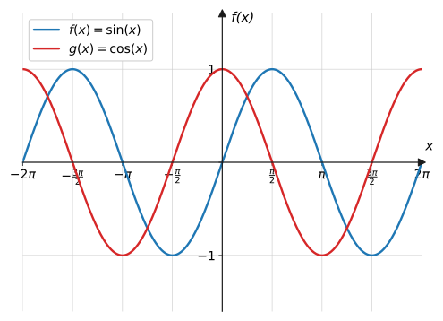
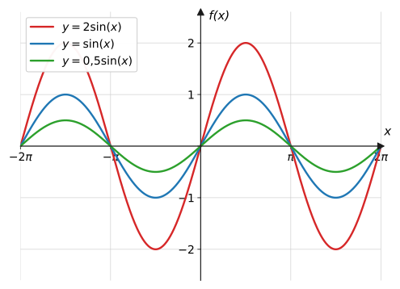
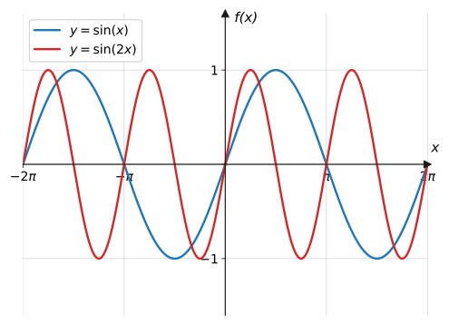
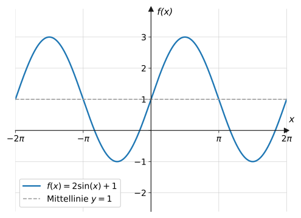

import Quiz from '../../../components/Quiz.astro';

## Worum geht's?

Atmung, Herzschlag, Gezeiten, ein Riesenrad, eine schwingende Gitarrensaite:
Viele Vorgänge wiederholen sich in festen Zeitabständen. Für solche
**periodischen** Prozesse braucht man Funktionen, die selbst periodisch
sind – Sinus und Kosinus. **Leitfrage:** Wie steuern die Parameter in
$f(x) = a \cdot \sin(b \cdot x) + d$ Höhe, Länge und Lage der Schwingung?

## Erklärung

### Bogenmaß

Winkel misst man in der Analysis nicht in Grad, sondern im **Bogenmaß**:
der Länge des zugehörigen Bogens am Einheitskreis. Umrechnung:

$$
180^\circ = \pi \qquad\Rightarrow\qquad
x_{\text{Bogen}} = \frac{\alpha}{180^\circ} \cdot \pi
$$

| Grad | $30^\circ$ | $45^\circ$ | $60^\circ$ | $90^\circ$ | $180^\circ$ | $360^\circ$ |
| --- | --- | --- | --- | --- | --- | --- |
| Bogenmaß | $\frac{\pi}{6}$ | $\frac{\pi}{4}$ | $\frac{\pi}{3}$ | $\frac{\pi}{2}$ | $\pi$ | $2\pi$ |

(Taschenrechner auf **RAD** stellen!)

Verständnisfrage: Warum rechnet die Analysis mit dem Bogenmaß statt mit Grad?

Das Bogenmaß ist eine **Länge** am Einheitskreis, also eine gewöhnliche
reelle Zahl ohne Einheit. Damit leben Eingabe $x$ und Ausgabe $\sin(x)$
auf derselben Zahlenskala – man kann die Sinusfunktion wie jede andere
Funktion zeichnen, verschieben und (später) ableiten. Grad sind dagegen
eine willkürliche Einteilung des Kreises in 360 Schritte.

### Sinus- und Kosinusfunktion

Am Einheitskreis ist $\sin(x)$ die $y$-Koordinate und $\cos(x)$ die
$x$-Koordinate des Punktes, der zum Winkel $x$ gehört. Lässt man $x$
laufen, entstehen die bekannten Wellen:

Eigenschaften von $\sin$ und $\cos$:

- **Periode** $2\pi$: Nach $2\pi$ wiederholt sich alles –
  $\sin(x + 2\pi) = \sin(x)$
- **Wertebereich** $[-1;\ 1]$, **Amplitude** 1
- Der Kosinus ist ein um $\frac{\pi}{2}$ nach links verschobener Sinus:
  $\cos(x) = \sin\!\left(x + \frac{\pi}{2}\right)$
- Symmetrie: $\sin$ ist punktsymmetrisch zum Ursprung
  ($\sin(-x) = -\sin(x)$), $\cos$ ist achsensymmetrisch zur $y$-Achse
  ($\cos(-x) = \cos(x)$)
- Nullstellen: $\sin(x) = 0$ bei $x = 0,\ \pm\pi,\ \pm 2\pi,\ \dots$;
  $\ \cos(x) = 0$ bei $x = \pm\frac{\pi}{2},\ \pm\frac{3\pi}{2},\ \dots$

Verständnisfrage: Warum hat die Gleichung $\sin(x) = 1{,}5$ keine Lösung?

$\sin(x)$ ist die $y$-Koordinate eines Punktes auf dem **Einheitskreis** –
und der hat Radius 1. Höher als 1 und tiefer als $-1$ kommt kein
Kreispunkt, also gilt immer $-1 \leq \sin(x) \leq 1$. Der Wert $1{,}5$
liegt außerhalb des Wertebereichs.

### Die allgemeine Sinusfunktion

$$
f(x) = a \cdot \sin(b \cdot x) + d
$$

**Amplitude $|a|$** – streckt die Welle in $y$-Richtung:

**Faktor $b$** – staucht die Welle in $x$-Richtung und ändert die Periode:

$$
T = \frac{2\pi}{b}
$$

**Verschiebung $d$** – hebt die **Mittellinie** auf $y = d$; der
Wertebereich wird $[d - |a|;\ d + |a|]$:

Verständnisfrage: Wie liest du $a$, $b$ und $d$ aus einem gezeichneten Wellengraphen ab?

Am besten in dieser Reihenfolge: **Mittellinie** $d$ = Mitte zwischen
höchstem und tiefstem Wert. **Amplitude** $|a|$ = Abstand vom Maximum zur
Mittellinie. **Periode** $T$ = Länge einer vollen Schwingung (z. B. von
Hochpunkt zu Hochpunkt), daraus $b = \frac{2\pi}{T}$. Wer mit der
Mittellinie beginnt, verwechselt Amplitude und Maximum nicht mehr.

## Beispiele

**Beispiel 1:** Rechne um: a) $90^\circ$ und $45^\circ$ ins Bogenmaß,
b) $\frac{\pi}{3}$ und $\frac{3\pi}{2}$ in Grad.

Lösung

a) Mit $180^\circ = \pi$:

$$
90^\circ = \frac{90}{180} \cdot \pi = \frac{\pi}{2}, \qquad
45^\circ = \frac{45}{180} \cdot \pi = \frac{\pi}{4}
$$

b) Rückrichtung ($\pi = 180^\circ$):

$$
\frac{\pi}{3} = \frac{180^\circ}{3} = 60^\circ, \qquad
\frac{3\pi}{2} = \frac{3 \cdot 180^\circ}{2} = 270^\circ
$$

**Beispiel 2:** Bestimme für $f(x) = 3 \cdot \sin(2x) - 1$ Amplitude,
Periode, Mittellinie und Wertebereich.

Lösung

Parameter ablesen: $a = 3$, $b = 2$, $d = -1$.

- **Amplitude:** $|a| = 3$
- **Periode:** $T = \frac{2\pi}{b} = \frac{2\pi}{2} = \pi$
- **Mittellinie:** $y = -1$
- **Wertebereich:** von $d - |a| = -4$ bis $d + |a| = 2$, also
  $W = [-4;\ 2]$

**Beispiel 3:** Ein Riesenrad dreht sich gleichmäßig; die Höhe einer
Gondel beschreibt $h(t) = 6 - 5 \cdot \cos\!\left(\frac{\pi}{6} t\right)$
($t$ in Minuten, $h$ in Metern – Graph in der Erklärung).
a) In welcher Höhe steigt man ein? Wie hoch fährt die Gondel maximal?
b) Wie lange dauert eine Umdrehung?
c) Wann erreicht die Gondel zum ersten Mal 8,5 m Höhe?

Lösung

a) Einstieg bei $t = 0$:

$$
h(0) = 6 - 5 \cdot \cos(0) = 6 - 5 = 1
$$

Einstieg in **1 m** Höhe. Maximal wird $h$, wenn $\cos = -1$ ist:
$h_{\max} = 6 + 5 = 11$ m (Mittellinie 6 m, Amplitude 5 m).

b) Periode:

$$
T = \frac{2\pi}{\pi/6} = 12
$$

Eine Umdrehung dauert **12 Minuten**.

c) $h(t) = 8{,}5$ lösen:

$$
\begin{aligned}
6 - 5\cos\!\left(\tfrac{\pi}{6}t\right) &= 8{,}5 &&\text{| } -6 \\
-5\cos\!\left(\tfrac{\pi}{6}t\right) &= 2{,}5 &&\text{| } :(-5) \\
\cos\!\left(\tfrac{\pi}{6}t\right) &= -0{,}5 &&\text{| } \cos^{-1} \\
\tfrac{\pi}{6}t &= \tfrac{2\pi}{3} &&\text{| } \cdot \tfrac{6}{\pi} \\
t &= 4
\end{aligned}
$$

Nach **4 Minuten**. (Kontrolle: $h(4) = 6 - 5\cos\!\left(\frac{2\pi}{3}\right)
= 6 - 5 \cdot (-0{,}5) = 8{,}5$ ✓)

## Aufgaben

Aufgabe 1 ⭐

Rechne ins Bogenmaß um:
a) $180^\circ$  b) $90^\circ$  c) $60^\circ$  d) $30^\circ$

Lösung zu Aufgabe 1

a) $\pi$  b) $\frac{\pi}{2}$  c) $\frac{\pi}{3}$  d) $\frac{\pi}{6}$

(jeweils $\frac{\alpha}{180^\circ}\cdot\pi$)

Aufgabe 2 ⭐

Rechne in Grad um:
a) $\frac{\pi}{4}$  b) $\frac{2\pi}{3}$  c) $\frac{3\pi}{2}$  d) $2\pi$

Lösung zu Aufgabe 2

a) $45^\circ$  b) $120^\circ$  c) $270^\circ$  d) $360^\circ$

Aufgabe 3 ⭐

Gib ohne Taschenrechner an:
a) $\sin(0)$  b) $\sin\!\left(\frac{\pi}{2}\right)$  c) $\sin(\pi)$
d) $\cos(0)$  e) $\cos(\pi)$

Lösung zu Aufgabe 3

a) $0$  b) $1$  c) $0$  d) $1$  e) $-1$

(am Einheitskreis oder am Graphen ablesen)

Aufgabe 4 ⭐

Gib für $f(x) = \sin(x)$ Wertebereich, Amplitude und
Periode an.

Lösung zu Aufgabe 4

$W = [-1;\ 1]$, Amplitude $1$, Periode $2\pi$.

Aufgabe 5 ⭐

Gib Amplitude und Wertebereich an:
a) $y = 4\sin(x)$  b) $y = 0{,}5\cos(x)$

Lösung zu Aufgabe 5

a) Amplitude $4$, $\ W = [-4;\ 4]$

b) Amplitude $0{,}5$, $\ W = [-0{,}5;\ 0{,}5]$

Aufgabe 6 ⭐⭐

Berechne die Periode:
a) $y = \sin(2x)$  b) $y = \sin\!\left(\frac{x}{2}\right)$  c) $y = \cos(3x)$

Lösung zu Aufgabe 6

Mit $T = \frac{2\pi}{b}$:

a) $T = \frac{2\pi}{2} = \pi$

b) $T = \frac{2\pi}{1/2} = 4\pi$

c) $T = \frac{2\pi}{3}$

Aufgabe 7 ⭐⭐

$f(x) = 2\sin(x) + 3$. Gib Amplitude, Mittellinie und
Wertebereich an.

Lösung zu Aufgabe 7

Amplitude $2$, Mittellinie $y = 3$, Wertebereich
$[3 - 2;\ 3 + 2] = [1;\ 5]$.

Aufgabe 8 ⭐⭐

Im Amplituden-Vergleichsgraphen der Erklärung sind drei
Kurven zu sehen. Ordne die Terme $2\sin(x)$, $\sin(x)$ und $0{,}5\sin(x)$
zu und begründe.

Lösung zu Aufgabe 8

Die Amplitude ist der maximale Ausschlag von der Mittellinie:

- höchste Kurve (bis $\pm 2$): $y = 2\sin(x)$ (rot)
- mittlere Kurve (bis $\pm 1$): $y = \sin(x)$ (blau)
- flachste Kurve (bis $\pm 0{,}5$): $y = 0{,}5\sin(x)$ (grün)

Alle drei haben dieselben Nullstellen, da der Faktor $a$ nur in
$y$-Richtung streckt.

Aufgabe 9 ⭐⭐

$f(x) = 5\sin(2x) - 2$. Gib Wertebereich und Periode an.

Lösung zu Aufgabe 9

Wertebereich: $[-2 - 5;\ -2 + 5] = [-7;\ 3]$.
Periode: $T = \frac{2\pi}{2} = \pi$.

Aufgabe 10 ⭐⭐

Bestimme alle Lösungen in $[0;\ 2\pi]$:
a) $\sin(x) = 0$  b) $\cos(x) = 0$

Lösung zu Aufgabe 10

a) Der Sinus ist null bei $x = 0,\ \pi,\ 2\pi$.

b) Der Kosinus ist null bei $x = \frac{\pi}{2},\ \frac{3\pi}{2}$.

(am Graphen der Erklärung ablesbar)

Aufgabe 11 ⭐⭐

Bestimme alle Lösungen von $\sin(x) = 0{,}5$ in
$[0;\ 2\pi]$.

Lösung zu Aufgabe 11

Der Taschenrechner (RAD!) liefert $x_1 = \sin^{-1}(0{,}5) = \frac{\pi}{6}$.

Wegen der Symmetrie der Sinuskurve zur Stelle $\frac{\pi}{2}$ gibt es im
Intervall eine zweite Lösung:

$$
x_2 = \pi - \frac{\pi}{6} = \frac{5\pi}{6}
$$

Aufgabe 12 ⭐⭐

Welche Symmetrie haben Sinus- und Kosinusfunktion?
Belege beide mit einer Rechnung an der Stelle $x = \frac{\pi}{2}$.

Lösung zu Aufgabe 12

$\sin$ ist **punktsymmetrisch** zum Ursprung: $\sin(-x) = -\sin(x)$.
Check: $\sin\!\left(-\frac{\pi}{2}\right) = -1 = -\sin\!\left(\frac{\pi}{2}\right)$ ✓

$\cos$ ist **achsensymmetrisch** zur $y$-Achse: $\cos(-x) = \cos(x)$.
Check: $\cos\!\left(-\frac{\pi}{2}\right) = 0 = \cos\!\left(\frac{\pi}{2}\right)$ ✓

Aufgabe 13 ⭐⭐

Gib einen Funktionsterm an: Sinuskurve mit Amplitude 3,
Periode $\pi$ und Mittellinie $y = 0$.

Lösung zu Aufgabe 13

Amplitude $\Rightarrow a = 3$. Periode $\pi$ bedeutet
$\frac{2\pi}{b} = \pi \Rightarrow b = 2$. Mittellinie $0 \Rightarrow d = 0$:

$$
f(x) = 3\sin(2x)
$$

Aufgabe 14 ⭐⭐⭐

Beim Riesenrad aus Beispiel 3 wird die Gondel nach
einer Umdrehung nicht angehalten.
a) In welcher Höhe befindet sie sich nach 15 Minuten?
b) Zu welchen Zeiten in der ersten Umdrehung ist die Gondel genau 6 m hoch?

Lösung zu Aufgabe 14

a) Periode 12 min → nach 15 min ist die Gondel wie bei $t = 3$:

$$
h(15) = h(3) = 6 - 5\cos\!\left(\frac{\pi}{2}\right) = 6 - 0 = 6
$$

**6 m**.

b) $h(t) = 6$ bedeutet $\cos\!\left(\frac{\pi}{6}t\right) = 0$, also
$\frac{\pi}{6}t = \frac{\pi}{2}$ oder $\frac{3\pi}{2}$:

$$
t_1 = 3, \qquad t_2 = 9
$$

Nach 3 und nach 9 Minuten (auf halber Höhe beim Auf- bzw. Abstieg).

Aufgabe 15 ⭐⭐⭐

Der Kammerton $a^1$ ist eine Schwingung mit 440 Hz
(440 Schwingungen pro Sekunde): $y(t) = 0{,}8 \cdot \sin(2\pi \cdot 440 \cdot t)$.
a) Gib die Amplitude an. b) Berechne die Periodendauer.
c) Was müsste man am Term ändern, damit der Ton **lauter** klingt?

Lösung zu Aufgabe 15

a) Amplitude $0{,}8$.

b) $b = 2\pi \cdot 440$, also

$$
T = \frac{2\pi}{2\pi \cdot 440} = \frac{1}{440} \approx 0{,}0023\ \text{s}
$$

c) Lautstärke entspricht der Amplitude → den Faktor $0{,}8$ vergrößern
(die Frequenz/Periode bleibt, sonst änderte sich die Tonhöhe).

Aufgabe 16 ⭐⭐⭐

In einem Hafenbecken schwankt der Wasserstand durch
die Gezeiten: $W(t) = 4 + 1{,}5 \cdot \sin\!\left(\frac{\pi}{6}t\right)$
($t$ in Stunden nach Mitternacht, $W$ in Metern).
a) Zwischen welchen Werten schwankt der Wasserstand?
b) Wie groß ist der zeitliche Abstand zwischen zwei Hochwassern?
c) Wann ist am ersten Tag zum ersten Mal Hochwasser?

Lösung zu Aufgabe 16

a) Mittellinie 4, Amplitude 1,5 → zwischen $2{,}5$ m und $5{,}5$ m.

b) Periode:

$$
T = \frac{2\pi}{\pi/6} = 12
$$

Alle **12 Stunden** ist Hochwasser.

c) Hochwasser, wenn der Sinus 1 ist:

$$
\frac{\pi}{6}t = \frac{\pi}{2} \quad\Rightarrow\quad t = 3
$$

Um **3 Uhr** nachts.

Aufgabe 17 ⭐⭐ · Verständnisaufgabe

Wahr oder falsch? Begründe:
a) „Verdoppelt man in $f(x) = \sin(b \cdot x)$ den Faktor $b$, verdoppelt
sich die Periode.“
b) „$f(x) = 5 \cdot \sin(x)$ hat den Wertebereich $[-1;\ 1]$, denn der
Sinus liegt immer zwischen $-1$ und $1$.“

Lösung zu Aufgabe 17

a) **Falsch.** Es gilt $T = \frac{2\pi}{b}$: Ein doppelt so großes $b$
**halbiert** die Periode – die Welle schwingt doppelt so schnell.

b) **Falsch.** $\sin(x)$ liegt zwischen $-1$ und $1$, aber jeder Wert
wird noch mit 5 multipliziert: Der Wertebereich ist $[-5;\ 5]$, die
Amplitude 5.

## Merksatz

Merksatz anzeigen

$f(x) = a \cdot \sin(b \cdot x) + d$ schwingt mit **Amplitude** $|a|$ um
die **Mittellinie** $y = d$; die **Periode** ist $T = \frac{2\pi}{b}$, der
Wertebereich $[d - |a|;\ d + |a|]$. Sinus und Kosinus haben dieselbe
Form – der Kosinus ist ein um $\frac{\pi}{2}$ verschobener Sinus. Winkel
im **Bogenmaß** ($180^\circ = \pi$), Taschenrechner auf RAD.

## Vertiefung

:::caution
Der häufigste Fehler in Klassenarbeiten ist ein Taschenrechner im
**DEG-Modus**: $\sin(\pi)$ ergibt dann $0{,}0548\ldots$ statt $0$. Vor
jeder Rechnung mit Bogenmaß den Modus **RAD** prüfen!
:::

**Warum der Faktor $b$ die Periode *verkleinert*:** $\sin(2x)$ durchläuft
beim Wachsen von $x$ das Argument doppelt so schnell – die Welle ist
fertig, wenn $2x = 2\pi$ gilt, also schon bei $x = \pi$. Allgemein:
Periodenlänge $= \frac{2\pi}{b}$.

**Ausblick:** Auf der Seite [Transformationen](../transformationen/)
erkennst du die Parameter $a$, $b$, $d$ als Spezialfall eines allgemeinen
Prinzips wieder, das für **alle** Funktionstypen gilt – inklusive der
Verschiebung in $x$-Richtung, die hier noch fehlte.

## Quiz

Zum Abschluss: Klicke bei jeder Frage eine Antwort an – die Auswertung kommt sofort.

<Quiz fragen={[
  { frage: 'Was ist 90° im Bogenmaß?',
    antworten: ['π', 'π/2', 'π/4', '2π'],
    richtig: 1, erklaerung: '180° = π, also 90° = π/2.' },
  { frage: 'Welche Periode hat y = sin(2x)?',
    antworten: ['4π', '2π', 'π', 'π/2'],
    richtig: 2, erklaerung: 'T = 2π/b = 2π/2 = π – der Faktor 2 staucht die Welle auf die halbe Länge.' },
  { frage: 'Welche Amplitude hat f(x) = 3 · sin(x) + 1?',
    antworten: ['4', '1', '2', '3'],
    richtig: 3, erklaerung: 'Die Amplitude ist |a| = 3; die +1 verschiebt nur die Mittellinie.' },
  { frage: 'Welchen Wertebereich hat f(x) = 2 · sin(x) − 1?',
    antworten: ['[−1; 1]', '[−3; 1]', '[−2; 2]', '[−1; 3]'],
    richtig: 1, erklaerung: 'Mittellinie −1, Amplitude 2: von −1 − 2 = −3 bis −1 + 2 = 1.' },
  { frage: 'Wie hängen Sinus- und Kosinuskurve zusammen?',
    antworten: ['Der Kosinus ist ein um π/2 verschobener Sinus', 'Der Kosinus ist der an der x-Achse gespiegelte Sinus', 'Sie haben verschiedene Perioden', 'Sie haben verschiedene Amplituden'],
    richtig: 0, erklaerung: 'cos(x) = sin(x + π/2) – gleiche Form, nur seitlich verschoben.' },
  { frage: 'In welchem Modus muss der Taschenrechner beim Bogenmaß stehen?',
    antworten: ['DEG', 'GRAD', 'RAD', 'Egal'],
    richtig: 2, erklaerung: 'Bogenmaß = Radiant: Im DEG-Modus wäre z. B. sin(π) nicht 0 – ein Klassiker unter den Klausurfehlern.' },
  { frage: 'Verständnisfrage: Warum hat sin(x) = 2 keine Lösung?',
    antworten: ['Weil 2 keine Bogenmaß-Zahl ist', 'Weil sin(x) die y-Koordinate am Einheitskreis ist und daher nie über 1 kommt', 'Weil der Taschenrechner im falschen Modus steht', 'Sie hat eine Lösung: x = 2π'],
    richtig: 1, erklaerung: 'Der Einheitskreis hat Radius 1 – die y-Koordinate seiner Punkte liegt immer zwischen −1 und 1.' },
  { frage: 'Verständnisfrage: Ein Wellengraph schwingt zwischen y = 3 und y = 7. Was liest du daraus ab?',
    antworten: ['Mittellinie d = 5, Amplitude 2', 'Mittellinie d = 4, Amplitude 4', 'Mittellinie d = 5, Amplitude 4', 'Amplitude 7, Mittellinie 3'],
    richtig: 0, erklaerung: 'd liegt in der Mitte: (3 + 7)/2 = 5. Die Amplitude ist der Abstand zum Maximum: 7 − 5 = 2.' },
]} />
