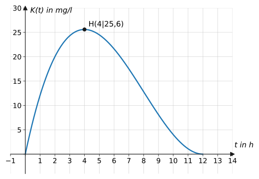
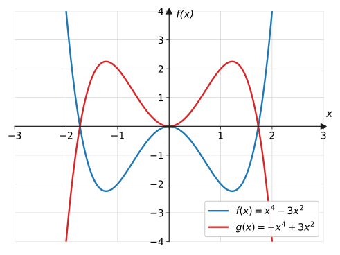
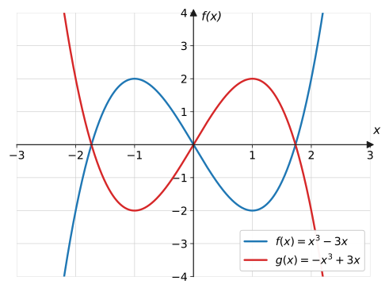
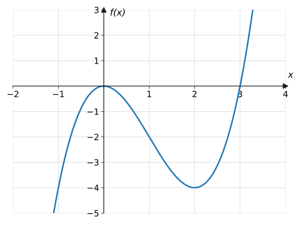
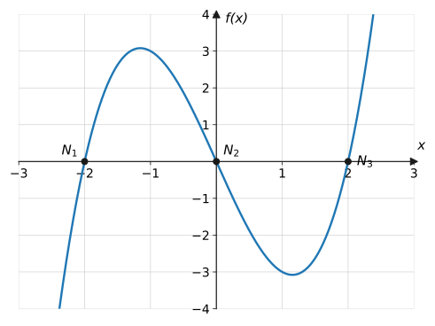

import Quiz from '../../../components/Quiz.astro';

## Worum geht's?

Nach der Einnahme einer Tablette steigt die Wirkstoffkonzentration im Blut
zunächst an, erreicht ein Maximum und wird dann wieder abgebaut. Solche
Verläufe mit „Bergen und Tälern“ kann keine Gerade und keine einzelne
Parabel beschreiben – wohl aber Summen von Potenzfunktionen.
**Leitfrage:** Was verrät der Funktionsterm einer solchen Funktion über
ihren Graphen, ganz ohne Wertetabelle?

## Erklärung

### Definition und Grad

Eine **ganzrationale Funktion** (ein **Polynom**) ist eine Summe von
Potenzfunktionen mit natürlichen Exponenten:

$$
f(x) = a_n x^n + a_{n-1} x^{n-1} + \dots + a_1 x + a_0
$$

- Die Zahlen $a_n, \dots, a_0$ heißen **Koeffizienten**.
- Der höchste Exponent $n$ (mit $a_n \neq 0$) ist der **Grad**.
- $a_n x^n$ heißt **Leitterm**, $a_0$ ist das **Absolutglied**.

Beispiel: $f(x) = -2x^4 + 3x^3 - x + 5$ hat Grad 4, Leitterm $-2x^4$ und
Absolutglied 5. **Nicht** ganzrational sind z. B. $\sqrt{x}$,
$\frac{1}{x}$ und $2^x$.

Direkt ablesbar: Der Graph schneidet die $y$-Achse bei
$f(0) = a_0$.

### Randverhalten (Globalverlauf)

Für betragsgroße $x$ dominiert der **Leitterm** – alle anderen Summanden
fallen nicht mehr ins Gewicht. Deshalb bestimmen nur $a_n$ und $n$, wie
der Graph „hereinkommt und hinausgeht“:

| | $a_n > 0$ | $a_n < 0$ |
| --- | --- | --- |
| **$n$ gerade** | von $+\infty$ nach $+\infty$ | von $-\infty$ nach $-\infty$ |
| **$n$ ungerade** | von $-\infty$ nach $+\infty$ | von $+\infty$ nach $-\infty$ |

Kurzschreibweise: $\ x \to +\infty:\ f(x) \to +\infty$ (usw.). Die
Mathematik hat dafür auch eine eigene Notation, den **Grenzwert**
(lateinisch *limes* = Grenze):

$$
\lim_{x \to +\infty} f(x) = +\infty
$$

gelesen: „der Grenzwert von $f(x)$ für $x$ gegen plus unendlich ist plus
unendlich“. Beide Schreibweisen bedeuten dasselbe – die
$\lim$-Schreibweise begegnet dir wieder bei den [gebrochenrationalen
Funktionen](../../funktionen/gebrochenrationale/#verhalten-im-unendlichen-waagerechte-asymptoten)
(dort mit endlichen Grenzwerten) und bei der
[h-Methode](../../differentialrechnung/ableitung-h-methode/) der
Differentialrechnung.

### Symmetrie

Am Term sofort erkennbar (Symmetrie zur $y$-Achse bzw. zum Ursprung):

- **Nur gerade** Exponenten (Absolutglied zählt als $x^0$) →
  **achsensymmetrisch** zur $y$-Achse: $f(-x) = f(x)$
- **Nur ungerade** Exponenten → **punktsymmetrisch** zum Ursprung:
  $f(-x) = -f(x)$
- **Gemischte** Exponenten → weder achsen- noch punktsymmetrisch (zu
  $y$-Achse/Ursprung)

### Nullstellen: höchstens n Stück

Eine ganzrationale Funktion vom Grad $n$ hat **höchstens $n$
Nullstellen**. Ist der Grad ungerade, gibt es wegen des Randverhaltens
(von $-\infty$ nach $+\infty$ oder umgekehrt) **mindestens eine**.

## Beispiele

**Beispiel 1:** $f(x) = -2x^4 + 3x^3 - x + 5$. Bestimme Grad,
Koeffizienten, $y$-Achsenabschnitt und Randverhalten.

Lösung

**Grad:** höchster Exponent → $n = 4$.

**Koeffizienten:** $a_4 = -2$, $a_3 = 3$, $a_2 = 0$ (kein
$x^2$-Summand!), $a_1 = -1$, $a_0 = 5$.

**$y$-Achsenabschnitt:** $f(0) = a_0 = 5$, also Punkt $(0 \mid 5)$.

**Randverhalten:** Es zählt nur der Leitterm $-2x^4$: Grad gerade,
$a_4 < 0$, also

$$
x \to \pm\infty:\quad f(x) \to -\infty
$$

Der Graph kommt von unten links und verschwindet nach unten rechts.

**Beispiel 2:** Untersuche auf Symmetrie:
a) $f(x) = x^4 - 3x^2$  b) $g(x) = 2x^3 - 4x$  c) $h(x) = x^3 - 3x^2$

Lösung

a) Nur gerade Exponenten (4 und 2) → achsensymmetrisch. Nachweis:

$$
f(-x) = (-x)^4 - 3(-x)^2 = x^4 - 3x^2 = f(x) \ \checkmark
$$

b) Nur ungerade Exponenten (3 und 1) → punktsymmetrisch. Nachweis:

$$
g(-x) = 2(-x)^3 - 4(-x) = -2x^3 + 4x = -g(x) \ \checkmark
$$

c) Gemischte Exponenten (3 und 2) → keine der beiden Symmetrien.
Gegenbeispiel: $h(1) = 1 - 3 = -2$, aber $h(-1) = -1 - 3 = -4$.
Es gilt weder $h(-1) = h(1)$ noch $h(-1) = -h(1)$.

**Beispiel 3:** Die Wirkstoffkonzentration aus dem Einstieg ist
$K(t) = 0{,}1t(t - 12)^2$ für $0 \leq t \leq 12$ ($t$ in Stunden, $K$ in
mg/l).
a) Zeige, dass $K$ ganzrational vom Grad 3 ist.
b) Berechne die Konzentration nach 2 Stunden.
c) Was bedeuten $K(0) = 0$ und $K(12) = 0$ im Sachzusammenhang?

Lösung

a) Ausmultiplizieren:

$$
\begin{aligned}
K(t) &= 0{,}1t \cdot (t^2 - 24t + 144) &&\text{| 2. binomische Formel} \\
&= 0{,}1t^3 - 2{,}4t^2 + 14{,}4t
\end{aligned}
$$

Eine Summe von Potenzen mit natürlichen Exponenten, höchster Exponent 3 →
ganzrational vom **Grad 3**.

b)

$$
K(2) = 0{,}1 \cdot 2 \cdot (2 - 12)^2 = 0{,}2 \cdot 100 = 20
$$

Nach 2 Stunden beträgt die Konzentration **20 mg/l**.

c) $K(0) = 0$: Bei der Einnahme ist noch kein Wirkstoff im Blut.
$K(12) = 0$: Nach 12 Stunden ist der Wirkstoff vollständig abgebaut –
danach ist das Modell (und die Wirkung) zu Ende.

## Aufgaben

Aufgabe 1 ⭐

$f(x) = 3x^5 - x^2 + 7$. Gib Grad, alle Koeffizienten
und das Absolutglied an.

Lösung zu Aufgabe 1

Grad 5. Koeffizienten: $a_5 = 3$, $a_4 = a_3 = 0$, $a_2 = -1$,
$a_1 = 0$, $a_0 = 7$ (Absolutglied).

Aufgabe 2 ⭐

Welche Funktionen sind ganzrational?
a) $f(x) = x^3 - 2x$  b) $g(x) = \sqrt{x}$  c) $h(x) = \frac{1}{x}$
d) $k(x) = 5$  e) $m(x) = 2^x$

Lösung zu Aufgabe 2

Ganzrational sind **a)** (Grad 3) und **d)** (konstante Funktion, Grad 0).

b) $\sqrt{x} = x^{1/2}$: Exponent nicht natürlich.
c) $\frac{1}{x} = x^{-1}$: Exponent negativ.
e) $2^x$: $x$ steht im Exponenten – Exponentialfunktion.

Aufgabe 3 ⭐

Gib den $y$-Achsenabschnitt an:
a) $f(x) = x^3 - 4x + 2$  b) $g(x) = -x^4 + 3x$

Lösung zu Aufgabe 3

a) $f(0) = 2$ → $(0 \mid 2)$

b) $g(0) = 0$ → der Graph läuft durch den Ursprung.

Aufgabe 4 ⭐

Gib das Randverhalten an:
a) $y = x^3$  b) $y = -2x^3$  c) $y = x^4$  d) $y = -0{,}5x^6$

Lösung zu Aufgabe 4

a) $x \to -\infty: y \to -\infty$; $\ x \to +\infty: y \to +\infty$

b) umgekehrt (Minus spiegelt): von $+\infty$ nach $-\infty$

c) beidseitig $y \to +\infty$

d) beidseitig $y \to -\infty$

Aufgabe 5 ⭐

Entscheide am Term über die Symmetrie:
a) $x^4 - 2x^2$  b) $x^5 - x$  c) $x^4 + x^3$  d) $-3x^6 + x^2 - 1$

Lösung zu Aufgabe 5

a) nur gerade Exponenten → achsensymmetrisch

b) nur ungerade → punktsymmetrisch

c) gemischt → keine (der beiden) Symmetrien

d) nur gerade (auch $-1 = -1 \cdot x^0$) → achsensymmetrisch

Aufgabe 6 ⭐⭐

$f(x) = -0{,}5x^4 + 3x^3 - 7$.
a) Gib das Randverhalten an.
b) Begründe mit dem Zahlenbeispiel $x = 100$, warum dabei nur der
Leitterm zählt.

Lösung zu Aufgabe 6

a) Leitterm $-0{,}5x^4$: Grad gerade, Koeffizient negativ →
$f(x) \to -\infty$ für $x \to \pm\infty$.

b) Bei $x = 100$:

$$
-0{,}5 \cdot 100^4 = -50\,000\,000, \qquad 3 \cdot 100^3 = 3\,000\,000
$$

Der Leitterm ist mehr als 16-mal so groß wie der nächste Summand – und
der Vorsprung wächst mit jedem weiteren $x$. Die $-7$ ist völlig
bedeutungslos.

Aufgabe 7 ⭐⭐

Weise die Symmetrie von $f(x) = x^4 - 3x^2$ rechnerisch
nach.

Lösung zu Aufgabe 7

$$
f(-x) = (-x)^4 - 3(-x)^2 = x^4 - 3x^2 = f(x)
$$

$f(-x) = f(x)$ für alle $x$ → achsensymmetrisch zur $y$-Achse. ∎

Aufgabe 8 ⭐⭐

Weise nach, dass $g(x) = 2x^3 - 4x$ punktsymmetrisch
zum Ursprung ist.

Lösung zu Aufgabe 8

$$
g(-x) = 2(-x)^3 - 4(-x) = -2x^3 + 4x = -\left(2x^3 - 4x\right) = -g(x)
$$

$g(-x) = -g(x)$ für alle $x$ → punktsymmetrisch zum Ursprung. ∎

Aufgabe 9 ⭐⭐

Zeige mit konkreten Zahlen, dass $h(x) = x^3 - 3x^2$
weder achsen- noch punktsymmetrisch ist.

Lösung zu Aufgabe 9

Vergleiche $h(1)$ und $h(-1)$:

$$
h(1) = 1 - 3 = -2, \qquad h(-1) = -1 - 3 = -4
$$

Achsensymmetrie bräuchte $h(-1) = h(1)$: $-4 \neq -2$ ✗
Punktsymmetrie bräuchte $h(-1) = -h(1) = 2$: $-4 \neq 2$ ✗

Ein einziges Gegenbeispiel genügt zum Widerlegen.

Aufgabe 10 ⭐⭐

Wie viele Nullstellen kann eine ganzrationale Funktion
höchstens bzw. muss sie mindestens haben, wenn ihr Grad a) 3, b) 4 ist?

Lösung zu Aufgabe 10

a) Grad 3: **höchstens 3**, **mindestens 1** – der Graph läuft von
$-\infty$ nach $+\infty$ (oder umgekehrt) und muss die $x$-Achse dabei
überqueren.

b) Grad 4: **höchstens 4**, **mindestens 0** – der Graph kann komplett
oberhalb (oder unterhalb) der Achse bleiben, z. B. $y = x^4 + 1$.

Aufgabe 11 ⭐⭐

In den beiden Randverhalten-Graphen der Erklärung sind
je zwei Kurven zu sehen. Ordne die vier Terme $x^4 - 3x^2$,
$-x^4 + 3x^2$, $x^3 - 3x$ und $-x^3 + 3x$ nur anhand des Randverhaltens zu.

Lösung zu Aufgabe 11

- beidseitig nach oben ($+\infty$/$+\infty$): $x^4 - 3x^2$ (gerade,
  $a_n > 0$)
- beidseitig nach unten: $-x^4 + 3x^2$
- von unten links nach oben rechts: $x^3 - 3x$ (ungerade, $a_n > 0$)
- von oben links nach unten rechts: $-x^3 + 3x$

Aufgabe 12 ⭐⭐

Berechne die Nullstellen von $f(x) = x^3 - 4x$ durch
Ausklammern und vergleiche mit dem Graphen der Erklärung.

Lösung zu Aufgabe 12

$$
\begin{aligned}
x^3 - 4x &= 0 &&\text{| } x \text{ ausklammern} \\
x(x^2 - 4) &= 0 &&\text{| 3. binomische Formel} \\
x(x + 2)(x - 2) &= 0
\end{aligned}
$$

$x_1 = 0$, $x_2 = -2$, $x_3 = 2$ – genau die drei markierten Punkte
$N_1$, $N_2$, $N_3$. ✓

Aufgabe 13 ⭐⭐

Liegt der Punkt auf dem Graphen von
$f(x) = x^3 - 4x + 1$? a) $P(2 \mid 1)$  b) $Q(-1 \mid 3)$

Lösung zu Aufgabe 13

a) $f(2) = 8 - 8 + 1 = 1$ ✓ → $P$ liegt auf dem Graphen.

b) $f(-1) = -1 + 4 + 1 = 4 \neq 3$ → $Q$ liegt nicht auf dem Graphen.

Aufgabe 14 ⭐⭐⭐

Zur Wirkstofffunktion $K(t) = 0{,}1t(t - 12)^2$ auf
$[0;\ 12]$:
a) Berechne $K(6)$.
b) Bestimme alle Nullstellen von $K$ und deute sie im Sachzusammenhang.
c) Warum ist $[0;\ 12]$ ein sinnvoller Definitionsbereich – was würde das
Modell für $t > 12$ behaupten?

Lösung zu Aufgabe 14

a) $K(6) = 0{,}1 \cdot 6 \cdot (-6)^2 = 0{,}6 \cdot 36 = 21{,}6$ mg/l.

b) Produktform nutzen: $K(t) = 0$ bei $t = 0$ und $t = 12$ (die Klammer
$(t-12)^2$ liefert die 12 „doppelt“). Deutung: kein Wirkstoff bei der
Einnahme, vollständiger Abbau nach 12 Stunden. Der Graph **berührt** die
$t$-Achse bei 12 nur – typisch für doppelte Nullstellen.

c) Für $t > 12$ würde $K$ wieder wachsen (Randverhalten Grad 3,
$a_3 > 0$) – der Körper würde von selbst Wirkstoff „erzeugen“. Das ist
unsinnig, das Modell gilt nur bis zum vollständigen Abbau.

Aufgabe 15 ⭐⭐⭐

Bestimme $a$ so, dass der Graph von
$f(x) = ax^4 - 2x^2 + 1$ durch den Punkt $P(2 \mid 1)$ verläuft.

Lösung zu Aufgabe 15

$P$ einsetzen:

$$
\begin{aligned}
a \cdot 2^4 - 2 \cdot 2^2 + 1 &= 1 \\
16a - 8 + 1 &= 1 &&\text{| } +7 \\
16a &= 8 &&\text{| } :16 \\
a &= \frac{1}{2}
\end{aligned}
$$

Also $f(x) = 0{,}5x^4 - 2x^2 + 1$.

Aufgabe 16 ⭐⭐⭐

Begründe ohne Rechnung: Jede ganzrationale Funktion
**ungeraden** Grades hat mindestens eine Nullstelle.

Lösung zu Aufgabe 16

Bei ungeradem Grad zeigt das Randverhalten in **entgegengesetzte**
Richtungen: Der Graph kommt (etwa für $a_n > 0$) von $-\infty$ und läuft
nach $+\infty$. Da ganzrationale Funktionen keine Sprünge oder Lücken
haben, muss der Graph auf dem Weg von negativen zu positiven Werten die
$x$-Achse **mindestens einmal** überqueren – dort liegt eine Nullstelle. ∎

(Bei geradem Grad zeigen beide Enden in dieselbe Richtung – der Graph
kann über der Achse bleiben, z. B. $y = x^2 + 1$.)

## Merksatz

Merksatz anzeigen

Bei $f(x) = a_n x^n + \dots + a_1 x + a_0$ verraten drei Blicke auf den
Term schon viel über den Graphen: **Leitterm** $a_n x^n$ → Randverhalten
(gerade/ungerade, $a_n$ positiv/negativ); **Exponenten** → Symmetrie (nur
gerade → Achsensymmetrie, nur ungerade → Punktsymmetrie); **Absolutglied**
$a_0$ → $y$-Achsenabschnitt. Grad $n$ → höchstens $n$ Nullstellen.

## Vertiefung

:::caution
„Keine Symmetrie erkennbar“ heißt genau: nicht symmetrisch **zur
$y$-Achse oder zum Ursprung**. Der Graph von $h(x) = x^3 - 3x^2$ ist
durchaus symmetrisch – aber zu seinem Wendepunkt, nicht zu den
Koordinatenachsen. Der Termcheck (nur gerade / nur ungerade Exponenten)
prüft nur die beiden Standardfälle.
:::

**Doppelte Nullstellen** wie bei $K(t) = 0{,}1t(t-12)^2$ sind kein
Zufallseffekt: Ob ein Graph die $x$-Achse schneidet oder nur berührt,
hängt von der **Vielfachheit** der Nullstelle ab – das Thema der Seite
[Linearfaktorzerlegung](../linearfaktorzerlegung/).

**Ausblick:** Wie man die Nullstellen ganzrationaler Funktionen
systematisch **berechnet** (Ausklammern, Substitution, Polynomdivision,
Horner-Schema), zeigt die nächste Seite: [Nullstellen
bestimmen](../nullstellen/).

## Quiz

Zum Abschluss: Klicke bei jeder Frage eine Antwort an – die Auswertung kommt sofort.

<Quiz fragen={[
  { frage: 'Welchen Grad hat f(x) = −2x⁴ + x − 7?',
    antworten: ['−2', '4', '3', '7'],
    richtig: 1, erklaerung: 'Der Grad ist der höchste Exponent: 4. Der Koeffizient −2 ändert daran nichts.' },
  { frage: 'Welches Randverhalten hat f(x) = −2x⁴ + x − 7?',
    antworten: ['Beide Enden nach +∞', 'Beide Enden nach −∞', 'Von −∞ nach +∞', 'Von +∞ nach −∞'],
    richtig: 1, erklaerung: 'Es zählt nur der Leitterm −2x⁴: gerader Grad, negativer Koeffizient – beide Enden laufen nach unten.' },
  { frage: 'Ein Term enthält nur ungerade Exponenten. Welche Symmetrie hat der Graph?',
    antworten: ['Achsensymmetrisch zur y-Achse', 'Punktsymmetrisch zum Ursprung', 'Symmetrisch zur x-Achse', 'Keine Aussage möglich'],
    richtig: 1, erklaerung: 'Nur ungerade Exponenten bedeutet f(−x) = −f(x) – Punktsymmetrie zum Ursprung.' },
  { frage: 'Wo schneidet f(x) = x³ − 4x + 2 die y-Achse?',
    antworten: ['Bei 0', 'Bei −4', 'Bei 2', 'Bei 3'],
    richtig: 2, erklaerung: 'f(0) = Absolutglied = 2, also im Punkt (0|2).' },
  { frage: 'Wie viele Nullstellen hat eine ganzrationale Funktion dritten Grades mindestens?',
    antworten: ['Keine', 'Genau drei', 'Eine', 'Zwei'],
    richtig: 2, erklaerung: 'Ungerader Grad: Der Graph läuft von −∞ nach +∞ (oder umgekehrt) und muss die x-Achse mindestens einmal kreuzen.' },
  { frage: 'Welche Funktion ist ganzrational?',
    antworten: ['f(x) = √x', 'f(x) = 1/x', 'f(x) = x³ − 2x', 'f(x) = 2ˣ'],
    richtig: 2, erklaerung: 'Ganzrational = Summe von Potenzen mit natürlichen Exponenten. Wurzel (x^½), Bruch (x⁻¹) und Exponentialterm fallen raus.' },
]} />
