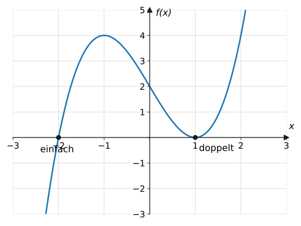
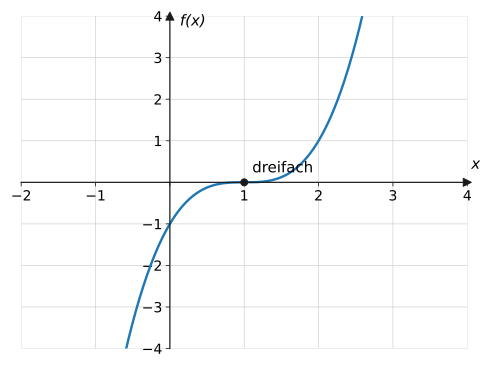
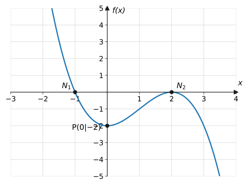

import Quiz from '../../../components/Quiz.astro';

## Worum geht's?

Warum schneidet ein Graph die $x$-Achse an einer Nullstelle manchmal glatt,
berührt sie woanders aber nur wie eine aufgesetzte Parabel? Die Antwort
steckt in der Produktdarstellung des Funktionsterms. **Leitfrage:** Wie
zerlegt man einen Funktionsterm vollständig in **Linearfaktoren** – und
was verrät die **Vielfachheit** jeder Nullstelle über den Graphen?

## Erklärung

### Die Linearfaktorzerlegung

Kennt man alle Nullstellen $x_1, x_2, \dots$ einer ganzrationalen
Funktion, lässt sich der Term als Produkt von **Linearfaktoren**
$(x - x_i)$ schreiben:

$$
f(x) = a_n \cdot (x - x_1) \cdot (x - x_2) \cdot \ldots
$$

Der Vorfaktor $a_n$ ist der **Leitkoeffizient** – ihn zu vergessen ist
der Klassiker (z. B. $2x^2 - 8x + 6 = 2(x-1)(x-3)$, nicht
$(x-1)(x-3)$!).

Beide Leserichtungen sind nützlich:

- **Faktoren → Nullstellen:** ablesen, Vorzeichen umdrehen:
  $(x - 3) \Rightarrow x = 3$, $\ (x + 2) = (x - (-2)) \Rightarrow x = -2$
- **Nullstellen → Faktoren:** Term rekonstruieren (→ Beispiel 3)

Nicht jede Funktion zerfällt vollständig: Ein quadratischer Faktor ohne
Nullstellen (z. B. $x^2 + 1$) bleibt als „unzerlegbarer Rest“ stehen.

Verständnisfrage: $(x-1)(x-3)$ und $2(x-1)(x-3)$ haben dieselben Nullstellen – warum sind es trotzdem verschiedene Funktionen?

Die Nullstellen legen nur fest, **wo** der Graph die $x$-Achse trifft –
nicht, wie hoch er dazwischen und außerhalb läuft. Ausmultiplizieren
zeigt es: $x^2 - 4x + 3$ gegenüber $2x^2 - 8x + 6$; schon die
$y$-Achsenabschnitte 3 und 6 unterscheiden sich. Der Leitkoeffizient
gehört deshalb immer mit in die Zerlegung.

### Vielfachheit von Nullstellen

Taucht ein Linearfaktor mehrfach auf, heißt der Exponent
**Vielfachheit** der Nullstelle. Sie bestimmt, wie der Graph die
$x$-Achse trifft:

| Vielfachheit | Verhalten des Graphen |
| --- | --- |
| 1 (einfach) | schneidet die Achse (Vorzeichenwechsel) |
| 2, 4, … (gerade) | **berührt** die Achse (kein Vorzeichenwechsel) |
| 3, 5, … (ungerade $\geq 3$) | schneidet mit **Sattel** (flacher Durchgang) |

Merkhilfe: **gerade Vielfachheit = kein Seitenwechsel** (wie bei $x^2$
am Ursprung), ungerade = Seitenwechsel.

Verständnisfrage: Woran erkennst du am <em>Graphen</em>, welche Vielfachheit eine Nullstelle hat?

Am Verhalten an der Achse: **Steiles Durchqueren** → einfache Nullstelle.
**Berühren und Umkehren** (wie ein Parabelscheitel auf der Achse) →
gerade Vielfachheit. **Flacher Sattel-Durchgang** (wie $x^3$ im Ursprung)
→ ungerade Vielfachheit ab 3. Die exakte Zahl (2 oder 4?) sieht man dem
Bild allerdings nicht an – nur gerade/ungerade.

### Graphen skizzieren ohne Wertetabelle

Aus der Produktform liest man in Sekunden ab: Nullstellen samt
Verhalten (Vielfachheit), Randverhalten (Grad = Summe der
Vielfachheiten, Vorzeichen von $a_n$) und den $y$-Achsenabschnitt
($x = 0$ einsetzen). Das reicht für eine qualitative Skizze.

Verständnisfrage: $f(x) = (x+2)(x-1)^2$ – warum weißt du ohne Rechnung, dass der Graph „von unten links nach oben rechts“ läuft?

Der Grad ist die Summe der Vielfachheiten: $1 + 2 = 3$, also ungerade.
Der Leitkoeffizient ist $1 > 0$ (vor den Klammern steht nichts). Ungerader
Grad + positiver Leitkoeffizient bedeutet: von $-\infty$ nach $+\infty$.
Zusammen mit den Nullstellen $-2$ (schneiden) und $1$ (berühren) steht
die Skizze.

## Beispiele

**Beispiel 1:** Zerlege $f(x) = x^3 - 3x + 2$ vollständig in
Linearfaktoren.

Lösung

Erst die Nullstellen (Methoden der [Nullstellen-Seite](../nullstellen/)):
Kandidaten sind die Teiler von 2. $f(1) = 1 - 3 + 2 = 0$ → $x_1 = 1$.

Horner-Schema (Koeffizienten $1,\ 0,\ -3,\ 2$):

| | $1$ | $0$ | $-3$ | $2$ |
| --- | --- | --- | --- | --- |
| $x_0 = 1$ | | $1$ | $1$ | $-2$ |
| | $1$ | $1$ | $-2$ | $\mathbf{0}$ |

Quotient $x^2 + x - 2 = 0$ → $x = -\frac{1}{2} \pm \frac{3}{2}$ →
$x_2 = 1$, $x_3 = -2$.

Die 1 ist also **doppelte** Nullstelle:

$$
f(x) = (x - 1)^2 (x + 2)
$$

(Der Graph in der Erklärung zeigt genau das: Berühren bei 1, Schneiden
bei $-2$.)

**Beispiel 2:** $f(x) = -2(x + 3)(x - 1)^2(x - 4)$. Beschreibe den
Graphen ohne Wertetabelle: Nullstellen mit Verhalten, Grad,
Randverhalten und $y$-Achsenabschnitt.

Lösung

**Nullstellen:** $x = -3$ (einfach → schneidet), $x = 1$ (doppelt →
berührt), $x = 4$ (einfach → schneidet).

**Grad:** Summe der Vielfachheiten $1 + 2 + 1 = 4$.

**Randverhalten:** Leitterm $-2x^4$ (Grad gerade, Koeffizient negativ):

$$
x \to \pm\infty:\quad f(x) \to -\infty
$$

**$y$-Achsenabschnitt:**

$$
f(0) = -2 \cdot 3 \cdot (-1)^2 \cdot (-4) = 24
$$

Skizze im Kopf: von unten links hoch, Schnitt bei $-3$, über
$(0 \mid 24)$, herunter zum Berührpunkt bei $1$, wieder hoch, Schnitt
bei $4$, dann nach unten rechts.

**Beispiel 3:** Bestimme den Funktionsterm zum abgebildeten Graphen
(Grad 3):

Lösung

**Nullstellen ablesen:** Bei $x = -1$ schneidet der Graph (einfach), bei
$x = 2$ berührt er (doppelt). Ansatz mit unbekanntem Vorfaktor:

$$
f(x) = a\,(x + 1)(x - 2)^2
$$

**$a$ bestimmen** über den markierten Punkt $P(0 \mid -2)$:

$$
\begin{aligned}
f(0) = a \cdot 1 \cdot (-2)^2 &= -2 \\
4a &= -2 &&\text{| } :4 \\
a &= -\frac{1}{2}
\end{aligned}
$$

$$
f(x) = -\frac{1}{2}(x + 1)(x - 2)^2
$$

(Plausibel: $a < 0$ passt zum Randverhalten von oben links nach unten
rechts.)

## Aufgaben

Aufgabe 1 ⭐

$f(x) = (x - 3)(x + 1)(x - 5)$. Gib alle Nullstellen und
den Grad an.

Lösung zu Aufgabe 1

Nullstellen: $3$, $-1$, $5$ (Vorzeichen in den Klammern umdrehen).
Grad: 3 Linearfaktoren → Grad 3.

Aufgabe 2 ⭐

$f(x) = (x + 2)^2(x - 1)$. Gib die Nullstellen mit ihren
Vielfachheiten an.

Lösung zu Aufgabe 2

$x = -2$: Vielfachheit 2 (doppelt), $\ x = 1$: Vielfachheit 1 (einfach).

Aufgabe 3 ⭐

Eine Funktion vom Grad 2 mit Leitkoeffizient 1 hat die
Nullstellen $2$ und $-4$. Gib die Linearfaktorzerlegung an und
multipliziere aus.

Lösung zu Aufgabe 3

$$
f(x) = (x - 2)(x + 4) = x^2 + 4x - 2x - 8 = x^2 + 2x - 8
$$

Aufgabe 4 ⭐

Schneidet, berührt oder Sattel? Entscheide an der
Vielfachheit: a) $(x - 3)^2$  b) $(x + 1)^3$  c) $(x - 2)$

Lösung zu Aufgabe 4

a) Vielfachheit 2 (gerade) → **berührt**

b) Vielfachheit 3 (ungerade $\geq 3$) → schneidet mit **Sattel**

c) Vielfachheit 1 → **schneidet** normal

Aufgabe 5 ⭐⭐

Zerlege $f(x) = x^2 - x - 12$ in Linearfaktoren.

Lösung zu Aufgabe 5

Nullstellen mit pq-Formel:

$$
x_{1,2} = \frac{1}{2} \pm \sqrt{\frac{1}{4} + 12} = \frac{1}{2} \pm \frac{7}{2}
$$

$x_1 = 4$, $x_2 = -3$, also

$$
f(x) = (x - 4)(x + 3)
$$

Aufgabe 6 ⭐⭐

Zerlege $f(x) = x^3 - 9x$ in Linearfaktoren.

Lösung zu Aufgabe 6

$$
x^3 - 9x = x\left(x^2 - 9\right) = x(x + 3)(x - 3)
$$

(Der Faktor $x$ ist der Linearfaktor zur Nullstelle 0.)

Aufgabe 7 ⭐⭐

Zerlege $f(x) = x^3 - 6x^2 + 9x$ und gib das Verhalten
des Graphen an den Nullstellen an.

Lösung zu Aufgabe 7

$$
x^3 - 6x^2 + 9x = x\left(x^2 - 6x + 9\right) = x(x - 3)^2
$$

$x = 0$ einfach → schneidet; $x = 3$ doppelt → berührt.

Aufgabe 8 ⭐⭐

Zerlege $f(x) = 2x^2 - 8x + 6$ in Linearfaktoren.
(Achtung, Leitkoeffizient!)

Lösung zu Aufgabe 8

Erst 2 ausklammern, dann Nullstellen der Klammer:

$$
2x^2 - 8x + 6 = 2\left(x^2 - 4x + 3\right)
$$

$x^2 - 4x + 3 = 0$ → $x = 2 \pm 1$ → $x_1 = 3$, $x_2 = 1$:

$$
f(x) = 2(x - 1)(x - 3)
$$

Kontrolle durch Ausmultiplizieren: $2(x^2 - 4x + 3) = 2x^2 - 8x + 6$ ✓

Aufgabe 9 ⭐⭐

Zerlege $f(x) = x^3 - 12x + 16$ vollständig.

Lösung zu Aufgabe 9

Kandidaten (Teiler von 16): $f(2) = 8 - 24 + 16 = 0$ → $x_1 = 2$.

Horner (Koeffizienten $1,\ 0,\ -12,\ 16$):

| | $1$ | $0$ | $-12$ | $16$ |
| --- | --- | --- | --- | --- |
| $x_0 = 2$ | | $2$ | $4$ | $-16$ |
| | $1$ | $2$ | $-8$ | $\mathbf{0}$ |

Quotient $x^2 + 2x - 8 = 0$ → $x = -1 \pm 3$ → $x_2 = 2$, $x_3 = -4$.

Die 2 ist doppelt:

$$
f(x) = (x - 2)^2(x + 4)
$$

Aufgabe 10 ⭐⭐

Beschreibe den Graphen von $f(x) = (x + 1)^2(x - 3)$
ohne zu zeichnen: Nullstellenverhalten, Randverhalten,
$y$-Achsenabschnitt.

Lösung zu Aufgabe 10

- $x = -1$ doppelt → Graph **berührt** die Achse
- $x = 3$ einfach → Graph **schneidet**
- Grad $2 + 1 = 3$, Leitkoeffizient $1 > 0$ → von $-\infty$ nach
  $+\infty$
- $f(0) = 1 \cdot (-3) = -3$ → Punkt $(0 \mid -3)$

Verlauf: von unten links hoch zum Berührpunkt $(-1 \mid 0)$, hinunter
durch $(0 \mid -3)$, dann hoch durch $(3 \mid 0)$ nach oben rechts.

Aufgabe 11 ⭐⭐

Gib einen Funktionsterm an: Grad 3, doppelte
Nullstelle bei $-2$, einfache Nullstelle bei $3$, Graph verläuft durch
$(0 \mid -6)$.

Lösung zu Aufgabe 11

Ansatz $f(x) = a(x + 2)^2(x - 3)$. Punkt einsetzen:

$$
\begin{aligned}
f(0) = a \cdot 4 \cdot (-3) &= -6 \\
-12a &= -6 &&\text{| } :(-12) \\
a &= \frac{1}{2}
\end{aligned}
$$

$$
f(x) = \frac{1}{2}(x + 2)^2(x - 3)
$$

Aufgabe 12 ⭐⭐

Begründe, warum sich $f(x) = x^2 + 1$ nicht in
Linearfaktoren zerlegen lässt.

Lösung zu Aufgabe 12

Jeder Linearfaktor $(x - x_0)$ gehört zu einer Nullstelle $x_0$. Aber
$x^2 + 1 \geq 1$ für alle $x$ – die Funktion hat **keine** reellen
Nullstellen, also gibt es keine Linearfaktoren. Solche quadratischen
Terme bleiben in Zerlegungen als Rest stehen.

Aufgabe 13 ⭐⭐

$f(x) = 3(x - 1)(x + 2)^2(x - 5)^3$.
a) Gib Nullstellen mit Vielfachheiten und den Grad an.
b) Gib das Randverhalten an.

Lösung zu Aufgabe 13

a) $x = 1$ einfach, $x = -2$ doppelt, $x = 5$ dreifach.
Grad $= 1 + 2 + 3 = 6$.

b) Leitterm $3x^6$: Grad gerade, Koeffizient positiv →
$f(x) \to +\infty$ für $x \to \pm\infty$.

Aufgabe 14 ⭐⭐⭐

Zerlege $f(x) = x^4 - 5x^2 + 4$ vollständig in
Linearfaktoren.

Lösung zu Aufgabe 14

Substitution $z = x^2$: $\ z^2 - 5z + 4 = 0$ → $z_1 = 4$, $z_2 = 1$
→ Nullstellen $\pm 2, \pm 1$ (alle einfach). Also:

$$
f(x) = (x - 1)(x + 1)(x - 2)(x + 2)
$$

(Eleganter Zwischenschritt: $x^4 - 5x^2 + 4 = (x^2 - 1)(x^2 - 4)$, dann
zweimal dritte binomische Formel.)

Aufgabe 15 ⭐⭐⭐

$f(x) = x^4 - 2x^3 - 3x^2$. Zerlege in
Linearfaktoren und beschreibe den Verlauf des Graphen entlang der
$x$-Achse.

Lösung zu Aufgabe 15

$$
x^4 - 2x^3 - 3x^2 = x^2\left(x^2 - 2x - 3\right) = x^2(x + 1)(x - 3)
$$

Nullstellen: $-1$ (einfach, schneidet), $0$ (doppelt, **berührt**),
$3$ (einfach, schneidet). Grad 4, $a_4 = 1 > 0$: von oben links – Schnitt
bei $-1$ – Berührpunkt im Ursprung – Schnitt bei $3$ – nach oben rechts.

Aufgabe 16 ⭐⭐⭐

Eine ganzrationale Funktion vom Grad 4 ist
achsensymmetrisch zur $y$-Achse, hat die Nullstellen $1$ und $3$ und den
$y$-Achsenabschnitt $9$. Bestimme den Funktionsterm.

Lösung zu Aufgabe 16

Achsensymmetrie: Zu jeder Nullstelle gehört ihr Spiegelbild – also sind
auch $-1$ und $-3$ Nullstellen. Das sind bereits 4 Stück (= Grad):

$$
f(x) = a(x - 1)(x + 1)(x - 3)(x + 3)
$$

$a$ über $f(0) = 9$:

$$
f(0) = a \cdot (-1) \cdot 1 \cdot (-3) \cdot 3 = 9a = 9
\quad\Rightarrow\quad a = 1
$$

$$
f(x) = (x^2 - 1)(x^2 - 9) = x^4 - 10x^2 + 9
$$

Aufgabe 17 ⭐⭐ · Verständnisaufgabe

Wahr oder falsch? Begründe:
a) „$f(x) = (x - 4)^2$ hat die doppelte Nullstelle $x = -4$.“
b) „$f(x) = (x-1)(x+2)$ und $g(x) = 3(x-1)(x+2)$ haben dieselben
Nullstellen – also beschreiben sie dieselbe Funktion.“

Lösung zu Aufgabe 17

a) **Falsch.** Die Nullstelle ist dort, wo die Klammer null wird:
$x - 4 = 0 \Rightarrow x = 4$ (doppelt). Das Vorzeichen wird beim Ablesen
umgedreht.

b) **Falsch.** Gleiche Nullstellen heißt nur: gleiche Schnittpunkte mit
der $x$-Achse. Der Faktor 3 streckt alle übrigen Funktionswerte auf das
Dreifache – z. B. ist $f(0) = -2$, aber $g(0) = -6$. Erst Nullstellen
**plus** Leitkoeffizient legen die Funktion fest.

## Merksatz

Merksatz anzeigen

$f(x) = a_n(x - x_1)(x - x_2)\cdots$ – **Leitkoeffizient nicht
vergessen!** Die **Vielfachheit** einer Nullstelle steuert den Graphen:
einfach → schneiden, gerade → berühren, ungerade ab 3 → Sattel-Durchgang.
Aus der Produktform lassen sich Nullstellen, Grad, Randverhalten und
$y$-Achsenabschnitt ablesen – und umgekehrt aus dem Graphen der Term
rekonstruieren (Ansatz mit $a$, Punkt einsetzen).

## Vertiefung

:::caution
Beim Rekonstruieren des Terms aus Nullstellen den Ansatz **immer** mit
Vorfaktor $a$ schreiben: Durch die Nullstellen allein ist die Funktion
nicht festgelegt – erst ein zusätzlicher Punkt (oft der
$y$-Achsenabschnitt) bestimmt $a$. Und in den Klammern drehen sich die
Vorzeichen um: Nullstelle $-2$ → Faktor $(x + 2)$.
:::

**Grad vs. Anzahl Nullstellen:** Die Summe aller Vielfachheiten kann
höchstens $n$ sein. Bleibt ein nullstellenfreier quadratischer Faktor
übrig (wie $x^2 + 1$), gibt es entsprechend weniger Nullstellen.

**Ausblick:** Das „Berühren“ bei gerader Vielfachheit ist kein Zufall:
Dort liegt zugleich ein Extrempunkt auf der $x$-Achse. Warum, klärt die
[Differentialrechnung](../../differentialrechnung/aenderungsrate/) – das
nächste große Kapitel.

## Quiz

Zum Abschluss: Klicke bei jeder Frage eine Antwort an – die Auswertung kommt sofort.

<Quiz fragen={[
  { frage: 'Welche Nullstellen hat f(x) = (x + 3)(x − 5)?',
    antworten: ['3 und −5', '−3 und 5', '3 und 5', '−3 und −5'],
    richtig: 1, erklaerung: 'Vorzeichen in den Klammern umdrehen: x + 3 = 0 bei x = −3, x − 5 = 0 bei x = 5.' },
  { frage: 'Was macht der Graph an einer doppelten Nullstelle?',
    antworten: ['Er schneidet die x-Achse', 'Er berührt die x-Achse', 'Er hat dort eine Lücke', 'Er hat dort einen Sprung'],
    richtig: 1, erklaerung: 'Gerade Vielfachheit = kein Vorzeichenwechsel: Der Graph kommt zur Achse und dreht wieder um.' },
  { frage: 'Was passiert an einer dreifachen Nullstelle?',
    antworten: ['Berühren ohne Durchgang', 'Schneiden mit flachem Sattel-Durchgang', 'Normales steiles Schneiden', 'Polstelle'],
    richtig: 1, erklaerung: 'Ungerade Vielfachheit ≥ 3: Der Graph quert die Achse, aber mit waagerechter Tangente – wie bei y = x³ im Ursprung.' },
  { frage: 'Welche Zerlegung von 2x² − 8x + 6 ist richtig?',
    antworten: ['(x − 1)(x − 3)', '2(x − 1)(x − 3)', '(2x − 1)(x − 3)', '2(x + 1)(x + 3)'],
    richtig: 1, erklaerung: 'Nullstellen sind 1 und 3, aber der Leitkoeffizient 2 muss als Vorfaktor erhalten bleiben – Kontrolle durch Ausmultiplizieren.' },
  { frage: 'Welchen Grad hat f(x) = 3(x − 1)(x + 2)²?',
    antworten: ['2', '3', '4', '6'],
    richtig: 1, erklaerung: 'Die Summe der Vielfachheiten zählt: 1 + 2 = 3.' },
  { frage: 'Warum lässt sich x² + 1 nicht in Linearfaktoren zerlegen?',
    antworten: ['Weil der Grad zu klein ist', 'Weil es keine reellen Nullstellen gibt', 'Weil das Absolutglied 1 ist', 'Es geht: (x + 1)(x − 1)'],
    richtig: 1, erklaerung: 'Jeder Linearfaktor gehört zu einer Nullstelle – x² + 1 ≥ 1 hat aber keine. ((x+1)(x−1) wäre x² − 1!)' },
  { frage: 'Verständnisfrage: f und g = 3 · f haben exakt dieselben Nullstellen. Sind sie dieselbe Funktion?',
    antworten: ['Ja – Nullstellen legen eine Funktion eindeutig fest', 'Nein – die Nullstellen bestimmen den Term nur bis auf den Vorfaktor', 'Ja, falls der Grad gleich ist', 'Nein, denn g hat mehr Nullstellen'],
    richtig: 1, erklaerung: 'Der Faktor 3 lässt Punkte auf der x-Achse liegen, streckt aber alle anderen Werte. Für den vollständigen Term braucht man zusätzlich a&#8345; – etwa über einen weiteren Punkt.' },
  { frage: 'Verständnisfrage: Ein Graph berührt die x-Achse bei x = 2 und schneidet sie steil bei x = −1 und x = 3. Welche Zerlegung passt?',
    antworten: ['a(x − 2)(x + 1)(x − 3)', 'a(x − 2)²(x + 1)(x − 3)', 'a(x + 2)²(x − 1)(x + 3)', 'a(x − 2)²(x − 1)(x + 3)'],
    richtig: 1, erklaerung: 'Berühren = gerade Vielfachheit → (x − 2)². Steiles Schneiden = einfache Faktoren bei −1 und 3 → (x + 1)(x − 3).' },
]} />
