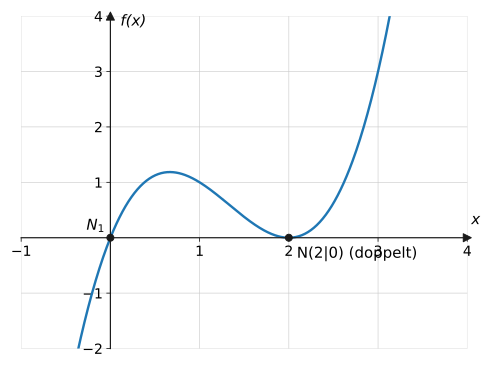
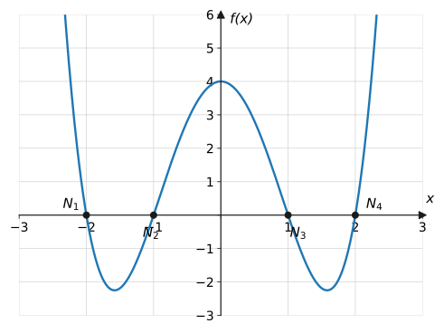
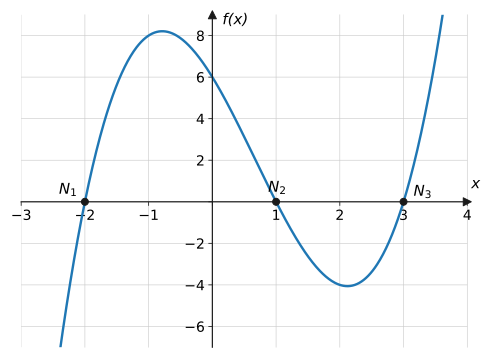

import Quiz from '../../../components/Quiz.astro';

## Worum geht's?

Wann ist der Wirkstoff vollständig abgebaut? Wann durchbricht der Graph
die Gewinnschwelle? Solche Fragen führen immer auf dieselbe Gleichung:
$f(x) = 0$. Für Geraden und Parabeln können wir das schon – aber bei
$x^3 - 2x^2 - 5x + 6 = 0$ versagt die pq-Formel. **Leitfrage:** Mit
welchen Strategien knackt man Gleichungen höheren Grades – und woran
erkennt man, welche Strategie passt?

## Erklärung

### Das Grundprinzip: Produktform anstreben

Nullstellen sind die Lösungen von $f(x) = 0$. Alle Methoden dieser Seite
verfolgen dasselbe Ziel: den Term als **Produkt** zu schreiben, denn dann
liefert der **Satz vom Nullprodukt** die Lösungen faktorweise. Ein
Polynom vom Grad $n$ hat höchstens $n$ Nullstellen (siehe
[Eigenschaften](../eigenschaften/)).

### Methode 1: Ausklammern

Kommt in **jedem Summanden** ein $x$ vor (kein Absolutglied!), wird die
kleinste Potenz ausgeklammert:

$$
\begin{aligned}
x^3 - 4x^2 + 4x &= 0 &&\text{| } x \text{ ausklammern} \\
x \left(x^2 - 4x + 4\right) &= 0 &&\text{| Klammer: pq oder Binom} \\
x (x - 2)^2 &= 0
\end{aligned}
$$

Nullstellen: $x_1 = 0$ und $x_2 = 2$ (doppelt – der Graph **berührt** die
Achse dort nur):



:::caution
Niemals durch $x$ **teilen**, um es „wegzukürzen“ – dabei geht die
Nullstelle $x = 0$ verloren! Immer ausklammern.
:::

### Methode 2: Substitution

Kommen nur $x^4$ und $x^2$ vor (**biquadratische** Gleichung), macht die
Ersetzung $z = x^2$ daraus eine quadratische Gleichung:

$$
\begin{aligned}
x^4 - 5x^2 + 4 &= 0 &&\text{| Substitution } z = x^2 \\
z^2 - 5z + 4 &= 0 &&\text{| pq-Formel} \\
z_{1,2} = \frac{5}{2} \pm \frac{3}{2} \ \Rightarrow\ z_1 &= 4,\ z_2 = 1
\end{aligned}
$$

**Rücksubstitution** (aus jedem positiven $z$ werden zwei $x$):

$$
x^2 = 4 \Rightarrow x = \pm 2, \qquad x^2 = 1 \Rightarrow x = \pm 1
$$



Negative $z$-Werte liefern **keine** $x$-Lösungen ($x^2 \geq 0$).

### Methode 3: Nullstelle raten + Polynomdivision

Hilft nichts von beidem (Absolutglied vorhanden, keine Substitution
möglich), rät man eine erste Nullstelle. Kandidaten sind die **Teiler des
Absolutglieds**. Für $f(x) = x^3 - 2x^2 - 5x + 6$ (Teiler von 6:
$\pm 1, \pm 2, \pm 3, \pm 6$):

$$
f(1) = 1 - 2 - 5 + 6 = 0 \quad\Rightarrow\quad x_1 = 1
$$

Dann wird der **Linearfaktor** $(x - 1)$ durch **Polynomdivision**
abgespalten – wie schriftliches Dividieren, nur mit $x$:

```text
  (x³ − 2x² − 5x + 6) : (x − 1) = x² − x − 6
−(x³ −  x²)
 ──────────
       −x² − 5x
     −(−x² +  x)
      ──────────
            −6x + 6
          −(−6x + 6)
           ─────────
                   0
```

Jeder Schritt: höchste Potenz vergleichen ($x^3 : x = x^2$),
zurückmultiplizieren, subtrahieren. Rest 0 bestätigt die geratene
Nullstelle. Die restlichen Nullstellen stecken im Quotienten:

$$
x^2 - x - 6 = 0 \quad\Rightarrow\quad x_{2,3} = \frac{1}{2} \pm \frac{5}{2}
\quad\Rightarrow\quad x_2 = 3,\ x_3 = -2
$$



### Methode 3b: Horner-Schema

Das **Horner-Schema** erledigt dieselbe Division als kompakte Tabelle.
Oben stehen die Koeffizienten (fehlende Potenzen als 0!), links der
Kandidat. Ablauf: erste Zahl herunterholen, dann immer „mal Kandidat,
plus nächste Spalte“. Für $f(x) = x^3 - 2x^2 - 5x + 6$ und $x_0 = 1$:

| | $1$ | $-2$ | $-5$ | $6$ |
| --- | --- | --- | --- | --- |
| $x_0 = 1$ | | $1$ | $-1$ | $-6$ |
| | $1$ | $-1$ | $-6$ | $\mathbf{0}$ |

Die letzte Zahl ist $f(1) = 0$ → Nullstelle bestätigt. Die Zahlen davor
sind die Koeffizienten des Quotienten: $x^2 - x - 6$ – dasselbe Ergebnis
wie bei der Polynomdivision, aber schneller und mit eingebauter Probe.

### Strategie-Übersicht

| Gleichungstyp | Methode |
| --- | --- |
| kein Absolutglied ($x$ überall) | Ausklammern |
| nur $x^4$ und $x^2$ (und Zahl) | Substitution $z = x^2$ |
| Produkt gegeben | direkt Satz vom Nullprodukt |
| sonst (Grad ≥ 3 mit Absolutglied) | Nullstelle raten → Polynomdivision/Horner |

## Beispiele

**Beispiel 1 (Ausklammern):** Bestimme alle Nullstellen von
$f(x) = 2x^3 - 8x$.

<details>
<summary>Lösung</summary>

Kein Absolutglied → $2x$ ausklammern:

$$
\begin{aligned}
2x^3 - 8x &= 0 \\
2x\left(x^2 - 4\right) &= 0 &&\text{| 3. binomische Formel} \\
2x(x + 2)(x - 2) &= 0 &&\text{| Nullprodukt}
\end{aligned}
$$

Nullstellen: $x_1 = 0$, $x_2 = -2$, $x_3 = 2$.

</details>

**Beispiel 2 (Substitution):** Bestimme alle Nullstellen von
$f(x) = x^4 - 5x^2 + 4$.

<details>
<summary>Lösung</summary>

Nur gerade Potenzen → Substitution $z = x^2$:

$$
\begin{aligned}
z^2 - 5z + 4 &= 0 &&\text{| pq-Formel, } p = -5,\ q = 4 \\
z_{1,2} &= \frac{5}{2} \pm \sqrt{\frac{25}{4} - 4} \\
&= \frac{5}{2} \pm \frac{3}{2}
\end{aligned}
$$

$z_1 = 4$, $z_2 = 1$. Rücksubstitution $x^2 = z$:

$$
x^2 = 4 \Rightarrow x_{1,2} = \pm 2, \qquad
x^2 = 1 \Rightarrow x_{3,4} = \pm 1
$$

Vier Nullstellen: $-2, -1, 1, 2$ (siehe Graph in der Erklärung).

</details>

**Beispiel 3 (Polynomdivision):** Bestimme alle Nullstellen von
$f(x) = x^3 - 2x^2 - 5x + 6$.

<details>
<summary>Lösung</summary>

Absolutglied 6 → Kandidaten $\pm 1, \pm 2, \pm 3, \pm 6$ testen:

$$
f(1) = 1 - 2 - 5 + 6 = 0 \quad\Rightarrow\quad x_1 = 1
$$

Polynomdivision durch $(x - 1)$:

```text
  (x³ − 2x² − 5x + 6) : (x − 1) = x² − x − 6
−(x³ −  x²)
 ──────────
       −x² − 5x
     −(−x² +  x)
      ──────────
            −6x + 6
          −(−6x + 6)
           ─────────
                   0
```

Quotient null setzen:

$$
\begin{aligned}
x^2 - x - 6 &= 0 &&\text{| pq-Formel} \\
x_{2,3} &= \frac{1}{2} \pm \sqrt{\frac{1}{4} + 6} = \frac{1}{2} \pm \frac{5}{2}
\end{aligned}
$$

$x_2 = 3$, $x_3 = -2$. Alle Nullstellen: $\ -2,\ 1,\ 3$.

</details>

**Beispiel 4 (Horner-Schema):** Bestimme alle Nullstellen von
$f(x) = x^3 - 7x + 6$ mit dem Horner-Schema.

<details>
<summary>Lösung</summary>

Kandidaten (Teiler von 6): $f(1) = 1 - 7 + 6 = 0$ → $x_1 = 1$.

Horner-Schema – Achtung, $x^2$ fehlt, also Koeffizienten $1,\ 0,\ -7,\ 6$:

| | $1$ | $0$ | $-7$ | $6$ |
| --- | --- | --- | --- | --- |
| $x_0 = 1$ | | $1$ | $1$ | $-6$ |
| | $1$ | $1$ | $-6$ | $\mathbf{0}$ |

(Rechenweg: $1$ herunterholen; $1 \cdot 1 + 0 = 1$;
$1 \cdot 1 + (-7) = -6$; $(-6) \cdot 1 + 6 = 0$ ✓)

Quotient $x^2 + x - 6 = 0$:

$$
x_{2,3} = -\frac{1}{2} \pm \sqrt{\frac{1}{4} + 6} = -\frac{1}{2} \pm \frac{5}{2}
$$

$x_2 = 2$, $x_3 = -3$. Alle Nullstellen: $\ -3,\ 1,\ 2$.
(Probe: $f(2) = 8 - 14 + 6 = 0$ ✓, $f(-3) = -27 + 21 + 6 = 0$ ✓)

</details>

**Beispiel 5 (Strategie kombinieren):** Bestimme alle Nullstellen von
$f(x) = x^4 - 2x^3 - 8x^2$.

<details>
<summary>Lösung</summary>

Erst schauen, dann rechnen: Kein Absolutglied → **zuerst ausklammern**
(hier sogar $x^2$):

$$
\begin{aligned}
x^4 - 2x^3 - 8x^2 &= 0 \\
x^2\left(x^2 - 2x - 8\right) &= 0 &&\text{| Klammer mit pq} \\
x^2 - 2x - 8 = 0 \ \Rightarrow\ x &= 1 \pm 3
\end{aligned}
$$

Nullstellen: $x_1 = 0$ (doppelt, wegen $x^2$), $x_2 = 4$, $x_3 = -2$.

Ohne das Ausklammern hätte man raten und zweimal dividieren müssen –
die richtige Reihenfolge spart viel Arbeit.

</details>

## Aufgaben

**Aufgabe 1** (⭐) Löse mit dem Satz vom Nullprodukt:
a) $(x - 2)(x + 5) = 0$  b) $x(x - 3)(x + 1) = 0$

<details>
<summary>Lösung zu Aufgabe 1</summary>

a) $x_1 = 2$, $x_2 = -5$

b) $x_1 = 0$, $x_2 = 3$, $x_3 = -1$

</details>

**Aufgabe 2** (⭐) Löse durch Ausklammern:
a) $x^2 - 6x = 0$  b) $x^3 + 2x^2 = 0$

<details>
<summary>Lösung zu Aufgabe 2</summary>

a) $x(x - 6) = 0$ → $x_1 = 0$, $x_2 = 6$

b) $x^2(x + 2) = 0$ → $x_1 = 0$ (doppelt), $x_2 = -2$

</details>

**Aufgabe 3** (⭐) Löse: $x^3 - 9x = 0$

<details>
<summary>Lösung zu Aufgabe 3</summary>

$$
x(x^2 - 9) = x(x+3)(x-3) = 0
$$

$x_1 = 0$, $x_2 = -3$, $x_3 = 3$

</details>

**Aufgabe 4** (⭐⭐) Löse: $2x^3 - 8x = 0$

<details>
<summary>Lösung zu Aufgabe 4</summary>

$$
2x(x^2 - 4) = 2x(x+2)(x-2) = 0
$$

$x_1 = 0$, $x_2 = -2$, $x_3 = 2$

</details>

**Aufgabe 5** (⭐⭐) Löse: $x^3 - 5x^2 + 6x = 0$

<details>
<summary>Lösung zu Aufgabe 5</summary>

$$
\begin{aligned}
x(x^2 - 5x + 6) &= 0 &&\text{| Klammer mit pq-Formel} \\
x^2 - 5x + 6 = 0 \ \Rightarrow\ x &= \frac{5}{2} \pm \frac{1}{2}
\end{aligned}
$$

$x_1 = 0$, $x_2 = 2$, $x_3 = 3$

</details>

**Aufgabe 6** (⭐⭐) Löse: $x^4 - 16x^2 = 0$

<details>
<summary>Lösung zu Aufgabe 6</summary>

$$
x^2(x^2 - 16) = x^2(x+4)(x-4) = 0
$$

$x_1 = 0$ (doppelt), $x_2 = -4$, $x_3 = 4$

</details>

**Aufgabe 7** (⭐) Löse mit der pq-Formel: $x^2 - 7x + 12 = 0$

<details>
<summary>Lösung zu Aufgabe 7</summary>

$$
x_{1,2} = \frac{7}{2} \pm \sqrt{\frac{49}{4} - 12} = \frac{7}{2} \pm \frac{1}{2}
$$

$x_1 = 4$, $x_2 = 3$

</details>

**Aufgabe 8** (⭐⭐) Löse: $x^2 + 3x - 10 = 0$

<details>
<summary>Lösung zu Aufgabe 8</summary>

$$
x_{1,2} = -\frac{3}{2} \pm \sqrt{\frac{9}{4} + 10} = -\frac{3}{2} \pm \frac{7}{2}
$$

$x_1 = 2$, $x_2 = -5$

</details>

**Aufgabe 9** (⭐⭐) Löse durch Substitution: $x^4 - 13x^2 + 36 = 0$

<details>
<summary>Lösung zu Aufgabe 9</summary>

$z = x^2$:

$$
z^2 - 13z + 36 = 0 \quad\Rightarrow\quad
z_{1,2} = \frac{13}{2} \pm \sqrt{\frac{169}{4} - 36} = \frac{13}{2} \pm \frac{5}{2}
$$

$z_1 = 9$, $z_2 = 4$. Rücksubstitution:

$$
x^2 = 9 \Rightarrow x = \pm 3, \qquad x^2 = 4 \Rightarrow x = \pm 2
$$

Vier Nullstellen: $\pm 2,\ \pm 3$

</details>

**Aufgabe 10** (⭐⭐) Löse: $x^4 - 10x^2 + 9 = 0$

<details>
<summary>Lösung zu Aufgabe 10</summary>

$z = x^2$: $\ z^2 - 10z + 9 = 0$ → $z = 5 \pm 4$, also $z_1 = 9$,
$z_2 = 1$.

$$
x^2 = 9 \Rightarrow x = \pm 3, \qquad x^2 = 1 \Rightarrow x = \pm 1
$$

</details>

**Aufgabe 11** (⭐⭐) Löse: $x^4 - 3x^2 - 4 = 0$

<details>
<summary>Lösung zu Aufgabe 11</summary>

$z = x^2$: $\ z^2 - 3z - 4 = 0$ → $z = \frac{3}{2} \pm \frac{5}{2}$,
also $z_1 = 4$, $z_2 = -1$.

$x^2 = 4 \Rightarrow x = \pm 2$; $\ x^2 = -1$ hat **keine** Lösung
(Quadrate sind nie negativ).

Nullstellen: nur $\pm 2$.

</details>

**Aufgabe 12** (⭐⭐⭐) Löse mit einer geeigneten Substitution:
$x^6 - 9x^3 + 8 = 0$

<details>
<summary>Lösung zu Aufgabe 12</summary>

Hier passt $z = x^3$ (denn $x^6 = (x^3)^2$):

$$
z^2 - 9z + 8 = 0 \quad\Rightarrow\quad z = \frac{9}{2} \pm \frac{7}{2}
$$

$z_1 = 8$, $z_2 = 1$. Rücksubstitution über die **dritte** Wurzel
(ungerader Exponent → je genau eine Lösung):

$$
x^3 = 8 \Rightarrow x = 2, \qquad x^3 = 1 \Rightarrow x = 1
$$

</details>

**Aufgabe 13** (⭐⭐) Begründe ohne vollständige Rechnung, dass
$x^4 + 4x^2 + 3 = 0$ keine Lösung hat.

<details>
<summary>Lösung zu Aufgabe 13</summary>

Für jedes reelle $x$ sind $x^4 \geq 0$ und $4x^2 \geq 0$, also

$$
x^4 + 4x^2 + 3 \geq 3 > 0
$$

Die linke Seite kann nie null werden.
(Mit Substitution: $z^2 + 4z + 3 = 0$ liefert $z_1 = -1$, $z_2 = -3$ –
beide negativ, keine Rücksubstitution möglich.)

</details>

**Aufgabe 14** (⭐⭐) $f(x) = x^3 - 3x^2 - x + 3$.
a) Zeige, dass $x = 1$ eine Nullstelle ist.
b) Bestimme die übrigen Nullstellen per Polynomdivision.

<details>
<summary>Lösung zu Aufgabe 14</summary>

a) $f(1) = 1 - 3 - 1 + 3 = 0$ ✓

b)

```text
  (x³ − 3x² −  x + 3) : (x − 1) = x² − 2x − 3
−(x³ −  x²)
 ──────────
      −2x² −  x
    −(−2x² + 2x)
     ───────────
           −3x + 3
         −(−3x + 3)
          ─────────
                  0
```

$x^2 - 2x - 3 = 0$ → $x = 1 \pm 2$ → $x_2 = 3$, $x_3 = -1$.

Alle Nullstellen: $-1,\ 1,\ 3$

</details>

**Aufgabe 15** (⭐⭐) $f(x) = x^3 - 2x^2 - 5x + 6$ (Graph in der Erklärung)
hat die Nullstelle $x = 3$. Spalte $(x - 3)$ per Polynomdivision ab und
bestimme die übrigen Nullstellen.

<details>
<summary>Lösung zu Aufgabe 15</summary>

```text
  (x³ − 2x² − 5x + 6) : (x − 3) = x² + x − 2
−(x³ − 3x²)
 ──────────
        x² − 5x
      −(x² − 3x)
       ─────────
           −2x + 6
         −(−2x + 6)
          ─────────
                  0
```

$x^2 + x - 2 = 0$ → $x = -\frac{1}{2} \pm \frac{3}{2}$ → $x_2 = 1$,
$x_3 = -2$.

Egal, mit welcher Nullstelle man startet – am Ende stehen dieselben drei:
$-2,\ 1,\ 3$.

</details>

**Aufgabe 16** (⭐⭐) Bestimme alle Nullstellen von
$f(x) = x^3 + x^2 - 10x + 8$.

<details>
<summary>Lösung zu Aufgabe 16</summary>

Kandidaten (Teiler von 8): $f(1) = 1 + 1 - 10 + 8 = 0$ → $x_1 = 1$.

Division durch $(x - 1)$ (oder Horner):

| | $1$ | $1$ | $-10$ | $8$ |
| --- | --- | --- | --- | --- |
| $x_0 = 1$ | | $1$ | $2$ | $-8$ |
| | $1$ | $2$ | $-8$ | $\mathbf{0}$ |

Quotient $x^2 + 2x - 8 = 0$ → $x = -1 \pm 3$ → $x_2 = 2$, $x_3 = -4$.

Alle Nullstellen: $-4,\ 1,\ 2$

</details>

**Aufgabe 17** (⭐⭐⭐) Bestimme alle Nullstellen von
$f(x) = 2x^3 - 4x^2 - 10x + 12$.

<details>
<summary>Lösung zu Aufgabe 17</summary>

$f(1) = 2 - 4 - 10 + 12 = 0$ → $x_1 = 1$. Division:

```text
  (2x³ − 4x² − 10x + 12) : (x − 1) = 2x² − 2x − 12
−(2x³ − 2x²)
 ───────────
       −2x² − 10x
     −(−2x² +  2x)
      ────────────
           −12x + 12
         −(−12x + 12)
           ──────────
                    0
```

$2x^2 - 2x - 12 = 0$, durch 2 teilen: $x^2 - x - 6 = 0$ →
$x = \frac{1}{2} \pm \frac{5}{2}$ → $x_2 = 3$, $x_3 = -2$.

Alle Nullstellen: $-2,\ 1,\ 3$

</details>

**Aufgabe 18** (⭐⭐⭐) Dividiere $\left(x^3 + 2x^2 - 5\right) : (x - 1)$.
Was bedeutet der Rest für die Frage, ob $x = 1$ Nullstelle ist?

<details>
<summary>Lösung zu Aufgabe 18</summary>

```text
  (x³ + 2x² + 0x − 5) : (x − 1) = x² + 3x + 3, Rest −2
−(x³ −  x²)
 ──────────
       3x² + 0x
     −(3x² − 3x)
      ──────────
            3x − 5
          −(3x − 3)
           ────────
                −2
```

Der Rest ist $-2 \neq 0$ – die Division „geht nicht auf“. Tatsächlich ist
$f(1) = 1 + 2 - 5 = -2$: Der Rest ist genau der Funktionswert an der
Teststelle. $x = 1$ ist **keine** Nullstelle.

</details>

**Aufgabe 19** (⭐⭐) Führe das Horner-Schema für $f(x) = x^3 - 7x + 6$ mit
$x_0 = 2$ durch und bestimme die restlichen Nullstellen.

<details>
<summary>Lösung zu Aufgabe 19</summary>

Koeffizienten $1,\ 0,\ -7,\ 6$ (fehlendes $x^2$ als 0):

| | $1$ | $0$ | $-7$ | $6$ |
| --- | --- | --- | --- | --- |
| $x_0 = 2$ | | $2$ | $4$ | $-6$ |
| | $1$ | $2$ | $-3$ | $\mathbf{0}$ |

Rest 0 → $x_1 = 2$ ist Nullstelle. Quotient $x^2 + 2x - 3 = 0$ →
$x = -1 \pm 2$ → $x_2 = 1$, $x_3 = -3$.

</details>

**Aufgabe 20** (⭐⭐) Bestimme alle Nullstellen von
$f(x) = x^3 - 6x^2 + 11x - 6$ mit dem Horner-Schema.

<details>
<summary>Lösung zu Aufgabe 20</summary>

$f(1) = 1 - 6 + 11 - 6 = 0$ → $x_1 = 1$.

| | $1$ | $-6$ | $11$ | $-6$ |
| --- | --- | --- | --- | --- |
| $x_0 = 1$ | | $1$ | $-5$ | $6$ |
| | $1$ | $-5$ | $6$ | $\mathbf{0}$ |

Quotient $x^2 - 5x + 6 = 0$ → $x = \frac{5}{2} \pm \frac{1}{2}$ →
$x_2 = 3$, $x_3 = 2$.

Alle Nullstellen: $1,\ 2,\ 3$

</details>

**Aufgabe 21** (⭐⭐⭐) $f(x) = x^3 + 3x^2 - 4$.
a) Zeige mit dem Horner-Schema, dass $x = -2$ Nullstelle ist.
b) Bestimme alle Nullstellen. Was fällt auf?

<details>
<summary>Lösung zu Aufgabe 21</summary>

a) Koeffizienten $1,\ 3,\ 0,\ -4$:

| | $1$ | $3$ | $0$ | $-4$ |
| --- | --- | --- | --- | --- |
| $x_0 = -2$ | | $-2$ | $-2$ | $4$ |
| | $1$ | $1$ | $-2$ | $\mathbf{0}$ |

Rest 0 ✓

b) Quotient $x^2 + x - 2 = 0$ → $x = -\frac{1}{2} \pm \frac{3}{2}$ →
$x_2 = 1$, $x_3 = -2$.

Die $-2$ taucht **noch einmal** auf: $x = -2$ ist eine **doppelte**
Nullstelle. $f(x) = (x + 2)^2 (x - 1)$ – der Graph berührt die Achse bei
$-2$ und schneidet sie bei $1$.

</details>

**Aufgabe 22** (⭐⭐) Warum sind beim Raten ganzzahliger Nullstellen die
Teiler des Absolutglieds die richtigen Kandidaten? Finde damit eine
Nullstelle von $f(x) = x^3 - x^2 - 4x + 4$ und bestimme die übrigen.

<details>
<summary>Lösung zu Aufgabe 22</summary>

Ist $x_0$ eine ganzzahlige Nullstelle, dann teilt $x_0$ jeden Summanden
mit $x$ – also muss $x_0$ auch das Absolutglied teilen, damit die Summe
null ergibt.

Kandidaten (Teiler von 4): $\pm 1, \pm 2, \pm 4$.
$f(1) = 1 - 1 - 4 + 4 = 0$ → $x_1 = 1$.

Division liefert $x^2 - 4$ (Kontrolle:
$(x-1)(x^2 - 4) = x^3 - 4x - x^2 + 4$ ✓):

$$
x^2 - 4 = 0 \Rightarrow x_{2,3} = \pm 2
$$

Alle Nullstellen: $-2,\ 1,\ 2$

</details>

**Aufgabe 23** (⭐⭐) Nenne für jede Gleichung die passende Methode und löse:
a) $x^3 + 5x^2 = 0$  b) $x^4 - 6x^2 + 8 = 0$
c) $(x - 2)\left(x^2 - 9\right) = 0$

<details>
<summary>Lösung zu Aufgabe 23</summary>

a) **Ausklammern:** $x^2(x + 5) = 0$ → $x_1 = 0$ (doppelt), $x_2 = -5$

b) **Substitution:** $z^2 - 6z + 8 = 0$ → $z = 3 \pm 1$, also $z_1 = 4$,
$z_2 = 2$ → $x = \pm 2$ und $x = \pm\sqrt{2}$

c) **Nullprodukt direkt:** $x_1 = 2$, $x_{2,3} = \pm 3$

</details>

**Aufgabe 24** (⭐⭐) $f(x) = x^4 - 4x^2$ (Graph in der Erklärung der Seite –
letzte Abbildung). Berechne die Nullstellen und erkläre, warum der Graph
bei $x = 0$ die Achse nur berührt.

<details>
<summary>Lösung zu Aufgabe 24</summary>

$$
x^4 - 4x^2 = x^2(x + 2)(x - 2) = 0
$$

$x_1 = 0$ (doppelt), $x_2 = -2$, $x_3 = 2$.

Der Faktor $x^2$ ist nie negativ – links und rechts von 0 hat $f$ in
Achsennähe dasselbe Vorzeichen, der Graph kommt zur Achse herunter und
dreht wieder um: **Berührpunkt** statt Durchgang.

</details>

**Aufgabe 25** (⭐⭐) Berechne die Nullstellen von $f(x) = x^3 - 4x^2 + 4x$
und beschreibe das Verhalten des Graphen an jeder Nullstelle.

<details>
<summary>Lösung zu Aufgabe 25</summary>

$$
x\left(x^2 - 4x + 4\right) = x(x - 2)^2 = 0
$$

$x_1 = 0$ (einfach – Graph **schneidet** die Achse),
$x_2 = 2$ (doppelt – Graph **berührt** die Achse; siehe Abbildung in der
Erklärung).

</details>

**Aufgabe 26** (⭐⭐⭐) Bestimme alle Nullstellen von
$f(x) = -x^3 + 9x^2 - 24x + 20$.

<details>
<summary>Lösung zu Aufgabe 26</summary>

Kandidaten (Teiler von 20): $f(2) = -8 + 36 - 48 + 20 = 0$ → $x_1 = 2$.

Horner mit Koeffizienten $-1,\ 9,\ -24,\ 20$:

| | $-1$ | $9$ | $-24$ | $20$ |
| --- | --- | --- | --- | --- |
| $x_0 = 2$ | | $-2$ | $14$ | $-20$ |
| | $-1$ | $7$ | $-10$ | $\mathbf{0}$ |

Quotient $-x^2 + 7x - 10 = 0$, mal $(-1)$: $x^2 - 7x + 10 = 0$ →
$x = \frac{7}{2} \pm \frac{3}{2}$ → $x_2 = 5$, $x_3 = 2$.

$x = 2$ ist **doppelte** Nullstelle; alle Nullstellen: $2$ (doppelt)
und $5$.

</details>

**Aufgabe 27** (⭐⭐⭐) Für welche Werte von $c$ hat $f(x) = x^3 - cx$ genau
**eine** Nullstelle?

<details>
<summary>Lösung zu Aufgabe 27</summary>

Ausklammern: $f(x) = x\left(x^2 - c\right)$. Die Klammer liefert
zusätzliche Nullstellen $x = \pm\sqrt{c}$, wenn $c > 0$ ist.

- $c > 0$: drei Nullstellen ($0, \pm\sqrt{c}$)
- $c = 0$: $f(x) = x^3$ – nur $x = 0$ (dreifach)
- $c < 0$: $x^2 - c > 0$ für alle $x$ – nur $x = 0$

Genau eine Nullstelle für $\boxed{c \leq 0}$.

</details>

**Aufgabe 28** (⭐⭐) Zeige ohne pq-Formel, dass $f(x) = x^4 + 2x^2 + 1$
keine Nullstellen hat.

<details>
<summary>Lösung zu Aufgabe 28</summary>

Der Term ist eine binomische Formel in $x^2$:

$$
x^4 + 2x^2 + 1 = \left(x^2 + 1\right)^2
$$

$x^2 + 1 \geq 1$ für alle $x$, also $f(x) \geq 1 > 0$ – keine
Nullstellen.

</details>

**Aufgabe 29** (⭐⭐⭐) Begründe: $x = 1$ ist für **jede** natürliche Zahl
$n$ eine Nullstelle von $f(x) = x^n - 1$. Für welche $n$ ist auch
$x = -1$ eine Nullstelle?

<details>
<summary>Lösung zu Aufgabe 29</summary>

$f(1) = 1^n - 1 = 0$ für jedes $n$ ✓.

$f(-1) = (-1)^n - 1$: Für **gerades** $n$ ist $(-1)^n = 1$, also
$f(-1) = 0$; für ungerades $n$ ist $(-1)^n = -1$, also $f(-1) = -2 \neq 0$.

$x = -1$ ist genau für gerade $n$ Nullstelle.

</details>

**Aufgabe 30** (⭐⭐⭐) $f(x) = x^3 - x^2 - 9x + 9$. Bestimme alle
Nullstellen auf **zwei** Wegen: a) Raten + Polynomdivision,
b) geschicktes Gruppieren und Ausklammern.

<details>
<summary>Lösung zu Aufgabe 30</summary>

a) $f(1) = 1 - 1 - 9 + 9 = 0$ → Division durch $(x-1)$:

| | $1$ | $-1$ | $-9$ | $9$ |
| --- | --- | --- | --- | --- |
| $x_0 = 1$ | | $1$ | $0$ | $-9$ |
| | $1$ | $0$ | $-9$ | $\mathbf{0}$ |

Quotient $x^2 - 9 = 0$ → $x = \pm 3$.

b) Je zwei Summanden gruppieren:

$$
\begin{aligned}
x^3 - x^2 - 9x + 9 &= x^2(x - 1) - 9(x - 1) \\
&= (x - 1)\left(x^2 - 9\right) \\
&= (x - 1)(x + 3)(x - 3)
\end{aligned}
$$

Beide Wege: $x_1 = 1$, $x_2 = -3$, $x_3 = 3$. ✓

</details>

## Merksatz

<details>
<summary>Merksatz anzeigen</summary>

Nullstellen bestimmen heißt: den Term in **Produktform** bringen und den
**Satz vom Nullprodukt** anwenden. Reihenfolge im Kopf: **1.** kein
Absolutglied → $x$ ausklammern (nie durch $x$ teilen!); **2.** nur
$x^4$/$x^2$ → Substitution $z = x^2$; **3.** sonst → Nullstelle raten
(Teiler des Absolutglieds) und den Linearfaktor per **Polynomdivision**
oder **Horner-Schema** abspalten, bis eine quadratische Gleichung übrig
ist.

</details>

## Vertiefung

:::caution
Bei der Rücksubstitution wird aus **einem** $z$ meist **zwei** $x$-Werte
($x = \pm\sqrt{z}$) – und aus negativem $z$ gar keiner. Wer $z_1 = 4$,
$z_2 = 1$ einfach als „Nullstellen“ abgibt, verschenkt die halbe Aufgabe.
:::

**Rest der Polynomdivision:** Der Rest bei der Division durch
$(x - x_0)$ ist immer genau $f(x_0)$ (Aufgabe 18). Deshalb hat das
Horner-Schema die Probe eingebaut: Steht rechts unten keine 0, war der
Kandidat keine Nullstelle – und man kennt trotzdem schon $f(x_0)$.

**Ausblick:** Sammelt man alle abgespaltenen Linearfaktoren ein, entsteht
die vollständige [Linearfaktorzerlegung](../linearfaktorzerlegung/) –
und mit ihr die Antwort, warum doppelte Nullstellen den Graphen nur
„berühren“ lassen.

## Quiz

Zum Abschluss: Klicke bei jeder Frage eine Antwort an – die Auswertung kommt sofort.

<Quiz fragen={[
  { frage: 'Was ist der beste erste Schritt bei x³ − 5x² = 0?',
    antworten: ['pq-Formel anwenden', 'x² ausklammern', 'Eine Nullstelle raten', 'Substitution z = x²'],
    richtig: 1, erklaerung: 'Kein Absolutglied → ausklammern: x²(x − 5) = 0 liefert sofort alle Lösungen.' },
  { frage: 'Warum darf man bei x² = 4x nicht einfach durch x teilen?',
    antworten: ['Weil man durch 4 teilen müsste', 'Weil die Lösung x = 0 verloren geht', 'Weil x negativ sein könnte', 'Man darf durch x teilen'],
    richtig: 1, erklaerung: 'Division durch x ist nur für x ≠ 0 erlaubt – die Lösung x = 0 verschwindet dabei. Stattdessen ausklammern!' },
  { frage: 'Welche Substitution passt zu x⁴ − 13x² + 36 = 0?',
    antworten: ['z = x⁴', 'z = x²', 'z = 13x', 'z = x − 36'],
    richtig: 1, erklaerung: 'Mit z = x² wird daraus die quadratische Gleichung z² − 13z + 36 = 0.' },
  { frage: 'Die Rücksubstitution liefert x² = 9. Welche x-Werte folgen?',
    antworten: ['x = 9', 'x = 3', 'x = 3 und x = −3', 'x = 81'],
    richtig: 2, erklaerung: 'Aus einem positiven z-Wert werden zwei x-Werte: ±√9 = ±3.' },
  { frage: 'Welche Kandidaten testet man beim Raten ganzzahliger Nullstellen?',
    antworten: ['Die Teiler des Absolutglieds', 'Die Teiler des Leitkoeffizienten', 'Nur 0, 1 und −1', 'Beliebige Zahlen'],
    richtig: 0, erklaerung: 'Eine ganzzahlige Nullstelle muss das Absolutglied teilen – das schränkt die Auswahl stark ein.' },
  { frage: 'Die Polynomdivision durch (x − 2) geht mit Rest 0 auf. Was bedeutet das?',
    antworten: ['2 ist keine Nullstelle', 'x = 2 ist eine Nullstelle', 'Das Polynom hat Grad 2', 'Die Division war falsch'],
    richtig: 1, erklaerung: 'Rest 0 heißt: (x − 2) ist Faktor des Polynoms, also ist f(2) = 0.' },
  { frage: 'Was zeigt die letzte Zahl im Horner-Schema an?',
    antworten: ['Den Grad des Polynoms', 'Den Funktionswert f(x₀)', 'Die nächste Nullstelle', 'Den Leitkoeffizienten'],
    richtig: 1, erklaerung: 'Die letzte Zahl ist f(x₀) – steht dort 0, ist der Kandidat eine Nullstelle, und davor stehen die Quotienten-Koeffizienten.' },
  { frage: 'Welche Lösungen hat x · (x − 2)² = 0?',
    antworten: ['0 und 2 (doppelt)', '0, 2 und −2', 'Nur 2', '0 und 4'],
    richtig: 0, erklaerung: 'Faktoren null setzen: x = 0 (einfach) und x = 2 (doppelt, wegen des Quadrats).' },
]} />
