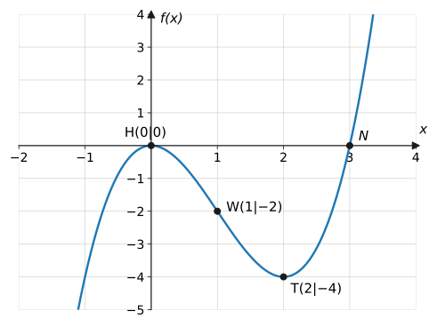
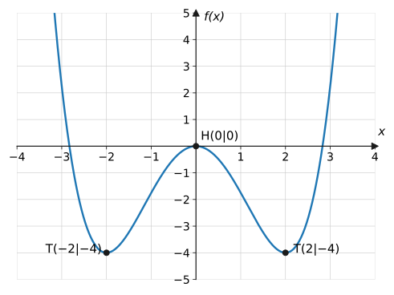
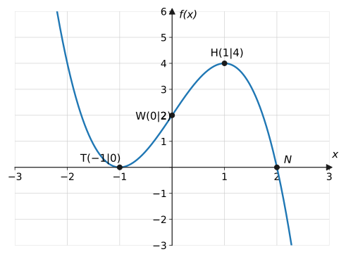
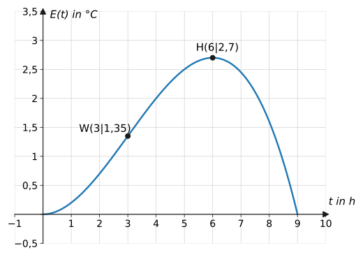
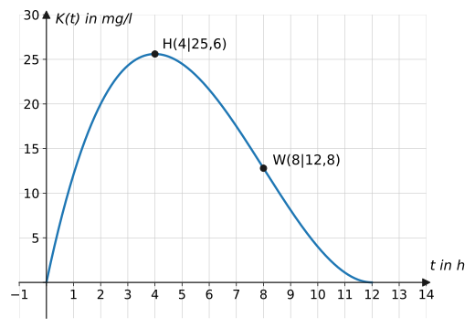
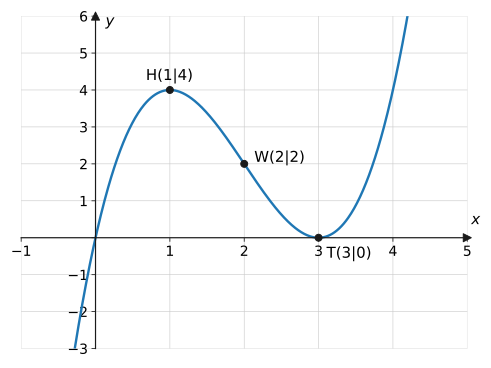
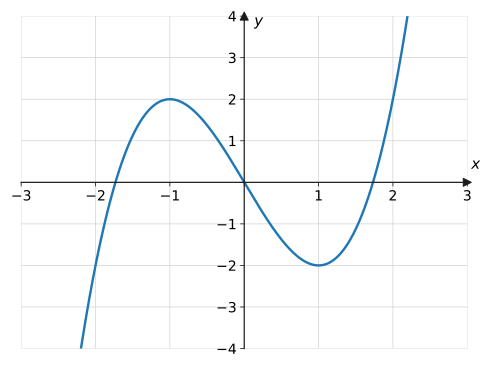
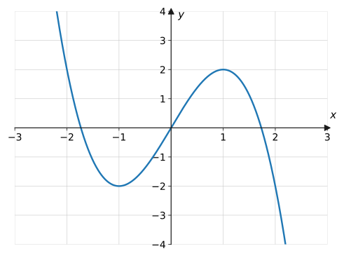
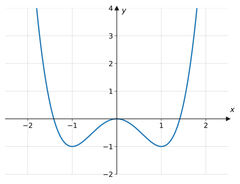
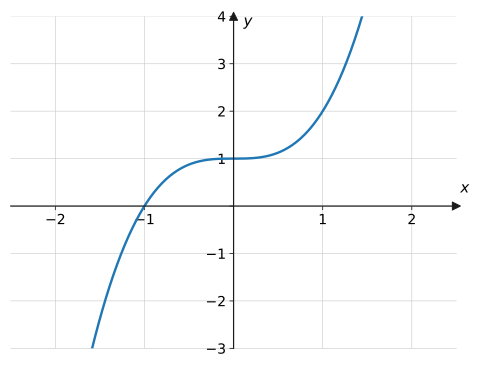

import Quiz from '../../../components/Quiz.astro';

## Worum geht's?

Fieberkurve, Laktatwert, Wirkstoffspiegel: Wer solche Verläufe versteht,
beantwortet immer dieselben Fragen – Wo sind die Grenzen? Wo Maximum und
Minimum? Wo ändert sich der Trend? Die **vollständige Kurvendiskussion**
bündelt alle Werkzeuge des bisherigen Schuljahres zu **einem**
Standardverfahren. Diese Seite bringt nichts Neues – sie ist das
Trainingslager für die Klassenarbeit: Schema, Musterlösungen und viele
komplette Aufgaben.

## Erklärung

### Das Schema der vollständigen Kurvendiskussion

| Schritt | Was ist zu tun? | Handwerkszeug |
| --- | --- | --- |
| 1. Definitionsbereich | meist $\mathbb{R}$; im Sachkontext einschränken | [Funktionsbegriff](../../funktionen/funktionsbegriff/) |
| 2. Symmetrie | nur gerade / nur ungerade Exponenten? | [Eigenschaften](../../ganzrationale/eigenschaften/) |
| 3. Randverhalten | Leitterm $a_n x^n$ betrachten | [Eigenschaften](../../ganzrationale/eigenschaften/) |
| 4. Achsenschnittpunkte | $f(0)$ und $f(x) = 0$ lösen | [Nullstellen](../../ganzrationale/nullstellen/) |
| 5. Extrempunkte | $f'(x) = 0$, hinreichende Bedingung, $y$-Werte | [Extrem- & Wendepunkte](../../differentialrechnung/extrem-wendepunkte/) |
| 6. Wendepunkte | $f''(x) = 0$, $f'''(x_0) \neq 0$, $y$-Werte | [Extrem- & Wendepunkte](../../differentialrechnung/extrem-wendepunkte/) |
| 7. Graph | alle Ergebnisse in eine Skizze übersetzen | [Linearfaktoren](../../ganzrationale/linearfaktorzerlegung/), [graph. Differenzieren](../../differentialrechnung/graphisches-differenzieren/) |

Dazu je nach Aufgabe: Monotonie-Intervalle (Vorzeichen von $f'$),
Krümmung (Vorzeichen von $f''$), Wertebereich, Tangenten.

### Selbstkontrolle beim Skizzieren

Alle Teilergebnisse müssen zusammenpassen – das ist die eingebaute
Fehlerkontrolle der Kurvendiskussion:

- Zwischen zwei Nullstellen mit Vorzeichenwechsel liegt ein Extremum.
- Bei kubischen Funktionen liegt der Wendepunkt **genau in der Mitte**
  zwischen Hoch- und Tiefpunkt.
- Eine doppelte Nullstelle **ist** ein Extrempunkt auf der $x$-Achse.
- Randverhalten und Öffnung der „Enden“ müssen zum Leitterm passen.

Passt etwas nicht zusammen, ist ein Rechenfehler im Spiel – zurückgehen
und prüfen.

### Zeitmanagement in der Klassenarbeit

Reihenfolge einhalten (das Schema baut aufeinander auf), Zwischenwerte
sauber notieren ($f'$, $f''$ nur **einmal** ausrechnen!), am Ende jede
Koordinate am Graphen gegenchecken. Symmetrie zuerst prüfen – sie
halbiert die restliche Arbeit (Beispiel 2).

## Beispiele

**Beispiel 1 (Musterdiskussion, kubisch):** Führe eine vollständige
Kurvendiskussion für $f(x) = x^3 - 3x^2$ durch.

Lösung

**1. Definitionsbereich:** $D = \mathbb{R}$ (ganzrational).

**2. Symmetrie:** Exponenten 3 und 2 gemischt → keine Symmetrie zu
$y$-Achse oder Ursprung.

**3. Randverhalten:** Leitterm $x^3$ (ungerade, positiv):

$$
x \to -\infty:\ f(x) \to -\infty; \qquad x \to +\infty:\ f(x) \to +\infty
$$

**4. Achsenschnittpunkte:** $f(0) = 0$ → durch den Ursprung.
Nullstellen:

$$
x^3 - 3x^2 = x^2(x - 3) = 0 \quad\Rightarrow\quad
x_1 = 0 \text{ (doppelt)},\ x_2 = 3
$$

(Bei 0 berührt der Graph die Achse, bei 3 schneidet er sie.)

**5. Extrempunkte:** $f'(x) = 3x^2 - 6x$, $\ f''(x) = 6x - 6$.

$$
3x^2 - 6x = 3x(x - 2) = 0 \quad\Rightarrow\quad x = 0 \text{ oder } x = 2
$$

Hinreichend: $f''(0) = -6 < 0$ → Hochpunkt; $f''(2) = 6 > 0$ →
Tiefpunkt. Werte: $f(0) = 0$, $f(2) = 8 - 12 = -4$:

$$
H(0 \mid 0), \qquad T(2 \mid -4)
$$

**6. Wendepunkt:** $f''(x) = 6x - 6 = 0 \Rightarrow x = 1$;
$f'''(x) = 6 \neq 0$ ✓; $f(1) = 1 - 3 = -2$:

$$
W(1 \mid -2)
$$

**7. Graph:** Alle Ergebnisse passen zusammen ($H$ = doppelte
Nullstelle, $W$ in der Mitte von $H$ und $T$):

**Beispiel 2 (Symmetrie ausnutzen, Grad 4):** Diskutiere
$f(x) = \frac{1}{4}x^4 - 2x^2$.

Lösung

**1.** $D = \mathbb{R}$.

**2. Symmetrie:** Nur gerade Exponenten → **achsensymmetrisch** zur
$y$-Achse. Ab jetzt genügt es, $x \geq 0$ zu untersuchen und zu
spiegeln!

**3. Randverhalten:** Leitterm $\frac{1}{4}x^4$: beidseitig
$f(x) \to +\infty$.

**4. Achsenschnittpunkte:** $f(0) = 0$. Nullstellen:

$$
\frac{1}{4}x^4 - 2x^2 = \frac{1}{4}x^2\left(x^2 - 8\right) = 0
\ \Rightarrow\ x = 0 \text{ (doppelt)},\ x = \pm\sqrt{8} \approx \pm 2{,}83
$$

**5. Extrempunkte:** $f'(x) = x^3 - 4x = x(x^2 - 4)$, Nullstellen $0,
\pm 2$. $\ f''(x) = 3x^2 - 4$:

$$
f''(0) = -4 < 0 \Rightarrow H; \qquad f''(\pm 2) = 8 > 0 \Rightarrow T
$$

$f(0) = 0$; $f(2) = 4 - 8 = -4$ (und symmetrisch $f(-2) = -4$):

$$
H(0 \mid 0), \qquad T_{1,2}(\pm 2 \mid -4)
$$

**6. Wendepunkte:** $f''(x) = 3x^2 - 4 = 0 \Rightarrow
x = \pm\sqrt{\tfrac{4}{3}} \approx \pm 1{,}15$;
$f'''(x) = 6x \neq 0$ dort ✓. Wert (WTR):
$f(1{,}15) \approx -2{,}22$:

$$
W_{1,2}(\pm 1{,}15 \mid -2{,}22)
$$

**7. Graph:** W-Form, spiegelsymmetrisch:

**Beispiel 3 (negativer Leitkoeffizient, doppelte Nullstelle):**
Diskutiere $f(x) = -x^3 + 3x + 2$.

Lösung

**1.** $D = \mathbb{R}$. **2.** Exponenten 3, 1, 0 gemischt → keine
Standardsymmetrie.

**3. Randverhalten:** Leitterm $-x^3$: von $+\infty$ (links) nach
$-\infty$ (rechts).

**4. Achsenschnittpunkte:** $f(0) = 2$. Nullstellen: Kandidat
$f(-1) = 1 - 3 + 2 = 0$ ✓. Horner (Koeffizienten $-1, 0, 3, 2$;
$x_0 = -1$):

| | $-1$ | $0$ | $3$ | $2$ |
| --- | --- | --- | --- | --- |
| $x_0 = -1$ | | $1$ | $-1$ | $-2$ |
| | $-1$ | $1$ | $2$ | $\mathbf{0}$ |

Quotient $-x^2 + x + 2 = 0 \Leftrightarrow x^2 - x - 2 = 0
\Rightarrow x = 2$ oder $x = -1$.

Also: $x = -1$ **doppelt** (Berührpunkt!), $x = 2$ einfach.

**5. Extrempunkte:** $f'(x) = -3x^2 + 3 = 0 \Rightarrow x = \pm 1$;
$f''(x) = -6x$: $f''(-1) = 6 > 0$ → Tiefpunkt, $f''(1) = -6 < 0$ →
Hochpunkt. $f(-1) = 0$, $f(1) = -1 + 3 + 2 = 4$:

$$
T(-1 \mid 0), \qquad H(1 \mid 4)
$$

(Der Tiefpunkt liegt **auf** der $x$-Achse – konsistent mit der
doppelten Nullstelle. ✓)

**6. Wendepunkt:** $f''(x) = -6x = 0 \Rightarrow x = 0$;
$f'''= -6 \neq 0$ ✓; $f(0) = 2$: $\ W(0 \mid 2)$.

**7. Graph:**

**Beispiel 4 (Sachkontext Fieberkurve):** Bei einem grippalen Infekt
steigt die Körpertemperatur über die Grundtemperatur von 37,5 °C um
$E(t) = -\frac{1}{40}t^3 + \frac{9}{40}t^2$ Grad ($t$ in Stunden,
$0 \leq t \leq 9$). Untersuche den Fieberverlauf vollständig und
interpretiere.

Lösung

**Definitionsbereich (Sachkontext):** $[0;\ 9]$.

**Nullstellen:**

$$
-\frac{1}{40}t^3 + \frac{9}{40}t^2
= \frac{1}{40}t^2\,(9 - t) = 0
\ \Rightarrow\ t = 0 \text{ (doppelt)},\ t = 9
$$

Deutung: Zu Beginn und nach 9 Stunden ist die Temperatur wieder normal.

**Extrempunkte:** $E'(t) = -\frac{3}{40}t^2 + \frac{18}{40}t
= \frac{3}{40}t\,(6 - t) = 0 \Rightarrow t = 0$ oder $t = 6$.
$E''(t) = -\frac{6}{40}t + \frac{18}{40}$:
$E''(6) = -\frac{18}{40} < 0$ → Hochpunkt.

$$
E(6) = -\frac{216}{40} + \frac{324}{40} = \frac{108}{40} = 2{,}7
$$

**Maximales Fieber nach 6 Stunden:** $37{,}5 + 2{,}7 = 40{,}2$ °C.

**Wendepunkt:** $E''(t) = 0 \Rightarrow t = 3$;
$E'''(t) = -\frac{6}{40} \neq 0$ ✓; $E(3) = -\frac{27}{40} +
\frac{81}{40} = 1{,}35$: $\ W(3 \mid 1{,}35)$.

Deutung: Nach 3 Stunden steigt das Fieber **am schnellsten**
($E'(3) = \frac{3}{40} \cdot 3 \cdot 3 = 0{,}675$ °C pro Stunde) –
danach verlangsamt sich der Anstieg, das Maximum kündigt sich an.

**Beispiel 5 (Sattelpunkt-Diskussion):** Diskutiere kompakt
$f(x) = x^3 - 3x^2 + 3x$.

Lösung

$D = \mathbb{R}$; keine Symmetrie; Randverhalten wie $x^3$.

$f(0) = 0$; Nullstellen: $x\left(x^2 - 3x + 3\right) = 0$: Die Klammer
hat Diskriminante $\frac{9}{4} - 3 < 0$ → einzige Nullstelle $x = 0$.

$f'(x) = 3x^2 - 6x + 3 = 3(x - 1)^2 \geq 0$ – Kandidat $x = 1$, aber
**kein Vorzeichenwechsel** ($f'$ beidseitig positiv): kein Extremum,
sondern **Sattelpunkt**. $f$ steigt auf ganz $\mathbb{R}$.

$f''(x) = 6x - 6 = 0 \Rightarrow x = 1$, $f''' = 6 \neq 0$;
$f(1) = 1 - 3 + 3 = 1$. Der Sattelpunkt **ist** der Wendepunkt:

$$
S = W(1 \mid 1) \ \text{mit waagerechter Tangente}
$$

**Beispiel 6 (Monotonie und Krümmung):** Bestimme für
$f(x) = x^3 - 3x$ die Monotonie-Intervalle und das Krümmungsverhalten.

Lösung

$f'(x) = 3x^2 - 3$ mit Nullstellen $\pm 1$; als nach oben geöffnete
Parabel ist $f'$ außen positiv, innen negativ:

- streng **steigend** auf $]-\infty;\ -1]$ und $[1;\ \infty[$
- streng **fallend** auf $[-1;\ 1]$

$f''(x) = 6x$:

- $x < 0$: $f'' < 0$ → **rechtsgekrümmt**
- $x > 0$: $f'' > 0$ → **linksgekrümmt**
- Krümmungswechsel bei $x = 0$ → Wendepunkt $W(0 \mid 0)$

**Beispiel 7 (Sachkontext Medikament):** Die Wirkstoffkonzentration
nach einer Tabletteneinnahme ist $K(t) = 0{,}1t(t - 12)^2$ ($t$ in h,
$K$ in mg/l, $0 \leq t \leq 12$). Wann ist die Konzentration maximal,
und wann nimmt sie am stärksten ab?

Lösung

Ausmultipliziert: $K(t) = 0{,}1t^3 - 2{,}4t^2 + 14{,}4t$.

**Maximum:** $K'(t) = 0{,}3t^2 - 4{,}8t + 14{,}4 = 0$; durch $0{,}3$:

$$
t^2 - 16t + 48 = 0 \quad\Rightarrow\quad t = 8 \pm 4
$$

Kandidaten $t = 4$ und $t = 12$. $K''(t) = 0{,}6t - 4{,}8$:
$K''(4) = -2{,}4 < 0$ → Hochpunkt; ($t = 12$: Tiefpunkt, der
Rand-Nullpunkt). $K(4) = 0{,}4 \cdot 64 = 25{,}6$:

**Nach 4 Stunden** ist die Konzentration mit **25,6 mg/l** maximal.

**Stärkste Abnahme = Wendepunkt im fallenden Bereich:**
$K''(t) = 0 \Rightarrow t = 8$; $K'''(t) = 0{,}6 \neq 0$ ✓;
$K(8) = 0{,}8 \cdot 16 = 12{,}8$; Abbaurate dort:
$K'(8) = 19{,}2 - 38{,}4 + 14{,}4 = -4{,}8$ mg/l pro Stunde.

**Nach 8 Stunden** wird der Wirkstoff am schnellsten abgebaut.

**Beispiel 8 (vom Graphen zur Analyse):** Der abgebildete Graph zeigt
eine ganzrationale Funktion dritten Grades. Lies alle Kenndaten ab und
prüfe sie auf Konsistenz:

Lösung

Ablesen: Nullstellen $x = 0$ (schneidet) und $x = 3$ (berührt →
**doppelt**); $H(1 \mid 4)$, $T(3 \mid 0)$, $W(2 \mid 2)$;
$f(0) = 0$; Randverhalten von $-\infty$ nach $+\infty$ →
Leitkoeffizient positiv.

Konsistenz-Checks: doppelte Nullstelle = Tiefpunkt auf der Achse ✓;
$W$ liegt in der Mitte zwischen $H$ und $T$ (kubisch) ✓; Summe der
Vielfachheiten $1 + 2 = 3$ = Grad ✓. (Der Term ist übrigens
$f(x) = x(x - 3)^2$ – siehe Aufgabe 26.)

## Aufgaben

### Teilschritte trainieren

**Aufgabe 1** (⭐⭐) Prüfe auf Symmetrie: a) $x^4 - 8x^2 + 3$
b) $x^3 - 4x$  c) $x^3 + x^2$

Lösung zu Aufgabe 1

a) nur gerade Exponenten → achsensymmetrisch zur $y$-Achse

b) nur ungerade → punktsymmetrisch zum Ursprung

c) gemischt → keine Standardsymmetrie

**Aufgabe 2** (⭐⭐) Gib das Randverhalten an:
a) $-2x^4 + 5x$  b) $3x^3 - x^2$  c) $-x^5 + 4x^3$

Lösung zu Aufgabe 2

a) Leitterm $-2x^4$: beidseitig $\to -\infty$

b) $3x^3$: von $-\infty$ nach $+\infty$

c) $-x^5$: von $+\infty$ nach $-\infty$

**Aufgabe 3** (⭐⭐) $f(x) = x^3 - 4x$: Bestimme $y$-Achsenabschnitt und
alle Nullstellen.

Lösung zu Aufgabe 3

$f(0) = 0$ (Ursprung). Nullstellen:

$$
x(x^2 - 4) = x(x+2)(x-2) = 0 \ \Rightarrow\ x = 0,\ \pm 2
$$

**Aufgabe 4** (⭐⭐) Bestimme alle Nullstellen von
$f(x) = x^3 - 7x + 6$.

Lösung zu Aufgabe 4

$f(1) = 0$ ✓; Horner (Koeff. $1, 0, -7, 6$; $x_0 = 1$) liefert den
Quotienten $x^2 + x - 6$:

$$
x^2 + x - 6 = 0 \ \Rightarrow\ x = -\tfrac{1}{2} \pm \tfrac{5}{2}
\ \Rightarrow\ x = 2,\ -3
$$

Nullstellen: $-3,\ 1,\ 2$.

**Aufgabe 5** (⭐⭐) Bestimme alle Extrempunkte von $f(x) = x^3 - 12x$.

Lösung zu Aufgabe 5

$f'(x) = 3x^2 - 12 = 0 \Rightarrow x = \pm 2$; $f''(x) = 6x$:
$f''(-2) < 0$, $f''(2) > 0$.

$$
H(-2 \mid 16), \qquad T(2 \mid -16)
$$

**Aufgabe 6** (⭐⭐) Bestimme den Wendepunkt von $f(x) = x^3 - 3x^2 + 4$.

Lösung zu Aufgabe 6

$f''(x) = 6x - 6 = 0 \Rightarrow x = 1$; $f''' = 6 \neq 0$ ✓;
$f(1) = 1 - 3 + 4 = 2$:

$$
W(1 \mid 2)
$$

**Aufgabe 7** (⭐⭐) Gib die Monotonie-Intervalle von $f(x) = x^3 - 3x$
an.

Lösung zu Aufgabe 7

$f'(x) = 3x^2 - 3$: positiv für $|x| > 1$, negativ für $|x| < 1$:
steigend auf $]-\infty; -1]$ und $[1; \infty[$, fallend auf $[-1; 1]$.

**Aufgabe 8** (⭐⭐) Untersuche das Krümmungsverhalten von
$f(x) = x^3 - 6x^2$.

Lösung zu Aufgabe 8

$f''(x) = 6x - 12$: negativ für $x < 2$ (**rechtsgekrümmt**), positiv
für $x > 2$ (**linksgekrümmt**); Wendepunkt bei $x = 2$
($f(2) = 8 - 24 = -16$, also $W(2 \mid -16)$).

**Aufgabe 9** (⭐⭐) Zeige, dass $f(x) = x^3 - 3x^2 + 3x$ keinen
Extrempunkt besitzt, und benenne, was stattdessen bei $x = 1$ liegt.

Lösung zu Aufgabe 9

$f'(x) = 3x^2 - 6x + 3 = 3(x - 1)^2 \geq 0$ für alle $x$: Der Kandidat
$x = 1$ hat **keinen Vorzeichenwechsel** – $f$ steigt links und rechts.
Bei $(1 \mid 1)$ liegt ein **Sattelpunkt** (zugleich Wendepunkt mit
waagerechter Tangente).

**Aufgabe 10** (⭐⭐) Bestimme den Wertebereich von $f(x) = x^4 - 2x^2$
mithilfe der Extrempunkte.

Lösung zu Aufgabe 10

$f'(x) = 4x^3 - 4x = 0 \Rightarrow x = 0, \pm 1$;
$T(\pm 1 \mid -1)$, $H(0 \mid 0)$; Randverhalten beidseitig
$\to +\infty$. Tiefster Wert ist $-1$:

$$
W_f = [-1;\ \infty[
$$

**Aufgabe 11** (⭐⭐) Von einer Funktion dritten Grades sind bekannt:
Nullstellen $-2$ und $1$ (doppelt), Hochpunkt bei $x = -1$,
Randverhalten von $-\infty$ nach $+\infty$. Beschreibe den Verlauf des
Graphen in Worten.

Lösung zu Aufgabe 11

Der Graph kommt von unten links, schneidet die $x$-Achse bei $-2$,
steigt zum Hochpunkt bei $x = -1$, fällt danach und **berührt** die
Achse bei $x = 1$ (doppelte Nullstelle = Tiefpunkt auf der Achse),
steigt anschließend nach oben rechts davon.

**Aufgabe 12** (⭐⭐) Fehlersuche: In einer Klassenarbeit steht „$f'(2) = 0$,
also liegt bei $x = 2$ ein Extrempunkt“. Was fehlt, und wie könnte die
Stelle sonst aussehen?

Lösung zu Aufgabe 12

Es fehlt die **hinreichende Bedingung** (VZW von $f'$ oder
$f''(2) \neq 0$). Ohne sie könnte bei $x = 2$ auch ein **Sattelpunkt**
liegen – waagerechte Tangente, aber kein Hoch-/Tiefpunkt (Beispiel:
$f(x) = (x-2)^3$).

### Komplette Kurvendiskussionen

**Aufgabe 13** (⭐⭐) Diskutiere vollständig: $f(x) = x^3 - 3x$

Lösung zu Aufgabe 13

**D:** $\mathbb{R}$. **Symmetrie:** nur ungerade Exponenten →
punktsymmetrisch zum Ursprung. **Randverhalten:** $-\infty \to
+\infty$.

**Achsenschnitte:** $f(0) = 0$;
$x(x^2 - 3) = 0 \Rightarrow x = 0,\ \pm\sqrt{3} \approx \pm 1{,}73$.

**Extrema:** $f'(x) = 3x^2 - 3 = 0 \Rightarrow x = \pm 1$;
$f''(x) = 6x$: $f''(-1) < 0$, $f''(1) > 0$:

$$
H(-1 \mid 2), \qquad T(1 \mid -2)
$$

**Wendepunkt:** $6x = 0 \Rightarrow x = 0$, $f''' = 6 \neq 0$:
$W(0 \mid 0)$ – passend zur Punktsymmetrie im Ursprung.

**Graph:** typische kubische S-Form durch den Ursprung.

**Aufgabe 14** (⭐⭐) Diskutiere vollständig: $f(x) = x^3 - 6x^2 + 9x$

Lösung zu Aufgabe 14

**D:** $\mathbb{R}$; keine Symmetrie; Randverhalten $-\infty \to
+\infty$.

**Achsenschnitte:** $f(0) = 0$;
$x\left(x^2 - 6x + 9\right) = x(x - 3)^2 = 0 \Rightarrow x = 0$,
$x = 3$ (doppelt, Berührpunkt).

**Extrema:** $f'(x) = 3x^2 - 12x + 9 = 0 \Leftrightarrow
x^2 - 4x + 3 = 0 \Rightarrow x = 1$ oder $3$; $f''(x) = 6x - 12$:
$f''(1) = -6 < 0$, $f''(3) = 6 > 0$:

$$
H(1 \mid 4), \qquad T(3 \mid 0)
$$

**Wendepunkt:** $6x - 12 = 0 \Rightarrow x = 2$; $f(2) = 2$:
$W(2 \mid 2)$.

**Checks:** $T$ auf der Achse = doppelte Nullstelle ✓; $W$ mittig
zwischen $H$ und $T$ ✓. (Graph: siehe Beispiel 8.)

**Aufgabe 15** (⭐⭐) Diskutiere vollständig: $f(x) = -x^3 + 3x^2$

Lösung zu Aufgabe 15

**D:** $\mathbb{R}$; keine Symmetrie; Leitterm $-x^3$: von $+\infty$
nach $-\infty$.

**Achsenschnitte:** $f(0) = 0$;
$-x^2(x - 3) = 0 \Rightarrow x = 0$ (doppelt), $x = 3$.

**Extrema:** $f'(x) = -3x^2 + 6x = -3x(x - 2) = 0 \Rightarrow x = 0,
2$; $f''(x) = -6x + 6$: $f''(0) = 6 > 0$ → Tiefpunkt,
$f''(2) = -6 < 0$ → Hochpunkt; $f(0) = 0$, $f(2) = -8 + 12 = 4$:

$$
T(0 \mid 0), \qquad H(2 \mid 4)
$$

**Wendepunkt:** $-6x + 6 = 0 \Rightarrow x = 1$; $f(1) = 2$:
$W(1 \mid 2)$.

Checks: doppelte Nullstelle 0 = Tiefpunkt auf der Achse ✓.

**Aufgabe 16** (⭐⭐⭐) Diskutiere vollständig: $f(x) = x^4 - 4x^2$

Lösung zu Aufgabe 16

**D:** $\mathbb{R}$; **achsensymmetrisch** (nur gerade Exponenten);
Randverhalten beidseitig $+\infty$.

**Achsenschnitte:** $f(0) = 0$;
$x^2\left(x^2 - 4\right) = 0 \Rightarrow x = 0$ (doppelt), $\pm 2$.

**Extrema:** $f'(x) = 4x^3 - 8x = 4x\left(x^2 - 2\right) = 0
\Rightarrow x = 0,\ \pm\sqrt{2}$; $f''(x) = 12x^2 - 8$:
$f''(0) = -8 < 0$ → $H$; $f''(\pm\sqrt{2}) = 16 > 0$ → $T$;
$f(\pm\sqrt{2}) = 4 - 8 = -4$:

$$
H(0 \mid 0), \qquad T_{1,2}\left(\pm\sqrt{2} \mid -4\right)
$$

**Wendepunkte:** $12x^2 - 8 = 0 \Rightarrow x = \pm\sqrt{\tfrac{2}{3}}
\approx \pm 0{,}82$; $f\left(\pm\sqrt{2/3}\right) = \tfrac{4}{9} -
\tfrac{8}{3} = -\tfrac{20}{9} \approx -2{,}22$:

$$
W_{1,2}(\pm 0{,}82 \mid -2{,}22)
$$

**Graph:** W-Form; alle Punkte spiegelbildlich zur $y$-Achse ✓.

**Aufgabe 17** (⭐⭐⭐) Diskutiere vollständig:
$f(x) = \frac{1}{4}x^4 - \frac{3}{2}x^2$

Lösung zu Aufgabe 17

**D:** $\mathbb{R}$; achsensymmetrisch; Randverhalten beidseitig
$+\infty$.

**Achsenschnitte:** $f(0) = 0$;
$\frac{1}{4}x^2\left(x^2 - 6\right) = 0 \Rightarrow x = 0$ (doppelt),
$\pm\sqrt{6} \approx \pm 2{,}45$.

**Extrema:** $f'(x) = x^3 - 3x = x\left(x^2 - 3\right) = 0 \Rightarrow
x = 0,\ \pm\sqrt{3}$; $f''(x) = 3x^2 - 3$: $f''(0) = -3 < 0$ → $H$;
$f''(\pm\sqrt{3}) = 6 > 0$ → $T$;
$f(\pm\sqrt{3}) = \frac{9}{4} - \frac{9}{2} = -\frac{9}{4}$:

$$
H(0 \mid 0), \qquad
T_{1,2}\left(\pm\sqrt{3} \,\middle|\, -\tfrac{9}{4}\right)
$$

**Wendepunkte:** $3x^2 - 3 = 0 \Rightarrow x = \pm 1$;
$f(\pm 1) = \frac{1}{4} - \frac{3}{2} = -\frac{5}{4}$:

$$
W_{1,2}\left(\pm 1 \,\middle|\, -\tfrac{5}{4}\right)
$$

**Aufgabe 18** (⭐⭐⭐) Diskutiere vollständig: $f(x) = x^3 + 3x^2 - 4$

Lösung zu Aufgabe 18

**D:** $\mathbb{R}$; keine Symmetrie; Randverhalten $-\infty \to
+\infty$.

**Achsenschnitte:** $f(0) = -4$. Nullstellen: $f(1) = 0$ ✓; Horner
liefert Quotient $x^2 + 4x + 4 = (x + 2)^2$:

$$
f(x) = (x - 1)(x + 2)^2
\ \Rightarrow\ x = 1,\ x = -2 \text{ (doppelt)}
$$

**Extrema:** $f'(x) = 3x^2 + 6x = 3x(x + 2) = 0 \Rightarrow x = 0,
-2$; $f''(x) = 6x + 6$: $f''(-2) = -6 < 0$ → $H$; $f''(0) = 6 > 0$ →
$T$; $f(-2) = -8 + 12 - 4 = 0$, $f(0) = -4$:

$$
H(-2 \mid 0), \qquad T(0 \mid -4)
$$

**Wendepunkt:** $6x + 6 = 0 \Rightarrow x = -1$;
$f(-1) = -1 + 3 - 4 = -2$: $\ W(-1 \mid -2)$.

Check: $H$ auf der Achse = doppelte Nullstelle $-2$ ✓.

**Aufgabe 19** (⭐⭐) Diskutiere vollständig: $f(x) = 2x^3 - 6x$

Lösung zu Aufgabe 19

**D:** $\mathbb{R}$; punktsymmetrisch (ungerade Exponenten);
Randverhalten $-\infty \to +\infty$.

**Achsenschnitte:** $f(0) = 0$;
$2x\left(x^2 - 3\right) = 0 \Rightarrow x = 0, \pm\sqrt{3}$.

**Extrema:** $f'(x) = 6x^2 - 6 = 0 \Rightarrow x = \pm 1$;
$f''(x) = 12x$: $H$ bei $-1$, $T$ bei $1$; $f(\mp 1) = \pm 4$:

$$
H(-1 \mid 4), \qquad T(1 \mid -4)
$$

**Wendepunkt:** $x = 0$, $W(0 \mid 0)$.

(Wie Aufgabe 13, nur mit Faktor 2 in $y$-Richtung gestreckt –
Nullstellen gleich, Extremwerte verdoppelt.)

**Aufgabe 20** (⭐⭐⭐) Diskutiere vollständig:
$f(x) = -\frac{1}{2}x^4 + x^2$

Lösung zu Aufgabe 20

**D:** $\mathbb{R}$; achsensymmetrisch; Leitterm $-\frac{1}{2}x^4$:
beidseitig $\to -\infty$.

**Achsenschnitte:** $f(0) = 0$;
$x^2\left(1 - \frac{1}{2}x^2\right) = 0 \Rightarrow x = 0$ (doppelt),
$\pm\sqrt{2}$.

**Extrema:** $f'(x) = -2x^3 + 2x = -2x\left(x^2 - 1\right) = 0
\Rightarrow x = 0, \pm 1$; $f''(x) = -6x^2 + 2$: $f''(0) = 2 > 0$ →
$T$; $f''(\pm 1) = -4 < 0$ → $H$; $f(\pm 1) = -\frac{1}{2} + 1 =
\frac{1}{2}$:

$$
T(0 \mid 0), \qquad H_{1,2}\left(\pm 1 \,\middle|\, \tfrac{1}{2}\right)
$$

**Wendepunkte:** $-6x^2 + 2 = 0 \Rightarrow x = \pm\frac{1}{\sqrt{3}}
\approx \pm 0{,}58$; $f \approx 0{,}28$: $W_{1,2}(\pm 0{,}58 \mid
0{,}28)$ (WTR).

**Graph:** M-Form (umgedrehtes W), Maximalwert $\frac{1}{2}$ →
Wertebereich $\left]-\infty;\ \frac{1}{2}\right]$.

### Graphen zuordnen und ablesen

**Aufgabe 21** (⭐⭐) Ordne die vier Terme den Graphen A–D zu:
$f_1(x) = x^3 - 3x$, $\ f_2(x) = -x^3 + 3x$, $\ f_3(x) = x^4 - 2x^2$,
$\ f_4(x) = x^3 + 1$.

Graph A:

Graph B:

Graph C:

Graph D:

Lösung zu Aufgabe 21

- **A → $f_1$:** Grad 3 mit $a > 0$ (von $-\infty$ nach $+\infty$),
  Extrema bei $\pm 1$, durch den Ursprung.
- **B → $f_2$:** gespiegeltes Randverhalten ($a < 0$).
- **C → $f_3$:** W-Form = Grad 4, achsensymmetrisch.
- **D → $f_4$:** streng steigend mit Sattelpunkt,
  $y$-Achsenabschnitt 1.

**Aufgabe 22** (⭐⭐) Begründe für Graph C aus Aufgabe 21 **ohne
Rechnung**, warum der Term gerade Exponenten haben muss und der
Leitkoeffizient positiv ist.

Lösung zu Aufgabe 22

Der Graph ist **achsensymmetrisch** zur $y$-Achse → nur gerade
Exponenten. Beide Enden laufen nach **oben** → gerader Grad mit
positivem Leitkoeffizienten.

**Aufgabe 23** (⭐⭐) Lies am Ablese-Graphen (Beispiel 8) die
Monotonie-Intervalle ab.

Lösung zu Aufgabe 23

Steigend bis zum Hochpunkt: $]-\infty;\ 1]$; fallend zwischen $H$ und
$T$: $[1;\ 3]$; danach wieder steigend: $[3;\ \infty[$.

**Aufgabe 24** (⭐⭐⭐) Am Ablese-Graphen berührt der Graph die $x$-Achse
bei $x = 3$. Welche Vielfachheit hat diese Nullstelle, und wie hängt das
mit dem Tiefpunkt zusammen?

Lösung zu Aufgabe 24

Berühren ohne Vorzeichenwechsel → **gerade Vielfachheit**, bei Grad 3
mit einer weiteren Nullstelle bleibt nur: **doppelt**. Eine doppelte
Nullstelle ist immer zugleich ein Extrempunkt **auf** der Achse – hier
der Tiefpunkt $T(3 \mid 0)$.

**Aufgabe 25** (⭐⭐) Skizziere (beschreibe) den Graphen von $f'$ zum
Ablese-Graphen aus Beispiel 8.

Lösung zu Aufgabe 25

Nullstellen von $f'$ unter $H$ und $T$: bei $x = 1$ und $x = 3$;
dazwischen negativ, außen positiv → eine nach oben geöffnete
**Parabel** mit Scheitel bei $x = 2$ (unter dem Wendepunkt).
(Tatsächlich: $f'(x) = 3x^2 - 12x + 9$.)

**Aufgabe 26** (⭐⭐⭐) Rekonstruiere den Funktionsterm des
Ablese-Graphen (Grad 3, Leitkoeffizient 1) aus den Nullstellen und
prüfe mit dem Hochpunkt.

Lösung zu Aufgabe 26

Nullstellen: $0$ (einfach) und $3$ (doppelt):

$$
f(x) = x(x - 3)^2 = x^3 - 6x^2 + 9x
$$

Probe mit $H(1 \mid 4)$: $f(1) = 1 \cdot 4 = 4$ ✓ und
$f'(1) = 3 - 12 + 9 = 0$ ✓.

### Anwendungen: Fieber, Laktat, Medikament

**Aufgabe 27** (⭐⭐) Fieberkurve aus Beispiel 4
($E(t) = -\frac{1}{40}t^3 + \frac{9}{40}t^2$): Berechne die Temperatur
(inkl. Grundtemperatur 37,5 °C) nach 2 Stunden.

Lösung zu Aufgabe 27

$$
E(2) = -\frac{8}{40} + \frac{36}{40} = \frac{28}{40} = 0{,}7
$$

Temperatur: $37{,}5 + 0{,}7 = 38{,}2$ °C.

**Aufgabe 28** (⭐⭐) Zeige rechnerisch, dass das Fieber nach 9 Stunden
wieder vollständig abgeklungen ist, und erkläre, warum das Modell für
$t > 9$ nicht mehr gelten kann.

Lösung zu Aufgabe 28

$$
E(9) = \frac{1}{40} \cdot 81 \cdot (9 - 9) = \frac{81}{40}(9-9) = 0
$$

(bzw. direkt: $E(t) = \frac{1}{40}t^2(9 - t)$, also $E(9) = 0$.)
Für $t > 9$ würde $E$ **negativ** – die Temperatur fiele unter die
Grundtemperatur und wegen $t \to \infty: E \to -\infty$ beliebig tief.
Unsinn im Sachkontext → Modellgrenze bei $t = 9$.

**Aufgabe 29** (⭐⭐⭐) Berechne die mittlere Änderungsrate der
Fieberkurve auf $[0;\ 6]$ und vergleiche sie mit der momentanen
Steigrate im Wendepunkt $t = 3$.

Lösung zu Aufgabe 29

Mittlere Rate:

$$
\frac{E(6) - E(0)}{6} = \frac{2{,}7}{6} = 0{,}45 \ \text{°C/h}
$$

Momentan bei $t = 3$: $E'(t) = -\frac{3}{40}t^2 + \frac{18}{40}t$:

$$
E'(3) = -\frac{27}{40} + \frac{54}{40} = \frac{27}{40} = 0{,}675
\ \text{°C/h}
$$

Im Wendepunkt steigt das Fieber **1,5-mal so schnell** wie im
Durchschnitt der ersten 6 Stunden – der Wendepunkt ist die Phase des
steilsten Anstiegs.

**Aufgabe 30** (⭐⭐) Medikament $K(t) = 0{,}1t(t - 12)^2$ (Beispiel 7):
Berechne $K(2)$ und $K(10)$ und vergleiche die beiden Phasen.

Lösung zu Aufgabe 30

$$
K(2) = 0{,}2 \cdot 100 = 20, \qquad K(10) = 1 \cdot 4 = 4
$$

2 h nach der Einnahme sind bereits 20 mg/l erreicht (steile
Anflutung), 10 h danach nur noch 4 mg/l (langsames Auslaufen des
Abbaus).

**Aufgabe 31** (⭐⭐⭐) Ab einer Konzentration von 10 mg/l wirkt das
Medikament. Prüfe, ob die Wirkschwelle zur Stunde 1 und zur Stunde 9
erreicht ist, und begründe damit ungefähr, wie lang das Wirkfenster
ist.

Lösung zu Aufgabe 31

$$
K(1) = 0{,}1 \cdot 121 = 12{,}1 > 10, \qquad
K(9) = 0{,}9 \cdot 9 = 8{,}1 < 10
$$

Schon nach 1 h liegt die Konzentration über der Schwelle; zwischen
$t = 8$ ($K(8) = 12{,}8$) und $t = 9$ fällt sie darunter. Das
Wirkfenster reicht also von knapp unter 1 h bis etwa 8,5 h – rund
**7,5 bis 8 Stunden**. (Exakt wäre $K(t) = 10$ zu lösen – WTR.)

**Aufgabe 32** (⭐⭐) Laktatmodell $L(t) = 6t^2 - t^3$ ($0 \leq t \leq
6$): Führe die Diskussion im Sachkontext: Nullstellen, Maximum,
Wendepunkt – jeweils mit Deutung.

Lösung zu Aufgabe 32

**Nullstellen:** $t^2(6 - t) = 0 \Rightarrow t = 0$ (doppelt), $t = 6$
– Start bei 0, am Testende wieder abgebaut.

**Maximum:** $L'(t) = 12t - 3t^2 = 3t(4 - t) = 0 \Rightarrow t = 4$;
$L''(t) = 12 - 6t$, $L''(4) = -12 < 0$ ✓; $L(4) = 96 - 64 = 32$ – der
Laktatwert erreicht nach 4 min sein Maximum.

**Wendepunkt:** $L''(t) = 0 \Rightarrow t = 2$; $L(2) = 24 - 8 = 16$ –
nach 2 min steigt der Laktatwert am schnellsten
($L'(2) = 24 - 12 = 12$ pro min).

**Aufgabe 33** (⭐⭐⭐) Ein zweiter Proband hat die Laktatkurve
$L_2(t) = 3t^2 - 0{,}5t^3$. Bestimme sein Maximum und vergleiche mit
dem ersten Probanden aus Aufgabe 32.

Lösung zu Aufgabe 33

$L_2'(t) = 6t - 1{,}5t^2 = 1{,}5t(4 - t) = 0 \Rightarrow t = 4$;
$L_2''(t) = 6 - 3t$, $L_2''(4) = -6 < 0$ ✓:

$$
L_2(4) = 48 - 32 = 16
$$

Beide erreichen ihr Maximum zur selben Zeit ($t = 4$), aber Proband 2
nur mit dem **halben** Spitzenwert (16 statt 32) – seine Kurve ist die
mit Faktor $\frac{1}{2}$ in $y$-Richtung gestauchte erste Kurve:
bessere Ausdauerleistung im Modell.

**Aufgabe 34** (⭐⭐⭐) Begründe allgemein: Wenn ein Bestand durch eine
ganzrationale Funktion beschrieben wird, findet die **stärkste
Zunahme** immer an einem Wendepunkt oder am Rand des
Definitionsbereichs statt.

Lösung zu Aufgabe 34

Die Zunahme-Rate ist $f'$. Ihre größten Werte nimmt $f'$ an, wo
$f'' = 0$ gilt (Extremum von $f'$ – das ist ein **Wendepunkt** von
$f$) – oder eben am **Rand** des betrachteten Intervalls, wenn $f'$
dort größer ist als an jeder inneren Stelle. Deshalb gehört zur Frage
„Wann wächst … am stärksten?“ immer der Blick auf Wendepunkte **und**
Ränder.

**Aufgabe 35** (⭐⭐) Fieberkurve: Ein fiebersenkendes Mittel soll
genommen werden, sobald die Temperatur über 39,5 °C steigt. Prüfe, ob
das im Modellverlauf nötig wird.

Lösung zu Aufgabe 35

39,5 °C entspricht $E(t) = 2$. Das Maximum liegt bei
$E(6) = 2{,}7 > 2$ – die Schwelle wird also überschritten
(z. B. $E(4) = -\frac{64}{40} + \frac{144}{40} = 2$: genau ab
$t = 4$). **Ja**, zwischen Stunde 4 und dem Abklingen ist das Mittel
angezeigt.

### Vermischtes und Begründungsaufgaben

**Aufgabe 36** (⭐⭐) Begründe: Jede ganzrationale Funktion **dritten**
Grades hat genau **einen** Wendepunkt.

Lösung zu Aufgabe 36

Für $f(x) = ax^3 + bx^2 + cx + d$ ($a \neq 0$) ist
$f''(x) = 6ax + 2b$ eine **lineare** Funktion mit Steigung
$6a \neq 0$ – sie hat genau eine Nullstelle, und dort wechselt sie das
Vorzeichen (Krümmungswechsel garantiert). Also genau ein Wendepunkt. ∎

**Aufgabe 37** (⭐⭐⭐) Kann eine Funktion vierten Grades genau **einen**
Extrempunkt haben? Belege mit einem Beispiel oder widerlege.

Lösung zu Aufgabe 37

**Ja.** Beispiel $f(x) = x^4$: $\ f'(x) = 4x^3$ hat nur die Nullstelle
$x = 0$ mit VZW von $-$ nach $+$ → einziger Extrempunkt $T(0 \mid 0)$.

**Aufgabe 38** (⭐⭐⭐) $f(x) = x^3 + bx$ mit beliebigem $b$. Zeige, dass
der Wendepunkt immer im Ursprung liegt.

Lösung zu Aufgabe 38

$f''(x) = 6x$ – unabhängig von $b$! Nullstelle $x = 0$ mit
$f''' = 6 \neq 0$, und $f(0) = 0$:

$$
W(0 \mid 0) \ \text{für jedes } b
$$

(Plausibel: $f$ ist stets punktsymmetrisch zum Ursprung, und der
Wendepunkt ist das Symmetriezentrum.)

**Aufgabe 39** (⭐⭐) Wie viele Extrempunkte kann eine ganzrationale
Funktion vom Grad $n$ höchstens haben? Begründe.

Lösung zu Aufgabe 39

Höchstens $n - 1$: Extremstellen sind Nullstellen von $f'$, und $f'$
hat Grad $n - 1$, also höchstens $n - 1$ Nullstellen.

**Aufgabe 40** (⭐⭐⭐) Vom Graphen von $f$ ist bekannt: $H(0 \mid 2)$
ist Hochpunkt. Welche Aussagen über $f(0)$, $f'(0)$ und $f''(0)$ sind
damit sicher, welche nur wahrscheinlich?

Lösung zu Aufgabe 40

**Sicher:** $f(0) = 2$ und $f'(0) = 0$ (waagerechte Tangente ist
notwendig).

**Nicht sicher:** $f''(0) < 0$ ist der Normalfall, aber es kann auch
$f''(0) = 0$ gelten (Beispiel $f(x) = 2 - x^4$: Hochpunkt bei 0,
obwohl $f''(0) = 0$). Sicher ist nur $f''(0) \leq 0$.

**Aufgabe 41** (⭐⭐) Wahr oder falsch? Begründe kurz.
a) Wenn $f''(x_0) = 0$, dann hat $f$ bei $x_0$ einen Wendepunkt.
b) Zwischen zwei Nullstellen mit Vorzeichenwechsel liegt ein
Extrempunkt.
c) An einer doppelten Nullstelle gilt auch $f'(x_0) = 0$.

Lösung zu Aufgabe 41

a) **Falsch** – notwendige Bedingung; Gegenbeispiel $f(x) = x^4$ bei
$x_0 = 0$ (dort Tiefpunkt, kein Wendepunkt).

b) **Wahr** – der Graph muss zwischen „unten“ und „unten“ (bzw. oben)
umkehren; irgendwo dazwischen ist die höchste/tiefste Stelle.

c) **Wahr** – der Graph berührt die Achse: Extrempunkt auf der Achse,
also waagerechte Tangente.

**Aufgabe 42** (⭐⭐) Bestimme den Wertebereich von
$f(x) = -\frac{1}{2}x^4 + x^2$ (Aufgabe 20) und begründe mit
Extrempunkten und Randverhalten.

Lösung zu Aufgabe 42

Höchste Punkte: $H(\pm 1 \mid \frac{1}{2})$; Randverhalten beidseitig
$\to -\infty$ – alle Werte bis $\frac{1}{2}$ werden angenommen, größere
nie:

$$
W_f = \left]-\infty;\ \tfrac{1}{2}\right]
$$

**Aufgabe 43** (⭐⭐⭐) Prüfe, dass $f(x) = \frac{1}{3}x^3 - 2x^2$ einen
Hochpunkt bei $x = 0$ und einen Tiefpunkt bei $x = 4$ hat – und erkläre,
wie man so eine Funktion „rückwärts“ aus den gewünschten Extremstellen
bauen könnte.

Lösung zu Aufgabe 43

$f'(x) = x^2 - 4x = x(x - 4) = 0 \Rightarrow x = 0, 4$;
$f''(x) = 2x - 4$: $f''(0) = -4 < 0$ → $H(0 \mid 0)$;
$f''(4) = 4 > 0$ → $T\left(4 \mid -\frac{32}{3}\right)$. ✓

Rückwärts-Idee: Man wünscht sich $f'(x) = x(x - 4)$ (Nullstellen an
den gewünschten Stellen mit passenden VZW) und sucht dann eine
Funktion mit genau dieser Ableitung. Das systematische Verfahren dafür
liefern die [Steckbriefaufgaben](../../steckbriefaufgaben/steckbriefaufgaben/).

**Aufgabe 44** (⭐⭐⭐) Erkläre, warum bei einer achsensymmetrischen
Funktion die halbe Kurvendiskussion genügt. Welche Punkte „verdoppeln“
sich, welcher nicht?

Lösung zu Aufgabe 44

Wegen $f(-x) = f(x)$ ist der Graph für $x < 0$ das Spiegelbild des
Graphen für $x > 0$: Jede Nullstelle, jeder Extrem- und Wendepunkt bei
$x_0 > 0$ hat einen Partner bei $-x_0$ mit **gleichem** $y$-Wert.
Nicht verdoppelt wird, was auf der Symmetrieachse liegt: der Punkt bei
$x = 0$ (dort liegt immer ein Kandidat für Hoch-/Tiefpunkt, denn
$f'(0) = 0$ bei achsensymmetrischen ganzrationalen Funktionen).

**Aufgabe 45** (⭐⭐⭐) Klassenarbeits-Simulation (45 min):
Führe für $f(x) = x^3 - 9x$ eine vollständige Kurvendiskussion durch
**und** bestimme zusätzlich die Gleichung der Tangente im Wendepunkt.

Lösung zu Aufgabe 45

**D:** $\mathbb{R}$; **punktsymmetrisch**; Randverhalten $-\infty \to
+\infty$.

**Achsenschnitte:** $f(0) = 0$;
$x\left(x^2 - 9\right) = 0 \Rightarrow x = 0, \pm 3$.

**Extrema:** $f'(x) = 3x^2 - 9 = 0 \Rightarrow x = \pm\sqrt{3}$;
$f''(x) = 6x$: $H$ links, $T$ rechts;
$f(\sqrt{3}) = 3\sqrt{3} - 9\sqrt{3} = -6\sqrt{3} \approx -10{,}39$:

$$
H\left(-\sqrt{3} \mid 6\sqrt{3}\right), \qquad
T\left(\sqrt{3} \mid -6\sqrt{3}\right)
$$

**Wendepunkt:** $6x = 0 \Rightarrow x = 0$; $W(0 \mid 0)$.

**Wendetangente:** Steigung $f'(0) = -9$, durch $W(0 \mid 0)$:

$$
t\colon\ y = -9x
$$

(Steilste Abwärtstangente des Graphen – im Wendepunkt ist das Gefälle
maximal.)

## Merksatz

Merksatz anzeigen

Vollständige Kurvendiskussion = festes Schema: **Definitionsbereich →
Symmetrie → Randverhalten → Achsenschnittpunkte → Extrempunkte
(notwendig + hinreichend!) → Wendepunkte → Graph.** Alle Ergebnisse
müssen zusammenpassen (doppelte Nullstelle = Extremum auf der Achse,
$W$ mittig zwischen $H$ und $T$ bei Grad 3) – die Skizze am Ende ist
die beste Fehlerkontrolle.

## Vertiefung

:::caution
Die drei teuersten Fehler in Klassenarbeiten: **(1)** hinreichende
Bedingung weggelassen, **(2)** $y$-Koordinaten mit $f'$ statt $f$
berechnet, **(3)** Ergebnisse widersprechen der eigenen Skizze – und
niemand hat es gemerkt. Plane 2 Minuten Konsistenz-Check pro Aufgabe
ein.
:::

**Im Sachkontext** kommen zwei Pflichtblicke dazu: der (eingeschränkte)
**Definitionsbereich** und die **Ränder** – das globale Maximum kann am
Rand liegen, nicht bei einem lokalen Hochpunkt. Und jede Antwort braucht
einen Antwortsatz mit **Einheiten**.

**Ausblick:** Als Nächstes bekommen die Funktionen einen **Parameter**:
[Kurvenscharen](../../scharen/kurvenscharen/) – die Kurvendiskussion
läuft dann buchstabengetreu genauso, nur mit $t$ im Gepäck.

## Quiz

Zum Abschluss: Klicke bei jeder Frage eine Antwort an – die Auswertung kommt sofort.

<Quiz fragen={[
  { frage: 'Welcher Punkt gehört NICHT zum Schema der Kurvendiskussion?',
    antworten: ['Randverhalten', 'Nullstellen', 'Ortskurve', 'Wendepunkte'],
    richtig: 2, erklaerung: 'Ortskurven gehören zu Funktionenscharen – die Kurvendiskussion untersucht eine einzelne Funktion.' },
  { frage: 'Warum lohnt es sich, die Symmetrie zuerst zu prüfen?',
    antworten: ['Weil sie am schwersten ist', 'Weil man dann nur die halbe Rechnung braucht und spiegeln kann', 'Weil sonst die pq-Formel nicht gilt', 'Sie ist reine Formsache'],
    richtig: 1, erklaerung: 'Bei Achsen- oder Punktsymmetrie liefert jedes Ergebnis für x &gt; 0 automatisch das Spiegelbild mit.' },
  { frage: 'Der Graph berührt die x-Achse bei x = 3. Was gilt dort?',
    antworten: ['Einfache Nullstelle', 'Doppelte Nullstelle und Extrempunkt auf der Achse', 'Polstelle', 'Wendepunkt'],
    richtig: 1, erklaerung: 'Berühren = gerade Vielfachheit; der Punkt ist zugleich Hoch- oder Tiefpunkt auf der Achse.' },
  { frage: 'Wo liegt bei einer kubischen Funktion der Wendepunkt?',
    antworten: ['Immer im Ursprung', 'Genau in der Mitte zwischen Hoch- und Tiefpunkt', 'Auf der y-Achse', 'Am tiefsten Punkt'],
    richtig: 1, erklaerung: 'Bei Grad 3 liegt der Wendepunkt exakt mittig zwischen den Extrempunkten – eine praktische Kontrolle.' },
  { frage: 'An welchen Stellen hat f(x) = x³ − 3x² Extrempunkte?',
    antworten: ['x = 0 und x = 2', 'x = ±1', 'x = 1 und x = 3', 'x = 0 und x = 3'],
    richtig: 0, erklaerung: 'f′(x) = 3x² − 6x = 3x(x − 2) = 0 bei x = 0 (Hochpunkt) und x = 2 (Tiefpunkt).' },
  { frage: 'Leitterm −x³: Wie verläuft der Graph global?',
    antworten: ['Von −∞ nach +∞', 'Von +∞ nach −∞', 'Beidseitig nach +∞', 'Beidseitig nach −∞'],
    richtig: 1, erklaerung: 'Ungerader Grad mit negativem Koeffizienten: von oben links nach unten rechts.' },
  { frage: 'Was bedeutet der Wendepunkt der Fieberkurve?',
    antworten: ['Das Fieber ist maximal', 'Das Fieber steigt dort am schnellsten', 'Das Fieber ist vorbei', 'Die Temperatur ist normal'],
    richtig: 1, erklaerung: 'Im Wendepunkt ist die Änderungsrate maximal – danach verlangsamt sich der Anstieg Richtung Maximum.' },
  { frage: 'Welchen Wertebereich hat f(x) = x⁴ − 2x² (Tiefpunkte bei y = −1)?',
    antworten: ['ℝ', '[−1; ∞[', '[0; ∞[', ']−∞; −1]'],
    richtig: 1, erklaerung: 'Tiefster Wert −1 (Tiefpunkte), Randverhalten beidseitig +∞: alle Werte ab −1.' },
  { frage: 'Warum muss man im Sachkontext zusätzlich die Ränder prüfen?',
    antworten: ['Weil f′ dort nicht existiert', 'Weil das globale Maximum am Rand des Definitionsbereichs liegen kann', 'Weil die Einheiten fehlen', 'Muss man nicht'],
    richtig: 1, erklaerung: 'f′ = 0 findet nur innere Extrema – auf einem Intervall kann der größte Wert am Rand sitzen.' },
  { frage: 'Die beste schnelle Fehlerkontrolle am Ende einer Kurvendiskussion?',
    antworten: ['Alles noch einmal rechnen', 'Prüfen, ob alle Ergebnisse zur Skizze zusammenpassen', 'Den Taschenrechner fragen', 'Die Aufgabe überspringen'],
    richtig: 1, erklaerung: 'Nullstellen, Extrema, Wendepunkt und Randverhalten müssen ein stimmiges Bild ergeben – Widersprüche zeigen Rechenfehler an.' },
]} />

## Checkliste zur Klassenarbeit

Die dritte Klassenarbeit umfasst Kurvendiskussion, Kurvenscharen und
Ortskurven. Für den Kurvendiskussions-Teil:

- [ ] Ich kann das Schema der vollständigen Kurvendiskussion in der
  richtigen Reihenfolge durchführen. → [Schema](#das-schema-der-vollständigen-kurvendiskussion)
- [ ] Ich kann Symmetrie und Randverhalten am Term ablesen.
  → [Eigenschaften](../../ganzrationale/eigenschaften/#erklärung)
- [ ] Ich kann Nullstellen mit allen Methoden bestimmen (Ausklammern,
  Substitution, Polynomdivision/Horner).
  → [Nullstellen](../../ganzrationale/nullstellen/#erklärung)
- [ ] Ich kann Extrempunkte mit notwendiger und hinreichender Bedingung
  berechnen und Sattelpunkte erkennen.
  → [Extrem- & Wendepunkte](../../differentialrechnung/extrem-wendepunkte/#erklärung)
- [ ] Ich kann Wendepunkte berechnen und als Stellen stärkster
  Zu-/Abnahme deuten. → [Beispiel 4](#beispiele)
- [ ] Ich kann Monotonie und Krümmung mit den Vorzeichen von $f'$ und
  $f''$ begründen. → [Beispiel 6](#beispiele)
- [ ] Ich kann aus den Ergebnissen einen Graphen skizzieren und auf
  Konsistenz prüfen. → [Selbstkontrolle](#selbstkontrolle-beim-skizzieren)
- [ ] Ich kann Kurvendiskussionen im Sachkontext durchführen und die
  Ergebnisse mit Einheiten deuten (Fieber, Laktat, Medikament).
  → [Beispiele 4 und 7](#beispiele)
- [ ] Ich kann Graphen und Terme einander zuordnen und Kenndaten aus
  Graphen ablesen. → [Aufgaben 21–26](#graphen-zuordnen-und-ablesen)
