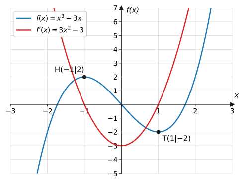

{/*
  Technische Testseite für Gate 0 – wird nach Abnahme der Foundation-Phase
  wieder entfernt. Nicht in der Sidebar verlinkt; direkt erreichbar unter
  /render-test/ bzw. /render-test/?beamer für den Beamer-Modus.
*/}

Diese Seite prüft alle Darstellungsbausteine der Website. Beamer-Modus
testen: an diese URL `?beamer` anhängen, beenden mit `?beamer=off`.

## Inline- und Display-Mathe

Inline: Die Funktion $f(x) = x^2 - 2x - 3$ hat die Nullstellen $x_1 = -1$
und $x_2 = 3$. Brüche wie $\frac{1}{2}$ und Potenzen wie $x^{n-1}$ müssen
in der Zeile lesbar bleiben.

Display-Mathe:

$$
f(x) = a_n x^n + a_{n-1} x^{n-1} + \dots + a_1 x + a_0
$$

Mehrschrittige Rechnung in `aligned`, ein Schritt pro Zeile:

$$
\begin{aligned}
x^2 - 2x - 3 &= 0 \\
(x - 3)(x + 1) &= 0 \\
x_1 = 3, \quad x_2 &= -1
\end{aligned}
$$

Längere Formel (Test: kein horizontaler Überlauf bei halber Bildschirmbreite):

$$
f'(x) = \lim_{h \to 0} \frac{f(x_0 + h) - f(x_0)}{h}
= \lim_{h \to 0} \frac{(x_0 + h)^2 - x_0^2}{h}
$$

## Eingeklappte Lösung

**Aufgabe 1** (⭐) Löse die Gleichung $x^2 = 16$.

Lösung zu Aufgabe 1

Wurzelziehen liefert zwei Lösungen, weil auch $(-4)^2 = 16$ gilt:

$$
\begin{aligned}
x^2 &= 16 &&\text{| Wurzel ziehen} \\
x_{1,2} &= \pm 4
\end{aligned}
$$

## Hinweis-Kästen

:::caution
So sieht der „Achtung“-Kasten für typische Fehler aus: Beim Wurzelziehen
nicht die negative Lösung vergessen!
:::

:::note
So sieht ein neutraler Hinweis-Kasten aus.
:::

## Plots

Einzelkurve mit markierten Punkten:

Mehrere Kurven mit Legende sowie Hoch- und Tiefpunkt:

