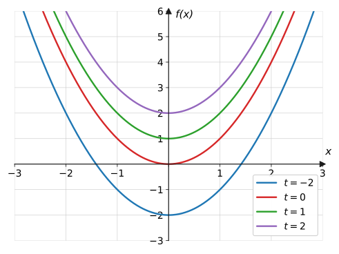
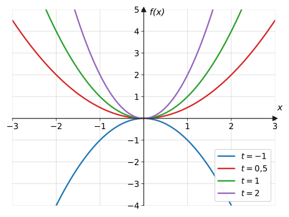
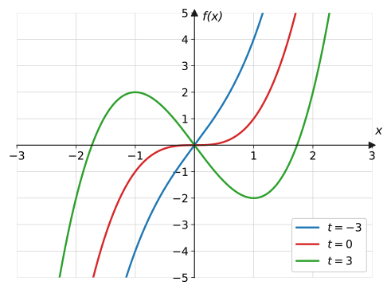
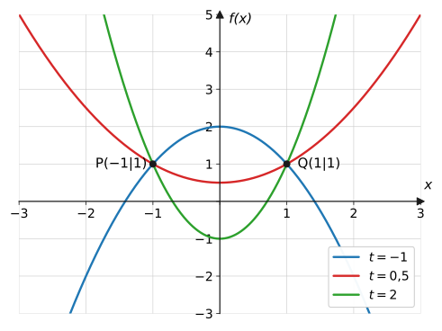
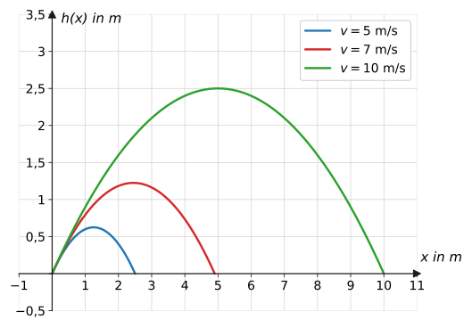
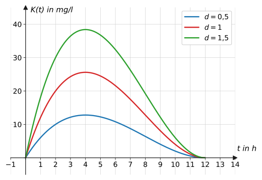

import Quiz from '../../../components/Quiz.astro';

## Worum geht's?

Welche Dosis muss ein Medikament haben, damit der Wirkstoffspiegel die
Wirkschwelle erreicht? Wie weit fliegt ein Ball – abhängig von der
Abwurfgeschwindigkeit? In beiden Fällen beschreibt **eine Formel mit
einem Parameter** gleich unendlich viele Kurven auf einmal.
**Leitfrage:** Wie rechnet man mit einem Funktionsterm, in dem neben
$x$ noch ein Parameter $t$ steckt – und was lässt sich über **alle**
Kurven der Schar gleichzeitig sagen?

## Erklärung

### Was ist eine Kurvenschar?

Eine **Funktionenschar** (Kurvenschar) ist eine Familie von Funktionen
mit einem **Parameter** $t$ (auch $a$, $k$, $d$ …):

$$
f_t(x) = x^2 + t
$$

Für jeden Wert von $t$ entsteht **eine** Kurve der Schar – hier lauter
in $y$-Richtung verschobene Normalparabeln:

Der Parameter kann auch die **Form** ändern:

Wichtig: $x$ ist die Variable, $t$ ist innerhalb jeder Kurve eine
**feste Zahl**. $f_2(3)$ heißt: Kurve zu $t = 2$, Stelle $x = 3$.

### Ableiten mit Parameter

Abgeleitet wird **nach $x$** – der Parameter wird dabei behandelt wie
eine ganz normale Zahl (wie die 5 in $5x$):

$$
f_t(x) = x^3 - tx
\quad\Rightarrow\quad
f_t'(x) = 3x^2 - t
$$

:::caution
**Die klassische Fehlerquelle:** $t$ ist beim Ableiten nach $x$ eine
**Konstante**! Aus $-tx$ wird $-t$ (nicht $-x$, nicht $0$). Und aus
$t^2 x$ wird $t^2$. Wer unsicher ist, ersetzt $t$ testweise durch 5:
$x^3 - 5x \to 3x^2 - 5$ – genauso mit $t$.
:::

### Kurvendiskussion mit Fallunterscheidung

Die Kurvendiskussion läuft wie gewohnt – nur hängen die Ergebnisse von
$t$ ab, und manchmal auch die **Anzahl** der Lösungen. Beispiel
$f_t(x) = x^3 - tx$ mit $f_t'(x) = 3x^2 - t = 0$, also
$x^2 = \frac{t}{3}$:

- $t > 0$: **zwei** Lösungen $x = \pm\sqrt{t/3}$ → Hoch- und Tiefpunkt
- $t = 0$: nur $x = 0$, kein VZW → **Sattelpunkt**
- $t < 0$: keine Lösung → $f_t$ ist streng monoton, **keine**
  Extrempunkte

Solche **Fallunterscheidungen** (z. B. $t > 0$ / $t = 0$ / $t < 0$)
gehören bei Scharen zum Standard.

### Gemeinsame Punkte aller Scharkurven

Manche Punkte liegen auf **jeder** Kurve der Schar. Man findet sie,
indem man den Term nach Potenzen von $t$ **sortiert**: Ein Punkt ist
gemeinsam, wenn der Wert nicht mehr von $t$ abhängt – also wenn alles,
was bei $t$ steht, null wird.

Beispiel $f_t(x) = tx^2 + 1 - t$:

$$
f_t(x) = t\left(x^2 - 1\right) + 1
$$

Für $x^2 - 1 = 0$, also $x = \pm 1$, ist $f_t(\pm 1) = 1$ – egal,
welches $t$:

(Alternative: $f_t(x) = f_s(x)$ für zwei verschiedene Parameter $t
\neq s$ lösen – führt auf dieselbe Bedingung.)

## Beispiele

**Beispiel 1:** Gegeben ist die Schar $f_t(x) = x^2 + t$.
a) Berechne $f_2(3)$ und $f_{-1}(0)$.
b) Für welchen Wert von $t$ verläuft die Kurve durch $P(1 \mid 3)$?

Lösung

a) $t$ einsetzen, dann $x$:

$$
f_2(3) = 3^2 + 2 = 11, \qquad f_{-1}(0) = 0 - 1 = -1
$$

b) Punktprobe mit unbekanntem $t$:

$$
\begin{aligned}
f_t(1) &= 3 \\
1 + t &= 3 \\
t &= 2
\end{aligned}
$$

Die Scharkurve zu $t = 2$ läuft durch $P$.

**Beispiel 2:** Leite nach $x$ ab:
a) $f_t(x) = x^3 - tx$  b) $g_t(x) = tx^2 - 2t^2x + 5$

Lösung

$t$ wird wie eine Zahl behandelt:

a)

$$
f_t'(x) = 3x^2 - t
$$

b) $t$ und $t^2$ sind konstante Faktoren, die $5$ fällt weg:

$$
g_t'(x) = 2tx - 2t^2
$$

**Beispiel 3:** Untersuche $f_t(x) = x^3 - tx$ in Abhängigkeit von $t$
auf Extrempunkte (vollständige Fallunterscheidung).

Lösung

$f_t'(x) = 3x^2 - t$, $\ f_t''(x) = 6x$.

**Notwendige Bedingung:**

$$
3x^2 - t = 0 \quad\Longleftrightarrow\quad x^2 = \frac{t}{3}
$$

**Fall 1: $t > 0$.** Zwei Lösungen $x = \pm\sqrt{\frac{t}{3}}$.
Hinreichend: $f_t''\!\left(-\sqrt{t/3}\right) < 0$ → Hochpunkt;
$f_t''\!\left(+\sqrt{t/3}\right) > 0$ → Tiefpunkt. Die Schar hat für
jedes positive $t$ je einen Hoch- und Tiefpunkt.

**Fall 2: $t = 0$.** $f_0(x) = x^3$: Kandidat $x = 0$ ohne VZW von
$f'$ → **Sattelpunkt** $(0 \mid 0)$, kein Extremum.

**Fall 3: $t < 0$.** $x^2 = \frac{t}{3} < 0$ hat keine Lösung –
$f_t'(x) = 3x^2 - t > 0$ überall: streng steigend, **keine
Extrempunkte**.

(Alle drei Fälle sind im Scharplot der Erklärung sichtbar.)

**Beispiel 4:** Zeige, dass alle Kurven der Schar
$f_t(x) = tx^2 + 1 - t$ durch zwei gemeinsame Punkte verlaufen.

Lösung

Term nach $t$ sortieren:

$$
f_t(x) = t\left(x^2 - 1\right) + 1
$$

Der Funktionswert hängt genau dann **nicht** von $t$ ab, wenn der
Faktor bei $t$ verschwindet:

$$
x^2 - 1 = 0 \quad\Rightarrow\quad x = \pm 1
$$

Dort gilt $f_t(\pm 1) = t \cdot 0 + 1 = 1$ für **jedes** $t$:

$$
P(-1 \mid 1), \qquad Q(1 \mid 1)
$$

**Beispiel 5:** Ein Ball wird unter 45° mit der Geschwindigkeit $v$
abgeworfen; seine Flugbahn ist näherungsweise
$h_v(x) = x - \frac{10}{v^2}\,x^2$ ($x$, $h$ in m, $v$ in m/s).
a) Zeige: Die Wurfweite beträgt $\frac{v^2}{10}$.
b) Wie hoch fliegt der Ball maximal (in Abhängigkeit von $v$)?

Lösung

a) Wurfweite = zweite Nullstelle:

$$
x - \frac{10}{v^2}x^2 = x\left(1 - \frac{10}{v^2}x\right) = 0
\quad\Rightarrow\quad x = 0 \ \text{oder}\ x = \frac{v^2}{10}
$$

Für $v = 10$ m/s also 10 m (siehe Scharplot in den Aufgaben).

b) Scheitel über die Ableitung ($v$ ist Parameter!):

$$
h_v'(x) = 1 - \frac{20}{v^2}x = 0
\quad\Rightarrow\quad x = \frac{v^2}{20}
$$

$$
h_v\!\left(\frac{v^2}{20}\right)
= \frac{v^2}{20} - \frac{10}{v^2} \cdot \frac{v^4}{400}
= \frac{v^2}{20} - \frac{v^2}{40} = \frac{v^2}{40}
$$

Die maximale Höhe wächst **quadratisch** mit $v$: doppelte
Geschwindigkeit → vierfache Höhe (und vierfache Weite).

## Aufgaben

**Aufgabe 1** (⭐) $f_t(x) = x^2 + t$. Berechne $f_2(3)$, $f_0(2)$ und
$f_{-3}(1)$.

Lösung zu Aufgabe 1

$$
f_2(3) = 9 + 2 = 11, \qquad f_0(2) = 4, \qquad f_{-3}(1) = 1 - 3 = -2
$$

**Aufgabe 2** (⭐) Beschreibe die Wirkung des Parameters:
a) $f_t(x) = x^2 + t$  b) $g_t(x) = (x - t)^2$

Lösung zu Aufgabe 2

a) Verschiebung der Normalparabel um $t$ in $y$-Richtung.

b) Verschiebung um $t$ in $x$-Richtung (Scheitel bei $x = t$).

**Aufgabe 3** (⭐) Durch welchen Punkt verlaufen **alle** Kurven der
Schar $f_t(x) = t \cdot x^2$?

Lösung zu Aufgabe 3

$f_t(0) = t \cdot 0 = 0$ für jedes $t$ – alle Parabeln laufen durch den
**Ursprung** $(0 \mid 0)$.

**Aufgabe 4** (⭐) Für welches $t$ verläuft $f_t(x) = x^2 + t$ durch
$P(2 \mid 1)$?

Lösung zu Aufgabe 4

$$
4 + t = 1 \quad\Rightarrow\quad t = -3
$$

**Aufgabe 5** (⭐) $g_t(x) = tx + 1$. Was haben alle Geraden der Schar
gemeinsam, was unterscheidet sie?

Lösung zu Aufgabe 5

Gemeinsam: der $y$-Achsenabschnitt 1 – alle laufen durch $(0 \mid 1)$.
Unterschied: die Steigung $t$ (ein „Geradenbüschel“ durch den Punkt).

**Aufgabe 6** (⭐) Leite nach $x$ ab:
a) $f_t(x) = x^2 + t$  b) $f_t(x) = x^3 - tx$  c) $f_t(x) = tx^2$

Lösung zu Aufgabe 6

a) $f_t'(x) = 2x$ (das $+t$ fällt als Konstante weg)

b) $f_t'(x) = 3x^2 - t$

c) $f_t'(x) = 2tx$

**Aufgabe 7** (⭐⭐) Leite nach $x$ ab: $f_t(x) = tx^3 - 3t^2x$

Lösung zu Aufgabe 7

$t$ und $t^2$ sind konstante Faktoren:

$$
f_t'(x) = 3tx^2 - 3t^2
$$

**Aufgabe 8** (⭐⭐) $f_t(x) = x^3 - 3tx^2 + 2$. Bestimme $f_t'$ und
$f_t''$.

Lösung zu Aufgabe 8

$$
f_t'(x) = 3x^2 - 6tx, \qquad f_t''(x) = 6x - 6t
$$

**Aufgabe 9** (⭐⭐) Fehlersuche: Jemand leitet $f_t(x) = x^3 - tx$ so
ab: „$f_t'(x) = 3x^2 - x$, weil $t$ abgeleitet 1 ergibt.“ Erkläre den
Fehler und korrigiere.

Lösung zu Aufgabe 9

Abgeleitet wird **nach $x$** – dabei ist $t$ keine Variable, sondern
eine Konstante (wie eine Zahl). $-tx$ ist „Konstante mal $x$“ und hat
die Ableitung $-t$ (Faktorregel). Richtig:

$$
f_t'(x) = 3x^2 - t
$$

Kontrolltrick: $t$ durch 5 ersetzen – $x^3 - 5x$ leitet niemand zu
$3x^2 - x$ ab.

**Aufgabe 10** (⭐⭐) Bestimme den Extrempunkt der Schar
$f_t(x) = x^2 - tx$ in Abhängigkeit von $t$ und gib seine Art an.

Lösung zu Aufgabe 10

$f_t'(x) = 2x - t = 0 \Rightarrow x = \frac{t}{2}$;
$f_t''(x) = 2 > 0$ → **Tiefpunkt** (für jedes $t$).

$$
f_t\!\left(\frac{t}{2}\right) = \frac{t^2}{4} - \frac{t^2}{2}
= -\frac{t^2}{4}
\qquad\Rightarrow\qquad
T\left(\frac{t}{2} \,\middle|\, -\frac{t^2}{4}\right)
$$

**Aufgabe 11** (⭐⭐) $f_t(x) = x^3 - 3tx$ mit $t > 0$. Bestimme Hoch-
und Tiefpunkt in Abhängigkeit von $t$.

Lösung zu Aufgabe 11

$f_t'(x) = 3x^2 - 3t = 0 \Rightarrow x^2 = t \Rightarrow
x = \pm\sqrt{t}$ (existiert, da $t > 0$). $f_t''(x) = 6x$:
links Hochpunkt, rechts Tiefpunkt.

$$
f_t\!\left(\sqrt{t}\right) = t\sqrt{t} - 3t\sqrt{t} = -2t\sqrt{t}
$$

$$
H\!\left(-\sqrt{t} \mid 2t\sqrt{t}\right), \qquad
T\!\left(\sqrt{t} \mid -2t\sqrt{t}\right)
$$

**Aufgabe 12** (⭐⭐⭐) Untersuche $f_t(x) = x^3 + tx$ vollständig auf
Extrempunkte (Fallunterscheidung nach $t$).

Lösung zu Aufgabe 12

$f_t'(x) = 3x^2 + t = 0 \Leftrightarrow x^2 = -\frac{t}{3}$.

**$t < 0$:** zwei Lösungen $x = \pm\sqrt{-t/3}$; mit
$f_t''(x) = 6x$: Hochpunkt links, Tiefpunkt rechts.

**$t = 0$:** $f_0(x) = x^3$ – Sattelpunkt bei $(0 \mid 0)$, kein
Extremum.

**$t > 0$:** keine Lösung; $f_t' > 0$ überall → streng steigend, keine
Extrempunkte.

(Gleiches Muster wie Beispiel 3, nur mit umgekehrtem Vorzeichen
von $t$.)

**Aufgabe 13** (⭐⭐) $f_t(x) = tx^2 - 4x$ mit $t \neq 0$. Bestimme den
Extrempunkt in Abhängigkeit von $t$ und entscheide, für welche $t$ es
ein Hoch- bzw. Tiefpunkt ist.

Lösung zu Aufgabe 13

$f_t'(x) = 2tx - 4 = 0 \Rightarrow x = \frac{2}{t}$;
$f_t''(x) = 2t$.

$$
f_t\!\left(\frac{2}{t}\right) = t \cdot \frac{4}{t^2} - \frac{8}{t}
= -\frac{4}{t}
\qquad\Rightarrow\qquad
E\left(\frac{2}{t} \,\middle|\, -\frac{4}{t}\right)
$$

$t > 0$: $f_t'' = 2t > 0$ → **Tiefpunkt**;
$t < 0$: $f_t'' < 0$ → **Hochpunkt**.

**Aufgabe 14** (⭐⭐) Bestimme den Wendepunkt der Schar
$f_t(x) = x^3 - 3tx^2$ in Abhängigkeit von $t$.

Lösung zu Aufgabe 14

$f_t''(x) = 6x - 6t = 0 \Rightarrow x = t$;
$f_t'''(x) = 6 \neq 0$ ✓.

$$
f_t(t) = t^3 - 3t \cdot t^2 = -2t^3
\qquad\Rightarrow\qquad
W\left(t \mid -2t^3\right)
$$

**Aufgabe 15** (⭐⭐) Wie viele Nullstellen hat $f_t(x) = x^2 - t$ in
Abhängigkeit von $t$?

Lösung zu Aufgabe 15

$x^2 = t$:

- $t > 0$: **zwei** Nullstellen $\pm\sqrt{t}$
- $t = 0$: **eine** (doppelte) Nullstelle $x = 0$
- $t < 0$: **keine** Nullstelle

**Aufgabe 16** (⭐⭐) Bestimme die Nullstellen von
$f_t(x) = x^3 - tx$ in Abhängigkeit von $t$ ($t > 0$).

Lösung zu Aufgabe 16

$$
x\left(x^2 - t\right) = 0 \quad\Rightarrow\quad
x = 0,\ x = \pm\sqrt{t}
$$

Drei Nullstellen; für $t \to 0$ rücken sie zusammen (bei $t = 0$:
dreifache Nullstelle im Ursprung).

**Aufgabe 17** (⭐⭐⭐) $f_t(x) = x^2 - 2tx + t^2$. Zeige, dass jede
Scharkurve genau eine (doppelte) Nullstelle hat, und gib sie an.

Lösung zu Aufgabe 17

Der Term ist eine binomische Formel:

$$
f_t(x) = (x - t)^2
$$

Jede Kurve ist eine verschobene Normalparabel mit Scheitel **auf** der
$x$-Achse: doppelte Nullstelle $x = t$. Die Schar „wandert“ mit $t$
die $x$-Achse entlang.

**Aufgabe 18** (⭐⭐) Zeige, dass alle Kurven der Schar
$f_t(x) = x^2 + tx$ durch den Ursprung laufen, und begründe, dass es
keinen weiteren gemeinsamen Punkt gibt.

Lösung zu Aufgabe 18

$f_t(0) = 0$ für jedes $t$ → Ursprung ✓.

Gemeinsame Punkte zweier Kurven ($t \neq s$):

$$
x^2 + tx = x^2 + sx \ \Rightarrow\ (t - s)x = 0
\ \Rightarrow\ x = 0
$$

Da $t - s \neq 0$, ist $x = 0$ die einzige Stelle – kein weiterer
gemeinsamer Punkt.

**Aufgabe 19** (⭐⭐⭐) Bestimme alle gemeinsamen Punkte der Schar
$f_t(x) = tx^2 + 1 - t$.

Lösung zu Aufgabe 19

Nach $t$ sortieren: $f_t(x) = t(x^2 - 1) + 1$. Unabhängig von $t$
genau dort, wo $x^2 - 1 = 0$:

$$
x = \pm 1, \qquad f_t(\pm 1) = 1
$$

Gemeinsame Punkte: $P(-1 \mid 1)$ und $Q(1 \mid 1)$ (siehe Scharplot
in der Erklärung).

**Aufgabe 20** (⭐⭐⭐) Bestimme den gemeinsamen Punkt aller Kurven der
Schar $f_t(x) = x^2 + t(x - 2)$.

Lösung zu Aufgabe 20

Der $t$-Anteil verschwindet für $x - 2 = 0$, also $x = 2$:

$$
f_t(2) = 4 + t \cdot 0 = 4
$$

Gemeinsamer Punkt: $(2 \mid 4)$.

**Aufgabe 21** (⭐⭐) Wurfschar $h_v(x) = x - \frac{10}{v^2}x^2$ (Graph
in der Erklärung von Beispiel 5):

Berechne die Wurfweite für $v = 5$ und $v = 10$ m/s.

Lösung zu Aufgabe 21

Wurfweite $= \frac{v^2}{10}$ (Beispiel 5):

$$
v = 5:\ \frac{25}{10} = 2{,}5 \text{ m}; \qquad
v = 10:\ \frac{100}{10} = 10 \text{ m}
$$

Doppelte Geschwindigkeit → **vierfache** Weite.

**Aufgabe 22** (⭐⭐) Berechne die maximale Wurfhöhe für $v = 10$ m/s
und kontrolliere am Scharplot.

Lösung zu Aufgabe 22

Maximale Höhe $\frac{v^2}{40}$ (Beispiel 5):

$$
\frac{100}{40} = 2{,}5 \text{ m}
$$

Passt zum Graphen: Scheitel der $v = 10$-Kurve bei $(5 \mid 2{,}5)$.

**Aufgabe 23** (⭐⭐⭐) Mit welcher Abwurfgeschwindigkeit muss man
werfen, damit der Ball 15 m weit fliegt?

Lösung zu Aufgabe 23

$$
\frac{v^2}{10} = 15 \quad\Rightarrow\quad v^2 = 150
\quad\Rightarrow\quad v = \sqrt{150} \approx 12{,}2 \text{ m/s}
$$

(Nur die positive Wurzel – Geschwindigkeiten sind positiv.)

**Aufgabe 24** (⭐⭐) Medikamentenschar $K_d(t) = 0{,}1d \cdot t(t - 12)^2$
($d$ = Dosisfaktor, $t$ in h):

a) Begründe, dass das Maximum für **jede** Dosis bei $t = 4$ liegt.
b) Für welche Dosis $d$ beträgt der Spitzenwert 38,4 mg/l?

Lösung zu Aufgabe 24

a) $K_d(t) = d \cdot K_1(t)$: Der Dosisfaktor streckt die Kurve nur in
$y$-Richtung. Streckungen verschieben Extrem**stellen** nicht
($K_d' = d \cdot K_1'$ hat dieselben Nullstellen) – das Maximum bleibt
bei $t = 4$ mit Wert $d \cdot 25{,}6$.

b)

$$
25{,}6 \, d = 38{,}4 \quad\Rightarrow\quad d = 1{,}5
$$

**Aufgabe 25** (⭐⭐⭐) Das Medikament wirkt ab 10 mg/l. Welche
Mindestdosis $d$ ist nötig, damit die Wirkschwelle überhaupt erreicht
wird?

Lösung zu Aufgabe 25

Der Spitzenwert $25{,}6\,d$ muss mindestens 10 betragen:

$$
25{,}6\,d \geq 10 \quad\Rightarrow\quad d \geq \frac{10}{25{,}6} \approx 0{,}39
$$

Ab etwa **39 %** der Standarddosis wird die Schwelle (gerade so)
erreicht – bei $d = 0{,}39$ allerdings nur für einen Augenblick am
Maximum.

**Aufgabe 26** (⭐⭐) Für welche $t$ hat $f_t(x) = x^2 + t$ genau eine
Nullstelle?

Lösung zu Aufgabe 26

$x^2 = -t$ hat genau eine Lösung ($x = 0$), wenn $-t = 0$:

$$
t = 0
$$

(Für $t < 0$ zwei, für $t > 0$ keine Nullstellen.)

**Aufgabe 27** (⭐⭐) Der Tiefpunkt von $f_t(x) = x^2 - tx$ ist
$T\left(\frac{t}{2} \mid -\frac{t^2}{4}\right)$ (Aufgabe 10). Für
welche $t$ liegt er auf der Geraden $y = -1$?

Lösung zu Aufgabe 27

$$
-\frac{t^2}{4} = -1 \quad\Rightarrow\quad t^2 = 4
\quad\Rightarrow\quad t = \pm 2
$$

Zwei Scharkurven ($t = 2$ und $t = -2$) haben ihren Tiefpunkt auf
Höhe $-1$.

**Aufgabe 28** (⭐⭐⭐) Für welchen Wert von $t$ **berührt** die Parabel
$f_t(x) = x^2 + t$ die Gerade $y = 2x$?

Lösung zu Aufgabe 28

Gleichsetzen; Berühren = genau eine Lösung = Diskriminante null:

$$
\begin{aligned}
x^2 + t &= 2x \\
x^2 - 2x + t &= 0 &&\text{| } D = 1 - t \\
1 - t &= 0 \ \Rightarrow\ t = 1
\end{aligned}
$$

Für $t = 1$ berührt die Scharkurve die Gerade im Punkt $(1 \mid 2)$.

**Aufgabe 29** (⭐⭐) Ordne im Fallunterscheidungs-Plot der Erklärung
(Schar $f_t(x) = x^3 - tx$) die drei Kurven den Werten $t = -3$,
$t = 0$ und $t = 3$ zu. Begründe über die Extrempunkte.

Lösung zu Aufgabe 29

- Kurve **mit** Hoch- und Tiefpunkt → $t = 3$ (Fall $t > 0$)
- Kurve mit Sattelpunkt im Ursprung (kurz waagerecht) → $t = 0$
- durchgehend steil steigende Kurve ohne waagerechte Stelle →
  $t = -3$ (Fall $t < 0$: $f' = 3x^2 + 3 > 0$)

**Aufgabe 30** (⭐⭐⭐) Begründe: **Alle** Kurven der Schar
$f_t(x) = x^3 - tx$ haben ihren Wendepunkt im Ursprung.

Lösung zu Aufgabe 30

$f_t''(x) = 6x$ – **unabhängig von $t$**. Nullstelle $x = 0$ mit
$f_t''' = 6 \neq 0$ ✓, und $f_t(0) = 0$ für jedes $t$:

$$
W(0 \mid 0) \ \text{für alle } t
$$

Der Ursprung ist zugleich gemeinsamer Punkt und gemeinsames
Symmetriezentrum der ganzen Schar (alle $f_t$ sind punktsymmetrisch).

## Merksatz

Merksatz anzeigen

Eine **Kurvenschar** $f_t$ ist eine Funktionsfamilie: jedes $t$ eine
Kurve. Beim **Ableiten nach $x$** ist $t$ eine Konstante ($x^3 - tx
\to 3x^2 - t$). Die Kurvendiskussion läuft wie gewohnt, aber Ergebnisse
hängen von $t$ ab – oft mit **Fallunterscheidung** ($t > 0$ / $t = 0$ /
$t < 0$). **Gemeinsame Punkte** aller Kurven: Term nach $t$ sortieren
und den $t$-Anteil null setzen.

## Vertiefung

:::caution
Beim Prüfen hinreichender Bedingungen mit Parametern auf die
**Vorzeichen achten**: $f_t''(\sqrt{t}) = 6\sqrt{t}$ ist nur für
$t > 0$ definiert und positiv – solche Aussagen gelten immer nur im
jeweiligen Fall der Fallunterscheidung. Wer Fälle vergisst, verliert
regelmäßig die halbe Aufgabe.
:::

**Parameter im Sachkontext** haben fast immer eine Bedeutung mit
eingeschränktem Bereich: Eine Dosis $d$ oder eine Geschwindigkeit $v$
ist positiv – dann entfallen manche Fälle von selbst. Das gehört in
den Antwortsatz.

**Ausblick:** Die Extrempunkte
$T\left(\frac{t}{2} \mid -\frac{t^2}{4}\right)$ aus Aufgabe 10 wandern,
wenn $t$ variiert – aber nicht irgendwie, sondern **auf einer eigenen
Kurve**. Wie man diese [Ortskurve](../ortskurven/) bestimmt, zeigt die
nächste Seite.

## Quiz

Zum Abschluss: Klicke bei jeder Frage eine Antwort an – die Auswertung kommt sofort.

<Quiz fragen={[
  { frage: 'Wie viele Kurven gehören zur Schar f_t(x) = x² + t?',
    antworten: ['Eine', 'Zwei', 'Unendlich viele – eine pro t-Wert', 'So viele wie Nullstellen'],
    richtig: 2, erklaerung: 'Jeder Parameterwert t liefert eine eigene Kurve – die Schar ist eine ganze Funktionsfamilie.' },
  { frage: 'Was ist die Ableitung von f_t(x) = x³ − tx nach x?',
    antworten: ['3x² − 1', '3x² − t', '3x² − x', '3x²'],
    richtig: 1, erklaerung: 't wird wie eine Zahl behandelt: Aus −tx wird −t (Faktorregel).' },
  { frage: 'f_t(x) = x² + t. Was ist f₂(3)?',
    antworten: ['9', '11', '5', '6'],
    richtig: 1, erklaerung: 't = 2 und x = 3 einsetzen: 3² + 2 = 11.' },
  { frage: 'Wie behandelt man den Parameter t beim Ableiten nach x?',
    antworten: ['Wie eine zweite Variable', 'Wie eine Konstante (feste Zahl)', 'Er wird zu 1', 'Er fällt immer weg'],
    richtig: 1, erklaerung: 'Innerhalb jeder Kurve ist t fest – beim Ableiten nach x verhält sich t wie die 5 in 5x.' },
  { frage: 'Die Bedingung x² = t/3 hat für t &gt; 0 …',
    antworten: ['keine Lösung', 'genau eine Lösung', 'zwei Lösungen', 'drei Lösungen'],
    richtig: 2, erklaerung: 'Für positives t/3 gibt es x = ±√(t/3) – deshalb braucht die Schar eine Fallunterscheidung nach t.' },
  { frage: 'Wie findet man Punkte, die auf ALLEN Kurven einer Schar liegen?',
    antworten: ['Alle Nullstellen berechnen', 'Den Term nach t sortieren und den t-Anteil null setzen', 'Den Mittelwert aller Kurven bilden', 't = 0 einsetzen'],
    richtig: 1, erklaerung: 'Wo der Faktor bei t verschwindet, hängt der Funktionswert nicht mehr von t ab – gemeinsamer Punkt.' },
  { frage: 'Durch welchen Punkt laufen alle Kurven der Schar f_t(x) = t · x²?',
    antworten: ['(1|1)', '(0|0)', '(t|0)', 'Es gibt keinen'],
    richtig: 1, erklaerung: 'f_t(0) = t · 0 = 0 für jedes t – alle Parabeln laufen durch den Ursprung.' },
  { frage: 'Wurfparabel: Was passiert mit der Wurfweite bei doppelter Abwurfgeschwindigkeit?',
    antworten: ['Sie verdoppelt sich', 'Sie vervierfacht sich', 'Sie bleibt gleich', 'Sie halbiert sich'],
    richtig: 1, erklaerung: 'Die Weite ist v²/10 – sie wächst quadratisch mit v: doppeltes v, vierfache Weite.' },
]} />
