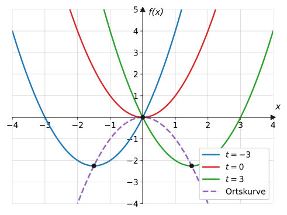
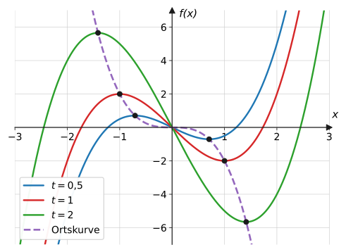
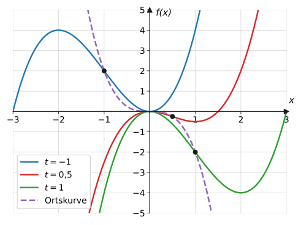
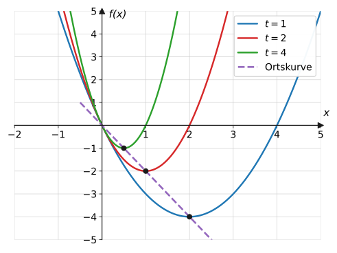
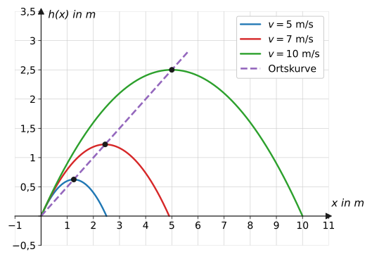

import Quiz from '../../../components/Quiz.astro';

## Worum geht's?

Wirft man einen Ball mit wachsender Geschwindigkeit, wandert der höchste
Punkt der Flugbahn – aber nicht irgendwohin, sondern auf einer
erstaunlich einfachen Linie. Genauso wandern die Tiefpunkte einer
Medikamenten- oder Parabelschar auf einer eigenen Kurve.
**Leitfrage:** Wie findet man die Kurve, auf der die Extrem- oder
Wendepunkte einer Schar liegen – die **Ortskurve**?

## Erklärung

### Was ist eine Ortskurve?

Jede Kurve der Schar $f_t(x) = x^2 - tx$ hat einen Tiefpunkt – für
jedes $t$ einen anderen. Alle diese Tiefpunkte zusammen bilden eine
eigene Kurve, die **Ortskurve** der Tiefpunkte:

Verständnisfrage: Ist die Ortskurve selbst eine Kurve der Schar?

Nein. Jede Scharkurve gehört zu *einem* festen $t$. Die Ortskurve
dagegen sammelt von **jeder** Scharkurve genau einen markanten Punkt
(z. B. den Tiefpunkt) ein – sie läuft quer durch die ganze Familie und
hat in der Regel eine völlig andere Gleichung als die Scharkurven.

### Das Standardverfahren (3 Schritte)

1. **Punkte in Abhängigkeit von $t$ bestimmen:** Extrem- bzw.
   Wendepunkte der Schar berechnen – die Koordinaten enthalten $t$,
   z. B. $T\left(\frac{t}{2} \mid -\frac{t^2}{4}\right)$.
2. **Parameter eliminieren:** Die $x$-Gleichung nach $t$ auflösen …

   $$
   x = \frac{t}{2} \quad\Rightarrow\quad t = 2x
   $$

3. **… und in die $y$-Gleichung einsetzen:**

   $$
   y = -\frac{t^2}{4} = -\frac{(2x)^2}{4} = -x^2
   $$

Die Ortskurve der Tiefpunkte ist $y = -x^2$ – genau die gestrichelte
Kurve im Bild. In der Skizze wird die Ortskurve **gestrichelt**
gezeichnet, um sie von den Scharkurven zu unterscheiden.

Verständnisfrage: Warum muss $t$ am Ende verschwinden – die Tiefpunkte hängen doch von $t$ ab?

$t$ ist nur die „Laufnummer“, die sagt, von *welcher* Kurve der Punkt
stammt. Die Ortskurve soll aber die **Bahn** dieser Punkte im
$x$-$y$-Koordinatensystem beschreiben – eine Beziehung allein zwischen
$x$ und $y$. Sobald $t$ durch $x$ ausgedrückt ist, übernimmt $x$ das
Durchlaufen der Schar. Steht am Ende noch ein $t$ im Ergebnis, ist die
Aufgabe nicht fertig.

### Gültigkeitsbereich beachten

Durchläuft $t$ nur bestimmte Werte (z. B. $t > 0$), durchläuft auch
$x$ nur einen Teil der Ortskurve – der Definitionsbereich der
Ortskurve muss dann eingeschränkt werden (Beispiel 2).

Zwei Sonderfälle: Hängt die $x$-Koordinate nicht von $t$ ab (z. B.
Maximum immer bei $x = 4$), ist die „Ortskurve“ eine **senkrechte
Gerade** – keine Funktion. Hängt gar nichts von $t$ ab, bleibt der
Punkt einfach fest.

Verständnisfrage: Die Tiefpunkte liegen bei $T\!\left(\frac{t}{2} \mid -\frac{t^2}{4}\right)$ und es gilt $t > 0$. Warum ist die Ortskurve dann nicht die komplette Parabel $y = -x^2$?

Aus $x = \frac{t}{2}$ und $t > 0$ folgt $x > 0$: Es werden nur
Tiefpunkte mit **positiver** $x$-Koordinate durchlaufen. Die Ortskurve
ist also nur der rechte Ast, $y = -x^2$ mit $x > 0$. Der
Gültigkeitsbereich der Ortskurve erbt immer die Einschränkung des
Parameters.

## Merksatz

Merksatz anzeigen

**Ortskurve** = Kurve, auf der ein markanter Punkt (Extrem-,
Wendepunkt, Scheitel) aller Scharkurven wandert. Verfahren:
**(1)** Punkt in Abhängigkeit von $t$ bestimmen,
**(2)** $x$-Gleichung nach $t$ auflösen,
**(3)** in die $y$-Gleichung einsetzen → $y$ als Funktion von $x$.
Gültigkeitsbereich prüfen; in Skizzen wird die Ortskurve
**gestrichelt** gezeichnet.

## Beispiele

**Beispiel 1 (Ortskurve der Tiefpunkte):** Bestimme die Ortskurve der
Tiefpunkte der Schar $f_t(x) = x^2 - tx$.

Lösung

**Schritt 1 – Tiefpunkt bestimmen:**
$f_t'(x) = 2x - t = 0 \Rightarrow x = \frac{t}{2}$;
$f_t''(x) = 2 > 0$ → Tiefpunkt ✓.

$$
f_t\!\left(\frac{t}{2}\right) = \frac{t^2}{4} - \frac{t^2}{2}
= -\frac{t^2}{4}
\qquad\Rightarrow\qquad
T\left(\frac{t}{2} \,\middle|\, -\frac{t^2}{4}\right)
$$

**Schritt 2 – $t$ eliminieren:**

$$
x = \frac{t}{2} \quad\Rightarrow\quad t = 2x
$$

**Schritt 3 – einsetzen:**

$$
y = -\frac{t^2}{4} = -\frac{4x^2}{4} = -x^2
$$

**Ortskurve:** $y = -x^2$ (siehe Plot in der Erklärung).

**Beispiel 2 (Ortskurve aller Extrempunkte):** Bestimme die Ortskurve
der Extrempunkte der Schar $f_t(x) = x^3 - 3tx$ mit $t > 0$.

Lösung

**Schritt 1:** $f_t'(x) = 3x^2 - 3t = 0 \Rightarrow x = \pm\sqrt{t}$;
$f_t''(x) = 6x$ → Hochpunkt links, Tiefpunkt rechts.

$$
f_t\!\left(\sqrt{t}\right) = t\sqrt{t} - 3t\sqrt{t} = -2t\sqrt{t}
\quad\Rightarrow\quad
T\left(\sqrt{t} \mid -2t\sqrt{t}\right),\ \
H\left(-\sqrt{t} \mid 2t\sqrt{t}\right)
$$

**Schritte 2 + 3 für die Tiefpunkte:** $x = \sqrt{t} \Rightarrow
t = x^2$ (mit $x > 0$):

$$
y = -2t\sqrt{t} = -2x^2 \cdot x = -2x^3
$$

**Für die Hochpunkte:** $x = -\sqrt{t} \Rightarrow \sqrt{t} = -x$,
$t = x^2$ (mit $x < 0$):

$$
y = 2t\sqrt{t} = 2x^2 \cdot (-x) = -2x^3
$$

Beide liegen auf **derselben** Ortskurve:

$$
y = -2x^3
$$

(Tiefpunkte auf dem Ast $x > 0$, Hochpunkte auf dem Ast $x < 0$ –
siehe Plot.)

**Beispiel 3 (Ortskurve der Wendepunkte):** Bestimme die Ortskurve der
Wendepunkte der Schar $f_t(x) = x^3 - 3tx^2$.

Lösung

**Schritt 1 – Wendepunkt:**
$f_t''(x) = 6x - 6t = 0 \Rightarrow x = t$;
$f_t'''(x) = 6 \neq 0$ ✓.

$$
f_t(t) = t^3 - 3t^3 = -2t^3
\qquad\Rightarrow\qquad
W\left(t \mid -2t^3\right)
$$

**Schritt 2:** $x = t$ (nichts aufzulösen – $t = x$).

**Schritt 3:**

$$
y = -2t^3 = -2x^3
$$

**Ortskurve der Wendepunkte:** $y = -2x^3$.

**Beispiel 4 (Ortskurve als Gerade):** Bestimme die Ortskurve der
Extrempunkte der Schar $f_t(x) = tx^2 - 4x$ mit $t > 0$.

Lösung

**Schritt 1:** $f_t'(x) = 2tx - 4 = 0 \Rightarrow x = \frac{2}{t}$;
$f_t''(x) = 2t > 0$ → Tiefpunkt.

$$
f_t\!\left(\frac{2}{t}\right) = t \cdot \frac{4}{t^2} - \frac{8}{t}
= -\frac{4}{t}
\qquad\Rightarrow\qquad
T\left(\frac{2}{t} \,\middle|\, -\frac{4}{t}\right)
$$

**Schritt 2:** $x = \frac{2}{t} \Rightarrow t = \frac{2}{x}$
(mit $x > 0$, da $t > 0$).

**Schritt 3:**

$$
y = -\frac{4}{t} = -\frac{4}{2/x} = -4 \cdot \frac{x}{2} = -2x
$$

**Ortskurve:** die Gerade $y = -2x$ (für $x > 0$):

**Beispiel 5 (Anwendung Wurfparabeln):** Die Flugbahnen
$h_v(x) = x - \frac{10}{v^2}x^2$ haben die Scheitelpunkte
$S\left(\frac{v^2}{20} \mid \frac{v^2}{40}\right)$ (Kurvenscharen-Seite,
Beispiel 5). Auf welcher Kurve liegen alle Scheitel?

Lösung

**Schritt 2 – Parameter $v$ eliminieren:**

$$
x = \frac{v^2}{20} \quad\Rightarrow\quad v^2 = 20x
$$

**Schritt 3 – einsetzen:**

$$
y = \frac{v^2}{40} = \frac{20x}{40} = \frac{x}{2}
$$

Alle Scheitel liegen auf der **Ursprungsgeraden** $y = \frac{x}{2}$:
Egal wie schnell man (unter 45°) wirft – der höchste Punkt liegt immer
auf halber Höhe seiner Entfernung.

## Aufgaben

Aufgabe 1 ⭐

Erkläre in eigenen Worten, was eine Ortskurve ist,
und nenne ein Beispiel von dieser Seite.

Lösung zu Aufgabe 1

Eine Ortskurve ist die Kurve, auf der ein bestimmter Punkt (z. B.
Tiefpunkt, Wendepunkt, Scheitel) **aller** Scharkurven liegt, wenn der
Parameter alle Werte durchläuft. Beispiel: Die Tiefpunkte von
$f_t(x) = x^2 - tx$ liegen auf $y = -x^2$.

Aufgabe 2 ⭐

Die Tiefpunkte einer Schar sind
$T_t(t \mid t^2)$. Bestimme die Ortskurve.

Lösung zu Aufgabe 2

$x = t$ einsetzen in $y = t^2$:

$$
y = x^2
$$

Aufgabe 3 ⭐

Die Hochpunkte einer Schar sind
$H_t(2t \mid 4t)$. Bestimme die Ortskurve.

Lösung zu Aufgabe 3

$x = 2t \Rightarrow t = \frac{x}{2}$;

$$
y = 4t = 4 \cdot \frac{x}{2} = 2x
$$

Ortskurve: Gerade $y = 2x$.

Aufgabe 4 ⭐

Die Tiefpunkte einer Schar sind
$T_t(t \mid 3t - 1)$. Bestimme die Ortskurve.

Lösung zu Aufgabe 4

$t = x$, also $y = 3x - 1$ (Gerade).

Aufgabe 5 ⭐⭐

Die Extrempunkte einer Schar sind
$E_t\left(\frac{t}{2} \mid -\frac{t^2}{2}\right)$. Bestimme die
Ortskurve.

Lösung zu Aufgabe 5

$x = \frac{t}{2} \Rightarrow t = 2x$;

$$
y = -\frac{(2x)^2}{2} = -\frac{4x^2}{2} = -2x^2
$$

Aufgabe 6 ⭐⭐

Die Wendepunkte einer Schar sind
$W_t\left(t \mid -2t^3\right)$. Bestimme die Ortskurve.

Lösung zu Aufgabe 6

$t = x$:

$$
y = -2x^3
$$

Aufgabe 7 ⭐⭐

Die Hochpunkte einer Schar sind
$H_t(-t \mid t^2 + 1)$. Bestimme die Ortskurve.

Lösung zu Aufgabe 7

$x = -t \Rightarrow t = -x$;

$$
y = (-x)^2 + 1 = x^2 + 1
$$

Aufgabe 8 ⭐⭐

Die Tiefpunkte einer Schar sind
$T_t(3t \mid 6t^2)$. Bestimme die Ortskurve.

Lösung zu Aufgabe 8

$x = 3t \Rightarrow t = \frac{x}{3}$;

$$
y = 6 \cdot \frac{x^2}{9} = \frac{2}{3}x^2
$$

Aufgabe 9 ⭐⭐

Bestimme die Ortskurve der Tiefpunkte von
$f_t(x) = x^2 + tx$ (komplette Rechnung).

Lösung zu Aufgabe 9

$f_t'(x) = 2x + t = 0 \Rightarrow x = -\frac{t}{2}$;
$f_t'' = 2 > 0$ ✓ Tiefpunkt.

$$
f_t\!\left(-\frac{t}{2}\right) = \frac{t^2}{4} - \frac{t^2}{2}
= -\frac{t^2}{4}
\quad\Rightarrow\quad
T\left(-\frac{t}{2} \,\middle|\, -\frac{t^2}{4}\right)
$$

Eliminieren: $t = -2x$;

$$
y = -\frac{(-2x)^2}{4} = -x^2
$$

Ortskurve: $y = -x^2$.

Aufgabe 10 ⭐⭐

Bestimme die Ortskurve der Tiefpunkte von
$f_t(x) = x^2 - 2tx$.

Lösung zu Aufgabe 10

$f_t'(x) = 2x - 2t = 0 \Rightarrow x = t$; $f_t'' = 2 > 0$ ✓.

$$
f_t(t) = t^2 - 2t^2 = -t^2 \quad\Rightarrow\quad T(t \mid -t^2)
$$

$t = x$:

$$
y = -x^2
$$

Aufgabe 11 ⭐⭐

Bestimme die Ortskurve der Tiefpunkte von
$f_t(x) = x^2 - 2tx + 2t^2$.

Lösung zu Aufgabe 11

$f_t'(x) = 2x - 2t = 0 \Rightarrow x = t$;

$$
f_t(t) = t^2 - 2t^2 + 2t^2 = t^2
\quad\Rightarrow\quad T(t \mid t^2)
$$

$t = x$: Ortskurve $y = x^2$ – die Tiefpunkte wandern selbst auf einer
Normalparabel.

Aufgabe 12 ⭐⭐

Bestimme die Ortskurve der Hochpunkte von
$f_t(x) = -x^2 + 2tx$.

Lösung zu Aufgabe 12

$f_t'(x) = -2x + 2t = 0 \Rightarrow x = t$; $f_t'' = -2 < 0$ →
Hochpunkt ✓.

$$
f_t(t) = -t^2 + 2t^2 = t^2 \quad\Rightarrow\quad H(t \mid t^2)
$$

Ortskurve: $y = x^2$.

Aufgabe 13 ⭐⭐⭐

$f_t(x) = x^3 - 3t^2x$ mit $t > 0$. Bestimme die
Ortskurve **aller** Extrempunkte.

Lösung zu Aufgabe 13

$f_t'(x) = 3x^2 - 3t^2 = 0 \Rightarrow x = \pm t$;
$f_t''(x) = 6x$: Tiefpunkt bei $x = t$, Hochpunkt bei $x = -t$.

$$
f_t(t) = t^3 - 3t^3 = -2t^3
\quad\Rightarrow\quad T(t \mid -2t^3),\ H(-t \mid 2t^3)
$$

Tiefpunkte: $t = x$ ($x > 0$) → $y = -2x^3$.
Hochpunkte: $t = -x$ ($x < 0$) →
$y = 2(-x)^3 = -2x^3$.

Gemeinsame Ortskurve: $y = -2x^3$ (Tiefpunkte auf dem rechten,
Hochpunkte auf dem linken Ast).

Aufgabe 14 ⭐⭐

Bestimme die Ortskurve der Wendepunkte von
$f_t(x) = x^3 - 3tx^2$ (komplette Rechnung).

Lösung zu Aufgabe 14

$f_t''(x) = 6x - 6t = 0 \Rightarrow x = t$; $f_t''' = 6 \neq 0$ ✓.

$$
f_t(t) = t^3 - 3t^3 = -2t^3 \quad\Rightarrow\quad W(t \mid -2t^3)
$$

$t = x$: Ortskurve $y = -2x^3$.

Aufgabe 15 ⭐⭐⭐

Bestimme die Ortskurve der Wendepunkte von
$f_t(x) = x^4 - tx^2$ mit $t > 0$.

Lösung zu Aufgabe 15

$f_t''(x) = 12x^2 - 2t = 0 \Rightarrow x^2 = \frac{t}{6}$, also
$x = \pm\sqrt{t/6}$ ($f''' = 24x \neq 0$ dort ✓).

$y$-Koordinate mit $t = 6x^2$:

$$
y = x^4 - t x^2 = x^4 - 6x^2 \cdot x^2 = -5x^4
$$

Ortskurve beider Wendepunkte: $y = -5x^4$.

Aufgabe 16 ⭐⭐⭐

$f_t(x) = x^4 - tx^2$ mit $t > 0$.
a) Zeige: Der Hochpunkt liegt für jedes $t$ im Ursprung.
b) Bestimme die Ortskurve der beiden Tiefpunkte.

Lösung zu Aufgabe 16

a) $f_t'(x) = 4x^3 - 2tx = 2x\left(2x^2 - t\right) = 0 \Rightarrow
x = 0$ oder $x^2 = \frac{t}{2}$. Bei $x = 0$:
$f_t''(0) = -2t < 0$ → Hochpunkt, und $f_t(0) = 0$:
$H(0 \mid 0)$ **fest** für alle $t$ (keine Ortskurve, ein Punkt).

b) Tiefpunkte bei $x = \pm\sqrt{t/2}$, also $t = 2x^2$:

$$
y = x^4 - 2x^2 \cdot x^2 = -x^4
$$

Ortskurve der Tiefpunkte: $y = -x^4$.

Aufgabe 17 ⭐⭐

Die Tiefpunkte der Schar $f_t(x) = tx^2 - 4x$
($t > 0$) sind $T\left(\frac{2}{t} \mid -\frac{4}{t}\right)$. Leite
die Ortskurve $y = -2x$ her.

Lösung zu Aufgabe 17

$x = \frac{2}{t} \Rightarrow t = \frac{2}{x}$ (mit $x > 0$):

$$
y = -\frac{4}{t} = -\frac{4}{2/x} = -2x
$$

Ortskurve: $y = -2x$ für $x > 0$.

Aufgabe 18 ⭐⭐

Prüfe: Liegt der Tiefpunkt der Kurve $f_3$ aus
Aufgabe 10 tatsächlich auf der dort berechneten Ortskurve?

Lösung zu Aufgabe 18

Aufgabe 10: $T(t \mid -t^2)$, für $t = 3$: $T(3 \mid -9)$.
Ortskurve $y = -x^2$: bei $x = 3$ ist $y = -9$ ✓ – der Punkt liegt
auf der Ortskurve. (Solche Proben sind eine schnelle
Selbstkontrolle.)

Aufgabe 19 ⭐⭐⭐

Umgekehrt: Gib eine Schar an, deren Tiefpunkte
die Ortskurve $y = x^2$ haben, und weise es nach.

Lösung zu Aufgabe 19

Idee: Tiefpunkt bei $(t \mid t^2)$ erzwingen, z. B. mit der
Scheitelform:

$$
f_t(x) = (x - t)^2 + t^2
$$

Nachweis: $f_t'(x) = 2(x - t) = 0 \Rightarrow x = t$; $f_t'' = 2 > 0$
✓; $f_t(t) = t^2$ → $T(t \mid t^2)$, und mit $t = x$ folgt
$y = x^2$. ✓ (Auch Aufgabe 11 ist eine solche Schar –
ausmultipliziert.)

Aufgabe 20 ⭐⭐

Die Wirkstoffschar $K_d(t) = 0{,}1d \cdot
t(t - 12)^2$ hat ihre Maxima bei $(4 \mid 25{,}6\,d)$. Warum ist die
„Ortskurve“ der Maxima hier **keine** Funktion von $x$? Beschreibe sie.

Lösung zu Aufgabe 20

Die $x$-Koordinate (Zeit $t = 4$) hängt **nicht** vom Parameter ab –
nur die Höhe $25{,}6\,d$ variiert. Alle Maxima liegen übereinander auf
der **senkrechten Geraden** $x = 4$ (für $d > 0$: der Teil oberhalb
der Achse). Eine senkrechte Gerade besteht den Senkrechten-Test nicht
– keine Funktion.

Aufgabe 21 ⭐⭐

Leite die Ortskurve der Wurfparabel-Scheitel
$S\left(\frac{v^2}{20} \mid \frac{v^2}{40}\right)$ her.

Lösung zu Aufgabe 21

$x = \frac{v^2}{20} \Rightarrow v^2 = 20x$:

$$
y = \frac{v^2}{40} = \frac{20x}{40} = \frac{x}{2}
$$

Ortskurve: $y = \frac{x}{2}$ (für $x > 0$).

Aufgabe 22 ⭐⭐

Deute die Ortsgerade $y = \frac{x}{2}$ aus
Aufgabe 21 sportpraktisch: Was gilt für jeden 45°-Wurf über den
höchsten Punkt?

Lösung zu Aufgabe 22

Der höchste Punkt liegt – unabhängig von der Abwurfgeschwindigkeit –
immer **halb so hoch, wie er weit entfernt ist**. Da der Scheitel bei
der halben Wurfweite $w$ liegt ($x = \frac{w}{2}$), beträgt die
maximale Höhe stets $\frac{w}{4}$: Ein 12-m-Wurf steigt auf 3 m.

Aufgabe 23 ⭐⭐⭐

Bei welcher Abwurfgeschwindigkeit liegt der
Scheitel bei $x = 10$ m? Wie hoch fliegt der Ball dann?

Lösung zu Aufgabe 23

$$
\frac{v^2}{20} = 10 \quad\Rightarrow\quad v^2 = 200
\quad\Rightarrow\quad v \approx 14{,}1 \text{ m/s}
$$

Höhe über die Ortskurve: $y = \frac{10}{2} = 5$ m (Wurfweite 20 m).

Aufgabe 24 ⭐⭐

In Beispiel 2 gilt $t > 0$. Erkläre, warum die
Tiefpunkte deshalb nur auf dem Teil der Ortskurve $y = -2x^3$ mit
$x > 0$ liegen.

Lösung zu Aufgabe 24

Die Tiefpunkte liegen bei $x = \sqrt{t}$. Für $t > 0$ ist
$\sqrt{t} > 0$ – die $x$-Koordinate durchläuft nur positive Werte,
also gehört nur der rechte Ast der Ortskurve zu Tiefpunkten. (Der
linke Ast gehört den Hochpunkten mit $x = -\sqrt{t} < 0$.)
Gültigkeitsbereiche der Ortskurve immer mitprüfen!

Aufgabe 25 ⭐⭐

Beschreibe, wie im ersten Plot der Erklärung die
Ortskurve grafisch zu erkennen ist, und woran man sie von den
Scharkurven unterscheidet.

Lösung zu Aufgabe 25

Die Ortskurve ist die **gestrichelte violette** Kurve, die genau durch
die markierten Tiefpunkte aller Parabeln läuft (hier: eine nach unten
geöffnete Parabel $y = -x^2$). Scharkurven sind durchgezogen und
farbig – die Konvention „Ortskurve gestrichelt“ hält beides
auseinander.

Aufgabe 26 ⭐⭐⭐

Zeige: Für die Schar $f_t(x) = x^3 - 3tx$
($t > 0$) liegen Hoch- **und** Tiefpunkte auf $y = -2x^3$, und die
Ortskurve ist punktsymmetrisch – wie die Schar selbst.

Lösung zu Aufgabe 26

Beispiel 2 liefert $T(\sqrt{t} \mid -2t\sqrt{t})$ und
$H(-\sqrt{t} \mid 2t\sqrt{t})$; beide erfüllen $y = -2x^3$ (rechter
bzw. linker Ast). $y = -2x^3$ ist punktsymmetrisch zum Ursprung –
passend dazu, dass jedes $f_t$ punktsymmetrisch ist und $H$ und $T$
deshalb spiegelbildlich zum Ursprung liegen: Das Spiegelbild eines
Extremums ist wieder eins, also muss auch die Ortskurve
punktsymmetrisch sein. ∎

Aufgabe 27 ⭐⭐

Formuliere das Standardverfahren zur Bestimmung
einer Ortskurve in drei Schritten.

Lösung zu Aufgabe 27

1. Extrem-/Wendepunkte der Schar **in Abhängigkeit von $t$**
   berechnen: $P(x(t) \mid y(t))$.
2. Die Gleichung $x = x(t)$ **nach $t$ auflösen**.
3. Das Ergebnis in $y = y(t)$ **einsetzen** – übrig bleibt $y$ als
   Funktion von $x$: die Ortskurve. (Plus: Gültigkeitsbereich prüfen.)

Aufgabe 28 ⭐⭐⭐

$f_t(x) = x^2 + t$. Bestimme die „Ortskurve“ der
Tiefpunkte und erkläre die Besonderheit.

Lösung zu Aufgabe 28

Tiefpunkt: $f_t'(x) = 2x = 0 \Rightarrow x = 0$, $f_t(0) = t$:
$T(0 \mid t)$.

Die $x$-Koordinate ist **konstant** 0, die $y$-Koordinate durchläuft
alle Werte: Die Tiefpunkte wandern auf der **$y$-Achse** ($x = 0$) –
eine senkrechte Gerade, also keine Funktion $y = f(x)$. Das
Standardverfahren scheitert in Schritt 2 („$x = 0$ lässt sich nicht
nach $t$ auflösen“) – genau das Signal für diesen Sonderfall.

Aufgabe 29 ⭐⭐⭐

Bestimme die Ortskurve der Tiefpunkte von
$f_t(x) = x^2 - 4tx + 4t^2 + 2t$.

Lösung zu Aufgabe 29

Der Term ist eine verschobene Scheitelform:

$$
f_t(x) = (x - 2t)^2 + 2t
$$

Tiefpunkt direkt ablesbar: $T(2t \mid 2t)$.

Eliminieren: $x = 2t \Rightarrow t = \frac{x}{2}$;
$y = 2t = x$.

Ortskurve: die **Winkelhalbierende** $y = x$.

Aufgabe 30 ⭐⭐⭐

Klassenarbeitsstil: $f_t(x) = x^3 - 3tx^2$
($t \neq 0$).
a) Bestimme die Extrempunkte in Abhängigkeit von $t$
(Fallunterscheidung $t > 0$ / $t < 0$ für die Art!).
b) Bestimme die Ortskurve der von $t$ abhängigen Extrempunkte.

Lösung zu Aufgabe 30

a) $f_t'(x) = 3x^2 - 6tx = 3x(x - 2t) = 0 \Rightarrow x = 0$ oder
$x = 2t$; $f_t''(x) = 6x - 6t$.

- Bei $x = 0$: $f_t''(0) = -6t$. Für $t > 0$: **Hochpunkt**
  $H(0 \mid 0)$; für $t < 0$: **Tiefpunkt** $T(0 \mid 0)$ – in beiden
  Fällen der feste Punkt $(0 \mid 0)$.
- Bei $x = 2t$: $f_t''(2t) = 6t$. Für $t > 0$: **Tiefpunkt**, für
  $t < 0$: **Hochpunkt**;
  $f_t(2t) = 8t^3 - 12t^3 = -4t^3$ → $E(2t \mid -4t^3)$.

b) Ortskurve von $E(2t \mid -4t^3)$: $t = \frac{x}{2}$;

$$
y = -4 \cdot \frac{x^3}{8} = -\frac{x^3}{2}
$$

Ortskurve: $y = -\frac{1}{2}x^3$ (für $x \neq 0$).

Aufgabe 31 ⭐⭐ · Verständnisaufgabe

a) Finde den Fehler: „Die Tiefpunkte liegen bei
$T\!\left(\frac{t}{2} \mid -\frac{t^2}{4}\right)$. Die Ortskurve lautet
also $y = -\frac{t^2}{4}$.“
b) Wahr oder falsch? „Auf der Ortskurve $y = -x^2$ (aus dem
Erklärungs-Beispiel) gehört zu jedem Punkt genau eine Scharkurve.“

Lösung zu Aufgabe 31

a) Der Parameter wurde **nicht eliminiert** – im Ergebnis darf kein $t$
mehr stehen, und es fehlt der Zusammenhang mit $x$. Richtig: Aus
$x = \frac{t}{2}$ folgt $t = 2x$, einsetzen liefert
$y = -\frac{(2x)^2}{4} = -x^2$.

b) **Wahr.** Die Zuordnung $t \mapsto x = \frac{t}{2}$ ist umkehrbar:
Zu jedem $x$-Wert der Ortskurve gehört genau das $t = 2x$ – also genau
eine Kurve der Schar, deren Tiefpunkt dort liegt.

## Vertiefung

:::caution
Häufigster Fehler: In Schritt 3 wird $t$ **nicht überall** ersetzt –
im Ergebnis darf **kein $t$ mehr vorkommen**! Eine „Ortskurve“
$y = -2t^3$ ist keine: Sie muss $y = -2x^3$ heißen. Endkontrolle:
Ergebnis enthält nur noch $x$ und $y$.
:::

**Probe leicht gemacht:** Einen konkreten Parameterwert wählen, den
Punkt ausrechnen und in die Ortskurve einsetzen (Aufgabe 18) – dauert
30 Sekunden und findet fast jeden Fehler.

**Ausblick:** Damit ist der Werkzeugkasten rund um Scharen komplett –
es folgt die Königsdisziplin des Anwendens: [Optimieren mit
Nebenbedingungen](../../extremwertprobleme/extremwertprobleme/)
(Extremwertprobleme).

## Quiz

Zum Abschluss: Klicke bei jeder Frage eine Antwort an – die Auswertung kommt sofort.

<Quiz fragen={[
  { frage: 'Was ist eine Ortskurve?',
    antworten: ['Der Graph einer einzelnen Scharkurve', 'Die Kurve, auf der z. B. alle Tiefpunkte der Schar liegen', 'Die x-Achse', 'Die Tangente an die Schar'],
    richtig: 1, erklaerung: 'Lässt man t laufen, wandert der markante Punkt (Extremum, Wendepunkt) – seine Bahn ist die Ortskurve.' },
  { frage: 'Wie lautet Schritt 2 des Standardverfahrens?',
    antworten: ['y-Gleichung nach x auflösen', 'Die x-Gleichung nach t auflösen', 'Beide Gleichungen addieren', 't = 0 setzen'],
    richtig: 1, erklaerung: 'Aus x = x(t) wird t = …, das setzt man dann in die y-Gleichung ein – so verschwindet der Parameter.' },
  { frage: 'Die Tiefpunkte einer Schar sind T(t | −t²). Wie lautet die Ortskurve?',
    antworten: ['y = −t²', 'y = x²', 'y = −x²', 'y = −2x'],
    richtig: 2, erklaerung: 'Aus x = t folgt t = x, eingesetzt: y = −x².' },
  { frage: 'Die Hochpunkte sind H(2t | 4t). Wie lautet die Ortskurve?',
    antworten: ['y = 2x', 'y = 4x', 'y = x/2', 'y = 8x'],
    richtig: 0, erklaerung: 't = x/2 in y = 4t einsetzen: y = 4 · x/2 = 2x.' },
  { frage: 'Welche Variablen darf das Endergebnis einer Ortskurve enthalten?',
    antworten: ['x, y und t', 'Nur x und y', 'Nur t', 'Nur y'],
    richtig: 1, erklaerung: 'Der Parameter muss vollständig eliminiert sein – steht noch ein t im Ergebnis, ist die Aufgabe nicht fertig.' },
  { frage: 'Wie zeichnet man die Ortskurve in eine Skizze der Schar ein?',
    antworten: ['Gar nicht', 'Gestrichelt (violett)', 'Als dickste durchgezogene Linie', 'Nur die Punkte, keine Kurve'],
    richtig: 1, erklaerung: 'Die Konvention „gestrichelt“ unterscheidet die Ortskurve klar von den Scharkurven selbst.' },
  { frage: 'Die Tiefpunkte liegen bei T(0 | t) für alle t. Was ist die „Ortskurve“?',
    antworten: ['y = 0', 'Die x-Achse', 'Die senkrechte Gerade x = 0 – keine Funktion', 'y = t'],
    richtig: 2, erklaerung: 'Die x-Koordinate ist konstant – die Punkte wandern auf der y-Achse. Eine senkrechte Gerade besteht den Senkrechten-Test nicht.' },
  { frage: 'Verständnisfrage: Ist die Ortskurve eine der Scharkurven?',
    antworten: ['Ja, die zu t = 0', 'Nein – sie sammelt von jeder Scharkurve einen markanten Punkt ein', 'Ja, die steilste', 'Nur bei Parabelscharen'],
    richtig: 1, erklaerung: 'Jede Scharkurve gehört zu einem festen t; die Ortskurve läuft quer durch die Familie und verbindet z. B. alle Tiefpunkte.' },
  { frage: 'Verständnisfrage: Warum wird der Parameter t bei der Ortskurve eliminiert?',
    antworten: ['Damit die Rechnung kürzer wird', 'Weil die Ortskurve eine Beziehung nur zwischen x und y beschreibt – t war bloß die Nummer der Kurve', 'Weil t immer null ist', 'Damit die Ortskurve durch den Ursprung geht'],
    richtig: 1, erklaerung: 'Die Bahn der Punkte lebt im x-y-System. Nach t auflösen und einsetzen überträgt das Durchlaufen der Schar auf x.' },
]} />
