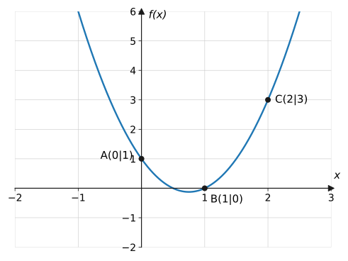
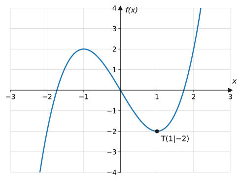
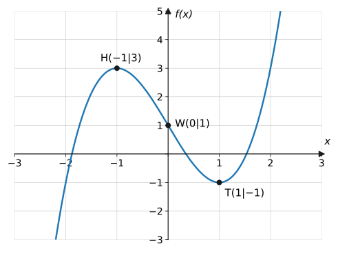
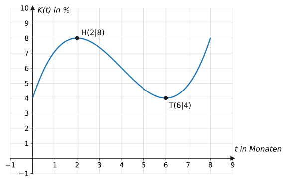
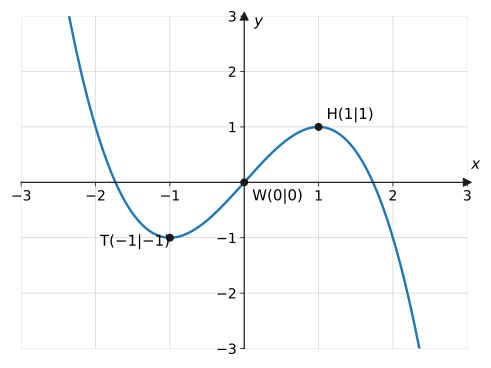

import Quiz from '../../../components/Quiz.astro';

## Worum geht's?

Die Heimleitung eines Pflegeheims kennt vom Krankenstand nur ein paar
Eckdaten: Jahresanfangswert, Wintermaximum, Frühjahrsminimum. Für die
Personalplanung braucht sie aber den **kompletten Verlauf** – also einen
Funktionsterm, der zu den Eckdaten passt. **Leitfrage:** Wie
rekonstruiert man aus gegebenen Eigenschaften („Steckbrief“) die
zugehörige Funktion?

## Erklärung

### Die Grundidee

Bisher war die Funktion gegeben und ihre Eigenschaften gesucht –
jetzt ist es **umgekehrt**. Der Weg:

1. **Ansatz wählen:** allgemeiner Funktionsterm passenden Grades, z. B.
   $f(x) = ax^3 + bx^2 + cx + d$.
2. **Bedingungen übersetzen:** Jede Eigenschaft wird eine Gleichung
   für die Koeffizienten.
3. **Gleichungssystem lösen** → Koeffizienten → Funktionsterm.
4. **Probe:** Erfüllt der Term alle Bedingungen (auch die
   hinreichenden)?

Ein Ansatz vom Grad $n$ hat $n + 1$ Unbekannte – man braucht also
**$n + 1$ Bedingungen** (Grad 3 → 4 Bedingungen).

Verständnisfrage: Warum braucht Grad 3 genau <em>vier</em> Bedingungen – nicht drei?

Gezählt werden die **Koeffizienten**, nicht der Grad: In
$ax^3 + bx^2 + cx + d$ stecken vier Unbekannte ($a$ bis $d$) – das
Absolutglied zählt mit. Jede unabhängige Bedingung legt eine davon
fest. Mit nur drei Gleichungen bliebe ein Koeffizient frei, und
unendlich viele Funktionen würden passen.

### Das Übersetzungs-Wörterbuch

| Eigenschaft | Gleichung(en) |
| --- | --- |
| Graph durch $P(a \mid b)$ | $f(a) = b$ |
| Nullstelle bei $a$ | $f(a) = 0$ |
| Extrempunkt bei $x = a$ | $f'(a) = 0$ |
| Hochpunkt $H(a \mid b)$ | $f(a) = b$ **und** $f'(a) = 0$ |
| Wendepunkt $W(a \mid b)$ | $f(a) = b$ **und** $f''(a) = 0$ |
| Tangentensteigung $m$ bei $x = a$ | $f'(a) = m$ |
| berührt die $x$-Achse bei $a$ | $f(a) = 0$ **und** $f'(a) = 0$ |
| Sattelpunkt bei $x = a$ | $f'(a) = 0$ **und** $f''(a) = 0$ |

Ein „Punkt mit Zusatzeigenschaft“ liefert also gleich **zwei**
Gleichungen – so kommen die nötigen $n + 1$ Bedingungen zusammen.

Verständnisfrage: Was geht beim Übersetzen von „Hochpunkt $H(2 \mid 5)$“ in Gleichungen verloren?

Das „Hoch“! Übersetzt wird nur: Punkt liegt drauf ($f(2) = 5$) und
Tangente waagerecht ($f'(2) = 0$) – beides sind **notwendige**
Bedingungen. Ob dort wirklich ein Hochpunkt (und nicht ein Tief- oder
Sattelpunkt) entsteht, weiß man erst nach der Rechnung – deshalb ist
die Probe mit der hinreichenden Bedingung Pflicht.

### Symmetrie verkürzt den Ansatz

- **punktsymmetrisch** zum Ursprung → nur ungerade Exponenten:
  $f(x) = ax^3 + cx$ (2 Unbekannte statt 4!)
- **achsensymmetrisch** zur $y$-Achse → nur gerade Exponenten:
  $f(x) = ax^4 + bx^2 + c$

Verständnisfrage: Warum darf man bei Punktsymmetrie $b$ und $d$ von vornherein weglassen?

Punktsymmetrie verlangt $f(-x) = -f(x)$ – und das schaffen nur die
ungeraden Potenzen. Schon ein kleines $d \neq 0$ (oder $b \neq 0$)
zerstört die Symmetrie: $g(x) = x^3 + 5$ erfüllt
$g(-1) = 4 \neq -g(1) = -6$. Die Symmetrie-Angabe ersetzt also zwei
Gleichungen und halbiert das Gleichungssystem.

### Lösen des Gleichungssystems

Zwei oder drei Unbekannte schafft man mit Einsetzen und
Subtrahieren der Gleichungen (Beispiele unten). Für größere Systeme –
und als sicheres Standardverfahren – gibt es das
[Gauß-Verfahren](../gauss-verfahren/) auf der nächsten Seite.

## Merksatz

Merksatz anzeigen

Steckbriefaufgabe = Funktion aus Eigenschaften rekonstruieren:
**Ansatz** nach Grad (und Symmetrie!) wählen, jede Eigenschaft mit dem
Wörterbuch in eine **Gleichung** übersetzen ($f(a) = b$, $f'(a) = 0$,
$f''(a) = 0$ …), das **LGS lösen**, Probe machen. Grad $n$ braucht
$n + 1$ Bedingungen; Punkte mit Zusatzinfo (Extremum, Wendepunkt,
Berühren, Tangente) liefern **zwei** Gleichungen.

## Beispiele

**Beispiel 1 (Parabel durch drei Punkte):** Eine Parabel verläuft durch
$A(0 \mid 1)$, $B(1 \mid 0)$ und $C(2 \mid 3)$. Bestimme den
Funktionsterm.

Lösung

**Ansatz** (Grad 2, drei Unbekannte): $f(x) = ax^2 + bx + c$.

**Bedingungen:**

$$
\begin{aligned}
f(0) = 1:&\quad c = 1 \\
f(1) = 0:&\quad a + b + c = 0 \\
f(2) = 3:&\quad 4a + 2b + c = 3
\end{aligned}
$$

**Lösen:** $c = 1$ einsetzen:

$$
\begin{aligned}
a + b &= -1 &&\text{(I)} \\
4a + 2b &= 2 \ \Leftrightarrow\ 2a + b = 1 &&\text{(II)}
\end{aligned}
$$

(II) − (I): $\ a = 2$, dann $b = -3$.

$$
f(x) = 2x^2 - 3x + 1
$$

**Probe:** $f(2) = 8 - 6 + 1 = 3$ ✓

**Beispiel 2 (Symmetrie nutzen):** Eine ganzrationale Funktion dritten
Grades ist punktsymmetrisch zum Ursprung und hat den Tiefpunkt
$T(1 \mid -2)$. Bestimme den Funktionsterm.

Lösung

**Ansatz:** Punktsymmetrie → nur ungerade Exponenten:

$$
f(x) = ax^3 + cx, \qquad f'(x) = 3ax^2 + c
$$

**Bedingungen** (der Tiefpunkt liefert zwei):

$$
\begin{aligned}
f(1) = -2:&\quad a + c = -2 &&\text{(I)} \\
f'(1) = 0:&\quad 3a + c = 0 &&\text{(II)}
\end{aligned}
$$

**Lösen:** (II) − (I): $\ 2a = 2 \Rightarrow a = 1$, dann $c = -3$:

$$
f(x) = x^3 - 3x
$$

**Probe (hinreichend):** $f''(x) = 6x$, $f''(1) = 6 > 0$ →
tatsächlich Tiefpunkt ✓.

**Beispiel 3 (vier Bedingungen, Grad 3):** Gesucht ist eine
ganzrationale Funktion dritten Grades mit Wendepunkt $W(0 \mid 1)$,
einem Extremum an der Stelle $x = 1$ und $f(1) = -1$.

Lösung

**Ansatz:** $f(x) = ax^3 + bx^2 + cx + d$;
$f'(x) = 3ax^2 + 2bx + c$; $f''(x) = 6ax + 2b$.

**Bedingungen (4 Stück):**

$$
\begin{aligned}
f(0) = 1:&\quad d = 1 \\
f''(0) = 0:&\quad 2b = 0 \ \Rightarrow\ b = 0 \\
f'(1) = 0:&\quad 3a + c = 0 \\
f(1) = -1:&\quad a + c + 1 = -1 \ \Rightarrow\ a + c = -2
\end{aligned}
$$

**Lösen:** Aus den letzten beiden: $(3a + c) - (a + c) = 0 - (-2)$,
also $2a = 2 \Rightarrow a = 1$, $c = -3$:

$$
f(x) = x^3 - 3x + 1
$$

**Probe:** $f''(1) = 6 > 0$ → bei $x = 1$ liegt ein Tiefpunkt
$T(1 \mid -1)$ ✓; Wendepunkt $W(0 \mid 1)$ ✓ (Graph unten – zugleich
$H(-1 \mid 3)$).

**Beispiel 4 (Krankenstand im Pflegeheim):** Der Krankenstand $K$
(in %) in einem Pflegeheim soll für die Monate Oktober ($t = 0$) bis
Juni ($t = 8$) durch eine ganzrationale Funktion dritten Grades
modelliert werden. Bekannt: Zu Beginn liegt er bei 4 %, das
Wintermaximum von 8 % wird bei $t = 2$ erreicht, bei $t = 6$ liegt ein
Minimum. Bestimme das Modell.

Lösung

**Ansatz:** $K(t) = at^3 + bt^2 + ct + d$;
$K'(t) = 3at^2 + 2bt + c$.

**Bedingungen:**

$$
\begin{aligned}
K(0) = 4:&\quad d = 4 \\
K(2) = 8:&\quad 8a + 4b + 2c + 4 = 8 \\
K'(2) = 0:&\quad 12a + 4b + c = 0 \\
K'(6) = 0:&\quad 108a + 12b + c = 0
\end{aligned}
$$

**Lösen:** Letzte minus vorletzte Gleichung:

$$
96a + 8b = 0 \quad\Rightarrow\quad b = -12a
$$

In $K'(2) = 0$: $\ 12a - 48a + c = 0 \Rightarrow c = 36a$.
In $K(2) = 8$:

$$
8a - 48a + 72a = 4 \quad\Rightarrow\quad 32a = 4
\quad\Rightarrow\quad a = \frac{1}{8}
$$

Also $b = -\frac{3}{2}$, $c = \frac{9}{2}$:

$$
K(t) = \frac{1}{8}t^3 - \frac{3}{2}t^2 + \frac{9}{2}t + 4
$$

**Probe/Deutung:** $K(2) = 1 - 6 + 9 + 4 = 8$ ✓ und
$K(6) = 27 - 54 + 27 + 4 = 4$: Im Frühjahr sinkt der Krankenstand
wieder auf das Ausgangsniveau – zum Sommer hin steigt das Modell
erneut (Modellgrenze!).

## Aufgaben

Aufgabe 1 ⭐

Übersetze in Gleichungen (Ansatz $f$ beliebig):
a) Der Graph verläuft durch $P(2 \mid 5)$.
b) Bei $x = 3$ liegt ein Hochpunkt mit $y$-Wert 7.
c) Bei $x = 1$ liegt eine Wendestelle.
d) Die Tangente bei $x = 0$ hat die Steigung 2.

Lösung zu Aufgabe 1

a) $f(2) = 5$

b) $f(3) = 7$ **und** $f'(3) = 0$

c) $f''(1) = 0$

d) $f'(0) = 2$

Aufgabe 2 ⭐

Wie viele Bedingungen braucht man für eine
ganzrationale Funktion vom Grad 2, 3 bzw. 4?

Lösung zu Aufgabe 2

Grad $n$ hat $n + 1$ Koeffizienten, also braucht man $n + 1$
Bedingungen: Grad 2 → **3**, Grad 3 → **4**, Grad 4 → **5**.

Aufgabe 3 ⭐

Gib den passenden (verkürzten) Ansatz an:
a) Grad 3, punktsymmetrisch zum Ursprung
b) Grad 4, achsensymmetrisch zur $y$-Achse

Lösung zu Aufgabe 3

a) $f(x) = ax^3 + cx$ (nur ungerade Exponenten)

b) $f(x) = ax^4 + bx^2 + c$ (nur gerade Exponenten)

Aufgabe 4 ⭐

Wie viele Gleichungen liefert die Aussage „der Graph
**berührt** die $x$-Achse bei $x = 3$“? Gib sie an.

Lösung zu Aufgabe 4

**Zwei:** Berühren heißt Nullstelle **und** waagerechte Tangente
(doppelte Nullstelle):

$$
f(3) = 0 \qquad\text{und}\qquad f'(3) = 0
$$

Aufgabe 5 ⭐⭐

Eine Parabel verläuft durch $(0 \mid 2)$,
$(1 \mid 3)$ und $(2 \mid 6)$. Bestimme den Funktionsterm.

Lösung zu Aufgabe 5

Ansatz $ax^2 + bx + c$: $\ c = 2$;

$$
a + b + 2 = 3 \Rightarrow a + b = 1; \qquad
4a + 2b + 2 = 6 \Rightarrow 2a + b = 2
$$

Subtrahieren: $a = 1$, $b = 0$:

$$
f(x) = x^2 + 2
$$

Aufgabe 6 ⭐⭐

Eine Parabel hat den Scheitel $S(1 \mid 4)$ und
verläuft durch $(3 \mid 0)$. Bestimme den Funktionsterm.

Lösung zu Aufgabe 6

Scheitel-Ansatz spart Arbeit: $f(x) = a(x - 1)^2 + 4$.

$$
f(3) = 4a + 4 = 0 \quad\Rightarrow\quad a = -1
$$

$$
f(x) = -(x - 1)^2 + 4 = -x^2 + 2x + 3
$$

Aufgabe 7 ⭐⭐

Eine Parabel hat die Nullstellen 1 und 5 und
schneidet die $y$-Achse bei 5. Bestimme den Funktionsterm.

Lösung zu Aufgabe 7

Nullstellen-Ansatz: $f(x) = a(x - 1)(x - 5)$.

$$
f(0) = a \cdot (-1)(-5) = 5a = 5 \quad\Rightarrow\quad a = 1
$$

$$
f(x) = (x - 1)(x - 5) = x^2 - 6x + 5
$$

Aufgabe 8 ⭐⭐

Eine Normalparabel-Verwandte $f(x) = x^2 + bx + c$
verläuft durch $(0 \mid -3)$ und $(2 \mid 1)$. Bestimme $b$ und $c$.

Lösung zu Aufgabe 8

$f(0) = c = -3$;

$$
f(2) = 4 + 2b - 3 = 1 \quad\Rightarrow\quad 2b = 0
\quad\Rightarrow\quad b = 0
$$

$$
f(x) = x^2 - 3
$$

Aufgabe 9 ⭐⭐

Eine ganzrationale Funktion dritten Grades ist
punktsymmetrisch zum Ursprung und hat den Tiefpunkt $T(2 \mid -16)$.
Bestimme den Funktionsterm.

Lösung zu Aufgabe 9

Ansatz $f(x) = ax^3 + cx$, $f'(x) = 3ax^2 + c$:

$$
\begin{aligned}
f(2) = -16:&\quad 8a + 2c = -16 &&\text{(I)} \\
f'(2) = 0:&\quad 12a + c = 0 \ \Rightarrow\ c = -12a &&\text{(II)}
\end{aligned}
$$

(II) in (I): $8a - 24a = -16 \Rightarrow a = 1$, $c = -12$:

$$
f(x) = x^3 - 12x
$$

Probe: $f''(2) = 12 > 0$ → Tiefpunkt ✓, $f(2) = 8 - 24 = -16$ ✓

Aufgabe 10 ⭐⭐

Grad 3, punktsymmetrisch zum Ursprung, Extremstelle
bei $x = 1$, Graph durch $P(2 \mid 2)$. Bestimme den Funktionsterm.

Lösung zu Aufgabe 10

Ansatz $ax^3 + cx$:

$$
f'(1) = 3a + c = 0 \Rightarrow c = -3a; \qquad
f(2) = 8a + 2c = 2
$$

Einsetzen: $8a - 6a = 2 \Rightarrow a = 1$, $c = -3$:

$$
f(x) = x^3 - 3x
$$

Aufgabe 11 ⭐⭐⭐

Der abgebildete Graph gehört zu einer
punktsymmetrischen Funktion dritten Grades. Bestimme den Funktionsterm.

Lösung zu Aufgabe 11

Ablesen: $H(1 \mid 1)$ (liefert zwei Bedingungen). Ansatz
$f(x) = ax^3 + cx$:

$$
\begin{aligned}
f(1) = 1:&\quad a + c = 1 \\
f'(1) = 0:&\quad 3a + c = 0
\end{aligned}
$$

Subtrahieren: $2a = -1 \Rightarrow a = -\frac{1}{2}$,
$c = \frac{3}{2}$:

$$
f(x) = -\frac{1}{2}x^3 + \frac{3}{2}x
$$

Probe: $f''(1) = -3 < 0$ → Hochpunkt ✓; $W(0 \mid 0)$ passt zur
Punktsymmetrie ✓.

Aufgabe 12 ⭐⭐⭐

Gesucht ist eine Funktion dritten Grades mit
$f(0) = 1$, waagerechter Tangente bei $x = 0$ und Wendepunkt
$W(1 \mid 3)$. Bestimme den Funktionsterm und die Art des Punktes bei
$x = 0$.

Lösung zu Aufgabe 12

Ansatz $ax^3 + bx^2 + cx + d$:

$$
\begin{aligned}
f(0) = 1:&\quad d = 1 \\
f'(0) = 0:&\quad c = 0 \\
f''(1) = 0:&\quad 6a + 2b = 0 \ \Rightarrow\ b = -3a \\
f(1) = 3:&\quad a + b + 1 = 3 \ \Rightarrow\ a + b = 2
\end{aligned}
$$

$a - 3a = 2 \Rightarrow a = -1$, $b = 3$:

$$
f(x) = -x^3 + 3x^2 + 1
$$

Art des Punktes bei 0: $f''(0) = 2b = 6 > 0$ → **Tiefpunkt**
$T(0 \mid 1)$. (Zusätzlich: $H(2 \mid 5)$.)

Aufgabe 13 ⭐⭐

Grad 4, achsensymmetrisch, berührt die $x$-Achse
bei $x = 1$, $f(0) = 1$. Bestimme den Funktionsterm.

Lösung zu Aufgabe 13

Ansatz $f(x) = ax^4 + bx^2 + c$; $f'(x) = 4ax^3 + 2bx$:

$$
\begin{aligned}
f(0) = 1:&\quad c = 1 \\
f(1) = 0:&\quad a + b + 1 = 0 \\
f'(1) = 0:&\quad 4a + 2b = 0 \ \Rightarrow\ b = -2a
\end{aligned}
$$

$a - 2a = -1 \Rightarrow a = 1$, $b = -2$:

$$
f(x) = x^4 - 2x^2 + 1 = \left(x^2 - 1\right)^2
$$

(Berührt wegen der Symmetrie automatisch auch bei $x = -1$.)

Aufgabe 14 ⭐⭐⭐

Grad 4, achsensymmetrisch, Hochpunkt im Ursprung,
Tiefpunkt $T(2 \mid -4)$. Bestimme den Funktionsterm.

Lösung zu Aufgabe 14

Ansatz $f(x) = ax^4 + bx^2 + c$. Hochpunkt im Ursprung:
$f(0) = c = 0$ (und $f'(0) = 0$ ist automatisch erfüllt).

$$
\begin{aligned}
f(2) = -4:&\quad 16a + 4b = -4 \\
f'(2) = 0:&\quad 32a + 4b = 0 \ \Rightarrow\ b = -8a
\end{aligned}
$$

$16a - 32a = -4 \Rightarrow a = \frac{1}{4}$, $b = -2$:

$$
f(x) = \frac{1}{4}x^4 - 2x^2
$$

Probe: $f''(x) = 3x^2 - 4$; $f''(0) = -4 < 0$ → Hochpunkt ✓,
$f''(2) = 8 > 0$ → Tiefpunkt ✓.

Aufgabe 15 ⭐⭐

Weise nach, dass das Krankenstand-Modell
$K(t) = \frac{1}{8}t^3 - \frac{3}{2}t^2 + \frac{9}{2}t + 4$ aus
Beispiel 4 alle vier Bedingungen erfüllt.

Lösung zu Aufgabe 15

$K(0) = 4$ ✓.
$K(2) = \frac{8}{8} - \frac{3}{2} \cdot 4 + 9 + 4 = 1 - 6 + 9 + 4 = 8$ ✓.

$K'(t) = \frac{3}{8}t^2 - 3t + \frac{9}{2}$:

$$
K'(2) = \frac{3}{2} - 6 + \frac{9}{2} = 0 \ \checkmark; \qquad
K'(6) = \frac{27}{2} - 18 + \frac{9}{2} = 0 \ \checkmark
$$

Hinreichend: $K''(t) = \frac{3}{4}t - 3$; $K''(2) = -\frac{3}{2} < 0$
(Maximum ✓), $K''(6) = \frac{3}{2} > 0$ (Minimum ✓).

Aufgabe 16 ⭐⭐⭐

Ein zweites Heim meldet: Krankenstand 5 % zu
Beginn ($t = 0$), Maximum 9 % bei $t = 2$, Minimum bei $t = 6$
(Grad 3). Bestimme das Modell.

Lösung zu Aufgabe 16

Gleiches System wie Beispiel 4, nur $d = 5$ und $K(2) = 9$:
Aus $K'(2) = K'(6) = 0$ folgt wieder $b = -12a$, $c = 36a$;

$$
K(2) = 8a - 48a + 72a + 5 = 32a + 5 = 9 \ \Rightarrow\ a = \frac{1}{8}
$$

$$
K(t) = \frac{1}{8}t^3 - \frac{3}{2}t^2 + \frac{9}{2}t + 5
$$

– dieselbe Kurve, um 1 Prozentpunkt nach oben verschoben.

Aufgabe 17 ⭐⭐

Deute im Krankenstand-Modell (Beispiel 4) die
Bedeutung von a) $K'(2) = 0$, b) der Wendestelle $t = 4$.

Lösung zu Aufgabe 17

a) Bei $t = 2$ ändert sich der Krankenstand momentan nicht – der
Anstieg ist beendet, das Wintermaximum erreicht.

b) $K''(t) = \frac{3}{4}t - 3 = 0 \Rightarrow t = 4$: Dort ist der
**Rückgang am schnellsten** – die Erholungsphase hat ihren stärksten
Effekt ($K'(4) = 6 - 12 + 4{,}5 = -1{,}5$ Prozentpunkte pro Monat).

Aufgabe 18 ⭐⭐

Eine Funktion dritten Grades verläuft durch
$(0 \mid 0)$, $(1 \mid 2)$, $(-1 \mid -4)$ und $(2 \mid 8)$. Stelle
**nur** das Gleichungssystem für $a, b, c, d$ auf (nicht lösen).

Lösung zu Aufgabe 18

Ansatz $f(x) = ax^3 + bx^2 + cx + d$:

$$
\begin{aligned}
f(0) = 0:&\quad d = 0 \\
f(1) = 2:&\quad a + b + c + d = 2 \\
f(-1) = -4:&\quad -a + b - c + d = -4 \\
f(2) = 8:&\quad 8a + 4b + 2c + d = 8
\end{aligned}
$$

Aufgabe 19 ⭐⭐⭐

Grad 4, achsensymmetrisch, Wendepunkt
$W(1 \mid 2)$, $f(0) = 7$. Bestimme den Funktionsterm.

Lösung zu Aufgabe 19

Ansatz $ax^4 + bx^2 + c$; $f''(x) = 12ax^2 + 2b$:

$$
\begin{aligned}
f(0) = 7:&\quad c = 7 \\
f''(1) = 0:&\quad 12a + 2b = 0 \ \Rightarrow\ b = -6a \\
f(1) = 2:&\quad a + b + 7 = 2 \ \Rightarrow\ a + b = -5
\end{aligned}
$$

$a - 6a = -5 \Rightarrow a = 1$, $b = -6$:

$$
f(x) = x^4 - 6x^2 + 7
$$

Probe: $f''(1) = 12 - 12 = 0$ ✓, $f'''(x) = 24x \neq 0$ bei 1 ✓.

Aufgabe 20 ⭐⭐

Warum ist eine Parabel durch nur **zwei** Punkte
nicht eindeutig bestimmt? Gib zu $(0 \mid 0)$ und $(1 \mid 1)$ zwei
verschiedene passende Parabeln an.

Lösung zu Aufgabe 20

Grad 2 hat drei Koeffizienten – zwei Gleichungen lassen einen frei
(das System ist **unterbestimmt**). Beispiele durch beide Punkte:

$$
f_1(x) = x^2 \qquad\text{und}\qquad f_2(x) = 2x^2 - x
$$

(Kontrolle: $f_2(1) = 2 - 1 = 1$ ✓ – es gibt unendlich viele.)

Aufgabe 21 ⭐⭐

Eine Parabel geht durch $(1 \mid 4)$ und hat im
Punkt $(0 \mid 1)$ die Tangente $y = 2x + 1$. Bestimme den
Funktionsterm.

Lösung zu Aufgabe 21

Die Tangente liefert **zwei** Bedingungen: $f(0) = 1$ und
$f'(0) = 2$. Ansatz $ax^2 + bx + c$:

$$
c = 1; \qquad f'(x) = 2ax + b \Rightarrow b = 2
$$

$$
f(1) = a + 2 + 1 = 4 \quad\Rightarrow\quad a = 1
$$

$$
f(x) = x^2 + 2x + 1
$$

Aufgabe 22 ⭐⭐⭐

Ein parabelförmiger Brückenbogen hat 40 m
Spannweite und ist in der Mitte 10 m hoch. Lege den Ursprung unter die
Bogenmitte und bestimme den Funktionsterm.

Lösung zu Aufgabe 22

Scheitel auf der $y$-Achse: $S(0 \mid 10)$; Achsensymmetrie → Ansatz
$f(x) = 10 - ax^2$. Nullstellen bei $\pm 20$ (halbe Spannweite):

$$
f(20) = 10 - 400a = 0 \quad\Rightarrow\quad a = \frac{1}{40}
$$

$$
f(x) = 10 - \frac{x^2}{40}, \qquad -20 \leq x \leq 20
$$

Aufgabe 23 ⭐⭐⭐

Löse das Gleichungssystem aus Aufgabe 18 und gib
den Funktionsterm an.

Lösung zu Aufgabe 23

$d = 0$. Gleichung (2) + Gleichung (3):

$$
(a + b + c) + (-a + b - c) = 2 + (-4)
\ \Rightarrow\ 2b = -2 \ \Rightarrow\ b = -1
$$

Dann (2): $a + c = 3$; (4): $8a + 2c = 12 \Leftrightarrow
4a + c = 6$. Subtrahieren: $3a = 3 \Rightarrow a = 1$, $c = 2$:

$$
f(x) = x^3 - x^2 + 2x
$$

Probe: $f(2) = 8 - 4 + 4 = 8$ ✓

Aufgabe 24 ⭐⭐⭐

Eine Skateboard-Rampe soll bei $x = 0$ **glatt**
(ohne Knick) an den ebenen Boden anschließen und bei $x = 2$ die Höhe
1 m erreichen. Bestimme eine Parabel $f(x) = ax^2 + bx + c$, die das
leistet, und erkläre, welche Bedingung den „knickfreien“ Anschluss
sichert.

Lösung zu Aufgabe 24

Boden = Gerade $y = 0$: Anschluss ohne Sprung heißt $f(0) = 0$, ohne
**Knick** heißt gleiche Steigung wie der Boden: $f'(0) = 0$.

$$
c = 0; \qquad b = 0; \qquad f(2) = 4a = 1 \Rightarrow a = \frac{1}{4}
$$

$$
f(x) = \frac{1}{4}x^2
$$

Die Tangentenbedingung $f'(0) = 0$ macht den Übergang glatt – ein
Radfahrer spürt keinen Stoß. (So werden reale Trassen und Rampen
konstruiert.)

Aufgabe 25 ⭐⭐⭐

Erkläre, warum es keine ganzrationale Funktion
**dritten** Grades geben kann, die achsensymmetrisch zur $y$-Achse ist.

Lösung zu Aufgabe 25

Achsensymmetrie erzwingt: nur **gerade** Exponenten im Term. Grad 3
verlangt aber einen Summanden $ax^3$ mit $a \neq 0$ – einen
**ungeraden** Exponenten. Beides zugleich ist unmöglich: Ein solcher
Steckbrief ist in sich widersprüchlich, das Gleichungssystem hätte
keine Lösung (es käme $a = 0$ heraus – dann wäre der Grad nicht 3).

Aufgabe 26 ⭐⭐ · Verständnisaufgabe

a) Finde den Fehler: „Wendepunkt $W(1 \mid 3)$ übersetze ich als
$f''(1) = 3$.“
b) Wahr oder falsch? „Wenn das Gleichungssystem eindeutig lösbar war,
erfüllt die gefundene Funktion sicher alle Forderungen des Steckbriefs.“

Lösung zu Aufgabe 26

a) Die zweite Ableitung ist an der Wendestelle **null**, nicht 3. Die 3
ist der Funktionswert. Richtig: $f(1) = 3$ **und** $f''(1) = 0$ – ein
Wendepunkt liefert wie jeder „Punkt mit Zusatzeigenschaft“ zwei
Gleichungen.

b) **Falsch.** Das LGS verarbeitet nur die **notwendigen** Bedingungen.
Ob aus $f'(a) = 0$ wirklich der geforderte *Hoch*punkt wurde (und nicht
ein Tief- oder Sattelpunkt), zeigt erst die Probe mit der hinreichenden
Bedingung – sie gehört immer ans Ende.

## Vertiefung

:::caution
Extrem- und Wendepunkte im Steckbrief sind nur **notwendige**
Bedingungen im Ansatz ($f' = 0$ bzw. $f'' = 0$). Ob die gefundene
Funktion dort wirklich Hoch-/Tief-/Wendepunkt hat, zeigt erst die
**Probe** mit der hinreichenden Bedingung – in Klassenarbeiten ein
Pflicht-Halbsatz.
:::

**Überbestimmt/unterbestimmt:** Zu wenige Bedingungen → unendlich
viele Lösungen (Aufgabe 20); zu viele oder widersprüchliche → keine
(Aufgabe 25). Die Anzahl-Regel $n + 1$ ist der erste Check jeder
Steckbriefaufgabe.

**Ausblick:** Bei vier und mehr Unbekannten wird das Lösen per
Einsetzen unübersichtlich. Das systematische Verfahren dafür – mit
Matrixschreibweise – ist das [Gauß-Verfahren](../gauss-verfahren/).

## Quiz

Zum Abschluss: Klicke bei jeder Frage eine Antwort an – die Auswertung kommt sofort.

<Quiz fragen={[
  { frage: 'Wie viele Bedingungen braucht eine Steckbriefaufgabe vom Grad 3?',
    antworten: ['3', '4', '5', '2'],
    richtig: 1, erklaerung: 'Grad n hat n + 1 Koeffizienten (a, b, c, d) – also braucht man 4 Gleichungen.' },
  { frage: 'Welche Gleichungen liefert die Angabe „Hochpunkt H(2|5)“?',
    antworten: ['Nur f(2) = 5', 'Nur f′(2) = 0', 'f(2) = 5 und f′(2) = 0', 'f″(2) = 5'],
    richtig: 2, erklaerung: 'Ein Extrempunkt liefert immer zwei Informationen: den Punkt selbst und die waagerechte Tangente.' },
  { frage: 'Welche Gleichungen liefert „Wendepunkt W(1|3)“?',
    antworten: ['f(1) = 3 und f″(1) = 0', 'f(1) = 3 und f′(1) = 0', 'Nur f″(1) = 0', 'f′(1) = 3'],
    richtig: 0, erklaerung: 'Der Punkt liegt auf dem Graphen (f(1) = 3), und an der Wendestelle gilt f″(1) = 0.' },
  { frage: 'Welcher Ansatz passt zu „Grad 3, punktsymmetrisch zum Ursprung“?',
    antworten: ['ax³ + bx² + cx + d', 'ax³ + cx', 'ax³ + bx²', 'ax⁴ + bx²'],
    richtig: 1, erklaerung: 'Punktsymmetrie erlaubt nur ungerade Exponenten – zwei Unbekannte statt vier.' },
  { frage: '„Der Graph berührt die x-Achse bei x = 4“ bedeutet:',
    antworten: ['f(4) = 0', 'f′(4) = 0', 'f(4) = 0 und f′(4) = 0', 'f(4) = 4'],
    richtig: 2, erklaerung: 'Berühren = doppelte Nullstelle: Nullstelle plus waagerechte Tangente – zwei Gleichungen.' },
  { frage: 'Warum gehört ans Ende jeder Steckbriefaufgabe eine Probe?',
    antworten: ['Weil das LGS meist falsch ist', 'Weil im Ansatz nur notwendige Bedingungen stecken – ob z. B. wirklich ein Hochpunkt vorliegt, zeigt erst die hinreichende Prüfung', 'Nur zur Übung', 'Die Probe ist überflüssig'],
    richtig: 1, erklaerung: 'f′(a) = 0 erzwingt nur eine waagerechte Tangente – es könnte auch ein Tief- oder Sattelpunkt herauskommen.' },
  { frage: 'Eine Parabel ist durch zwei Punkte gegeben. Wie viele passende Parabeln gibt es?',
    antworten: ['Genau eine', 'Zwei', 'Keine', 'Unendlich viele'],
    richtig: 3, erklaerung: 'Grad 2 braucht drei Bedingungen – mit nur zwei bleibt ein Koeffizient frei: unendlich viele Lösungen.' },
  { frage: 'Verständnisfrage: Warum zählt beim Ansatz ax³ + bx² + cx + d auch das d als Unbekannte?',
    antworten: ['Es zählt nicht – d ist immer 0', 'Weil alle vier Koeffizienten den Graphen mitbestimmen und festgelegt werden müssen', 'Weil d der Grad ist', 'Weil d die Nullstelle angibt'],
    richtig: 1, erklaerung: 'd verschiebt den Graphen in y-Richtung – ohne eine Bedingung dafür passen unendlich viele Funktionen. Grad n ⇒ n + 1 Unbekannte.' },
  { frage: 'Verständnisfrage: Die Symmetrieangabe „punktsymmetrisch zum Ursprung“ ersetzt beim Grad-3-Ansatz wie viel?',
    antworten: ['Nichts – sie ist nur ein Hinweis', 'Zwei Bedingungen: b = 0 und d = 0 stehen sofort fest', 'Eine Bedingung', 'Das ganze LGS'],
    richtig: 1, erklaerung: 'Nur ungerade Exponenten bleiben: Der Ansatz schrumpft auf ax³ + cx mit zwei Unbekannten – die halbe Arbeit.' },
]} />
